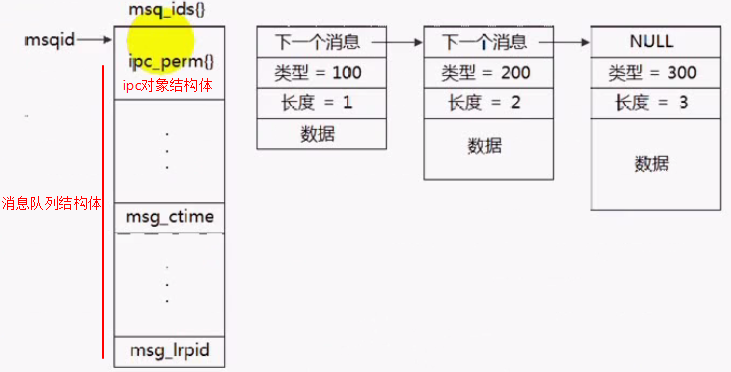
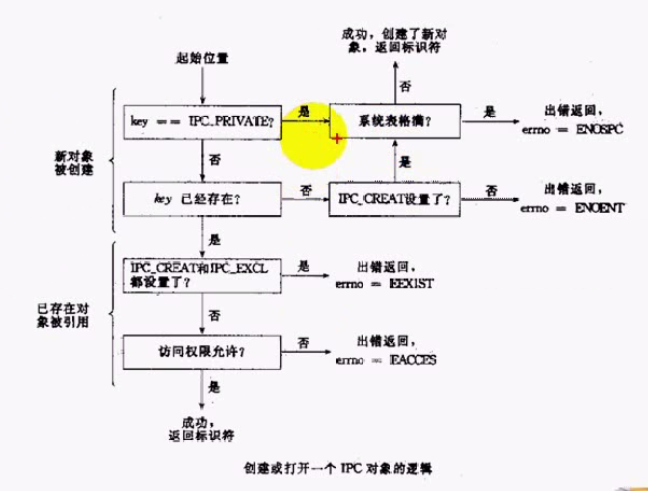
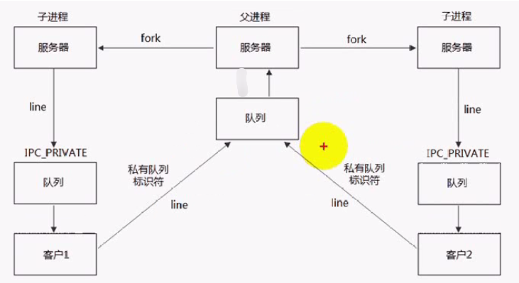

# 1 System V 消息队列
消息队列在内核种的表示：
**Note**：使用**ipcs**命令可以查看当前系统存在system V的消息队列，共享内存和信号量信息。


## 1.1 消息队列相关函数
头文件：
```c
#lnclude <sys/types.h>
#include <sys/ipc.h>
#include <sys/msg.h>
```

### msgget函数
函数定义： `int msgget(key t key, Int msgflg)`功能：  创建一个新的消息队列； 返回值为消息队列标识，失败返回-1参数：

- key：消息队列的名字
- msgflg：由九个权限标志组成，类似创建文件时的mode权限。创建队列需要加上**IPC_CREAT | O_EXCL** 标志。


msget的执行逻辑如下：


### msgctl函数
函数定义： `int msgctl(int msqid, int cmd, struct msqid_ds *buff)`功能：  控制消息队列； 成功返回0，失败返回-1参数：

- msqid：消息队列标识码
- cmd：要采取的操作，可取值如下
| 命令 | 说明 |
| :--- | --- |
| IPC_STAT | 获取当前消息队列的信息，存到buff返回参数中 |
| IPC_SET | 设置消息队列，设置值存在buff中 |
| IPC_RMID | 删除消息队列 |


### msgsnd函数
函数定义： `int msgsnd(int msq id, const void *msgp, size_t msgsz, int msgflg)`功能：  发送消息到消息队列； 成功返回0，失败返回-1参数：

- msgp：指针，指向要发送的消息
- msgsz：要发送消息的长度，不包含消息类型的长度
- msgflg：控制队列满或达到系统上限时的行为。IPC_NOWAIT（消息队列满时不等待，直接返回**EAGAIN**错误）

### msgrcv函数
函数定义： `ssize_t msgrcv(lnt msqld, void *msgp, Slze_t msgsz, long msgtype, int msgflg)`功能：  从消息队列获取一条消息； 成功返回接收的字符个数，失败返回-1参数：

- msgp：指针，指向用于接收消息的buff
- msgsz：接收buff的长度
- msgtype：实现接收优先级
| **type取值** | **优先级** |
| --- | --- |
| type = 0 | 返回队列第一条消息 |
| type > 0 | 返回队列第一条类型等于type的消息 |
| type < 0 | 返回队列中第一条类型小于等于type绝对值的消息 |


- msgflg：控制队列满或达到系统上限时的行为
| **flag取值** | **含义** |
| --- | --- |
| IPC_NOWAIT | 队列没有可读消息时不等待，直接返回EMOMSG错误 |
| MSG_NOERROR | 消息大小超过msgsz时截断消息 |
| type>0 && flag=MSC_EXCEPT | 接收类型不等于type的第一条消息 |


## 1.2 代码实例
```c
int len = atoi(argv[1]);
int type = atoi(argv[2]);
int msgid = msgget(1234, 0666 | IPC_CREAT);
if (msgid == -1)
{
    msgid = msgget(1234, 0);
    if (msgid == -1)
        ERR_EXIT("msgget failed");
}

msgbuf* ptr = (msgbuf*)malloc(sizeof(long) + len);
ptr->mtype = type;
if (msgsnd(msgid, ptr, len, 0) < 0)
    ERR_EXIT("msgsnd failed");

//=======================================
int msgid;
int rcvsize = 0;
msgid = msgget(1234, 0);
if (msgid == -1)
    ERR_EXIT("msgget failed");

msgbuf* ptr = (msgbuf*)malloc(sizeof(long) + MSGMAX);
ptr->mtype = type;
if ((rcvsize = msgrcv(msgid, ptr, MSGMAX, type, flag)) < 0)
    ERR_EXIT("msgrcv failed");

printf("read %d bytes from msg queue\r\n", rcvsize);
```

## 1.3 消息队列实现服务器客户端
发送和接收是在不同的队列中，可以避免死锁。


# 2 Posix消息队列

## 2.1 posix消息队列函数
统一头文件：
```c
#include <fcntl.h>           /* For O_* constants */
#include <sys/stat.h>        /* For mode constants */
#include <mqueue.h>
```

### mq_open
函数定义：
```c
mqd_t mq_open(const char *name, int oflag);
mqd_t mq_open(const char *name, int oflag, mode_t mode,  struct mq_attr *attr);
```
功能：  创建和访问一个消息队列返回值： 成功返回消息队列文件描述符，失败返回-1参数：

- name：消息队列名字, 必须以**/**开头
- oflag：与open函数类似，指定权限
- mode：如果oflag指定为O_CREAT，需要设置mode
- att：消息队列的属性，指定NULL则使用默认属性


**Note**：无法使用ipcs查看posix的消息队列。需要挂载**mqueue**才能看到POSIX创建的消息队列。
```c
# mkdir /dev/mqueue
# mount -t mqueue none /dev/mqueue
```

### mq_close
函数定义：`int mq_close(mqd_t mqdes);`功能：  关闭一个消息队列返回值： 成功返回0，失败返回-1参数：

- mqdes：消息队列描述符

### mq_unlink
函数定义：`int mq_unlink(const char *name);`功能：  删除一个消息队列返回值： 成功返回0，失败返回-1参数：

- name：消息队列的名字

### mq_getattr和mq_setattr
函数定义：
```c
int mq_getattr(mqd_t mqdes, struct mq_attr *attr);
int mq_setattr(mqd_t mqdes, struct mq_attr *newattr, struct mq_attr *oldattr);
```
功能：  获取和设置一个消息队列的属性返回值： 成功返回0，失败返回-1参数：

- mqdes：消息队列描述符
- attr： 队列属性结构体

### mq_send
函数定义：`int mq_send(mqd_t mqdes, const char *msg_ptr, size_t msg_len, unsigned msg_prio);`功能： 向消息队列发送一条消息返回值： 成功返回0，失败返回-1参数：

- msg_ptr：指向消息的指针
- msg_len：消息的长度
- msg_prio：消息的优先级

### mq_receive
函数定义：`ssize_t mq_receive(mqd_t mqdes, char *msg_ptr, size_t msg_len, unsigned *msg_prio);`功能： 从消息队列接收一条消息返回值： 成功返回接收到的字节数，失败返回-1参数：

- msg_ptr：接收消息的指针
- msg_len：接收的消息长度
- msg_prio： 接收到额消息的优先级


**注意**：该函数总是返回消息队列中最高优先级的消息。

### mq_notify
函数定义：`int mq_notify(mqd_t mqdes, const struct sigevent *sevp);`功能： 建立或删除消息到达的通知事件返回值： 成功返回0，失败返回-1参数：

- sevp：两个取值
   - NULL： 撤销已注册的通知
   - sevp->sigev_notify = SIGEV_SIGNAL：产生一个信号(具体哪个信号用sevp->sigev_signo指定)通知有消息到达
   - sevp->sigev_notify = SIGEV_THREAD：创建一个线程执行指定的函数(具体哪个函数用sevp->sigev_notify_function指定)


## 2.2 代码示例

### mq_open
```cpp
#include "common.h"
#include <unistd.h>
#include <sys/types.h>
#include <stdlib.h>
#include <stdio.h>
#include <fcntl.h>           /* For O_* constants */
#include <sys/stat.h>        /* For mode constants */
#include <mqueue.h>
#include <string.h>

struct student
{
    char name[32];
    int age;
};

int main()
{
    mqd_t mqid;
    mqid = mq_open("/abc", O_CREAT | O_RDWR, 0666, NULL);
    /** mqid = mq_open("/abc", O_RDWR, 0666, NULL); */
    if (mqid == (mqd_t)-1)
        ERR_EXIT("mq_open failed");
    
    //获取消息队列参数
    mq_attr attr;
    if (mq_getattr(mqid, &attr) == -1)
        ERR_EXIT("mq_getattr failed");

    printf("[mq_getattr:%d]  mq_flags:%d, mq_maxmsg:%d, mq_msgsize:%d, mq_curmsgs:%d\r\n", __LINE__, attr.mq_flags, attr.mq_maxmsg, attr.mq_msgsize, attr.mq_curmsgs);

    //发送消息到消息队列
    student stu = {"barret", 29};
    if(mq_send(mqid, (const char*)&stu, sizeof(stu),  1) == -1)
        ERR_EXIT("mq_send failed");

    if (mq_getattr(mqid, &attr) == -1)
        ERR_EXIT("mq_getattr failed");

    printf("[mq_getattr:%d]  mq_flags:%d, mq_maxmsg:%d, mq_msgsize:%d, mq_curmsgs:%d\r\n", __LINE__, attr.mq_flags, attr.mq_maxmsg, attr.mq_msgsize, attr.mq_curmsgs);

    //读取消息队列中消息
    student rcvstu;
    unsigned prio;
    if(mq_receive(mqid, (char*)&rcvstu, attr.mq_msgsize, &prio) == -1)
        ERR_EXIT("mq_receive failed");

    printf("[mq_receive:%d] name:%s, age:%d, prio:%d\r\n", __LINE__, rcvstu.name, rcvstu.age, prio);

    if (mq_getattr(mqid, &attr) == -1)
        ERR_EXIT("mq_getattr failed");

    printf("[mq_getattr:%d]  mq_flags:%d, mq_maxmsg:%d, mq_msgsize:%d, mq_curmsgs:%d\r\n", __LINE__, attr.mq_flags, attr.mq_maxmsg, attr.mq_msgsize, attr.mq_curmsgs);

    mq_close(mqid); //关闭队列
    mq_unlink("/abc");//删除消息队列
    return 0;
}
```

### mq_notify
```cpp
#include "common.h"
#include <unistd.h>
#include <sys/types.h>
#include <stdlib.h>
#include <stdio.h>
#include <fcntl.h>           /* For O_* constants */
#include <sys/stat.h>        /* For mode constants */
#include <mqueue.h>
#include <string.h>
#include <signal.h>

struct student
{
    char name[32];
    int age;
};

mqd_t mqid;

void handleSignal(int sig)
{
    mq_attr attr;
    if (mq_getattr(mqid, &attr) == -1)
        ERR_EXIT("mq_getattr failed");

    //读取消息队列中消息
    student rcvstu;
    unsigned prio;
    if(mq_receive(mqid, (char*)&rcvstu, attr.mq_msgsize, &prio) == -1)
        ERR_EXIT("mq_receive failed");

    printf("[mq_receive:%d] name:%s, age:%d, prio:%d\r\n", __LINE__, rcvstu.name, rcvstu.age, prio);

}

int main()
{
    mqid = mq_open("/abc", O_CREAT | O_RDWR, 0666, NULL);
    /** mqid = mq_open("/abc", O_RDWR, 0666, NULL); */
    if (mqid == (mqd_t)-1)
        ERR_EXIT("mq_open failed");
    

    signal(SIGUSR1, handleSignal);
    //注册消息通知
    sigevent evt;
    evt.sigev_notify = SIGEV_SIGNAL;
    evt.sigev_signo = SIGUSR1;
    mq_notify(mqid, &evt);//使用信号接收新消息通知
    
    //发送消息到消息队列
    student stu = {"barret", 29};
    if(mq_send(mqid, (const char*)&stu, sizeof(stu),  1) == -1)
        ERR_EXIT("mq_send failed");

    while(1)
    {
        pause();
    }

    mq_close(mqid); //关闭队列
    mq_unlink("/abc");//删除消息队列
    return 0;
}
```
