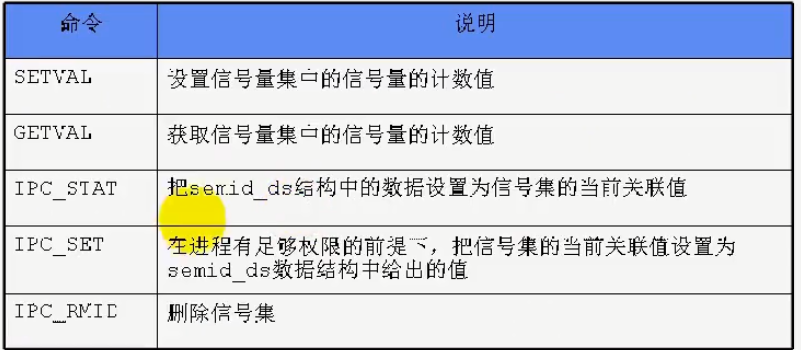

# 1 system V信号量

## 1.1 信号量基本定义
信号量：

- **互斥： P，V在同一个进程中**
- **同步：P，V在不同进程中**


信号量值的含义：

- S>0： S表示可用资源的个数
- S=0： 表示没有可用资源，无等待进程
- S<0： S绝对值表示等待队列种进程的个数


## 1.2 信号量PV操作
```cpp
//linux系统信号量结构体的定义
struct semaphore
{
    int value;//s的个数
    pointer_PCB queue; //s等待队列,等待获取信号量
}

//P获取信号量的基本操作流程
P(s)
{
    s.value -= 1;
    if (s.value < 0)
    {
        //改进程状态设置为等待状态
        //讲改进程的PCB插入到相应的等待队列s.queue末尾
    }
}

//V归还信号量的基本操作流程
V(s)
{
    s.value += 1;
    if (s.value >= 0)
    {
        //唤醒等待队列中等待的一个进程
        //改变其状态为就绪态，将其插入就绪队列
    }
}
```


## 1.3 信号量集函数
统一头文件：
```c
#include <sys/types.h>
#include <sys/ipc.h>
#include <sys/sem.h>
```

### semget
函数定义： `int semget(key_t key, int nsems, int semflg);`功能：  创建或打开一个信号量集返回值： 成功返回信号量集的标识码，失败返回-1参数：

- key： 信号量集名称
- nsems：信号量个数
- semflg：九个权限标志，和创建文件的mode一样

### semctl
函数定义： `int semctl(int semid, int semnum, int cmd,...);`功能：  修改或删除信号量集返回值： 成功返回0，失败返回-1参数：

- semid: 信号量集标识码
- semnum: 信号量的序号
- cmd： 要采取的操作



- 最后一个参数根据命令不同而不同

### semop
函数定义： `int semop(int semid, struct sembuf* sops, unsigned nsops);`功能：  对信号量集进程PV操作返回值： 成功返回0，失败返回-1参数：

- sops：指向一个结构体的指针
```c
struct sembuf{
    short sem_num; //信号量编号
    short sem_op;//信号量一次PV操作时加减的数值, +1,-1
    short sem_flg;//IPC_NOWAIT, SEM_UNDO
};
```

- nsops: 信号量的个数


## 1.4 代码示例
```c
//创建信号量集
int sem_create(key_t key)
{
    int semid;
    semid = semget(key, 1, IPC_CREAT | IPC_EXCL | 0666);
    if (semid == -1)
        ERR_EXIT("semget create failed");
    return semid;
}
//打开一个已经存在的信号量集
int sem_open(key_t key)
{
    int semid;
    semid = semget(key, 0, 0);
    if (semid == -1)
        ERR_EXIT("get sem failed");

    return semid;
}

//设置当前计数值
int sem_setval(int semid, int val)
{
    union semun s;
    s.val = val;
    int ret = semctl(semid, 0, SETVAL, s);
    if (ret == -1)
        ERR_EXIT("semctl setval failed");

    return 0;
}

//获取当前计数值
int sem_getval(int semid)
{
    int ret = semctl(semid, 0, GETVAL, 0);
    if (ret == -1)
        ERR_EXIT("semctl getval failed");

    return ret;
}

//删除信号量集
int sem_d(int semid)
{
    if (semctl(semid, 0, IPC_RMID, 0) == -1)
        ERR_EXIT("semctl delete failed");

    return 0;
}

//PV操作
int sem_p(int semid)
{
    sembuf s = {0, -1, 0};//可以使用二维数组定义多个信号量的处理
    int ret = semop(semid, &s, 1);//这里1表示处理一个信号量
    if (ret == -1)
        ERR_EXIT("semop P failed");

    return ret;
}

int sem_v(int semid)
{
    sembuf s = {0, 1, 0};
    int ret = semop(semid, &s, 1);
    if (ret == -1)
        ERR_EXIT("semop V failed");

    return ret;
}

//PV操作,同时操作两个信号量
int sem_p(int semid, int left, int right)
{
    sembuf s[2] = {
        {left, -1, 0}, 
        {right, -1, 0}
    };
    int ret = semop(semid, s, 2);
    if (ret == -1)
        ERR_EXIT("semop P failed");

    return ret;
}

int sem_v(int semid, int left, int right)
{
    sembuf s[2] = {
        {left, 1, 0}, 
        {right, 1, 0}
    };
    int ret = semop(semid, s, 2);
    if (ret == -1)
        ERR_EXIT("semop V failed");

    return ret;
```

# 2 POSIX信号量
头文件
```c
#include <fcntl.h>           /* For O_* constants */
#include <sys/stat.h>        /* For mode constants */
#include <semaphore.h>
```
在 POSIX 标准中，信号量分两种，一种是**无名信号量**，一种是**有名信号量**。无名信号量一般用于**线程间同步或互斥**，而有名信号量一般用于**进程间同步或互斥**。它们的区别和管道及命名管道的区别类似，无名信号量则**直接保存在内存**中，而有名信号量要求**创建一个文件**。


## 2.1 有名信号量创建删除

- sem_open：创建信号量，会在/dev/shm中生成一个同名文件
- sem_close：关闭信号量
- sem_unlink：删除信号量


## 2.2 无名信号量创建删除

- sem_init：创建无名信号量
- sem_destroy：删除无名信号量


## 2.3 信号量PV操作

- sem_wait： P操作
- sem_post： V操作


## 2.4 代码示例

### 有名信号量示例
```cpp
#include <stdio.h>  
#include <semaphore.h>  
#include <fcntl.h>  
#include <unistd.h>  
#include <sys/stat.h>  
#include <sys/types.h>  
#include <sys/wait.h>

void printer(sem_t *sem, char *str)  
{  
    sem_wait(sem);  //信号量减一  
    while(*str!='\0')  
    {  
        putchar(*str);    
        fflush(stdout);  
        str++;  
        sleep(1);  
    }  
    printf("\n");   

    sem_post(sem);  //信号量加一  
}  

int main(int argc, char *argv[])  
{  
    pid_t pid;  
    sem_t *sem = NULL;  

    pid = fork(); //创建进程  
    if (pid<0)
    { //出错  
        perror("fork error");  
    }
    else if(pid == 0)
    { 
        //子进程  
        //跟open()打开方式很相似,不同进程只要名字一样，那么打开的就是同一个有名信号量  
        sem = sem_open("name_sem", O_CREAT | O_RDWR, 0666, 1); //信号量值为 1  
        if(sem == SEM_FAILED)
        { 
            //有名信号量创建失败  
            perror("sem_open");  
            return -1;  
        }  

        char str1[6] = "hello";  
        printer(sem, str1); //打印  

        sem_close(sem); //关闭有名信号量  

        _exit(1);  
    }
    else if(pid > 0)
    { 
        //父进程  
        //跟open()打开方式很相似,不同进程只要名字一样，那么打开的就是同一个有名信号量  
        sem = sem_open("name_sem", O_CREAT|O_RDWR, 0666, 1); //信号量值为 1  
        if(sem == SEM_FAILED)
        {//有名信号量创建失败  
            perror("sem_open");  
            return -1;  
        }  

        char str2[6] = "world";  
        printer(sem, str2); //打印  

        sem_close(sem); //关闭有名信号量  

        wait(NULL); //等待子进程结束  
    }  

    sem_unlink("name_sem");//删除有名信号量  

    return 0;  
}
```

### 无名信号量示例
```cpp
#include <stdio.h>
#include <pthread.h>
#include <unistd.h>
#include <semaphore.h>
 
sem_t sem; //信号量
 
void printer(char *str)
{
	sem_wait(&sem);//减一
	while(*str)
	{
		putchar(*str);	
		fflush(stdout);
		str++;
		sleep(1);
	}
	printf("\n");
	
	sem_post(&sem);//加一
}
 
void *thread_fun1(void *arg)
{
	char str1[6] = "hello";
	printer(str1);
}
 
void *thread_fun2(void *arg)
{
	char str2[6] = "world";
	printer(str2);
}
 
int main(void)
{
	pthread_t tid1, tid2;
	
	sem_init(&sem, 0, 1); //初始化无名信号量，初始值为 1
	
	//创建 2 个线程
	pthread_create(&tid1, NULL, thread_fun1, NULL);
	pthread_create(&tid2, NULL, thread_fun2, NULL);
	
	//等待线程结束，回收其资源
	pthread_join(tid1, NULL);
	pthread_join(tid2, NULL); 
	
	sem_destroy(&sem); //销毁信号量
	
	return 0;
}
```
