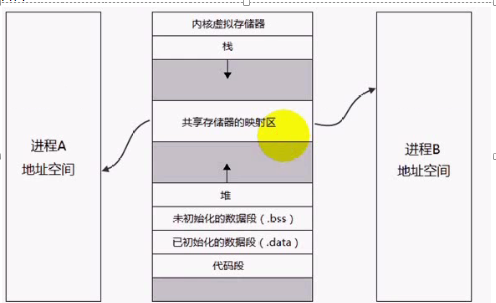
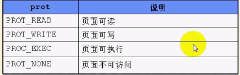
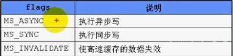
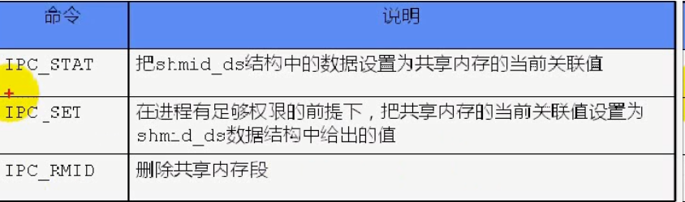

共享内存是最快的IPC方式，一个进程中内存映射到其他进程的地址空间中，之后数据传递不再需要内核的系统调用，其他进程可以直接访问内存空间。示意图如下：
共享内存注意点：

- 映射不能改变文件的大小。内容写回文件时，不能超过文件的大小。
- 可用于进程间通信的有效地址空间不完全受限于被映射文件的大小。内核分配的空间可能比文件大小大。
- 文件被映射后，所有对映射区域的访问实际上都是对内存区域的访问。


# 1 文件映射内存区

## 1.1 mmap函数
头文件： <sys/mman.h>函数定义： `void* mmap(void* addr, size_t len, int prot, int flags, int fd, off_t offset)`功能：  将文件或设备空间映射到共享内存区返回值：   成功返回共享内存区起始地址，失败返回-1参数：

- Addr：要映射的起始地址，通常为NULL，由内核自动选择
- len： 映射内存区的字节数
- prot： 映射区保护方式



- flags：标志


- fd：文件描述符
- offset： 从文件头开始的偏移量

## 1.2 munmap函数
头文件： <sys/mman.h>函数定义： `void* munmap(void* addr, size_t len)`功能：  取消mmap函数建立的映射返回值：   成功返回0，失败返回-1参数：

- Addr：要映射的起始地址
- len： 映射内存区的字节数

## 1.3 msync函数
头文件： <sys/mman.h>函数定义： `int msync(void* addr, size_t len, int flags)`功能：  对共享内存中的数据执行同步操作返回值：   成功返回0，失败返回-1参数：

- addr： 映射内存的起始地址
- len： 映射到进程空间的字节数
- flags： 标志




## 1.4 代码实例
```c
//==================================write
#include <unistd.h>
#include <sys/types.h>
#include <sys/stat.h>
#include <sys/mman.h>
#include <stdlib.h>
#include <stdio.h>
#include <errno.h>
#include <string.h>
#include <fcntl.h>

#define ERR_EXIT(m)\
    do\
    {\
        perror(m);\
        exit(EXIT_FAILURE);\
    }while(0)

typedef struct student
{
    char name[4];
    int age;
}STU;

int main(int argc, char* argv[])
{
    if (argc != 2)
    {
        printf("Usage: %s, <filename>\r\n", argv[0]);
        exit(EXIT_FAILURE);
    }

    int fd;
    fd = open(argv[1], O_CREAT | O_RDWR | O_TRUNC, 0666); //打开文件
    if (fd == 1)
        ERR_EXIT("open failed");

    lseek(fd, sizeof(STU) * 5 -1, SEEK_SET);//定位到某位置
    write(fd, "", 1);//写入数据
    STU* p = (STU*)mmap(NULL, sizeof(STU) * 5, PROT_READ | PROT_WRITE, MAP_SHARED, fd, 0);//将文件映射为共享内存
    if (p == NULL)
        ERR_EXIT("mmap failed");

    char ch = 'a';
    for (int i = 0; i < 5; i++)
    {
        memcpy((p+i)->name, &ch, 1);
        (p+i)->age = 20 + i;
        ch++;
    }

    printf("initialize over\r\n");
    munmap(p, sizeof(STU) * 5);
    printf("exit\r\n");

    return 0;
}

//==================================read
int main(int argc, char* argv[])
{
    if (argc != 2)
    {
        printf("Usage: %s, <filename>\r\n", argv[0]);
        exit(EXIT_FAILURE);
    }

    int fd;
    fd = open(argv[1], O_RDWR, 0666); //打开文件
    if (fd == 1)
        ERR_EXIT("open failed");

    STU* p = (STU*)mmap(NULL, sizeof(STU) * 5, PROT_READ | PROT_WRITE, MAP_SHARED, fd, 0);//将文件映射为共享内存
    if (p == NULL)
        ERR_EXIT("mmap failed");

    char ch = 'a';
    for (int i = 0; i < 5; i++)
    {
        printf("name = %s, age = %d\r\n", (p+i)->name, (p+i)->age);
    }

    munmap(p, sizeof(STU) * 5);
    printf("exit\r\n");

    return 0;
}
```

# 2 system V共享内存
统一头文件：
```c
#include <sys/ipc.h>
#include <sys/shm.h>
```


## 2.1 shmget
函数定义： `int shmget(key_t key, size_t size, int shmflg);`功能：  创建共享内存返回值：   成功返回共享内存段的标识码，失败返回-1参数：

- key： 共享内存段的名称
- size：共享内存大小
- shmflg：由九个权限标志组成，类似创建文件时的mode权限

## 2.2 shmat
函数定义： `void* shmat(int shmid, const void* shmaddr, int shmflg);`功能：  将共享内存段连接到进程地址空间返回值：   成功返回共享内存起始地址，失败返回-1参数：

- shmid：共享内存段标识码
- shmaddr：指定连接地址
- shmflg：SHM_RND或SHM_RDONLY


备注：

- shmaddr=NULL， 内核自动选择一个地址返回
- shmaddr！=NULL，shmflg！=SHM_RND， 以shmaddr为连接地址
- shmaddr！=NULL，shmflg=SHM_RND，内核会自动调整对齐地址，公式：addr - (addr % SHMLBA)

## 2.3 shmdt
函数定义： `int shmdt(const void* shmaddr);`功能：  将共享内存段与当前进程脱离，但并未删除共享内存段返回值：   成功返回0，失败返回-1参数：

- shmaddr：共享内存段起始地址


## 2.4 shmclt
函数定义： `int shmctl(int shmid, int cmd, struct shmid_ds* buf);`功能：  修改或删除共享内存段返回值：   成功返回0，失败返回-1参数：

- shmid：共享内存标识码
- cmd：将要采取的操作



- buf： 想要配置的值


## 2.5 代码实例
```c
//======================================write
#include <unistd.h>
#include <sys/types.h>
#include <sys/stat.h>
#include <stdlib.h>
#include <stdio.h>
#include <errno.h>
#include <string.h>
#include <fcntl.h>
#include <sys/ipc.h>
#include <sys/shm.h>


#define ERR_EXIT(m)\
    do\
    {\
        perror(m);\
        exit(EXIT_FAILURE);\
    }while(0)

typedef struct student
{
    char name[4];
    int age;
}STU;

int main(int argc, char* argv[])
{
    int shmid;
    shmid = shmget(1234, sizeof(STU), IPC_CREAT| 0666);
    if (shmid == -1)
        ERR_EXIT("shmget faile");

    STU *p;
    p = (STU*)shmat(shmid, NULL, SHM_RND);//映射内存到进程的地址空间
    if (p == (void*)-1)
        ERR_EXIT("shmat failed");

    strcpy(p->name, "barr");//直接对共享内存进行操作
    p->age = 20;

    shmdt(p);//解除映射

    return 0;
}

//===================================read
int main(int argc, char* argv[])
{
    int shmid;
    shmid = shmget(1234, sizeof(STU), 0);//打开填0即可
    if (shmid == -1)
        ERR_EXIT("shmget faile");

    STU *p;
    p = (STU*)shmat(shmid, NULL, SHM_RND);//映射内存到进程的地址空间
    if (p == (void*)-1)
        ERR_EXIT("shmat failed");
    
    //读取内存中值
    printf("name:%s, age:%d", p->name, p->age);

    shmdt(p);//解除映射
    shmctl(shmid, IPC_RMID, NULL);//删除共享内存

    return 0;
}
```

# 3 posix共享内存
头文件
```cpp
#include <sys/mman.h>
#include <sys/stat.h>        /* For mode constants */
#include <fcntl.h>           /* For O_* constants */
```


## 3.1 posix共享内存函数

### shm_open
函数定义：`int shm_open(const char *name, int oflag, mode_t mode);`功能： 创建或打开共享内存对象返回值： 成功返回文件描述符，失败返回-1参数：

- name：共享内存名字
- oflag：取值有O_RDONLY, O_RDWR, O_CREAT, O_EXCL, O_TRUNC
- mode: 权限，oflag指定O_CREAT时需要设置，其他可以设置为0

### ftruncate
函数定义：`int ftruncate(int fd, off_t length);`功能： 修改共享内存对象的大小返回值： 成功返回0，失败返回-1参数：

- fd：文件描述符
- length：要修改的长度

### fstat
函数定义：`int fstat(int fd, struct stat *buf);`功能： 获取共享内存对象的信息返回值： 成功返回0，失败返回-1参数：

- fd：文件描述符
- buf：详细内存状态

### shm_unlink
函数定义：`int shm_unlink(const char *name);`功能： 删除共享内存对象返回值： 成功返回0，失败返回-1参数：

- name：共享内存的名字


## 3.2 共享内存映射
POSIX共享内存映射同样要使用**mmap**和**munma**函数来映射和取消映射。
```cpp
#include "common.h"
#include <sys/mman.h>
#include <sys/stat.h>        /* For mode constants */
#include <fcntl.h>           /* For O_* constants */


struct student
{
    char name[32];
    int age;
};

int main()
{
    //创建共享内存
    int shmid = shm_open("/xyz", O_CREAT | O_RDWR, 0666);
    if (shmid == -1)
        ERR_EXIT("shm_open failed");
    //设置共享内存大小
    if (ftruncate(shmid, sizeof(student)) == -1)
        ERR_EXIT("ftruncate failed");

    struct stat buf;
    //获取共享内存信息
    if (fstat(shmid, &buf) == -1)
        ERR_EXIT("fstat failed");

    printf("size=%d, mode=%d\r\n", buf.st_size, buf.st_mode & 0777);

    //映射共享内存到进程地址空间
    student* p = (student*)mmap(NULL, buf.st_size, PROT_WRITE, MAP_SHARED, shmid, 0);
    if (p == MAP_FAILED)
        ERR_EXIT("mmap failed");

    strcpy(p->name, "test");
    p->age = 29;

    if (shm_unlink("/xyz") == -1)
        ERR_EXIT("shm_unlink");

    return 0;
}
```
