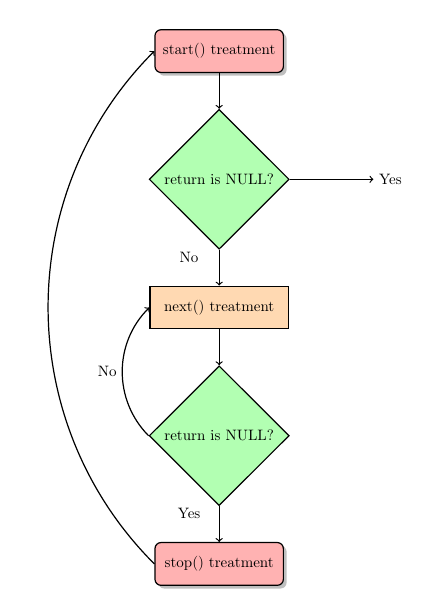

`/proc`虚拟文件系统驻留在/proc目录，包含了各种内核信息，允许进程通过常规文件IO系统调用方便的读取，有时还可以修改，之所以是虚拟，因为其包含的文件和子目录并未存储在磁盘上，而是由内核在进程访问此类信息时动态创建的。
`/proc`目录有很多目录和文件, 常用的有:
* /proc: 各种系统信息
* /proc/net: 网络和套接字的状态信息
* /proc/sys/fs: 文件系统相关设置
* /proc/sys/vm: 内存管理设置
* /proc/sys/net: 网络和套接字的设置
* /proc/sys/kernel: 常规的内核设置
* /proc/sysvipc: System V IPC对象的信息
* /proc/modules: 已加载的模块信息
* /proc/meminfo: 内存空间占用信息

# /proc如何访问
一般可以通过如下三种方式使用`/proc`:
1. cat以手工查看
2. 程序中用文件IO访问
3. shell脚本中用cat命令结合正则表达式来获取并处理内核信息

下面是在C程序中访问`/proc`中文件获取信息的例子:
```c
#include <stdio.h>
#include <string.h>
#include <sys/types.h>
#include <sys/stat.h>
#include <fcntl.h>
#include <unistd.h>

int main(int argc ,char **argv)
{
    int fd=-1;
    char buf[500]={0};
    if(argc!=2)
    {
        printf("eg: %s -d|-v\n",argv[0]);
        return -1;
    }
    if(!strcmp(argv[1],"-v"))
    {
        fd=open("/proc/version",O_RDONLY);
        read(fd,buf,sizeof(buf));
        printf("结果:\n%s\n",buf);
    }
    else if(!strcmp(argv[1],"-d"))
    {
        fd=open("/proc/devices",O_RDONLY);
        read(fd,buf,sizeof(buf));
        printf("结果:\n%s\n",buf);
    }
}
```

# 创建和访问/proc文件
像普通字符设备驱动程序一样, 我们也可以使用内核模块创建一个`/proc`下的文件, 并添加相应的驱动程序(很像笔记里虚拟字符设备). **不同的是, proc文件系统有自己独有的文件操作指针fops和创建函数。**
## struct proc_dir_entry
`proc_dir_entry`用于表示一个proc文件:
```c
struct proc_dir_entry {
    atomic_t in_use;
    //...
    const struct inode_operations *proc_iops;
    union { //指向IO操作结构体,驱动要实现的主要部分
        const struct proc_ops *proc_ops;
        const struct file_operations *proc_dir_ops;
    };
    //...
    kuid_t uid;
    kgid_t gid;
    loff_t size;
    struct proc_dir_entry *parent;
    struct rb_root subdir;
    struct rb_node subdir_node;
    char *name;
    umode_t mode;
    u8 flags;
    u8 namelen;
}__randomize_layout;
```

## proc_ops
proc文件使用特有的ops结构体来支持IO操作, 只有内核版本不支持`struct proc_ops`时才使用`file_operations`:
```c
struct proc_ops {
    unsigned int proc_flags;
    int (*proc_open)(struct inode *, struct file *);
    ssize_t (*proc_read)(struct file *, char __user *, size_t, loff_t *);
    ssize_t (*proc_read_iter)(struct kiocb *, struct iov_iter *);
    ssize_t (*proc_write)(struct file *, const char __user *, size_t, loff_t *);
    loff_t  (*proc_lseek)(struct file *, loff_t, int);
    int (*proc_release)(struct inode *, struct file *);
    __poll_t (*proc_poll)(struct file *, struct poll_table_struct *);
    long    (*proc_ioctl)(struct file *, unsigned int, unsigned long);
#ifdef CONFIG_COMPAT
    long    (*proc_compat_ioctl)(struct file *, unsigned int, unsigned long);
#endif
    int (*proc_mmap)(struct file *, struct vm_area_struct *);
    unsigned long (*proc_get_unmapped_area)(struct file *, unsigned long, unsigned long, unsigned long, unsigned long);
} __randomize_layout;
```

## proc文件驱动示例
如下示例支持读写`/proc`文件, 与字符驱动不同的是**不需要申请设备号和注册设备等操作,只需要创建文件+绑定ops即可**。
```c
/*
* procdev_rw.c - create a "file" in /proc
*/
#include <linux/kernel.h> /* We're doing kernel work */
#include <linux/module.h> /* Specifically, a module */
#include <linux/proc_fs.h> /* Necessary because we use the proc fs */
#include <linux/uaccess.h> /* for copy_from_user */
#include <linux/version.h>

#if LINUX_VERSION_CODE >= KERNEL_VERSION(5, 6, 0)
#define HAVE_PROC_OPS
#endif

#define PROCFS_MAX_SIZE 1024
#define procfs_name "procdev2"

static struct proc_dir_entry *our_proc_file;
/* The buffer used to store character for this module */
static char procfs_buffer[PROCFS_MAX_SIZE];

//ops函数
static ssize_t procfile_read(struct file* filePointer, char __user *buffer,
                             size_t buffer_length, loff_t* offset)
{
    unsigned long count = buffer_length;
    unsigned long p = *offset;
    ssize_t ret = 0;
    //判断文件偏移量
    if (p >= PROCFS_MAX_SIZE)
        return 0;//偏移量不能超过buffer容量

    if (count > (PROCFS_MAX_SIZE - p))
        count = PROCFS_MAX_SIZE - p;

    if(copy_to_user(buffer, procfs_buffer + p, count))
    {
        pr_info("copy_to_user failed\n");
        ret = 0;
    }
    else
    {
        pr_info("procfile_read file %s\n", filePointer->f_path.dentry->d_name.name);
        *offset += count;
        ret = count;
    }
    return ret;
}

/* This function is called with the /proc file is written. */
static ssize_t procfile_write(struct file *file, const char __user *buff,
                              size_t len, loff_t *off)
{
    unsigned long p = *off;
    unsigned int count = len;
    int ret = 0;

    if (p >= PROCFS_MAX_SIZE)
        return 0;//偏移位置不能超过空间容量

    if (count > (PROCFS_MAX_SIZE - p))
        count = PROCFS_MAX_SIZE - p;//字节数不能超过容量

    if (copy_from_user(procfs_buffer + p, buff, count))
    {
        pr_info("copy_from_user failed\n");
        return -EFAULT;
    }
    else
    {
        pr_info("copy_from_user success, write length:%d\n", count);
        *off += count;
        ret = count;
    }

    return ret;
}

//定义ops结构体
#ifdef HAVE_PROC_OPS
static const struct proc_ops proc_file_ops = {
    proc_read:procfile_read,
    proc_write:procfile_write,
};
#else
static const struct file_operations proc_file_ops = {
    read:procfile_read,
    write:procfile_write,
};
#endif

//模块加载
static int __init profdev2_init(void)
{
    //创建proc文件,绑定ops
    our_proc_file = proc_create(procfs_name, 0666, NULL, &proc_file_ops);
    if (NULL == our_proc_file)
    {
        proc_remove(our_proc_file);
        pr_alert("Error: Could not initialize /proc/%s\n", procfs_name);
        return -ENOMEM;//没有内存空间了，创建失败
    }

    pr_info("/proc/%s created\n", procfs_name);
    return 0;
}

//模块卸载
static void __exit procdev2_exit(void)
{
    //删除文件
    proc_remove(our_proc_file);
    pr_info("/proc/%s removed\n", procfs_name);
}

module_init(profdev2_init);
module_exit(procdev2_exit);

MODULE_LICENSE("GPL");
```

# seq_file简化proc写入
seq_file可以简化/proc文件的读写, 使读写的格式更加优雅. seq_file主要有三个函数组成:
```c
struct seq_operations {
    void * (*start) (struct seq_file *m, loff_t *pos);
    void (*stop) (struct seq_file *m, void *v);
    void * (*next) (struct seq_file *m, void *v, loff_t *pos);
    int (*show) (struct seq_file *m, void *v);
};
```
* `start()`: 用于启动一个处理序列
* `next()`: 每当遇到非NULL值, 就调用`next()`迭代处理。
* `show()`: 显示每一步的输出
* `stop()`: 当遇到NULL值时,停止调用`next()`, 调用`stop()`结束序列


使用示例如下: 需要先绑定`seq_ops`, 再将seq_file的相关函数绑定到文件ops上
```c
/* This function is called at the beginning of a sequence.
 * ie, when:
 * - the /proc file is read (first time)
 * - after the function stop (end of sequence)
*/
static void *my_seq_start(struct seq_file *s, loff_t *pos)
{
    static unsigned long counter = 0;
    /* beginning a new sequence? */
    if (*pos == 0) {
        /* yes => return a non null value to begin the sequence */
        return &counter;
    }
    /* no => it is the end of the sequence, return end to stop reading */
    *pos = 0;
    return NULL;
}

/* This function is called after the beginning of a sequence.
 * It is called untill the return is NULL (this ends the sequence).
*/
static void *my_seq_next(struct seq_file *s, void *v, loff_t *pos)
{
    unsigned long *tmp_v = (unsigned long *)v;
    (*tmp_v)++;
    (*pos)++;
    return NULL;
}

/* This function is called for each "step" of a sequence. */
static int my_seq_show(struct seq_file *s, void *v)
{
    loff_t *spos = (loff_t *)v;
    seq_printf(s, "%Ld\n", *spos);
    return 0;
}

/* This function is called at the end of a sequence. */
static void my_seq_stop(struct seq_file *s, void *v)
{
    /* nothing to do, we use a static value in start() */
}
//填充seq_ops
static struct seq_operations my_seq_ops = {
    start:my_seq_start,
    next:my_seq_next,
    stop:my_seq_stop,
    show:my_seq_show,
};

/* This function is called when the /proc file is open. */
static int my_open(struct inode *inode, struct file *file)
{
    return seq_open(file, &my_seq_ops);//绑定seq_ops供其他seq函数使用
}

//定义ops结构体
static const struct proc_ops proc_file_ops = {
    .proc_open = my_open,
    .proc_read = seq_read,
    .proc_lseek = seq_lseek,
    .proc_release = seq_release,
};
```