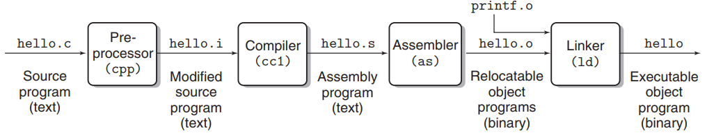
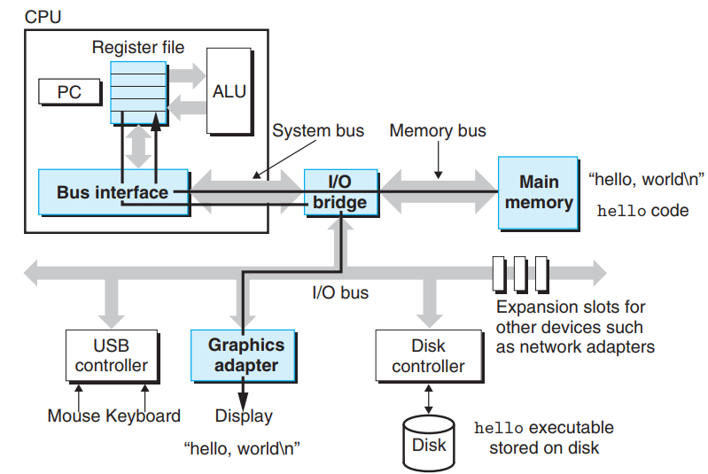
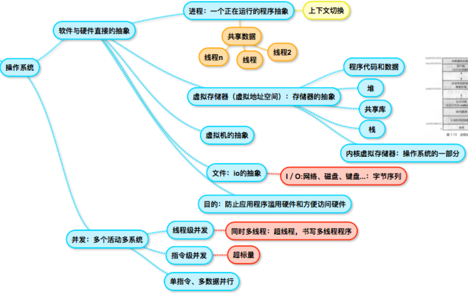

在计算机系统的内部，所有的信息——包括磁盘文件、程序、以及网络中的数据都是由一串位表示的，区分不同信息的关键在于对于这些内容如何解释，就比如同样的一串01010101，可以解释成：整数、浮点数甚至指令。

# 1 程序编译
预处理－编译－汇编－链接的基本过程：

- 预处理的工作比较简单：包括展开#include中的.h头文件，替换宏定义等；
- 编译器其实包含了一个**汇编语言程序**，讲程序语言转化成汇编语言；
- 汇编阶段：生成可重定位的.o二进制目标文件，这一步完成汇编语言转**机器指令**；
- 链接阶段：合并许多的.o文件，主要是我们在源程序中用到过的如：printf.o

# 2 高速缓存
当我们从外壳执行hello程序的时候，首先是将程序的数据和代码**从磁盘复制到主存**，处理器开始执行指令，并将需要显示的数据**从主存复制到寄存器**中，最后需要显示是**将寄存器的数据复制到显示设备**，最终显示出来的。这些复制操作就是开销，减缓了程序真正的工作。因此就需要高速缓存技术：暂时集结区域。下图是没有缓存机制的程序运行过程：

# 3 操作系统
操作系统提供了软件与硬件之间的一层抽象，既可以防止程序滥用硬件也方便了我们对于程序的编写。这里的抽象主要是指

- 对运行中程序的抽象（进程）
- 对于存储器的抽象（虚拟存储器）
- 对输入输出的抽象（文件）甚至包括网络
- 虚拟机等

