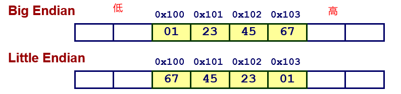
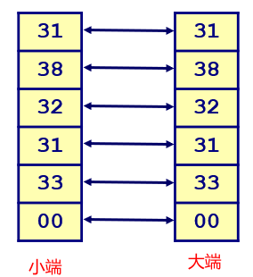
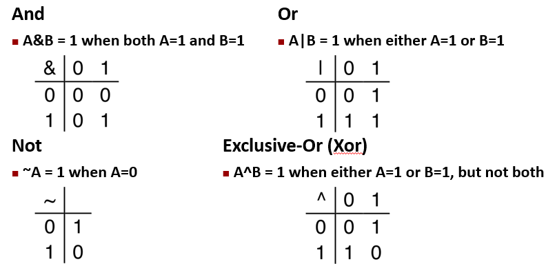
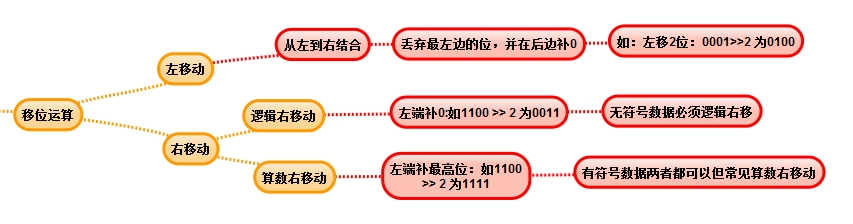
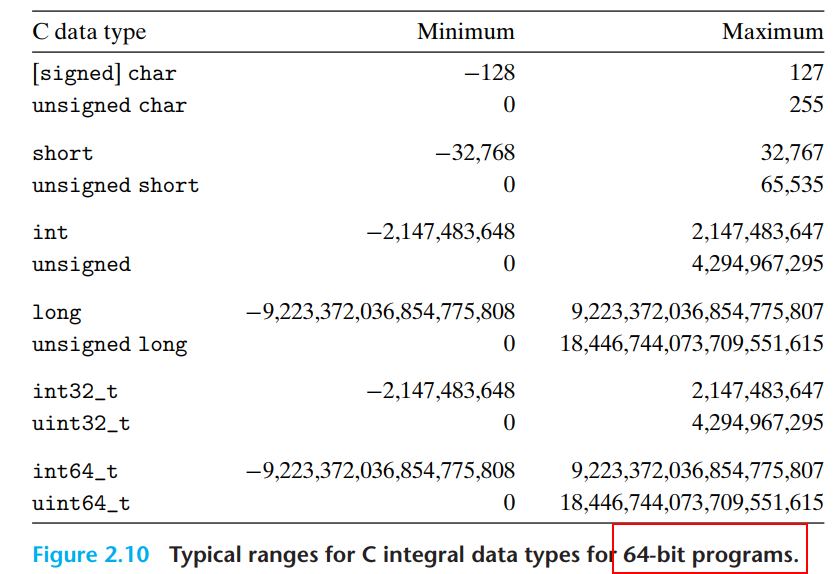
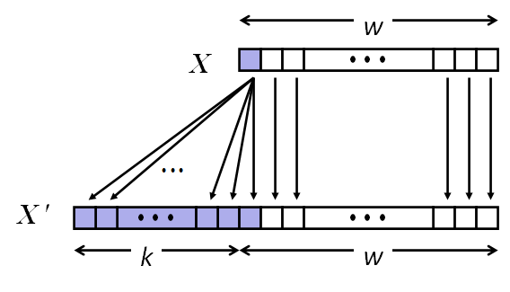
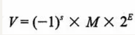
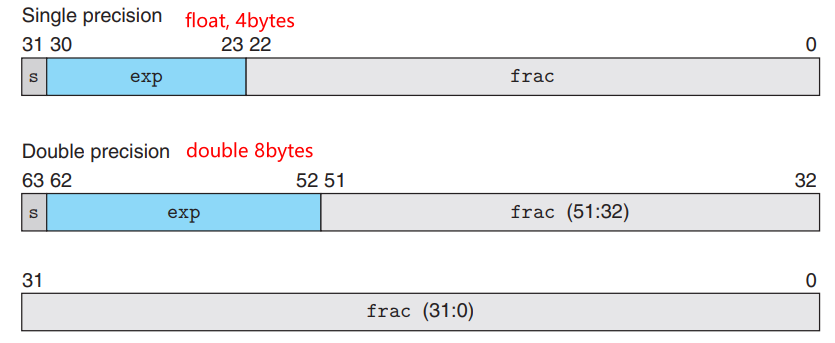

# 1 一切皆bits
计算机是二进制的，所以**每一比特位都只能取值0或1。**所有的数字都是基于二进制在计算机中表示。8位bit的组合被称为**字节byte**。不同的数据类型有不同的长度，同一类型在不同架构的系统里基于的byte数也会不同：

| C Data Type | Typical 32-bit | Typical 64-bit | **x86-64** |
| --- | --- | --- | --- |
| **char** | 1 | 1 | **1** |
| **short** | 2 | 2 | **2** |
| **int** | 4 | 4 | **4** |
| **long** | 4 | 8 | **8** |
| **float** | 4 | 4 | **4** |
| **double** | 8 | 8 | **8** |
| **long double** | − | − | **10/16** |
| pointer | 4 | 8 | **8** |


## 1.1 整型的大小端字节序

- 小端序：低位字节保存在低位内存地址，简称**低低**
   - **x86，arm处理器都是小端序**
- 大端序：低位保存在高位内存地址，高位字节保存在低位内存地址，简称**低高**
   - **internet大端序**

例如对于数值0x01234567，**由于二进制从右往左表示数值，所以12是高位字节，67是低位字节**，所以大小端的显示方式如下：

```cpp
#include <iostream>
typedef unsigned char *pointer;

//该函数用于打印输入数值的内存地址和对应的值
//由此可以看出是什么字节序
void show_bytes(pointer start, size_t len)
{
    size_t i;
    for (i = 0; i < len; i++)
        printf("%p\t 0x%.2x\n", start + i, start[i]);
    printf("\n");
}

int main()
{
    int a = 15213; //16进制位0x3b6d
    show_bytes((pointer)&a, sizeof(int));
    return 0;
}
/*
输出为：可以看出，符合低低原则，是小端序
0x7ffe4715f0a4	 0x6d
0x7ffe4715f0a5	 0x3b
0x7ffe4715f0a6	 0x00
0x7ffe4715f0a7	 0x00
*/
```

## 1.2 字符串的表示
字符串是一系列有序的字符组成，以\0结束，在内存中总是以相同的顺序保存，和大小端字节序没有关系。例如对字符串`char S[6] = "18213"`，不管系统是什么字节序，内存中表示都是：

# 2 位级运算

## 2.1 位运算
单个bit之间有如下四种基本运算，下面是四种运算的基本图示：
> note：在C/C++中，可以使用&、|、~、^来表示这四种运算。但是位运算符需要与逻辑运算符号区分开，判断符号有&&、||、！等。


## 2.2 位移运算

- 左移 x<<y：
   - 二进制数x向左移动y个bit
   - 左侧超出范围的bit被丢弃
   - 右侧空白位补0
- 右移 x >>y：
   - 二进制数x向右移动y个bit
   - 右侧超出范围的bit被丢弃
   - 左侧空白位补0



# 3 整型表示

## 3.1 数值范围计算

- 无符号：不需要考虑符号位，0 至（2  -1）
- 有符号：需要考虑符号位，-2 至 2 - 1
> 当前计算机中，有符号数基本都采用**补码**的方式进行表示

例如常见类型的数值范围：

## 3.2 符号扩展
将一个小范围的数据类型转换到一个大的数据类型时（比如short int 到int），C/C++会自动进行符号的扩展： 

- 无符号转为更大的数值：前面扩展位填充0，原bit位值不变
- 有符号转为更大的数值：前面扩展位填充原来符号位的值（0或1），原bit位值不变

# 4 浮点数

## 4.1 **单精度和双精度的表示**
**IEEE**浮点数表示标准:



- 符号（S）：当s=1为负数，当s=0为正数；
- 尾数（M）：表示从（1~2）或者（0~1）之间的数；
- 阶码（E）：可以是负数

其内存表示如下：

## 4.2 **浮点数的数学属性**
浮点数使用的是向偶数舍入的方法，为了避免统计上的误差，在一半的时间向下舍入，另一半的时间向上舍入。由于舍入而产生的丢失精度，**浮点数的运算中不具有结合性。**因此在C/C++中使用浮点数需要注意：

- int转换为float时，数值不会溢出，但是可能被舍入，导致和原int值不一致
- int或float转换为double时，因为double数值范围更大，精度更高，因此可以保留精确的数值
- 从double转换为float时，因为范围减小，数值可能溢出为极大或极小（+∞ or -∞ ），并可能被舍入
- 从float或double转换为int时，值会向0舍入。进一步来说，值可能会溢出（C标准没有规定这种情况的处理结果，如果不能为浮点数找到一个合理的整数近似值，就会产生一个**整数不确定值**）
   - 比如1.999转换为1，-1.999转换为-1


