# 1 Intel CPU数据格式
首先需要区分CPU中所指的数据类型和C语言中的区别，比如Intel中**word（字）**表示16个bit，而编程语言中**字节**表示8个bit，更具体的对比见下表（X86-64架构）：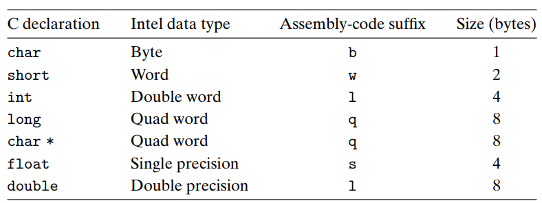

# 2 寄存器和汇编语言

## 2.1 程序寄存器
如下图所示，CPU中有很多寄存器（IA32有8个，X86-64有16个），每个寄存器都有不同的作用，寄存器可以通过上面的数据格式进行读写：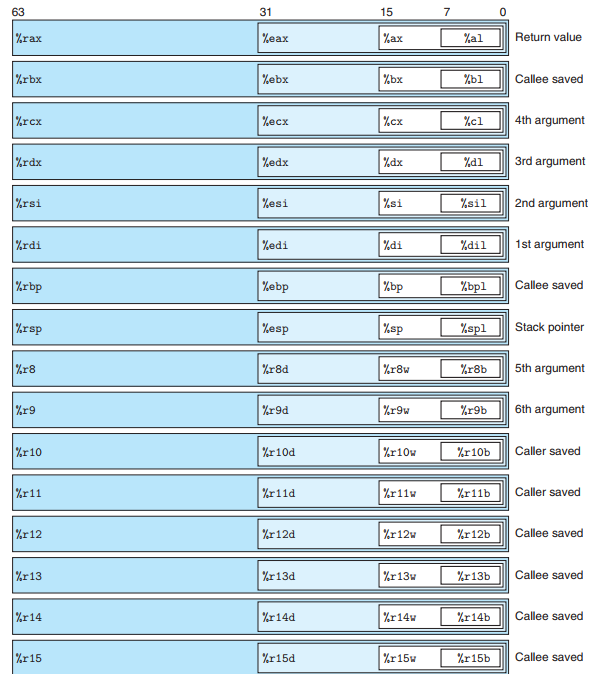

## 2.2 move指令
move传送指令：move  源--> 目的地（两个操作数不能同时指向存储器，需要寄存器周转）。详细命令如下：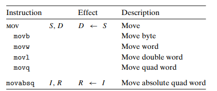
```c
long exchange(long *xp, long y) //该函数用于将传入的值y赋值给指针xp
{
	long x = *xp;
	*xp = y;
	return x;
}
```
使用命令`gcc -Og -S a.cpp`编译后可以得到名为a.s的汇编文件，可以看到源代码生成的汇编内容：
```
_Z8exchangePll:
.LFB24:
    .cfi_startproc
===>x是返回值，所以使用rax寄存器，xp是传入的第一个参数，保存在rdi寄存器。这一句的意思是从xp获取到x
    movq    (%rdi), %rax
===>y是传入的第二个参数，保存在rsi寄存器，这里需要将y赋值给xp，所以需要从rsi move到rdi
    movq    %rsi, (%rdi)
===>返回寄存器rax中的值
    ret
    .cfi_endproc
```

## 2.3 栈操作push和pop指令
栈的数据结构是**向低地址方向增长**的，无论如何esp都是指向栈顶。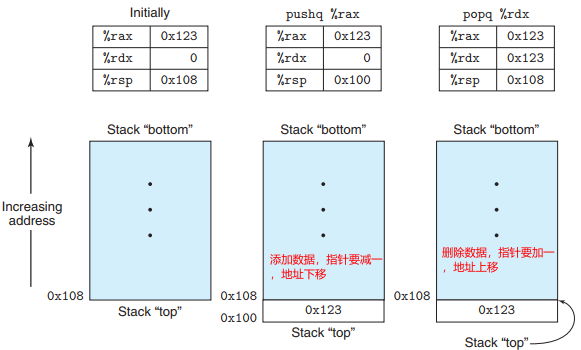

- `pushq`指令相当于如下两步操作：
   - `subq $8, %rsp`：stack pointer寄存器减一（X86-64架构，q长度为8，所以这里用$8）
   - `movq $rbp, (%rsp)`：将新数据放入stack pointer中
- `popq`指令相当于如下两部操作：
   - `movq (%rsp), %rax`：从stack pointer寄存器中读取值，保存到rax中，用于返回数据
   - `addq $8, %rsp`：stack poinger寄存器加一

## 2.4 基本运算指令
加减乘除、与或非等常见运算指令如下图，不再详细介绍了。需要注意的是，汇编代码与C语言源码中的顺序可能不同：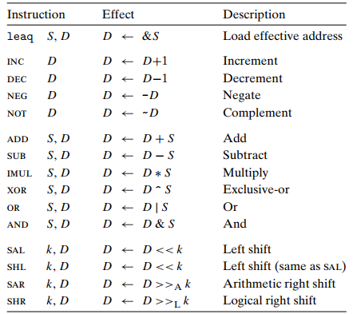

## 2.5 控制指令
> **汇编程序通过条件测试和跳转来实现循环和条件判断**


### 2.5.1 条件寄存器指令
这里用到的是条件码寄存器，常见的有：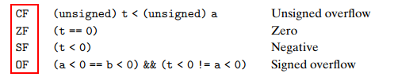
```
int comp(data_t a, data_t b)
a in %rdi, b in %rsi
comp:
    cmpq %rsi, %rdi ===>比较两个寄存器中的值
    setl %al        ===>从条件码中获取结果保存到eax寄存器的最低位al，用于返回
    movzbl %al, %eax ===>清除eax寄存器的其他位，值保留最低位
    ret
```

### 2.5.2 跳转指令
jmp指令用于跳转改变程序的执行顺序（想象一下C语言的goto，当然并不等于goto，if判断等也是调用jmp）：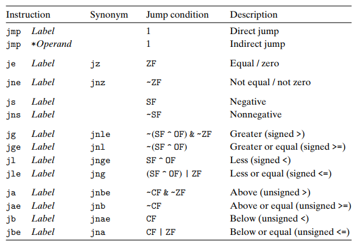

- 直接跳转用`.`
- 间接跳转用`*`

示例如下：
```
    movq $0,%rax      ===>设置rax为0
    jmp .L1           ===>直接跳转到.L1位置
    movq (%rax),%rdx  ===>设置rdx为NULL，即删除指针，这里会被跳过
.L1:
    popq %rdx         ===>跳转的位置
```


# 3 函数调用怎么表示

## 3.1 栈帧
我们如果要调用一个函数，实现将数据和控制代码从一个部分到另一个部分的跳转。我们如何来分配执行函数的变量空间，并在返回的时候释放空间，将返回值返回呢？**答案是只有****栈帧**。栈帧的结构如下：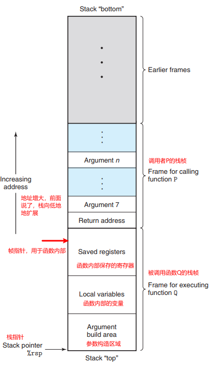

## 3.2 函数调用和返回指令
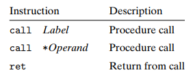

## 3.3 函数参数的传递
函数参数是通过专门的**参数寄存器**来保存和传递（参考第二节）。

# 4 复杂数据类型的表示

## 4.1 数组
数组不再详解，因为不是很复杂。**数组就是内存中一段连续的空间**，比如声明了`int a[12]`就会拥有起始地址A+12位置的空间（总大小4*12）。而汇编要访问数组里的元素，使用指令：`movl (%rdx,%rcx,4),%eax `。（4表示数据类型的大小）数组的地址放于rdx中，而索引index放于rcx中，我们通过上面的指令就完成了`A + 4i`来读取其中的值，放在了eax中去。

## 4.2 struct和union

- **结构体：**所有的组成部分在存储器中连续存放，指向结构的指针指向结构的第一个字节；结构的各个字段的选取是在编译时处理，机器代码不包含字段的声明或字段名字的信息。
- **联合体：**一个联合的总大小等于它最大字段的大小，而指向一个联合的指针，引用的是数据结构的起始位置。应用在：
   - 如果两个数据互斥，减少空间；
   - 访问不同数据的位模式

## 4.3 数据对齐
数据对齐要求**某个类型对象的数据地址必须是（2、4、8）的倍数**。比如汇编中，`.align 4`要求数组开始的位置为4的倍数，由于每单个数据的长度也是4的倍数，也就保证了后续的数据是4的倍数，数据对齐了。这种设计简化了，处理器与存储器之间接口的硬件设计。这种设计，**编译器甚至会在字段中间、后面插入间隙，以保证每个结构满足上述要求**
例如，定义了如下结构体：
```cpp
struct S1 {
	int i;  //长度4
	char c; //长度1
	int j;  //长度4
};
```
其在内存中显示为：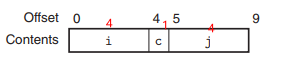

# 5 内存越界和缓冲区溢出

## 5.1 越界示例
由于C/C++对于数组不进行边界检查，在栈帧结构中保存着局部变量和状态信息，特别是返回地址也是在栈中存放的，对越界数据的访问和修改将破坏掉这些数据，当ret试图返回的时候，错误的地址（甚至是被修改的恶意目的地地址）会带来严重的安全隐患。
例如下面的代码，定义了长度为8的字符数组，然后从标准输入获取内存填充。
```cpp
char *gets(char *s)
{
    int c;
    char *dest = s;
    while ((c = getchar()) != ’\n’ && c != EOF)
        *dest++ = c;

    if (c == EOF && dest == s)
        return NULL;/* No characters read */

    *dest++ = ’\0’; /* Terminate string */
    return s;
}
/* Read input line and write it back */
void echo()
{
    char buf[8]; /* Way too small! */
    gets(buf);
    puts(buf);
}
```
很明显存在的问题是数组越界，数组长度只有8，而用户的输出超过8时，输入字符就会保存到字符数组之外，而恰好这是一个**函数调用**，过多的字符会副高栈帧原有的内容。根据覆盖的长度不同，程序可能出现不同的表现行为，严重的会破坏函数调用返回地址，或破坏调用者的内容：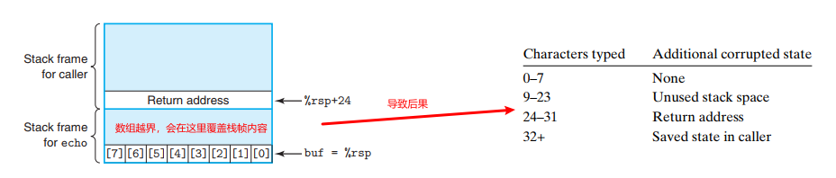

## 5.2 预防措施

- **栈随机化：**在程序开始时，随机分配一段0-n的空间，使得栈的位置每次运行都不同。栈地址随机化，即使在一台机器上运行同样的程序，地址都是不同的。
- **栈破坏检测：**插入栈保护者，俗称金丝雀的一段随机大小

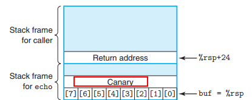

- **限制可执行代码区域**

**

# 6 浮点数寄存器
和第二节寄存器类似，不过长度更长，使用的指令也不一样（仅作了解，以后再研究）。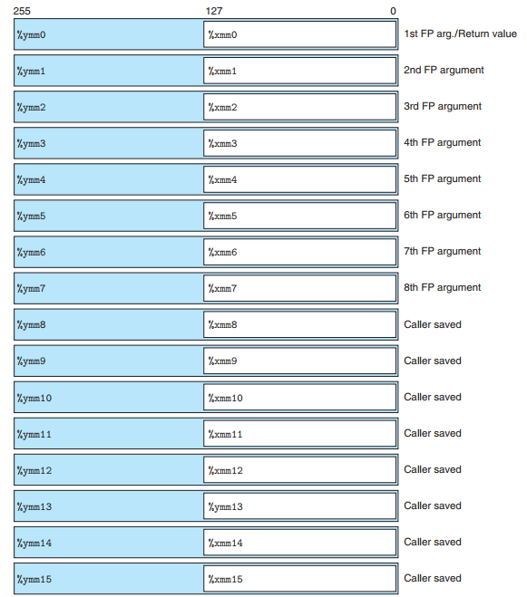
