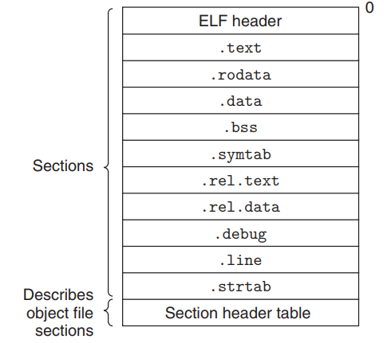
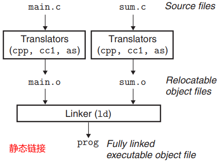
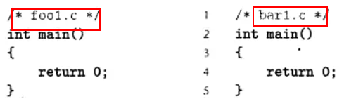
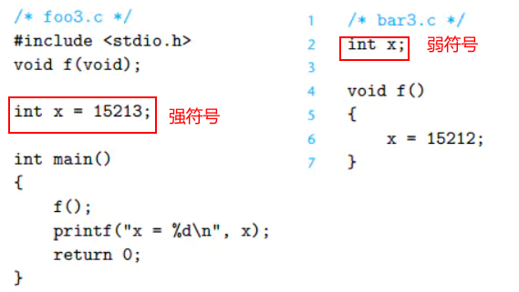
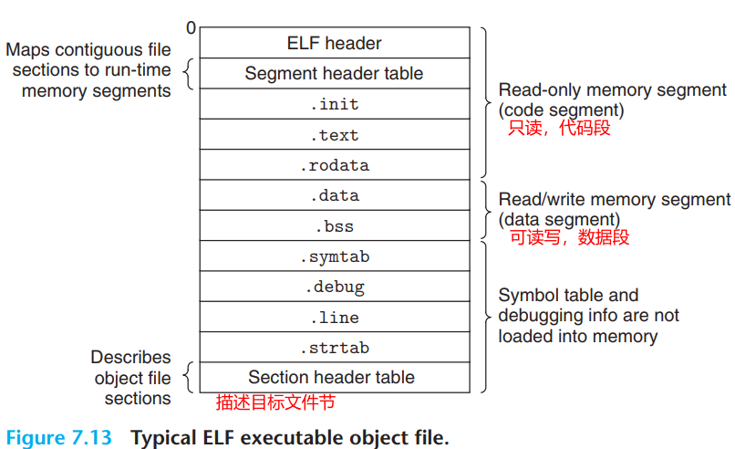
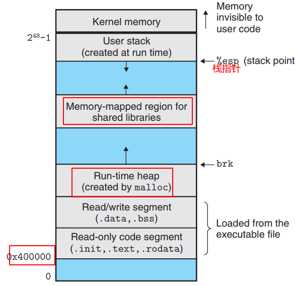
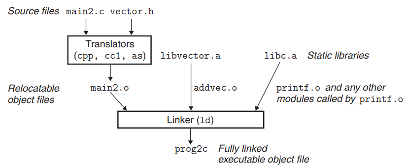

链接是将各种不同文件的代码和数据部分收集（符号解析和重定位）起来并组合成一个单一文件的过程。分为**静态链接**和**动态链接**。

# 1 目标文件
目标文件一般是由汇编器生成的.o后缀的文件，大概有三种不同的形式：

- 可重定位目标文件；
- 可执行目标文件
- 共享目标文件。

## 1.1 ELF文件格式
下面基于Unix上的ELF格式（windows上是PE格式）举例**一个典型的可重定位文件格式如下：**

- .text：已编译程序的机器码；
- .rodata：只读数据（read-only-data）；
- .data：已初始化的全局变量；
- .bss：未初始化的全局变量（better save space）;
- .symtab：一个符号表（**定义和引用的函数和全局变量信息**）；
- .rel.text：代码重定位条目， 一个.text节中位置的列表，需要修改的位置;
- .rel.data: 被模块引用或定义的任何全局变量的重定位信息；
- .debug：一个调试符号表；
- .line：原始C源程序中的行号和.text机器指令的映射；
- .strtab: 一个字符串表

## 1.2 符号和符号表
保存于.symtab中的是一个符号表，其是定义和引用函数和全局变量的信息。有三种不同类型的符号：

- 全局符号（不带static），
- 外部引用（external）
- 本地符号。如果是带有static符号的就会在.data和.bss中为每个定义分配空间，并在.symtab中创建一个唯一名字的本地符号


例如下面代码：
```cpp
//static定义的x变量，其会在.data中分配空间，并在.symtab中创建两个，x.1表示f函数的定义和x.2表示函数g的定义
int f()
{
	static int x = 0;
	return x;
}

int g()
{
	static int x = 1;
 	return x;
}
```
.symtab符号表的使用的数据结构为：
```c
//elfstructs.c
typedef struct {
	int name; /* String table offset */
	char type:4, /* Function or data (4 bits) */
	binding:4; /* Local or global (4 bits) */
	char reserved; /* Unused */
	short section; /* Section header index */
	long value; /* Section offset or absolute address */
	long size; /* Object size in bytes */
} Elf64_Symbol;
```
我们使用命令`readelf -a main.o`（main.o生成方式见第二节gcc）可以读取可重定位目标文件的内容，下面列出了最后几行内容，可以对应到上面的结构体：
```c
//main.c内容
int sum(int *a, int n);//该函数不在本文件中
int array[2] = {1, 2};

int main()
{
    int val = sum(array, 2);
    return val;
}
//符号表部分内容
Num:    Value          Size Type    Bind   Vis      Ndx Nam 
9: 0000000000000000     8 OBJECT  GLOBAL DEFAULT    3 array
10: 0000000000000000    37 FUNC    GLOBAL DEFAULT    1 main
11: 0000000000000000     0 NOTYPE  GLOBAL DEFAULT  UND _GLOBAL_OFFSET_TABLE_
12: 0000000000000000     0 NOTYPE  GLOBAL DEFAULT  UND sum
```
我们可以看到

- num9处，全局变量array定义条目，位于.data(Ndx=3)开始字节偏移为0（value为0）处的8个字节目标（size）。
- 随后是全局符号main的定义，其位于.text(Nex=1)处，偏移字节为0处（value）的17个字节函数。
- 最后一个是sum函数的引用，现在没有链接过程，还找不到sum函数定义的位置，所以是Und。


# 2 链接的过程
比如有两个源代码文件，通过编译器命令`gcc -0 a.out main.c sum.c`进行编译链接，其内部过程为：

| 
| --- | --- |

**在以上的这个过程中ld链接器的主要工作：**

1. **符号解析。**目标文件定义和引用符号，符号解析的目的是将每个符号引用和一个符号定义联系起来；
1. **重定位：**把每个符号定义与一个存储器位置联系起来，然后修改对这些符号的引用，使得他们指向这个存储器位置，从而实现重定位。

## 2.1 第一步：符号解析
符号解析任务简单的说，就是**链接器使得所有模块中的每个符号只有一个定义**。链接器在这一个阶段的主要任务就是把代码中的每个符号引用和确定的一个符号定义联系起来。

- 对于本地符号，这个任务相对来说是简单的。
- 复杂的就是全局符号，编译器（cc1）遇到不是在当前模块中定义的符号时，会假设该符号的定义在其他模块中，生成一个**链接器符号（上面的UND）**交给链接器处理。如果链接器ld在所有的模块中都找不到定义的话就会抛出异常。


这里最容易产生的错误就是当多个模块定义同一个符号的时候，我们的链接器到底怎么做。以C++中的函数重载为例，我们会按照实际的需要重载许多相同名字的函数，链接器（ld）使用一种叫做毁坏的方法（mangling）将相同函数名不同参数的函数进行修改，比如Foo将会编码成3Foo__的形式，实际上还是使得在链接器层面上来看符号是唯一的。
链接器使用如下规则**解析多重定义的全局符号**：

- 规则1：不允许多个强符号；（比如两处定义了mian函数）



- 规则2：如果有一个强符号和多个弱符号，那么选择强符号；（比如下面例子，两处定义了X变量，其中初始化的那个是强符号，被选择）



- 规则3：如果有多个弱符号，那么这些弱符号中任意选择一个；

### 2.1.1解析静态库
解析静态库的过程是按照命令行标识的文件顺序从左到右解析，如果输入文件是一个目标文件(.o)，那么将文件添加到集合E（合并成执行文件）；如果f是一个存档文件（.a），那么就尝试解析集合U（未解析的符号），能够解析的话就将其加载到集合E中去；重复这样的过程直到都解析完毕。

## 2.2 第二步：重定位
完成了符号解析以后，链接器的第二个任务就是合并输入模块，并为每个符号分配运行时的地址。

- **重定位节和符号定义：**在这一步中，链接器将所有模块中的.data节合并成一个文件的.data节，运行时存储器的地址也会赋给新的聚合节。
- **重定位节中的符号引用：**链接器修改代码节和数据节中对每个符号的引用，使得他们指向正确的运行时地址。

### 2.2.1 重定位条目的结构
当汇编器生成一个.o文件模块的时候，它不知道数据和代码最终会放到存储器的什么位置，它只是生成一个重定位条目，放到.rel.text中告诉大家这个内容会在以后修改。数据结构如下：
```cpp
//elfstructs.c
typedef struct {
	long offset; /* Offset of the reference to relocate */
	long type:32, /* Relocation type */
	symbol:32; /* Symbol table index */
	long addend; /* Constant part of relocation expression */
} Elf64_Rela;
```

- offset：是需要修改的引用节的偏移；
- symbol：标识被修改引用应该指向的符号；
- type：告诉连接器如何修改新的引用


ELF有32种不同的重定位类型：我们只关心常用的两种：

- **（相对地址引用）**：R_X86_64_PC32和R_X86_64_PLT32
- **（绝对地址引用）：**R_X86_64_32

### 2.2.2 **重定位符号引用**
**【相对地址引用模式】R_X86_64_PC32：**再以1.2节的main和sum文件为例，来看main.c文件的反汇编列表的一个片段：

- 反汇编.o文件命令：`objdump -dx main.o `
```
000000000000000 <main>:
   0:   f3 0f 1e fa             endbr64 
   4:   48 83 ec 08             sub    $0x8,%rsp
   8:   be 02 00 00 00          mov    $0x2,%esi
   d:   48 8d 3d 00 00 00 00    lea    0x0(%rip),%rdi        # 14 <main+0x14>
                        10: R_X86_64_PC32       array-0x4
  14:   e8 00 00 00 00          callq  19 <main+0x19>
                        15: R_X86_64_PLT32      sum-0x4
  19:   48 83 c4 08             add    $0x8,%rsp
  1d:   c3                      retq   
```
这里我们看到call指令开始于字节偏移0x14处的位置，sum函数在main处偏移0x19处的位置。重定位类型使用的是R_X86_64_PLT32模式（和PC32一样是相对地址引用，是新GCC的默认格式）。所以重定位条目的数据结构如下：
```
r.offset = 0x19
r.symbol = sum
r.type = R_X86_64_PC32
r.addend = -4
```
这个结构告诉我们，修改偏移量为0x13的相对引用，使得它能指向sum函数的位置。​

**【绝对地址引用模式】R_X86_64_32：**绝对地址就比较好理解了，使用绝对的地址，不添加任何偏移量。​

# 3 可执行目标文件
链接器主要完成了两个工作，符号解析和重新定义。将数据和代码合并成为一个可执行的文件，接下来我们看看这个可执行文件的格式是什么，以及如何加载到存储器中开始运行的过程。

## 3.1 可执行文件格式
可执行elf文件格式如下：

- ELF头部：描述文件总体格式，标注出程序入口点；.init：定义了初始化函数;
- 段头部表：可执行文件是一个连续的片，段头部表中描述了这种映射关系；


我们对1.2节的code编译生成a.out文件进行反汇编（依然使用objdump命令），可以看到program header中各个段，下面列出了只读段和可读写段的内容：
```
LOAD off    0x0000000000001000 vaddr 0x0000000000001000 paddr 0x0000000000001000 align 2**12
         filesz 0x0000000000000225 memsz 0x0000000000000225 flags r-x
         
 LOAD off    0x0000000000002df0 vaddr 0x0000000000003df0 paddr 0x0000000000003df0 align 2**12
         filesz 0x0000000000000228 memsz 0x0000000000000230 flags rw-
```
解释：在段头部表中，我们会看到程序初始化为两个存储器字段，

- 行1和行2是代码段，有读和执行的权限（flags：r-x），开始于存储器地址0x0000000000001000处（vaddr/paddr），该字段大小为0x225（memsz），并且初始化为可执行目标文件的头0x225个字节（filesz）；
- 行3和行4是数据段，有读写的权限（flags），开始于存储器地址：0x0000000000003df0处，总大小0x230个字节（memsz），从文件偏移0x0000000000002df0（off）处开始的0228（filesz）个字节初始化。


## 3.2 ** 如何加载可执行目标文件**
加载后运行的每个Unix程序都有一个镜像，如下图所示。代码段总是从0x400000开始，数据段是接下来的4kb对齐地址处，运行时堆在读写段之后，使用malloc向上增长；还有一个段为共享库保留。用户栈是在最大合法地址处开始并向下增长。再往上就是不对用户开放的内核虚拟存储器了。
**怎样加载？**当加载器运行时，就先创建一个存储器映像（上图所示），在ELF可执行文件头部表的指示下，加载器将可执行文件的代码和数据段拷贝到0x0804800处向上的两个段中，然后跳转到程序入口点_start（在ctrl.o中定义）开始执行

# 4 静态链接库
像printf等一些常用的函数，都是在libc.a静态库中，**静态库以一种存档的特殊文件（.a）格式**，将可以定位的目标文件集合成一个.a文件。可以使用如下命令使用系统已有的静态库：

- `gcc main.c /usr/lib/printf.o /usr/lib/scanf.o . . .`：使用.o文件
- `gcc main.c /usr/lib/libm.a /usr/lib/libc.a`：使用.a文件


举例**如何创建自定义的静态库文件**，有如下四个文件：
```cpp
//文件addvec.c：addvec函数的实现代码
int addcnt = 0;

void addvec(int *x, int *y, int *z, int n)
{
    int i;
    addcnt++;

    for (i = 0; i < n; i++)
        z[i] = x[i] + y[i];
}

//文件multvec.c：multivec函数的实现代码
int multcnt = 0;

void multvec(int *x, int *y, int *z, int n)
{
    int i;
    multcnt++;

    for (i = 0; i < n; i++)
        z[i] = x[i] * y[i];
}

//文件vector.h：上面上面的两个文件
//头文件中声明两个函数
void addvec(int *x, int *y, int *z, int n);
void multvec(int *x, int *y, int *z, int n);

//文件main.c：主程序
#include <stdio.h>
#include "vector.h" //调用自定义的头文件

int x[2] = {1, 2};
int y[2] = {3, 4};
int z[2];

int main()
{
    addvec(x, y, z, 2);
    printf("z = [%d %d]\n", z[0], z[1]);
    return 0;
}
```

下面开始创建静态库

1. 首先将两个c文件编译生成.o目标文件：`gcc -c addvec.c multvec.c `
1. 使用`ar`命令将.o文件合成.a静态库文件：`ar rcs libvector.a addvec.o multvec.o `
1. 然后编译生成mian文件的.o文件：`gcc -c main2.c `
1. 最后将.o和.a文件链接，生成可执行文件：`gcc -static -o a.out main.o ./libvector.a`

上面的过程用图表示为：

# 5 动态链接库

## 5.1 动态库的原理
在第4节我们创建的静态链接库**libvector.a**，我们在调用链接器ld的时候就会把静态库的一起编译到可执行文件中。静态库需要定期的维护和更新，调用的代码还会拷贝到每个运行的进程中去，这是对存储器系统资源的极大浪费。
为了弥补这样的缺陷，我们发明了**共享库（也叫动态链接库）**。共享库的一个主要目的就是**允许多个正在运行的进程共享存储器中相同的库代码，节约资源**。以(.so)结尾的文件，在运行时被加载到任意存储器地址，并和存储器中的程序链接起来，以后的进程要用到这个库就从这个固定的位置开始访问。这一过程的管理交由动态链接器程序来执行。
微软的windows程序开发人员提供共享库来更新软件，通常要求下载最新的dll库，然后在程序下一次执行的时候会自动链接和加载更新后的共享库。

## 5.2 生成so动态链接库文件

- 使用gcc命令将.c源文件合成.so动态库文件：`gcc -shared -fpic -o libvector.so addvec.c multvec.c`
   - -shared指示链接器创建一个共享目标文件；-fPIC生成与位置无关代码
- 然后生成可执行文件：`gcc -rdynamic -o a.out main_dynamic.c ./libvector.so -ldl`


上述过程图示如下：

- **当a.out生成的时候没有任何libvector.so的代码和数据被真正拷贝到a.out中去**，它是在运行的时候与libvector.so链接，**a.out中只是拷贝了一些重定位和符号表**。
- 当加载器加载a.out程序开始运行的时候，动态链接器注意到a.out中有.interp节，加载器就会加载和运行动态链接器，动态链接器重定位.so的文本和数据到一个存储器段中，然后将a.out中的符号引用重新定位到存储器段中已经加载的.so文本和数据的位置。动态链接器完成这些工作以后就会把控制权交给a.out，由于共享库(.so)位置固定好了，程序就会开始执行


## 5.3 代码中加载动态库用于运行
在代码中需要显示的使用下面的函数加载和使用动态链接库里的内容，**不能像静态链接库一样直接include一个头文件就行了**。
```c
#include <dlfcn.h> //头文件

//加载动态链接库文件
void *dlopen(const char *filename, int flag); //Returns: pointer to handle if OK, NULL on error

//加载库里的符号，可以时函数指针、变量、宏等
void *dlsym(void *handle, char *symbol); //Returns: pointer to symbol if OK, NULL on error

//关闭库
int dlclose (void *handle);  //Returns: 0 if OK, −1 on error

//返回上面三个函数的错误信息
//Returns: error message if previous call to dlopen, dlsym, or dlclose failed;
//NULL if previous call was OK
const char *dlerror(void);
```
使用示例代码如下：
```cpp
#include <stdio.h>
#include <stdlib.h>
#include <dlfcn.h>

int x[2] = {1, 2};
int y[2] = {3, 4};
int z[2];

int main()
{
    void *handle;
    void (*addvec)(int *, int *, int *, int);
    char *error;

    /* Dynamically load the shared library containing addvec() */
    handle = dlopen("./libvector.so", RTLD_LAZY);
    if (!handle)
    {
        fprintf(stderr, "%s\n", dlerror());
        exit(1);
    }

    /* Get a pointer to the addvec() function we just loaded */
    addvec = dlsym(handle, "addvec");
    if ((error = dlerror()) != NULL)
    {
        fprintf(stderr, "%s\n", error);
        exit(1);
    }

    /* Now we can call addvec() just like any other function */
    addvec(x, y, z, 2);
    printf("z = [%d %d]\n", z[0], z[1]);

    /* Unload the shared library */
    if (dlclose(handle) < 0)
    {
        fprintf(stderr, "%s\n", dlerror());
        exit(1);
    }
    return 0;
}
```


