# 1 物理寻址和虚拟寻址
虚拟内存主要是一种地址扩展技术，主要是建立和管理两套地址系统：物理地址和虚拟地址。由虚拟地址空间（硬盘上）装入进程，其实际执行是在物理地址空间（内存上）承载进程的执行。**虚拟地址空间比物理地址空间要大的多**，操作系统同时承担着管理者两套地址空间的转换。
**【物理寻址】**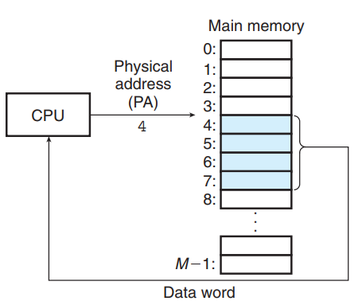

**【虚拟寻址】**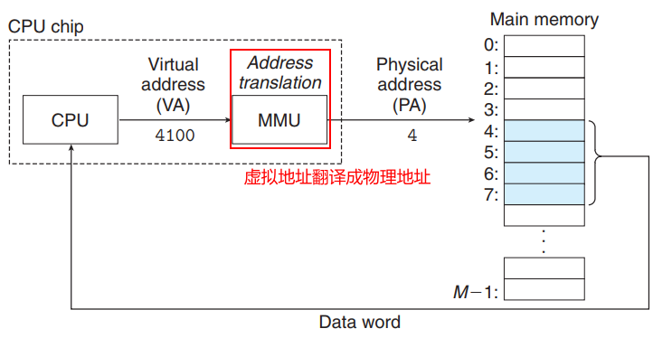

# 2 虚拟内存的原理
虚拟存储的主要思想就是：在主存中缓存硬盘上的**虚拟页**（pagefile.sys），虚拟页有三个状态：未分配、缓存的、未缓存的。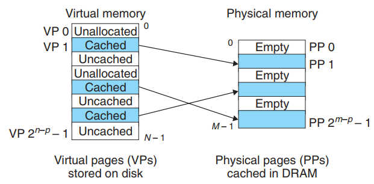

## 2.1 虚拟页表
页表是一个存放在内存中的数据结构，MMU就是通过页表来完成虚拟地址到物理地址的转换。这个数据结构每一个条目称为**PTE（Page Table Entry）**，由两部分组成：**有效位和n位地址段**。

- 有效位如果是1，那么n位地址就指向已经在内存中缓存好了的地址；如果为0，地址为null的话表示为分配
- 地址指向磁盘上的虚拟内存（pagefile.sys）的话就是未缓存。


一个典型的页表图：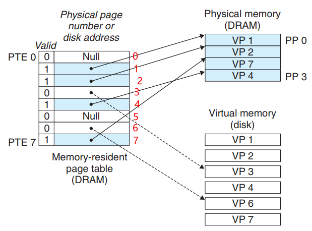

### 2.1.1 页命中
当我们使用虚拟地址来访问**虚拟页2（已经缓存了，上图）**的内容的时候，就是一个页命中。地址翻译将指向PTE2上，由于有效位1，地址翻译器MMU就知道VP2已经缓存在内存中了。就使用页表中保存的物理地址进行访问。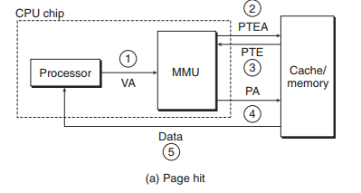

### 2.1.2 缺页
再来看看不命中，也就是缺页的情况，当CPU需要访问虚拟页3时，PTE3有效位是0，同时地址位指向了虚拟内存（pagefile.sys），就会**触发缺页异常**。异常处理程序会选择牺牲一个内存（DRAM）中的页，本例中选择的是内存中的PP3页的VP4，接下来内核就从虚拟内存中拷贝VP3到内存中的PP3，并使得PTE3指向内存中的PP3，形成如下情况：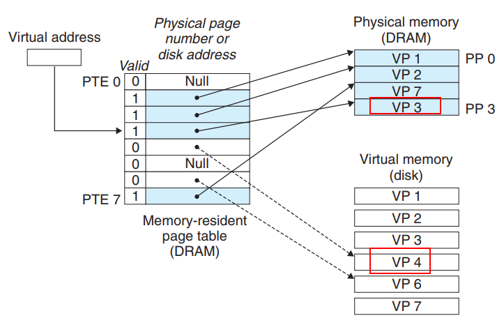

1. CPU生成虚拟地址；
1. MMU生成PTE地址从内存的页表中请求内容；
1. 内存中的页表返回相应的PTE值；
1. PTE的有效位是0，转到异常处理程序；
1. 异常处理程序确定内存中的牺牲页，并将其写会到磁盘上（pagefile.sys）；
1. 从pagefile.sys中调入新的文件并更新PTE。
1. 由于PTE已经被更新好了，从新发送虚拟地址到MMU（后面就和命中的过程一样了）

## 2.2 地址翻译

### 2.2.1 页表基址寄存器
**地址翻译**从形式上来说就是建立一个虚拟地址空间到物理地址空间的映射关系，我们前面说过MMU使用的是页表来实现这种映射。CPU中有一个专门的页表基址寄存器（PTBR）指向当前页表，使用页表进行翻译的时候方法如下：每个虚拟地址由两部分组成：虚拟页号（VPN）+虚拟页偏移量（VPO），当CPU生成一个虚拟地址并传递给MMU开始翻译的时候，MMU利用虚拟地址的VPN来选择相应的PTE，同时将页表中的物理页号（PPN）+虚拟地址的VPO就生成了相应的物理地址。（**物理地址是由页表中的物理页号+虚拟地址中的偏移量构成**）：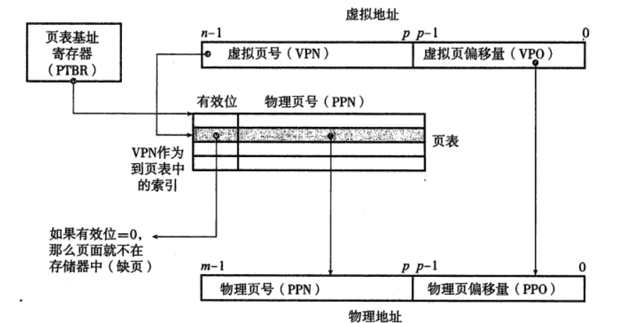


### 2.2.2 如何提高地址翻译的速度
【**加入高速缓存】：**高速缓存被发明出来的一个重要原因就是**提高对内存的访问速度**，我们来看看加入高速缓存后的访问示意图：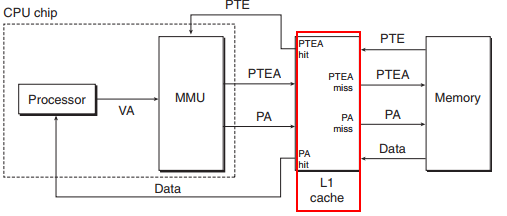
【**加入翻译后备缓冲器TLB】：**TLB是一个小的、虚拟寻址的缓存，其中每一行都保存一个PTE块，高度相连。主要是提供虚拟地址到物理地址的翻译速度。大致范围示意图如下：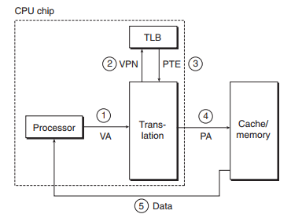

1. CPU生成一个虚拟地址并发送到MMU；
1. ② ③MMU**从TLB中获取相应的PTE**
1. ④翻译成相应的物理地址后从内存中请求内容；
1. ⑤ 数据从内存返回给CPU


【**加入多级页表】：**在单级页表模式下，其实是在内存中为这个程序创建了一个页表，使得程序有了独立的地址空间。我们以32位系统4GB地址空间为例，我们将物理内存分割为虚拟的页面，每个页面保存4KB大小的内容，这样我们总共需要1048576个页面，才能瓜分所有的4GB空间。那么我们的页表要能够完成所有物理内存的映射，就必须要1048576个页表项，由于每个页表项占用4B的空间，那么我们这个页表就需要占用4194304B（4M）的内存空间，每个进程都有这样的一个4M的页表占用着内存空间，才能完成映射。
我们加入分级的思想以后，每一级的页表就都只有4KB的大小，数量也有原来的1048576变成了1024个，两级相乘其实表示的数量还是原来那么多。上图所示，一级页表每条PTE负责映射二级页表1024个PTE项，二级页表的每个PTE在映射虚拟存储器中4KB大小的位置。这样做的好处是：

- 如果一级页表中有未被分配的项目，那么这条PTE直接设置成null，不指向任何二级列表，也就不再占用空间。
- 不是所有的二级列表都需要常驻内存，每个进程只需要在内存中建立一级页表（4kb）大小，二级列表按需要的时候创建调入，这样就更省了。


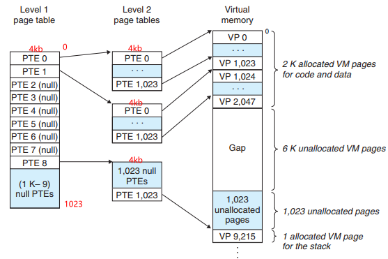

# 3 虚拟内存的作用
虚拟存储器有诸多的好处，操作系统其实为每个进程提供了一个独立的页表，使用不同的页表也就创建了独立的虚拟地址空间。

- **简化链接：**每个进程一个页表后，这个进程就会觉得全世界都是它的（页表模拟出一个虚拟存储器），那什么符号链接的时候（也就是符号映射到地址的时候），不再会受到内存中还有其他应用程序的干扰，因为我们面向的是虚拟存储器，我们的进程的地址空间是独立的，我这个符号放到离0偏移100的地方，那个放到离0偏移200的地方很容易就搞定了。
- **简化加载：**在硬盘中双击一个图标，启动一个应用程序时，实际上你都不需要将这个程序从硬盘给加载到内存，只需要建个页表，然后页表里的编号指向的是硬盘，然后CPU访问到具体代码的时候，再按照上一节的寻址的方式，按需的将硬盘上的代码加载到内存。加载过程及其简单了。
- **简化共享：**我们有很多的进程在系统中运行，但是有些代码，比如调用操作系统的API，这些API可能许多进程都要使用比如printf，这就要共享一部分内存，我们不需要将这部分内存在每个进程空间都拷贝一份，实际上每个进程都有一个页表，而不是全局只有一个，页表把共享内存映射到同一个地方。
- **简化存储器分配：**当一个进程使用malloc要求额外的空间时，操作系统只需要保证形成了一个连续的虚拟页面，但可以映射到物理内存中任意的位置，可以随机分散在内存的不同位置。
- **简化保护：**我们可以通过为PTE添加额外的标识位提供对存储器的保护


# 4 Linux虚拟内存子系统
一个单独的Linux系统进程虚拟内存主要分为：内核虚拟内存和进程虚拟内存：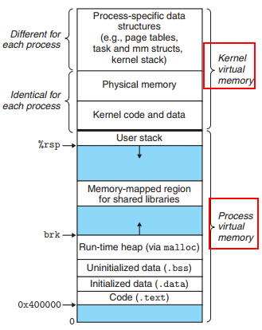

## 4.1 虚拟存储区域
区域就是我们通常说的段，text、data、bss都是不同的区域，这些区域是被分为连续的片。每个虚拟页面都在不同的段中，不属于某个段的虚拟页面是不存在的，且不能被使用。我们来看看内核中的一个task数据结构（mm）：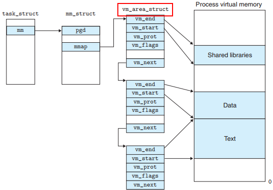

## 4.2 **Linux缺页异常**
**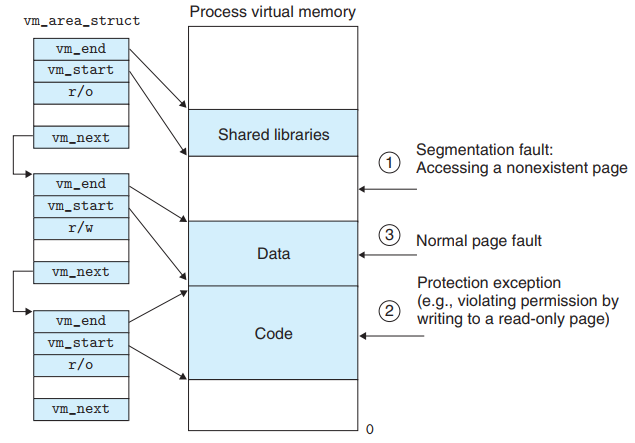

1. **访问地址是否合法**：缺页处理程序只需要将这个地址A与vm_area_struct链表中的每个元素的start和end数据比较，如果都没有的话，表示该地址不在相应的段中。就是一个段错误。
1. **保护异常**：vm_area_struct中的vm_prot结构是包含了所有页面的读写权限，所以当对只有读权限的文本内容写入数据的时候，就会引发保护异常。
1. 最后，**正常缺页：**也就是相应的页面不在物理内存的时候，缺页程序就会锁定一个牺牲页面，将它的内容与实际需要的内容交换过来，当缺页程序返回的时候就可以正常的访问了。

---


# 5 内存映射
内存映射是通过**将磁盘上的一个文件与虚拟存储器中的一个区域关联起来**的过程。

## 5.1 **共享对象？私有对象？**
一个对象被映射到虚拟存储器的一个区域，**这个区域要么是共享对象，要么是私有对象**。**【共享对象】**：如果一个进程A将一个共享对象映射X到了它的虚拟存储器中，那么对于也把这个共享对象X映射了的其他进程而言，进程A对共享对象X的任何读写操作都是可见的。下图是进程1和进程2映射了共享区域的图例：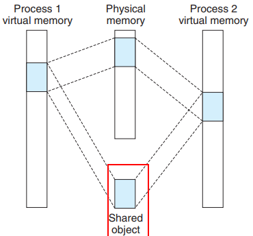

## 5.2 fork创建新的虚拟空间
当前进程调用fork函数的时候，内核为新进程创建各种数据结构，并分配PID。为了给新进程创建一个虚拟存储器，它创建的当前进程的mm_struct、区域结构和页表的一个拷贝，内核为两个进程的每个页表标记为只读，并将每个区域标记为私有的写时拷贝（**即利用私有对象的运作方式**）。这样当fork函数返回的时候，新进程的虚拟内存空闲和当前进程的虚拟内存刚好相同。任何一个进程进行写操作的时候，才会创建新的页面。

## 5.3 **mmap函数创建内存映射**
函数声明如下：
```c
#include <unistd.h>
#include <sys/mman.h>
//创建内存映射
void *mmap(void *start, size_t length, int prot, int flags, int fd, off_t offset);
//Returns: pointer to mapped area if OK, MAP_FAILED (−1) on error

//删除内存映射
int munmap(void *start, size_t length);
//Returns: 0 if OK, −1 on error
```

- start：从地址start开始处创建，通常为NULL；length：连续对象的大小；
- port：访问权限（PROT_EXEC\PROT_READ\PROT_WRITE\PROT_NONE）;
- flags：被映射对象的位（MAP_ANOE\MAP_PRIVATE\MAP_SHARED）;
- fd: 指定的磁盘文件；
- offset：距离磁盘文件偏移的位置处开始；
- 返回值：调用成功，返回新区域的地址

# 6 动态内存分配
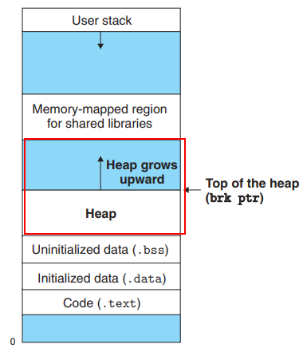

## 6.1 内存碎片
首先看下面的动态malloc的几种情况：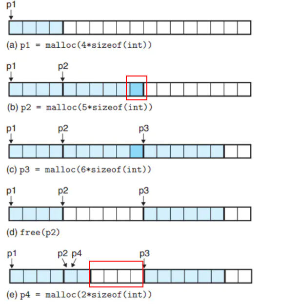

- （a）请求一个4字大小的块，malloc将分配好的空间的首地址返回给p1；
- （b）请求一个5字大小的块，由于使用的双字对齐（4+5=9，差一个），所以填充了一个空闲块；
- （c）请求一个6字大小的块，返回给p3；
- （d）释放p2，调用后p2仍然指向原来的位置；
- （e）请求一个2字大小的块，在已经释放的p2处优先分配，然后返回指针p4


**【内部碎片】：**上面讲到的（b）的情况，分配了一个额外的空闲块，实现双字对齐，这个空闲块就是**内部碎片**。

**【外部碎片】：**(e)中如果请求2字大小的块，造成了中间4个字节的空闲块（外部碎片）。如果这时候需要再申请一个大于4字节的空间，那么必须在P3之后申请，这4个字节的碎片就一直放在那里成了**外部碎片**。


## 6.2 **隐式空闲链表**
主要是由三部分组成：头部、有效载荷、填充（可选）；

- **头部：**是由块大小+标志位（a已分配/f空闲）；
- **有效载荷：**实际的数据

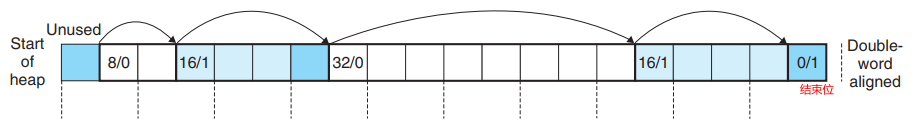

### 6.2.1 分割空闲块
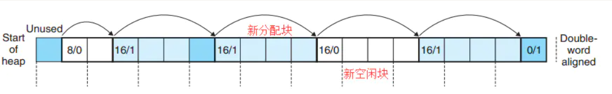

适配到合适的空闲块，分配器将空闲块分割成两个部分，一个是分配块，一个是新的空闲块


### 6.2.2 合并
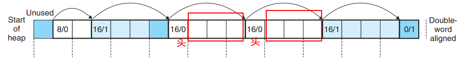

- 合并的策略是**立即合并和推迟合并**，我们可能不立即推迟合并，如果有空间直接合并不好吗？有时候的确还真不好，如果我们马上合并上图的空间后又申请3字节的块，那么就会开始分割，释放以后立即合并的话，又将是一个合并分割的过程，这样的话推迟合并就有好处了。需要的时候再合并，就不会产生抖动了。

【**怎么合并：带边界标记】**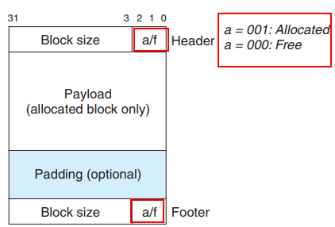

下面是各种情况下的处理方式：


- （a）：在合并的时候，由于前后都是已分配不执行合并，只是把当前块标记位空闲：
- （b）：后面的块是空闲的，当前块与后面的块合并，用新的块的大小（当前块大小+后面块大小），更新当前块的头部和后面块的脚部
- （c）：前面块是空闲，前面块与当前块合并，用新的块的大小（当前块的大小+前面块的大小），更新前面块的头部和当前块的脚部
- （d）：三个块都是空闲，3个块的大小来更新前面块的头部和后面块的脚部
> 当（c）和（d）两种情况，前面的块是空闲的，才需要用到当前块的脚部。（a）不需要更新，（b）更新的是后面块的脚部+块大小。如果我们把前面的块的位存放在当前块头部未使用多出来的低位中，那么已分配的块就不需要脚部了。


## 6.3 分离的空闲链表
现在来看看比较流行的分离存储方法，在一个分离存储的系统中，分配器维护着一个**空闲链表数组**，每个空闲链表是一些大小不同的类。我们可以按照2的幂来划分，比如1，2，4，8，16，32.......等等。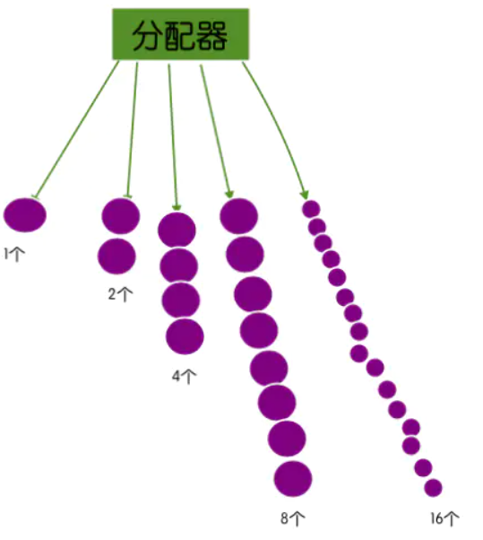
**申请：**如果我们要在16字节的空间中分配一个4字节大小的空间，就会首先将这个16字节的总空间分割成两个8字节大小的空间，其中空闲的那部分（左边）叫做伙伴，被放置到空闲链表中。我们发现8字节的空间依然大于我们要分配的空间，就再一次将8字节的空间分割成两部分，每个4字节，刚好完成分割，这时候8字节中的左边部分也就是伙伴，被放置到空闲链表中。
**释放：**需要释放4字节空间的时候，会与其伙伴进行空闲合并，形成一个8字节大小的空闲空间，继续发现另外的8字节伙伴也是空闲的，继续合并。直到遇到的伙伴已经被分配了才停止。
