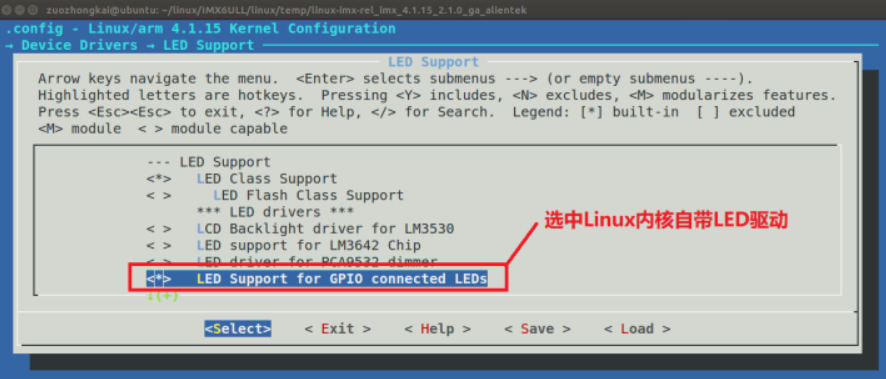
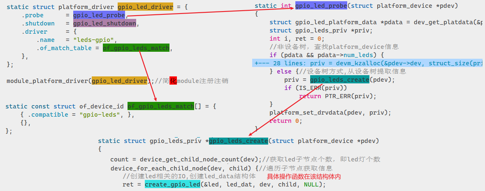

在基础篇我们可以看到编写Linux驱动的基础知识，知道如何从零编写一个驱动并编译运行。但是Linux作为一个完整的内核，除了提供完整的分层驱动框架外，还为每类驱动设计了良好的专用框架，**让我们添加新驱动时不必从头开始，提高了效率，也避免了代码冗余。**本篇就开始介绍Linux内核中各类专用驱动框架，在此基础上编写驱动事半功倍。​

# Led通用驱动
Linux 内核的LED 灯驱动采用 platform 框架，因此我们只需要按照要求**在设备树文件中添加相应的 LED 节点**即可（无需其他操作，无需其他编码）。

## 使能Led驱动支持
在编译内核时需要打开Led驱动的支持，不然框架的代码不会编译到内核中：

# Led驱动源码解析
代码都在`drivers/leds/leds-gpio.c`中，主要流程如下：

# 绑定新Led设备
代码都是准备好的，如果要适配新设备，我们**只需要在设备树添加新设备的信息即可**。可以从源代码或内核文档`Documentation/devicetree/bindings/leds/`中帮助文档得到一些示例和说明，避免出错。​

主要需要关注以下几点：

1. 创建一个节点表示 LED 灯设备，比如 dtsleds，如果板子上有多个 LED 灯的话每个 LED灯都作为 dtsleds 的子节点。
1. dtsleds 节点的 compatible 属性值**一定要为“gpio-leds”**。
1. **每个子节点必须要设置 gpios 属性值**，表示此 LED 所使用的 GPIO 引脚！
1. 可以设置“linux,default-trigger”属性值，也就是设置 LED 灯的默认功能，比如：
   1. backlight： LED 灯作为背光。
   1. default-on： LED 灯打开
   1. heartbeat： LED 灯作为心跳指示灯，可以作为系统运行提示灯。
   1. ide-disk： LED 灯作为硬盘活动指示灯。
   1. timer： LED 灯周期性闪烁，由定时器驱动，闪烁频率可以修改
5. 可以设置“default-state”属性值，可以设置为 on、 off 或 keep


设备树示例：
```
dtsleds {
    compatible = "gpio-leds";

    ed0 {
        label = "red";
        gpios = <&gpio1 3 GPIO_ACTIVE_LOW>;
        linux,default-trigger = "heartbeat";
        default-state = "on";
    };
};
```
