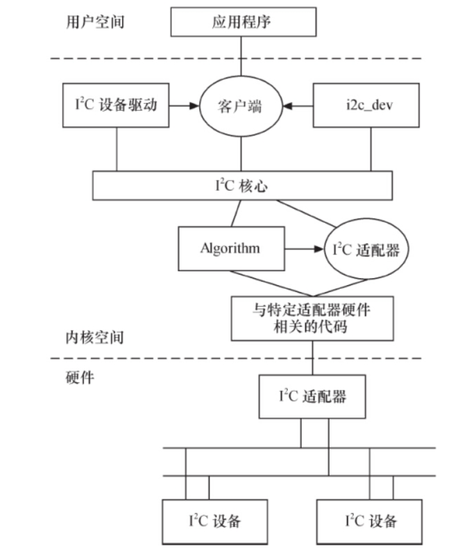
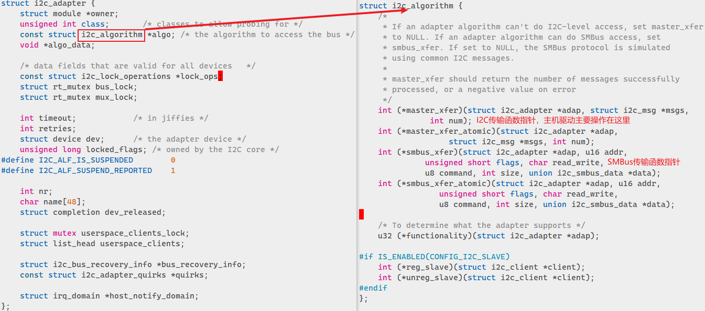
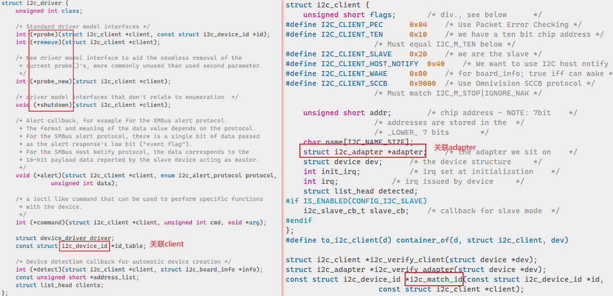

# I2C硬件介绍

# I2C驱动架构
I2C驱动分为三部分（驱动架构路径**drivers/i2c**，结构体定义路径**include/linux/i2c.h**）：

- I2C核心：总线驱动和设备驱动的注册注销，I2C通信
- I2C总线驱动：适配I2C硬件。主要包括I2C适配器`i2c_adapter`，通信数据结构`i2c_algorithm`和内部产生通信信号的函数
   - `i2c_adapter`对应于**物理上的一个适配器**，`i2c_algorithm`对应一套通信方法。适配器需要`i2c_algorithm`里的函数指针控制适配器产生特定的访问周期。
   - `master_xfer`函数用于产生I2C访问周期需要的信号，以`i2c_msg`表示



- I2C设备驱动：也叫客户驱动，负责提供用户程序需要的设备操作接口。主要包含数据结构`i2c_driver`和`i2c_client`
   - `i2c_driver`对应于**一套驱动方法**，其主要成员函数是probe、 remove、 suspend、 resume等。成员`struct i2c_device_id`是该驱动所支持的I2C设备的ID表，是一对多的关系，可以通过`i2c_match_id`找到对应设备
   - `i2c_client`对应于**真实的物理设备**， 每个I2C设备都需要一个i2c_client来描述。一个`i2c_adpater`也可以被多个`i2c_client`依附，`i2c_client`包含它所依附的`i2c_adpater`指针



## I2C core
核心层提供了一组接口函数，用于联系总线和设备层，一般不需要修改，只需要知道何时调用如下函数：

1. 增加删除i2c_adapter
```c
int i2c_add_adapter(struct i2c_adapter *adapter);
void i2c_del_driver(struct i2c_driver *driver);
```

2. 增加删除i2c_driver
```c
extern int i2c_register_driver(struct module *owner, struct i2c_driver *driver);
extern void i2c_del_driver(struct i2c_driver *driver);

/* use a define to avoid include chaining to get THIS_MODULE */
#define i2c_add_driver(driver) \
    i2c_register_driver(THIS_MODULE, driver)
```

3. 数据发送和接收函数
```c
int i2c_transfer(struct i2c_adapter *adap, struct i2c_msg *msgs, int num);
int i2c_master_recv(const struct i2c_client *client, char *buf, int count);
int i2c_master_send(const struct i2c_client *client, const char *buf, int count);
```

## I2C总线驱动
i2c总线适配器本身也是连接在platform总线上，所以总线驱动需要注册到platform_driver上，然后再通过I2C本身的架构与设备驱动通信。为特定的I2C适配器实现通信方法， 主要是实现`i2c_algorithm`的`functionality`函数和`master_xfer`函数。
如下为I2C总线驱动基本的模板：
```c
static int xxx_i2c_probe(struct platform_device *pdev)
{
    struct i2c_adapter *adap;
    //初始化I2C adapter所使用的硬件资源，如IO地址，中断号，时钟等
    xxx_adpater_hw_init();
    adap->dev.parent = &pdev->dev;
    adap->dev.of_node = pdev->dev.of_node;
    adap->algo = xxx_i2c_algo //指定实现通信方法的i2c_algorithm
    //添加adapter到I2C驱动核心中
    rc = i2c_add_adapter(adap);
    ...
}

static int xxx_i2c_remove(struct platform_device *pdev)
{
    //释放硬件资源
    xxx_adpater_hw_free();
    //从核心删除adapter
    i2c_del_adapter(&dev->adapter);
    return 0;
}

static const struct of_device_id xxx_i2c_of_match[] = {
    {
        .compatible = "vendor,xxx-i2c",
    },
    {},
};
MODULE_DEVICE_TABLE(of, xxx_i2c_of_match);

static struct platform_driver xxx_i2c_driver = {
    .driver = {
        .name = "xxx-i2c",
        .owner = THIS_MODULE,
        .of_match_table = xxx_i2c_of_match,
    },
    .probe = xxx_i2c_probe,
    .remove = xxx_i2c_remove,
};
module_platform_driver(xxx_i2c_driver);//注册到platform总线
```

## I2C设备驱动
设备驱动要使用i2c_driver和i2c_client数据结构并填充i2c_driver中的成员函数。i2c_client一般被包含在**设备的私有信息结构体yyy_data中**， 而i2c_driver则适合被定义为**全局变量**并初始化。
```c
static struct i2c_driver yyy_driver = {
    .driver = {
        .name = "yyy",
    },
    .probe = yyy_probe,
    .remove = yyy_remove,
    .id_table = yyy_id,
};

static int __init yyy_init(void)
{
    return i2c_add_driver(&yyy_driver);//注册到核心
}
module_initcall(yyy_init);

static void __exit yyy_exit(void)
{
    i2c_del_driver(&yyy_driver);//从核心删除
}
11module_exit(yyy_exit);

```
 
