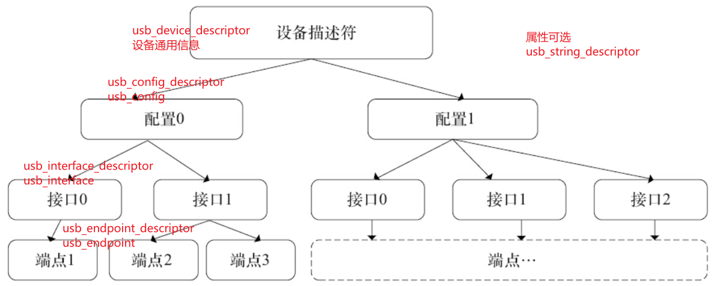
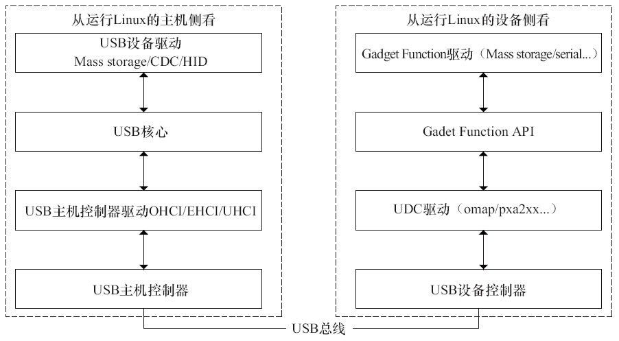
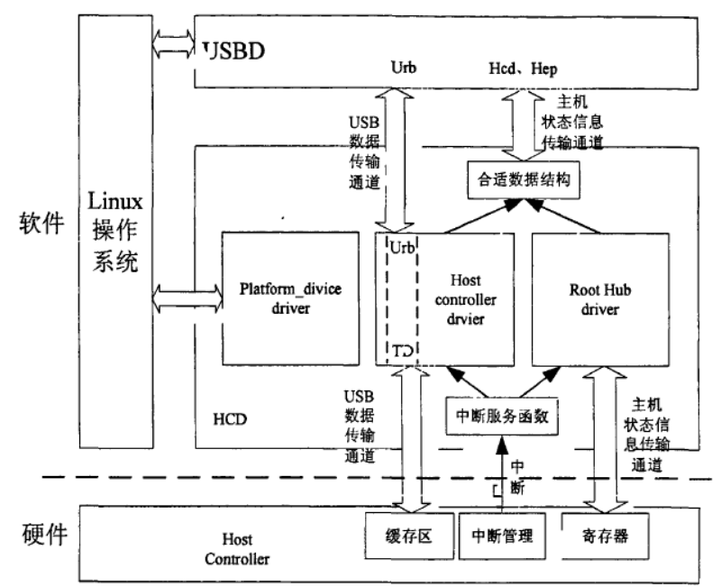
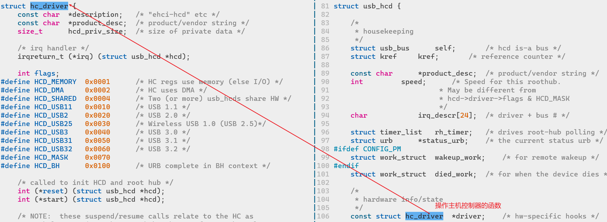
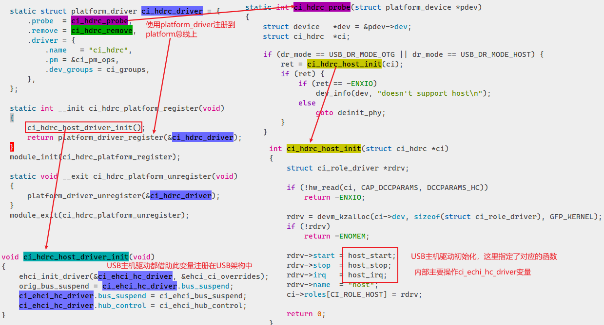
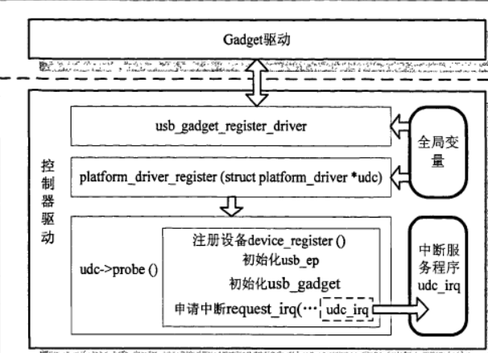
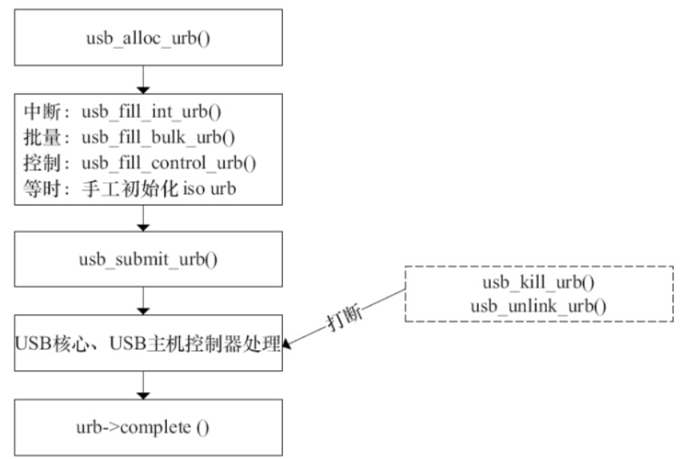

# USB设备的表示


# 驱动架构


## 主机控制器驱动


- OHCI（Open Host Controller Interface）
- UHCI（Universal Host Controller Interface）
- EHCI（Enhanced Host Controller Interface）
- xHCI（eXtensible Host Controller Interface）

### usb_hcd
 在Linux内核中， 用`**usb_hcd**`结构体描述USB主机控制器驱动：
```c
//创建hcd结构体
struct usb_hcd *usb_create_hcd(const struct hc_driver *driver, struct device *dev, const char *bus_name);
//向内核增加hcd
int usb_add_hcd(struct usb_hcd *hcd, unsigned int irqnum, unsigned long irqflags);
//从内核删除hcd
extern void usb_remove_hcd(struct usb_hcd *hcd);
```

### Chipidea USB主机驱动解读
代码位置：`drivers/usb/chipidea`

## 设备控制器驱动


- 音频设备类通信设备类
- HID（人机接口）设备类
- 显示设备类
- 海量存储设备类
- 电源设备类
- 打印设备类
- 集线器设备类

查看USB设备信息：`sudo cat /sys/kernel/debug/usb/devices`

### usb_driver
`usb_driver`结构体描述一个USB设备驱动。编写新的USB设备驱动时， 主要应该完成的工作是**probe**和**disconnect**函数，它们分别在设备被插入和拔出的时候调用，用于初始化和释放软硬件资源。​

USB只是一个总线，U**SB设备驱动真正的主体工作仍然是USB设备本身所属类型的驱动**，如字符设备、 tty设备、 块设备、 输入设备等。**与platform_driver、 i2c_driver类似， usb_driver起到了“牵线”的作用**， 即

- 在`probe`里注册相应的字符、tty等设备.
   - 字符设备可以调用`usb_register_dev`注册驱动，其他设备需要对应设备的注册函数。
- 在`disconnect`注销相应的字符、tty等设备
   - 字符设备注销：`usb_deregister_dev`


原先对普通的字符等设备的注册和注销一般直接发生在模块加载和卸载函数中，这里用于借助了USB总线，所以需要将真正的读写驱动包含在USB的驱动架构中。
```c
struct usb_driver {
    const char *name;

    int (*probe) (struct usb_interface *intf,
              const struct usb_device_id *id);

    void (*disconnect) (struct usb_interface *intf);

    int (*unlocked_ioctl) (struct usb_interface *intf, unsigned int code,
            void *buf);

    int (*suspend) (struct usb_interface *intf, pm_message_t message);
    int (*resume) (struct usb_interface *intf);
    int (*reset_resume)(struct usb_interface *intf);

    int (*pre_reset)(struct usb_interface *intf);
    int (*post_reset)(struct usb_interface *intf);

    const struct usb_device_id *id_table;//这个USB驱动所支持的USB设备列表
    const struct attribute_group **dev_groups;

    struct usb_dynids dynids;
    struct usbdrv_wrap drvwrap;
    unsigned int no_dynamic_id:1;
    unsigned int supports_autosuspend:1;
    unsigned int disable_hub_initiated_lpm:1;
    unsigned int soft_unbind:1;
};
```
以下函数用于像内核注册和注销驱动：
```c
#define usb_register(driver) \
    usb_register_driver(driver, THIS_MODULE, KBUILD_MODNAME)

extern void usb_deregister(struct usb_driver *);
```

### usb_device_id
`usb_driver`结构体中的`id_table`成员标明了本驱动可以用于哪些USB设备，结构体`usb_device_id`用于描述一个USB设备的各种信息。当USB核心检测到某个设备的属性和某个驱动程序的usb_device_id结构体所携带的信息一致时，这个驱动程序的`probe`函数就被执行。​

下面的函数和宏用于操作`usb_device_id`：
```c
//生成usb_device_id实例
#define USB_DEVICE(vend, prod) \
    .match_flags = USB_DEVICE_ID_MATCH_DEVICE, \
    .idVendor = (vend), \
    .idProduct = (prod)
//根据制造商和产品ID生成usb_device_id实例
#define USB_DEVICE_VER(vend, prod, lo, hi) \
    .match_flags = USB_DEVICE_ID_MATCH_DEVICE_AND_VERSION, \
    .idVendor = (vend), \
    .idProduct = (prod), \
    .bcdDevice_lo = (lo), \
    .bcdDevice_hi = (hi)
//根据制造商，产品ID，产品版本生成usb_device_id实例
#define USB_DEVICE_INFO(cl, sc, pr) \
    .match_flags = USB_DEVICE_ID_MATCH_DEV_INFO, \
    .bDeviceClass = (cl), \
    .bDeviceSubClass = (sc), \
    .bDeviceProtocol = (pr)
//创建一个匹配设备指定类型的usb_device_id实例
#define USB_INTERFACE_INFO(cl, sc, pr) \
    .match_flags = USB_DEVICE_ID_MATCH_INT_INFO, \
    .bInterfaceClass = (cl), \
    .bInterfaceSubClass = (sc), \
    .bInterfaceProtocol = (pr)
```
上面函数在定义`id_table`数组时可以直接调用，返回实例作为数组成员
```c
static struct usb_device_id id_table [] = {
    {USB_DEVICE(VENDOR_ID, PRODUCT_ID)},
    //当然也可以直接赋值，不用宏
    {.idVendor = 0x10D2, .match_flags = USB_DEVICE_ID_MATCH_VENDOR,},
    { },
};
MODULE_DEVICE_TABLE (usb, id_table);//关联到usb_driver
```

### 内核USB设备驱动骨架解读
代码位于：`drivers/usb/usb-skeleton.c`

# URB处理流程
USB初始化过程中，无论是主机控制器驱动还是根集线器驱动，都是通过URB传输获取设备信息。USB请求块（USB Request Block）是USB设备驱动中用来**描述与USB设备通信所用的基本载体和核心数据结构**， 非常类似于网络设备驱动中的sk_buff结构体。
