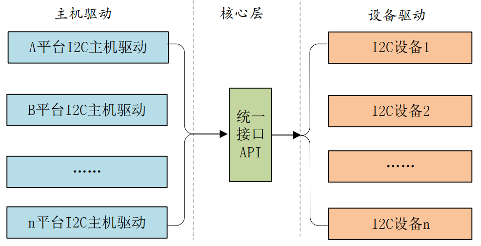
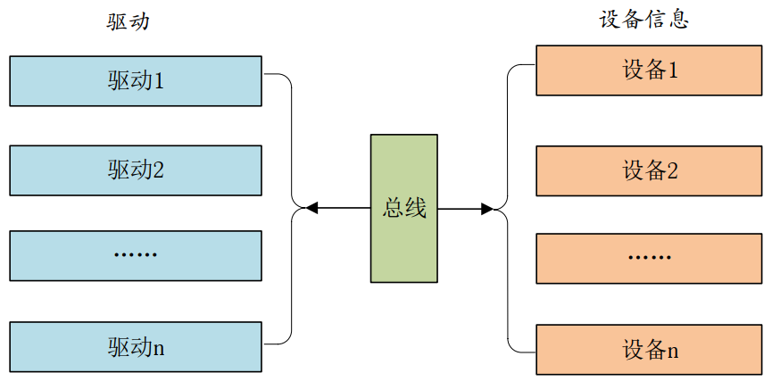
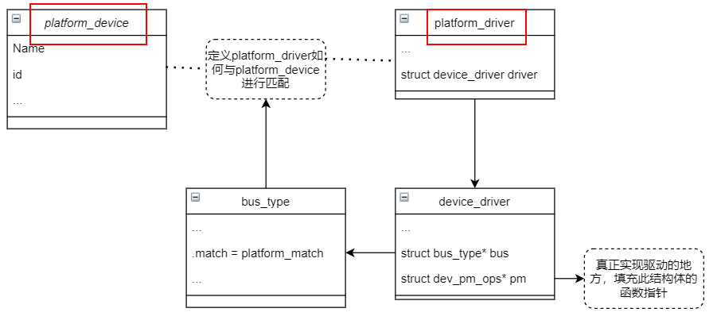
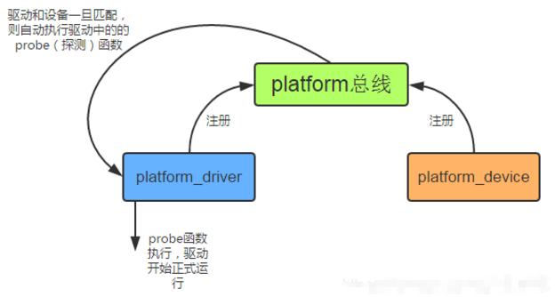

# 1 驱动的分层思想

## 1.1 主机驱动与外设驱动分离
Linux中的SPI、I2C、USB等子系统都利用了典型的把主机驱动和外设驱动分离的想法， 让主机端只负责产生总线上的传输波形， 而外设端只是通过标准的API来让主机端以适当的波形访问自身，涉及了4个软件模块：

- 主机端驱动
- 连接主机和外设的纽带
- 外设端驱动
- 板级逻辑


分离后的驱动框架如下所示：

## 1.2 驱动核心层
核心层肩负的3大职责：

1. 对上提供接口：file_operations的读、 写、 ioctl都被中间层搞定， 各种I/O模型也被处理掉了。
1. 中间层实现通用逻辑：可以被底层各种实例共享的代码都被中间层搞定， 避免底层重复实现。
1. 对下定义框架：底层的驱动不再需要关心Linux内核VFS的接口和各种可能的I/O模型， 而只需处理与具体硬件相关的访问。

这种分层有时候还不是两层， 可以有更多层， 在软件上呈现为面向对象里类继承和多态的状态。

# 2 platform总线架构
像上面分层思想讲的，在Linux中，设备和驱动是分离的，通过总线将设备和驱动绑定。

- 在注册设备到系统时，会在左侧会寻找与之匹配的驱动；
- 在注册驱动到设备时，也会在右侧寻找匹配的设备；

这个过程是由**总线**完成的**。**由于上面这个优势，**一个驱动可以供同类的几个设备使用**。

## 2.1 platform总线
Linux发明了一种虚拟的总线，叫**platform总线**，对应的结构如下：
```c
//platform平台总线
struct bus_type platform_bus_type = {
	.name		= "platform",
	.dev_groups	= platform_dev_groups,
	.match		= platform_match, //匹配关系查找函数
	.uevent		= platform_uevent,
	.dma_configure	= platform_dma_configure,
	.pm		= &platform_dev_pm_ops,
};

//匹配关系有4种可能性, 所以依次检查
//1.基于设备树风格的匹配
//2.基于ACPI风格的匹配
//3.匹配ID table
//4.匹配设备名和驱动名,用的最多
static int platform_match(struct device *dev, struct device_driver *drv)
{
	struct platform_device *pdev = to_platform_device(dev);
	struct platform_driver *pdrv = to_platform_driver(drv);

	/* When driver_override is set, only bind to the matching driver */
	if (pdev->driver_override)
		return !strcmp(pdev->driver_override, drv->name);

	/* Attempt an OF style match first */
	if (of_driver_match_device(dev, drv))
		return 1;

	/* Then try ACPI style match */
	if (acpi_driver_match_device(dev, drv))
		return 1;

	/* Then try to match against the id table */
	if (pdrv->id_table)
		return platform_match_id(pdrv->id_table, pdev) != NULL;

	/* fall-back to driver name match */
	return (strcmp(pdev->name, drv->name) == 0);
}
```

## 2.2 platform驱动
`platform_driver`结构体用于表示platform驱动:
```c
//include/linux/platform_device.h
struct platform_driver {
    int (*probe)(struct platform_device *);//设备和驱动匹配成功时自动执行
    int (*remove)(struct platform_device *);
    void (*shutdown)(struct platform_device *);
    int (*suspend)(struct platform_device *, pm_message_t state);
    int (*resume)(struct platform_device *);
    struct device_driver driver; //相当于基类,提供最基础的驱动框架
    const struct platform_device_id *id_table; //匹配方式的一种,id表
    bool prevent_deferred_probe;
};

//include/linux/device.h
struct device_driver {
    const char      *name;
    struct bus_type     *bus;//指定platform总线实例,用里面的match函数
	//...

    const struct of_device_id   *of_match_table;//匹配方式的一种,设备树
    const struct acpi_device_id *acpi_match_table;//匹配方式的一种,acpi
    //...
};
```
在编写 platform 驱动的时候：

1. 首先定义一个 platform_driver 结构体变量，然后实现结构体中的各个成员变量，重点是实现匹配方法以及 probe 函数。当驱动和设备匹配成功以后 probe函数就会执行，**具体的驱动程序在probe函数里面编写**，比如字符设备驱动等等。 
1. 当我们定义并初始化好 platform_driver 结构体变量以后，需要在驱动入口函数里面调用platform_driver_register 函数向 Linux 内核注册一个platform驱动。
1. 在驱动卸载函数中通过 platform_driver_unregister 函数卸载 platform 驱动
```c
int platform_driver_register (struct platform_driver *driver);//成功返回0
void platform_driver_unregister(struct platform_driver *);

//module_platform_driver宏可以同时完成2、3步操作
#define module_platform_driver(__platform_driver) \
    module_driver(__platform_driver, platform_driver_register, \
            platform_driver_unregister)
```

## 2.3 platform设备
`platform_device`这个结构体表示 platform 设备。
> 这里我们要注意，如果内核支持设备树的话就不要再使用 platform_device 来描述设备了，因为改用设备树去描述了 

```c
//include/linux/platform_device.h
struct platform_device {
    const char  *name;
    int     id;
    bool        id_auto;
    struct device   dev;
    u64     platform_dma_mask;
    struct device_dma_parameters dma_parms;
    u32     num_resources;//资源数量
    struct resource *resource;//资源,设备信息(内存地址,类型等)

    const struct platform_device_id *id_entry;
    char *driver_override; /* Driver name to force a match */

    /* MFD cell pointer */
    struct mfd_cell *mfd_cell;

    /* arch specific additions */
    struct pdev_archdata    archdata;
};
```
同样的，platform设备也需要注册和注销函数：
```c
int platform_device_register(struct platform_device *);
void platform_device_unregister(struct platform_device *);
```
**如果使用了设备树，Linux 内核启动的时候会从设备树中读取设备信息，然后将其组织成 platform_device 形式，不再需要手动注册注销设备了**。

## 2.4 工作原理
platform总线的工作原理如下：

# 3 驱动中引入platform的好处

1. 使得设备被挂接在一个总线上，符合Linux 2.6以后内核的设备模型。其结果是使配套的sysfs节点、设备电源管理都成为可能
1. 隔离BSP和驱动。在BSP中定义platform设备和设备使用的资源、设备的具体配置信息，而在驱动中，只需要通过通用API去获取资源和数据，做到了板相关代码和驱动代码分离，使得驱动具有更好的可扩展性和跨平台性
1. 让一个驱动支持多个设备实例。譬如DM9000的驱动只有一份，但是我们可以在板级添加多份DM9000的platform_device，它们都可以与唯一的驱动匹配

# 4 设备树+platform驱动的点灯示例
单纯的设备树点灯示例参考：本示例将基于设备树自动添加platfrom device，然后编写platform driver：

1. 设备树文件和上面链接一致，不做修改
1. 驱动程序修改如下：
```c
#include <linux/types.h>
#include <linux/kernel.h>
#include <linux/delay.h>
#include <linux/ide.h>
#include <linux/init.h>
#include <linux/module.h>
#include <linux/errno.h>
#include <linux/gpio.h>
#include <linux/cdev.h>
#include <linux/device.h>
#include <linux/of.h>
#include <linux/of_address.h>
#include <asm/mach/map.h>
#include <asm/uaccess.h>
#include <asm/io.h>

#define DTSLED_CNT			1		  	/* 设备号个数 */
#define DTSLED_NAME			"dtsplatled"	/* 名字 */
#define LEDOFF 					0			/* 关灯 */
#define LEDON 					1			/* 开灯 */

/* 映射后的寄存器虚拟地址指针 */
static void __iomem *IMX6U_CCM_CCGR1;
static void __iomem *SW_MUX_GPIO1_IO03;
static void __iomem *SW_PAD_GPIO1_IO03;
static void __iomem *GPIO1_DR;
static void __iomem *GPIO1_GDIR;

/* dtsled设备结构体 */
struct dtsled_dev{
	dev_t devid;			/* 设备号 	 */
	struct cdev cdev;		/* cdev 	*/
	struct class *class;		/* 类 		*/
	struct device *device;	/* 设备 	 */
	int major;				/* 主设备号	  */
	int minor;				/* 次设备号   */
	struct device_node	*nd; /* 设备节点 */
};

struct dtsled_dev dtsled;	/* led设备 */

/*
 * @description		: LED打开/关闭
 * @param - sta 	: LEDON(0) 打开LED，LEDOFF(1) 关闭LED
 * @return 			: 无
 */
void led_switch(u8 sta)
{
	u32 val = 0;
	if(sta == LEDON) {
		val = readl(GPIO1_DR);
		val &= ~(1 << 3);	
		writel(val, GPIO1_DR);
	}else if(sta == LEDOFF) {
		val = readl(GPIO1_DR);
		val|= (1 << 3);	
		writel(val, GPIO1_DR);
	}	
}

/*
 * @description		: 打开设备
 * @param - inode 	: 传递给驱动的inode
 * @param - filp 	: 设备文件，file结构体有个叫做private_data的成员变量
 * 					  一般在open的时候将private_data指向设备结构体。
 * @return 			: 0 成功;其他 失败
 */
static int led_open(struct inode *inode, struct file *filp)
{
	filp->private_data = &dtsled; /* 设置私有数据 */
	return 0;
}

/*
 * @description		: 从设备读取数据 
 * @param - filp 	: 要打开的设备文件(文件描述符)
 * @param - buf 	: 返回给用户空间的数据缓冲区
 * @param - cnt 	: 要读取的数据长度
 * @param - offt 	: 相对于文件首地址的偏移
 * @return 			: 读取的字节数，如果为负值，表示读取失败
 */
static ssize_t led_read(struct file *filp, char __user *buf, size_t cnt, loff_t *offt)
{
	return 0;
}

/*
 * @description		: 向设备写数据 
 * @param - filp 	: 设备文件，表示打开的文件描述符
 * @param - buf 	: 要写给设备写入的数据
 * @param - cnt 	: 要写入的数据长度
 * @param - offt 	: 相对于文件首地址的偏移
 * @return 			: 写入的字节数，如果为负值，表示写入失败
 */
static ssize_t led_write(struct file *filp, const char __user *buf, size_t cnt, loff_t *offt)
{
	int retvalue;
	unsigned char databuf[1];
	unsigned char ledstat;

	retvalue = copy_from_user(databuf, buf, cnt);
	if(retvalue < 0) {
		printk("kernel write failed!\r\n");
		return -EFAULT;
	}

	ledstat = databuf[0];		/* 获取状态值 */

	if(ledstat == LEDON) {	
		led_switch(LEDON);		/* 打开LED灯 */
	} else if(ledstat == LEDOFF) {
		led_switch(LEDOFF);	/* 关闭LED灯 */
	}
	return 0;
}

/*
 * @description		: 关闭/释放设备
 * @param - filp 	: 要关闭的设备文件(文件描述符)
 * @return 			: 0 成功;其他 失败
 */
static int led_release(struct inode *inode, struct file *filp)
{
	return 0;
}

/* 设备操作函数 */
static struct file_operations dtsled_fops = {
	.owner = THIS_MODULE,
	.open = led_open,
	.read = led_read,
	.write = led_write,
	.release = 	led_release,
};

/*
* @description : flatform 驱动的 probe 函数，当驱动与设备匹配以后此函数就会执行
* @param - dev : platform 设备
* @return : 0，成功;其他负值,失败
*/
static int led_probe(struct platform_device *dev)
{
	/* 初始化LED */
	IMX6U_CCM_CCGR1 = of_iomap(dtsled.nd, 0);
	SW_MUX_GPIO1_IO03 = of_iomap(dtsled.nd, 1);
  	SW_PAD_GPIO1_IO03 = of_iomap(dtsled.nd, 2);
	GPIO1_DR = of_iomap(dtsled.nd, 3);
	GPIO1_GDIR = of_iomap(dtsled.nd, 4);

	/* 2、使能GPIO1时钟 */
	val = readl(IMX6U_CCM_CCGR1);
	val &= ~(3 << 26);	/* 清楚以前的设置 */
	val |= (3 << 26);	/* 设置新值 */
	writel(val, IMX6U_CCM_CCGR1);

	/* 3、设置GPIO1_IO03的复用功能，将其复用为
	 *    GPIO1_IO03，最后设置IO属性。
	 */
	writel(5, SW_MUX_GPIO1_IO03);
	
	/*寄存器SW_PAD_GPIO1_IO03设置IO属性
	 *bit 16:0 HYS关闭
	 *bit [15:14]: 00 默认下拉
     *bit [13]: 0 kepper功能
     *bit [12]: 1 pull/keeper使能
     *bit [11]: 0 关闭开路输出
     *bit [7:6]: 10 速度100Mhz
     *bit [5:3]: 110 R0/6驱动能力
     *bit [0]: 0 低转换率
	 */
	writel(0x10B0, SW_PAD_GPIO1_IO03);

	/* 4、设置GPIO1_IO03为输出功能 */
	val = readl(GPIO1_GDIR);
	val &= ~(1 << 3);	/* 清除以前的设置 */
	val |= (1 << 3);	/* 设置为输出 */
	writel(val, GPIO1_GDIR);

	/* 5、默认关闭LED */
	val = readl(GPIO1_DR);
	val |= (1 << 3);	
	writel(val, GPIO1_DR);

	/* 注册字符设备驱动 */
	/* 1、创建设备号 */
	if (dtsled.major) {		/*  定义了设备号 */
		dtsled.devid = MKDEV(dtsled.major, 0);
		register_chrdev_region(dtsled.devid, DTSLED_CNT, DTSLED_NAME);
	} else {						/* 没有定义设备号 */
		alloc_chrdev_region(&dtsled.devid, 0, DTSLED_CNT, DTSLED_NAME);	/* 申请设备号 */
		dtsled.major = MAJOR(dtsled.devid);	/* 获取分配号的主设备号 */
		dtsled.minor = MINOR(dtsled.devid);	/* 获取分配号的次设备号 */
	}
	printk("dtsled major=%d,minor=%d\r\n",dtsled.major, dtsled.minor);	
	
	/* 2、初始化cdev */
	dtsled.cdev.owner = THIS_MODULE;
	cdev_init(&dtsled.cdev, &dtsled_fops);
	
	/* 3、添加一个cdev */
	cdev_add(&dtsled.cdev, dtsled.devid, DTSLED_CNT);

	/* 4、创建类 */
	dtsled.class = class_create(THIS_MODULE, DTSLED_NAME);
	if (IS_ERR(dtsled.class)) {
		return PTR_ERR(dtsled.class);
	}

	/* 5、创建设备 */
	dtsled.device = device_create(dtsled.class, NULL, dtsled.devid, NULL, DTSLED_NAME);
	if (IS_ERR(dtsled.device)) {
		return PTR_ERR(dtsled.device);
	}
	
	return 0;
}

/*
* @description : remove 函数，移除 platform 驱动的时候此函数会执行
* @param - dev : platform 设备
* @return : 0，成功;其他负值,失败
*/
static int led_remove(struct platform_device *dev)
{
	/* 取消映射 */
	iounmap(IMX6U_CCM_CCGR1);
	iounmap(SW_MUX_GPIO1_IO03);
	iounmap(SW_PAD_GPIO1_IO03);
	iounmap(GPIO1_DR);
	iounmap(GPIO1_GDIR);

	/* 注销字符设备驱动 */
	cdev_del(&dtsled.cdev);/*  删除cdev */
	unregister_chrdev_region(dtsled.devid, DTSLED_CNT); /* 注销设备号 */

	device_destroy(dtsled.class, dtsled.devid);
	class_destroy(dtsled.class);
}

/* 匹配列表 */
static const struct of_device_id led_of_match[] = {
	{ .compatible = "atkalpha-led" },
	{ /* Sentinel */ }
};

/* platform驱动结构体 */
static struct platform_driver led_driver = {
	.driver		= {
		.name	= "barretled",			/* 驱动名字，用于和设备匹配 */
		.of_match_table	= led_of_match, /* 设备树匹配表 		 */
	},
	.probe		= led_probe, //指定驱动初始化函数
	.remove		= led_remove,//指定驱动卸载函数
};
		
/*
 * @description	: 驱动模块加载函数
 * @param 		: 无
 * @return 		: 无
 */
static int __init leddriver_init(void)
{
	return platform_driver_register(&led_driver);
}

/*
 * @description	: 驱动模块卸载函数
 * @param 		: 无
 * @return 		: 无
 */
static void __exit leddriver_exit(void)
{
	platform_driver_unregister(&led_driver);
}

module_init(leddriver_init);
module_exit(leddriver_exit);
MODULE_LICENSE("GPL");
MODULE_AUTHOR("barretren");
```


