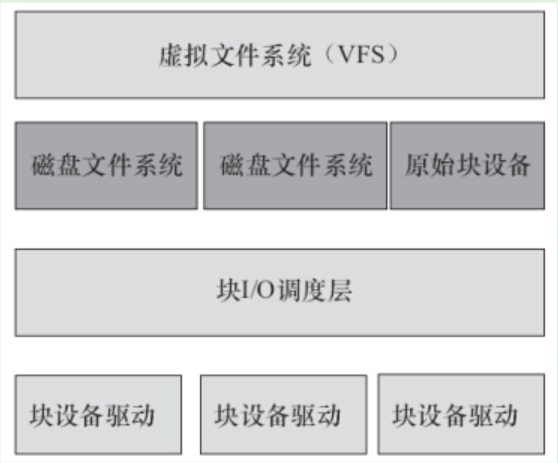
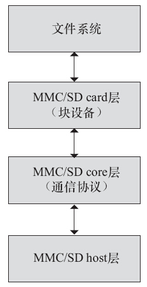

# 1 块驱动结构体
block_device_operations结构体它是对块设备操作的集合，是块设备驱动要实现的主要部分
```c
struct block_device_operations {
    int (*open) (struct block_device *, fmode_t); //打开设备
    void (*release) (struct gendisk *, fmode_t); //释放设备
    int (*rw_page)(struct block_device *, sector_t, struct page *, unsigned int); //块读写
    int (*ioctl) (struct block_device *, fmode_t, unsigned, unsigned long); //IO控制，对应ioctl()系统调用
    int (*compat_ioctl) (struct block_device *, fmode_t, unsigned, unsigned long); //供32位程序调用
    unsigned int (*check_events) (struct gendisk *disk, //可移动磁盘介质是否存在
    			      unsigned int clearing);
    /* ->media_changed() is DEPRECATED, use ->check_events() instead */
    int (*media_changed) (struct gendisk *);
    void (*unlock_native_capacity) (struct gendisk *);
    int (*revalidate_disk) (struct gendisk *); //响应一个介质改变，使驱动就绪
    int (*getgeo)(struct block_device *, struct hd_geometry *); //获取硬件信息
    /* this callback is with swap_lock and sometimes page table lock held */
    void (*swap_slot_free_notify) (struct block_device *, unsigned long);
    struct module *owner;
    const struct pr_ops *pr_ops;
};
```
其他与块设备相关的结构体

- gendisk（通用磁盘） 结构体：表示一个独立的磁盘设备（或分区）。其内部包含了一个block_device_operations指针


# 2 IO请求和调度
块设备子系统的架构如下：

- blk_init_queue：初始化request queue，在块设备驱动的初始化过程中调用
- blk_cleanup_queue：释放request queue，在块设备驱动卸载过程中调用
- blk_peek_request：获取一个要处理的请求
- blk_start_request：从queue中移除请求
- blk_fetch_request：等同于peek+start
- blk_end_request_all：抱歉请求释放处理完成
- blk_alloc_queue：用于完全随机读取、不需要复杂IO调度的设备，比如现在的固态硬盘和U盘
   - 与`blk_queue_make_request`配合使用


# 3 与字符设备的区别
块设备的I/O操作方式与字符设备的存在较大的不同，引入了request_queue、request、bio等一系列数据结构。在整个块设备的I/O操作中，贯穿始终的就是“请求”，**字符设备的I/O操作则是直接进行不绕弯，块设备的I/O操作会排队和整合**。驱动的任务是处理请求，对请求的排队和整合由I/O调度算法解决。因此，**块设备驱动的核心就是请求处理函数或“制造请求”函数**。尽管在块设备驱动中仍然存在block_device_operations结构体及其成员函数， 但不再包含读写类的成员函数， 而只是包含打开、 释放及I/O控制等与具体读写无关的函数。

块设备驱动的结构相对复杂，但幸运的是，块设备不像字符设备那样包罗万象，**它通常就是存储设备，而且驱动的主体已经由Linux内核提供，针对一个特定的硬件系统，驱动工程师所涉及的工作往往只是编写极其少量的与硬件平台相关的代码**。

# 4 示例解析
Linux MMC/SD卡驱动：drivers/mmc，里面三个目录对应的结构如下：

