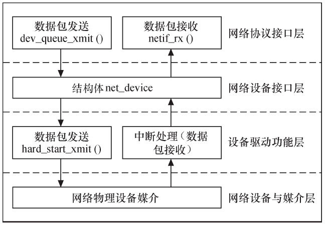
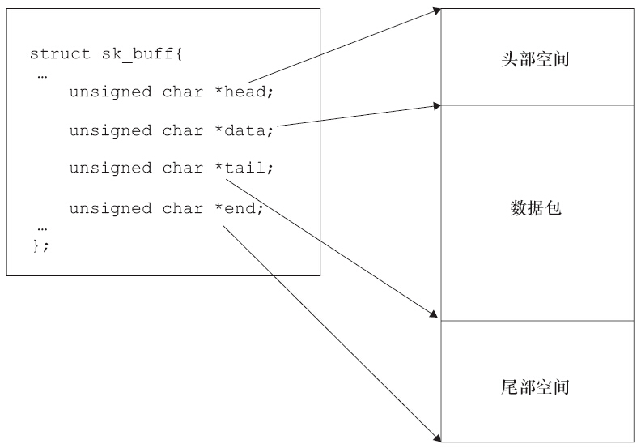

# 1 网络设备结构
与字符设备和块设备不同，网络设备并不对应于/dev目录下的文件，应用程序最终使用**Socket**完成与网络设备的接口。因而在网络设备身上并不能体现出“一切都是文件”的思想。Linux系统对网络设备驱动定义了4个层次:

- **网络协议接口层**：向网络层协议提供统一的数据包收发接口
   - `int dev_queue_xmit(struct sk_buff *skb);`函数发送数据
   - `int netif_rx(struct sk_buff *skb);`函数接收数据
- **网络设备接口层**：向协议接口层提供统一的结构体net_device，用于描述具体网络设备属性和操作
- **设备驱动功能层**：实现net_device中各个函数，驱使网络设备硬件完成相应动作
   - 通过hard_start_xmit（） 函数启动发送操作
   - 通过网络设备上的中断触发接收操作
- **网络设备与媒介层**：完成数据包发送和接收的物理实体，包括网络适配器和具体的传输媒介



## 1.1 socket缓冲区
上面收发网络数据都需要用到`struct sk_buff`，sk_buff叫做socket缓冲区。

- 当发送数据包时， Linux内核的网络处理模块必须**建立一个包含要传输的数据包的**`**sk_buff**`， 然后将sk_buff递交给下层， 各层在sk_buff中**添加不同的协议头**直至交给网络设备发送
- 当网络设备从网络媒介上接收到数据包后， 它必须**将接收到的数据转换为`sk_buff`数据结构**并传递给上层， 各层**剥去相应的协议头**直至交给用户


缓冲区的主要结构如下：


## 1.2 net_device结构体
net_device结构体在内核中指代一个网络设备，它定义于`include/linux/netdevice.h`文件中，网络设备驱动程序**只需通过填充net_device的具体成员并注册net_device**即可实现硬件操作函数与内核的挂接。
net_device的关键成员有：
```c
struct net_device {
    unsigned int    mtu;//最大传输单元
    unsigned char   *dev_addr;//设备的MAC地址
    const struct net_device_ops *netdev_ops;//设备对应的硬件操作函数集合
};
```
net_device结构体的成员（属性和net_device_ops结构体中的函数指针）需要被**设备驱动功能层**赋予具体的数值和函数。 对于具体的设备，工程师应该编写相应的设备驱动功能层的函数。
`netdevice.h`中的`alloc_netdev`函数可以生成一个`net_device`并赋初值，`free_netdev`函数用于释放结构体。net_device结构体的分配和网络设备驱动的注册需在网络设备驱动程序初始化时进行， 而net_device结构体的释放和网络设备驱动的注销在设备或驱动被移除的后执行。

# 2 网络设备驱动的基本组成

## 2.1 注册与注销
网络驱动的注册于注销使用下面的函数，参数均为`net_device`结构体：

- `int register_netdev(struct net_device *dev);`
- `void unregister_netdev(struct net_device *dev);`

## 2.2 网络设备初始化
完成如下任务：

- 进行**硬件上的准备工作**，检查网络设备是否存在，如果存在，则检测设备所使用的硬件资源。
- 进行软件接口上的准备工作，**分配net_device结构体并对其数据和函数指针成员赋值**。
- 获得设备的**私有信息**指针并初始化各成员的值。如果私有信息中包括自旋锁或信号量等并发或同步机制，则需对其进行初始化。

## 2.3 设备打开与关闭
网络设备的打开函数需要完成如下工作：

- 使能设备使用的硬件资源，申请I/O区域、中断和DMA通道等
- 调用Linux内核提供的`netif_start_queue()`函数，激活设备发送队列


网络设备的关闭函数需要完成如下工作：

- 调用Linux内核提供的`netif_stop_queue()`函数， 停止设备传输包
- 释放设备所使用的I/O区域、中断和DMA资源。

## 2.4 数据发送与接收
网络设备驱动完成数据包发送的流程如下：

- 网络设备驱动程序从上层协议传递过来的sk_buff参数获得数据包的有效数据和长度，**将有效数据放入临时缓冲区**
- 对于以太网， 如果有效数据的长度小于以太网冲突检测所要求数据帧的最小长度ETH_ZLEN， 则**给临时缓冲区的末尾填充0**
- **设置硬件的寄存器**， 驱使网络设备进行数据发送操作
- 使用如下函数**唤醒和阻止**Linux网络子系统向下发送数据包
   - `netif_wake_queue`
   - `netif_stop_queue`

网络设备接收数据的主要方法是由中断引发设备的中断处理函数，

- 中断处理函数判断中断类型
- 如果为接收中断，则读取接收到的数据，分配`sk_buffer`数据结构和数据缓冲区，将接收到的数据复制到数据缓冲区
- 调用`netif_rx()`函数将`sk_buffer`传递给上层协议。 


# 3 示例解析
Linux Kernel源码：drivers/net/ethernet/davicom/dm9000.c

