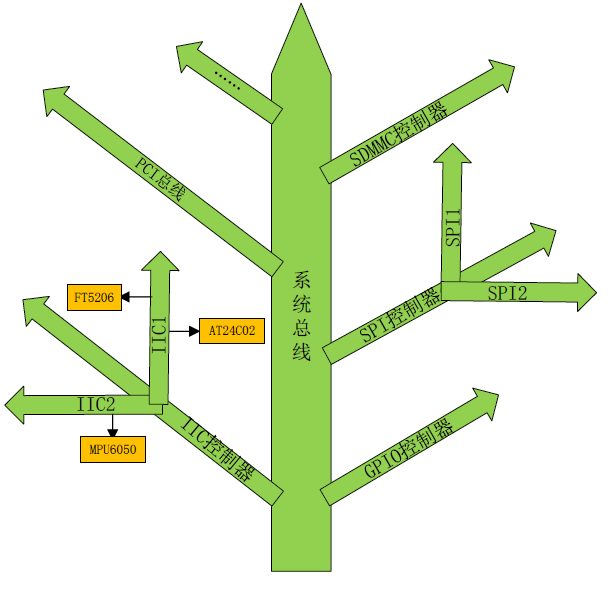
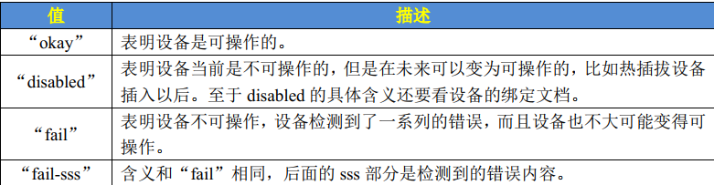
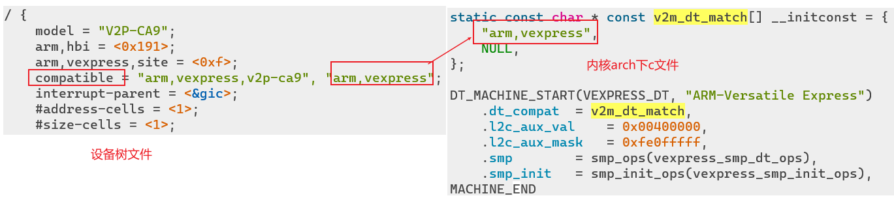
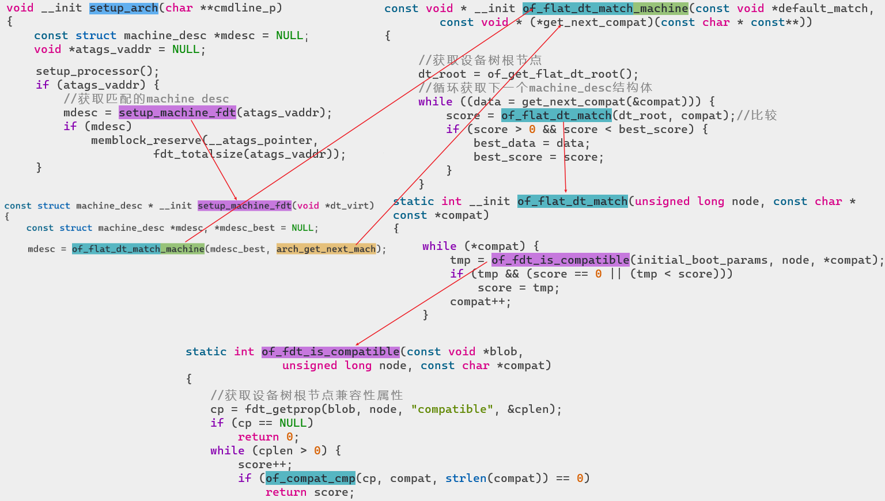
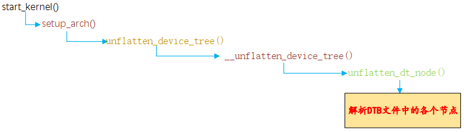

在新版本的 Linux中， ARM相关的驱动全部采用了设备树 (也有支持老式驱动的，比较少 )，最新出的 CPU其驱动开发也基本都是基于设备树的。**因此了解设备树是驱动开发必须的！**

# 设备树简介
设备树的由来：Linux内核中ARM架构下有太多的冗余的垃圾板级信息文件，导致 linus震怒，然后ARM社区从PowerPC中借鉴引入了设备树。目录位于`arch/arm/boot/dts`。**​**

设备树属于DTS文件（device tree source）描述板卡上的信息，比如CPU数量、内存基地址、不同接口上都接了什么设备。如图：

- 这个通用文件就是`.dtsi`文件，类似于 C语言中的头文件。描述SOC级信息（有

几个 CPU、主频是多少、各个外设控制器信息等）

- 一般`.dts`描述板级信息 (也就是开发板上有哪些 IIC设备、 SPI设备等 )

# DTC工具
DTC是将.dts编译为.dtb的工具，DTC工具在内核的`scrits/dtc`目录下，要编译`dts`文件可以直接在内核目录下执行`make dtbs`。DTC除了可以编译.dts文件以外， 也可以**“反汇编”.dtb文件为.dts文件**，其指令格式为：`./scripts/dtc/dtc -I dtb -O dts -o xxx.dts arch/arm/boot/dts/xxx.dtb`

# DTS文件

## dts与dtb
`dts`是设备树源码文件，经过DTC工具编译后可以生成`dtb`二进制文件。在Linux内核的`arch/arm/boot/dts/Makefile`中， 描述了当某种SoC被选中后， 哪些.dtb文件会被编译出来。

## dts语法
DTS语法非常的人性化，是一种 ASCII文本文件，不管是阅读还是修改都很方便。下面以内核中vexpress-v2p-ca9.dts为例，记录dts的基本语法：

### include
dts文件中可以通过`#include`引用dts、dtsi和h头文件。不过**推荐使用dtsi作为后缀。**​一般 .dtsi文件用于描述 SOC的内部外设信息，比如 CPU架构、主频、外设寄存器地址范围，比如 UART、 IIC等。
```
//导入头文件，支持dts,dtsi和h头文件
#include "vexpress-v2m.dtsi"
```

### 设备节点
设备树是采用树形结构来描述板子上的设备信息的文件，**每个设备都是一个节点，叫做设备节点**，每个节点都通过一些属性信息来描述节点信息，**属性就是键-值对**。​

在设备树中节点命名格式如下：

- `node-name@unit-address`：
   - node-name是节点名字，为 ASCII字符串，节点名字应该能够清晰的描述出节点的功能，比如“ uart1”就表示这个节点是 UART1外设。
   - unit-address一般表示**设备的地址或寄存器首地址**，如果某个节点没有地址或者寄存器的话unit-address可以不要，比如 “cpu@0”、interrupt-controller@00a01000”。
- `label: node-name@unit-address`：label是为了方便访问节点，采用格式`&label`


每个属性都是键值对，常见如下几种类型：

- 字符串类型：`compatible = "arm,cortex-a9";`
- 32bit无符号整数：`reg = <0>;`
- 字符串列表：`compatible = "arm,vexpress,v2p-ca9", "arm,vexpress";`


```
// 斜杠表示根节点，如果include文件也有根节点则合并为一个
/ {
	model = "V2P-CA9";
	arm,hbi = <0x191>;
	arm,vexpress,site = <0xf>;
	compatible = "arm,vexpress,v2p-ca9", "arm,vexpress";
	interrupt-parent = <&gic>;
	#address-cells = <1>;
	#size-cells = <1>;

  //...
	cpus {
		#address-cells = <1>;
		#size-cells = <0>;

		A9_0: cpu@0 {
			device_type = "cpu";
			compatible = "arm,cortex-a9";
			reg = <0>;
			next-level-cache = <&L2>;
		};

		A9_1: cpu@1 {
			device_type = "cpu";
			compatible = "arm,cortex-a9";
			reg = <1>;
			next-level-cache = <&L2>;
		};

		//...
	};
  //...
}
```

### 常见标准属性

- compatible：用于**将设备和驱动绑定**，格式为`"厂商,驱动名称`。格式为字符串列表，可以指定多个驱动，按照先后顺序确定优先级。**一般驱动程序有OF匹配表，用于与compatible对比。**
- model：字符串，描述设备模块的信息
- status：字符串，设备的状态信息，可选如下value：



- reg：格式为`reg = <address1 length1 address2 length2 address3 length3……>`，描述设备的地址空间信息，其中每个address length组个表示一个地址范围
   - #address-cells：指定address所占用的字长（32bit）
   - #size-cells：指定length所占用的字长（32bit）
- ranges：地址映射/转换表，ranges由子地址、父地址和地址空间长度组成（也可以为空，表示子地址与父地址空间完全相同，不需要转换）：
   - child-bus-address：子总线地址空间的物理地址，由父节点的#address-cells确定字长
   - parent-bus-address：父总线地址空间的物理地址，由父节点的#address-cells确定字长
   - length：子地址空间长度，由父节点#size-cells确定字长
- device_type：字符串，用于描述设备的FCode，只用于CPU和memory节点
- chosen：uboot向Linux内核传递数据，除了默认存在的bootargs一般为空。


# 设备树如何匹配设备

## 匹配原理
以vexpress开发板为例，我们能看到在vexpress-v2p-ca9.dts设备树源文件中，根节点的compatible定义。而在`arch/arm/mach-vexpress/v2m.c`中定义了该架构下设备的兼容信息，如果两者相等，则表示内核支持该设备：

## 代码流程
在中`start_kernel`中有一步是解析设备树并判断内核是否支持某个设备。更具体的流程如下：

# Linux解析dtb文件
Linux 内核在启动的时候会解析 DTB 文件，然后在`/proc/device-tree` 目录下生成相应的设备树节点文件： 

# OF函数获取设备树信息
因为设备树最终是被驱动文件所使用的，而驱动文件必须要读取设备树中的属性信息，比如内存信息、 GPIO 信息、中断信息等等。要想在驱动中读取设备树的属性值，那么就必须**使用Linux内核提供的众多的OF函数（统一前缀of_）**。 

## 查找节点
Linux 内核使用`device_node`结构体来描述一个节点，此结构体定义在文件`include/linux/of.h`中，OF函数也在该文件定义。查找节点函数有以下几个：
```c
//from标识开始查找的节点，传入NULL表示从根节点开始
//name为要查找的节点名字
struct device_node *of_find_node_by_name(struct device_node *from, const char *name);

//通过device_type属性查找节点
struct device_node *of_find_node_by_type(struct device_node *from, const char *type);

//通过device_type和compatible两个属性查找节点
struct device_node *of_find_compatible_node(struct device_node *from,
	const char *type, const char *compat);

//通过 of_device_id 匹配表来查找指定的节点
//matches是匹配表，可以设置多个需要匹配的id
//match为最终找到的node的id
struct device_node *of_find_matching_node_and_match(
	struct device_node *from,
	const struct of_device_id *matches,
	const struct of_device_id **match);

//根据节点路径查找节点
//path是全路径的节点名，可以使用节点别名
static inline struct device_node *of_find_node_by_path(const char *path)
```

## 查找父子节点
Linux 内核提供了几个查找节点对应的父节点或子节点的 OF 函数：
```c
//获取指定节点的父节点
struct device_node *of_get_parent(const struct device_node *node);

//查找指定节点的子节点
//prev是前一个子节点，表示从该子节点开始迭代。NULL表示从第一个子节点开始
struct device_node *of_get_next_child(const struct device_node *node,
					     struct device_node *prev);
```

## 提取属性值
节点的属性信息里面保存了驱动所需要的内容，Linux 内核中使用结构体`property`表示属性，此结构体同样定义在文件`include/linux/of.h`中。相关函数如下：
```c
//获取指定节点的属性
//name为属性名,leno为提取到的属性字节数
struct property *of_find_property(const struct device_node *np,
					 const char *name,
					 int *lenp);

//获取属性中元素的数量，比如reg属性值是一个数组，那么使用此函数可以获取到这个数组的大小
int of_property_count_elems_of_size(const struct device_node *np,
				const char *propname, int elem_size);

//从属性中获取指定标号的 u32 类型数据值
//index为多个值时,要获取指定的标号的数值
int of_property_read_u32_index(const struct device_node *np,
				       const char *propname,
				       u32 index, u32 *out_value);

//如下几个函数,用于获取属性所有值,返回数组,用于多值清空
static inline int of_property_read_u8_array(const struct device_node *np,
					    const char *propname,
					    u8 *out_values, size_t sz)
of_property_read_u16_array(...);
of_property_read_u32_array(...);
of_property_read_u64_array(...);

//获取属性的单个值:
static inline int of_property_read_u8(const struct device_node *np,
				       const char *propname,
				       u8 *out_value);
of_property_read_u16(...);
of_property_read_u32(...);
of_property_read_u64(...);

//读取字符串值
int of_property_read_string(const struct device_node *np,
				   const char *propname,
				   const char **out_string);

//获取address-cells和size-cells值
int of_n_addr_cells(struct device_node *np);
int of_n_size_cells(struct device_node *np);

//将节点的reg寄存器物理地址映射为虚拟地址
//index用于reg包含多个地址范围时,指定要映射哪一段
void __iomem *of_iomap(struct device_node *np, int index);
```

# 使用设备树的点灯示例
在udev章节有个使用udev的点灯示例，该例子中使用IO访问函数将外部设备的寄存器地址映射为linux虚拟地址，然后进行修改。​

在本章节，**使用设备树来向 Linux 内核传递相关的寄存器物理地址， 用OF函数从设备树中获取所需的属性值，然后使用获取到的属性值来初始化相关的 IO**。​

1. 修改设备树源文件：在根节点下创建子节点，设置外设的各个属性，尤其是寄存器地址。修改后`make dtbs`生成新的设备树文件
```
barretled {
    #address-cells = <1>;
    #size-cells = <1>;
    compatible = "atkalpha-led";
    status = "okay";
    reg = < 0X020C406C 0X04 /* CCM_CCGR1_BASE */
            0X020E0068 0X04 /* SW_MUX_GPIO1_IO03_BASE */
            0X020E02F4 0X04 /* SW_PAD_GPIO1_IO03_BASE */
            0X0209C000 0X04 /* GPIO1_DR_BASE */
            0X0209C004 0X04 >; /* GPIO1_GDIR_BASE */
};
```

2. 驱动程序源代码
```c
#include <linux/types.h>
#include <linux/kernel.h>
#include <linux/delay.h>
#include <linux/ide.h>
#include <linux/init.h>
#include <linux/module.h>
#include <linux/errno.h>
#include <linux/gpio.h>
#include <linux/cdev.h>
#include <linux/device.h>
#include <linux/of.h>
#include <linux/of_address.h>
#include <asm/mach/map.h>
#include <asm/uaccess.h>
#include <asm/io.h>

#define DTSLED_CNT			1		  	/* 设备号个数 */
#define DTSLED_NAME			"dtsled"	/* 名字 */
#define LEDOFF 					0			/* 关灯 */
#define LEDON 					1			/* 开灯 */

/* 映射后的寄存器虚拟地址指针 */
static void __iomem *IMX6U_CCM_CCGR1;
static void __iomem *SW_MUX_GPIO1_IO03;
static void __iomem *SW_PAD_GPIO1_IO03;
static void __iomem *GPIO1_DR;
static void __iomem *GPIO1_GDIR;

/* dtsled设备结构体 */
struct dtsled_dev{
	dev_t devid;			/* 设备号 	 */
	struct cdev cdev;		/* cdev 	*/
	struct class *class;		/* 类 		*/
	struct device *device;	/* 设备 	 */
	int major;				/* 主设备号	  */
	int minor;				/* 次设备号   */
	struct device_node	*nd; /* 设备节点 */
};

struct dtsled_dev dtsled;	/* led设备 */

/*
 * @description		: LED打开/关闭
 * @param - sta 	: LEDON(0) 打开LED，LEDOFF(1) 关闭LED
 * @return 			: 无
 */
void led_switch(u8 sta)
{
	u32 val = 0;
	if(sta == LEDON) {
		val = readl(GPIO1_DR);
		val &= ~(1 << 3);	
		writel(val, GPIO1_DR);
	}else if(sta == LEDOFF) {
		val = readl(GPIO1_DR);
		val|= (1 << 3);	
		writel(val, GPIO1_DR);
	}	
}

/*
 * @description		: 打开设备
 * @param - inode 	: 传递给驱动的inode
 * @param - filp 	: 设备文件，file结构体有个叫做private_data的成员变量
 * 					  一般在open的时候将private_data指向设备结构体。
 * @return 			: 0 成功;其他 失败
 */
static int led_open(struct inode *inode, struct file *filp)
{
	filp->private_data = &dtsled; /* 设置私有数据 */
	return 0;
}

/*
 * @description		: 从设备读取数据 
 * @param - filp 	: 要打开的设备文件(文件描述符)
 * @param - buf 	: 返回给用户空间的数据缓冲区
 * @param - cnt 	: 要读取的数据长度
 * @param - offt 	: 相对于文件首地址的偏移
 * @return 			: 读取的字节数，如果为负值，表示读取失败
 */
static ssize_t led_read(struct file *filp, char __user *buf, size_t cnt, loff_t *offt)
{
	return 0;
}

/*
 * @description		: 向设备写数据 
 * @param - filp 	: 设备文件，表示打开的文件描述符
 * @param - buf 	: 要写给设备写入的数据
 * @param - cnt 	: 要写入的数据长度
 * @param - offt 	: 相对于文件首地址的偏移
 * @return 			: 写入的字节数，如果为负值，表示写入失败
 */
static ssize_t led_write(struct file *filp, const char __user *buf, size_t cnt, loff_t *offt)
{
	int retvalue;
	unsigned char databuf[1];
	unsigned char ledstat;

	retvalue = copy_from_user(databuf, buf, cnt);
	if(retvalue < 0) {
		printk("kernel write failed!\r\n");
		return -EFAULT;
	}

	ledstat = databuf[0];		/* 获取状态值 */

	if(ledstat == LEDON) {	
		led_switch(LEDON);		/* 打开LED灯 */
	} else if(ledstat == LEDOFF) {
		led_switch(LEDOFF);	/* 关闭LED灯 */
	}
	return 0;
}

/*
 * @description		: 关闭/释放设备
 * @param - filp 	: 要关闭的设备文件(文件描述符)
 * @return 			: 0 成功;其他 失败
 */
static int led_release(struct inode *inode, struct file *filp)
{
	return 0;
}

/* 设备操作函数 */
static struct file_operations dtsled_fops = {
	.owner = THIS_MODULE,
	.open = led_open,
	.read = led_read,
	.write = led_write,
	.release = 	led_release,
};

/*
 * @description	: 驱动出口函数
 * @param 		: 无
 * @return 		: 无
 */
static int __init led_init(void)
{
	u32 val = 0;
	int ret;
	u32 regdata[14];
	const char *str;
	struct property *proper;

	/* 获取设备树中的属性数据 */
	/* 1、获取设备节点：barretled */
	dtsled.nd = of_find_node_by_path("/barretled");
	if(dtsled.nd == NULL) {
		printk("barretled node nost find!\r\n");
		return -EINVAL;
	} else {
		printk("barretled node find!\r\n");
	}

	/* 2、获取compatible属性内容 */
	proper = of_find_property(dtsled.nd, "compatible", NULL);
	if(proper == NULL) {
		printk("compatible property find failed\r\n");
	} else {
		printk("compatible = %s\r\n", (char*)proper->value);
	}

	/* 3、获取status属性内容 */
	ret = of_property_read_string(dtsled.nd, "status", &str);
	if(ret < 0){
		printk("status read failed!\r\n");
	} else {
		printk("status = %s\r\n",str);
	}

	/* 4、获取reg属性内容 */
	ret = of_property_read_u32_array(dtsled.nd, "reg", regdata, 10);
	if(ret < 0) {
		printk("reg property read failed!\r\n");
	} else {
		u8 i = 0;
		printk("reg data:\r\n");
		for(i = 0; i < 10; i++)
			printk("%#X ", regdata[i]);
		printk("\r\n");
	}

	/* 初始化LED */
	IMX6U_CCM_CCGR1 = of_iomap(dtsled.nd, 0);
	SW_MUX_GPIO1_IO03 = of_iomap(dtsled.nd, 1);
  	SW_PAD_GPIO1_IO03 = of_iomap(dtsled.nd, 2);
	GPIO1_DR = of_iomap(dtsled.nd, 3);
	GPIO1_GDIR = of_iomap(dtsled.nd, 4);

	/* 2、使能GPIO1时钟 */
	val = readl(IMX6U_CCM_CCGR1);
	val &= ~(3 << 26);	/* 清楚以前的设置 */
	val |= (3 << 26);	/* 设置新值 */
	writel(val, IMX6U_CCM_CCGR1);

	/* 3、设置GPIO1_IO03的复用功能，将其复用为
	 *    GPIO1_IO03，最后设置IO属性。
	 */
	writel(5, SW_MUX_GPIO1_IO03);
	
	/*寄存器SW_PAD_GPIO1_IO03设置IO属性
	 *bit 16:0 HYS关闭
	 *bit [15:14]: 00 默认下拉
     *bit [13]: 0 kepper功能
     *bit [12]: 1 pull/keeper使能
     *bit [11]: 0 关闭开路输出
     *bit [7:6]: 10 速度100Mhz
     *bit [5:3]: 110 R0/6驱动能力
     *bit [0]: 0 低转换率
	 */
	writel(0x10B0, SW_PAD_GPIO1_IO03);

	/* 4、设置GPIO1_IO03为输出功能 */
	val = readl(GPIO1_GDIR);
	val &= ~(1 << 3);	/* 清除以前的设置 */
	val |= (1 << 3);	/* 设置为输出 */
	writel(val, GPIO1_GDIR);

	/* 5、默认关闭LED */
	val = readl(GPIO1_DR);
	val |= (1 << 3);	
	writel(val, GPIO1_DR);

	/* 注册字符设备驱动 */
	/* 1、创建设备号 */
	if (dtsled.major) {		/*  定义了设备号 */
		dtsled.devid = MKDEV(dtsled.major, 0);
		register_chrdev_region(dtsled.devid, DTSLED_CNT, DTSLED_NAME);
	} else {						/* 没有定义设备号 */
		alloc_chrdev_region(&dtsled.devid, 0, DTSLED_CNT, DTSLED_NAME);	/* 申请设备号 */
		dtsled.major = MAJOR(dtsled.devid);	/* 获取分配号的主设备号 */
		dtsled.minor = MINOR(dtsled.devid);	/* 获取分配号的次设备号 */
	}
	printk("dtsled major=%d,minor=%d\r\n",dtsled.major, dtsled.minor);	
	
	/* 2、初始化cdev */
	dtsled.cdev.owner = THIS_MODULE;
	cdev_init(&dtsled.cdev, &dtsled_fops);
	
	/* 3、添加一个cdev */
	cdev_add(&dtsled.cdev, dtsled.devid, DTSLED_CNT);

	/* 4、创建类 */
	dtsled.class = class_create(THIS_MODULE, DTSLED_NAME);
	if (IS_ERR(dtsled.class)) {
		return PTR_ERR(dtsled.class);
	}

	/* 5、创建设备 */
	dtsled.device = device_create(dtsled.class, NULL, dtsled.devid, NULL, DTSLED_NAME);
	if (IS_ERR(dtsled.device)) {
		return PTR_ERR(dtsled.device);
	}
	
	return 0;
}

/*
 * @description	: 驱动出口函数
 * @param 		: 无
 * @return 		: 无
 */
static void __exit led_exit(void)
{
	/* 取消映射 */
	iounmap(IMX6U_CCM_CCGR1);
	iounmap(SW_MUX_GPIO1_IO03);
	iounmap(SW_PAD_GPIO1_IO03);
	iounmap(GPIO1_DR);
	iounmap(GPIO1_GDIR);

	/* 注销字符设备驱动 */
	cdev_del(&dtsled.cdev);/*  删除cdev */
	unregister_chrdev_region(dtsled.devid, DTSLED_CNT); /* 注销设备号 */

	device_destroy(dtsled.class, dtsled.devid);
	class_destroy(dtsled.class);
}

module_init(led_init);
module_exit(led_exit);
MODULE_LICENSE("GPL");
MODULE_AUTHOR("barretren");
```
