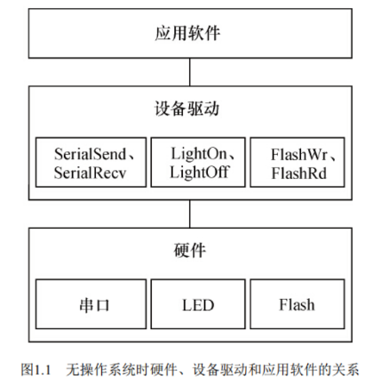
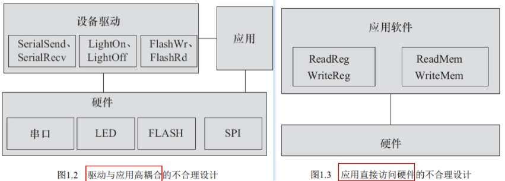
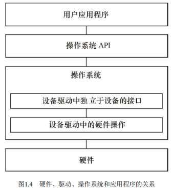
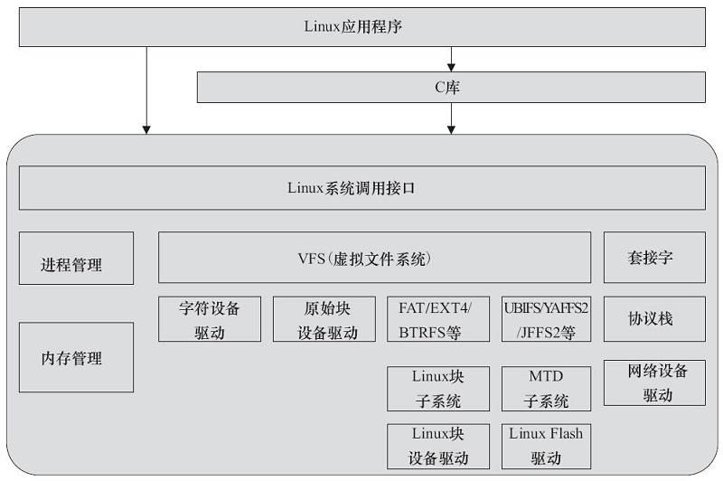
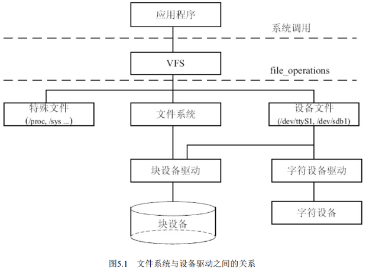

> **注，笔记主体内容基于宋宝华《Linux设备驱动开发详解》，并补充其他地方学到的要点**

# 1 设备驱动的作用
对设备驱动最通俗的解释就是“**驱使硬件设备行动**”。 驱动与底层硬件直接打交道， 按照硬件设备的具体工作方式， 读写设备的寄存器， 完成设备的轮询、 中断处理、 DMA通信， 进行物理内存向虚拟内存的映射等， 最终让通信设备能收发数据， 让显示设备能显示文字和画面， 让存储设备能记录文件和数据。

- 在系统没有操作系统的情况下， 工程师可以根据硬件设备的特点自行定义接口
- 在有操作系统的情况下， 驱动的架构则由相应的操作系统定义， 按照相应的架构设计驱动， 这样， 驱动才能良好地整合入操作系统的内核中

## 1.1 没有OS时的驱动
在没有操作系统的情况下， 设备驱动的接口被直接提交给应用软件工程师， **应用软件没有跨越任何层次就直接访问设备驱动的接口**。 驱动包含的接口函数也与硬件的功能直接吻合， 没有任何附加功能。结构如下：
下图所示的结构设计是**常见的不合理设计**：

## 1.2 有OS时的驱动
当系统中存在操作系统的时候， **驱动变成了连接硬件和内核的桥梁**。 如下图所示， 操作系统的存在势必要求设备驱动附加更多的代码和功能， 把单一的“驱使硬件设备行动”变成了操作系统内与硬件交互的模块，它**对外呈现为操作系统的统一的API**， 不再给应用软件工程师直接提供接口。
当驱动都按照操作系统给出的独立于设备的接口而设计时， 那么， 应用程序将可使用统一的系统调用接口来访问各种设备。

# 2 Linux设备驱动

## 2.1 Linux设备分类
Linux将存储器和外设分为3大类:

- **字符设备：**必须以串行顺序依次进行访问的设备， 如触摸屏、 磁带驱动器、 鼠标等
- **块设备：**可以按任意顺序进行访问， 以块为单位进行操作， 如硬盘、 eMMC等。
- **网络设备：**面向数据包的接收和发送而设计， 它并不倾向于对应于文件系统的节点，而是使用socket接口

**Note**：**字符设备与块设备都被映射到Linux文件系统的文件和目录**， 通过文件系统的系统调用接口open()、 write() 、 read() 、 close()等即可访问字符设备和块设备。
**Note**: 编写Linux的驱动，除了**硬件操作函数**仍然需要外， 还包含了大量暂时陌生的元素， 例如结构体file_operations、 cdev， Linux内核模块声明用的MODULE_AUTHOR、MODULE_LICENSE、 module_init、 module_exit， 以及用于字符设备注册、 分配和注销的函数register_chrdev_region（ ） 、 alloc_chrdev_region（ ） 、 unregister_chrdev_region（ ） 等。这些陌生的元素都是Linux内核为某一类设备定义的， 以实现驱动与内核接口。 **Linux对各类设备的驱动都定义了类似的数据结构和函数**。

## 2.2 驱动和OS的关系
Linux驱动和整个操作系统的关系：

## 2.3 驱动和文件系统的关系
应用程序和VFS之间的接口是系统调用， 而VFS与文件系统以及设备文件之间的接口是**file_operations结构体**成员函数，这个结构体包含对文件进行打开、 关闭、 读写、 控制的一系列成员函数：

- 字符设备的file_operations成员函数就直接由设备驱动提供，没有文件系统
- 块设备有两种访问方法：
   - 不通过文件系统直接访问裸设备， 在Linux内核实现了统一的**def_blk_fops**这一file_operations
   - 通过文件系统来访问块设备， file_operations的实现则位于文件系统内， 文件系统会把针对文件的读写转换为针对块设备原始扇区的读写
