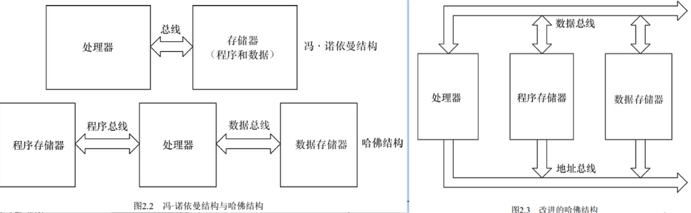
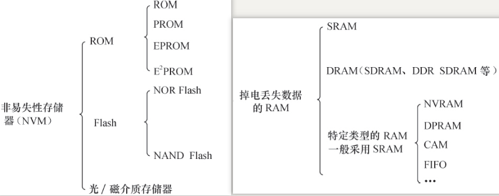
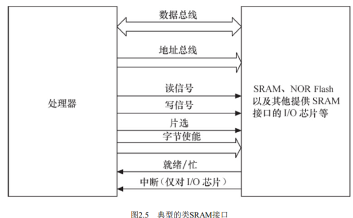
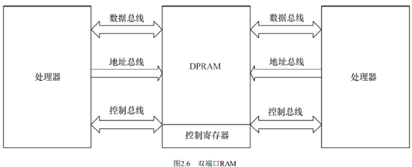
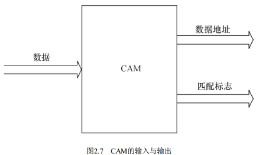
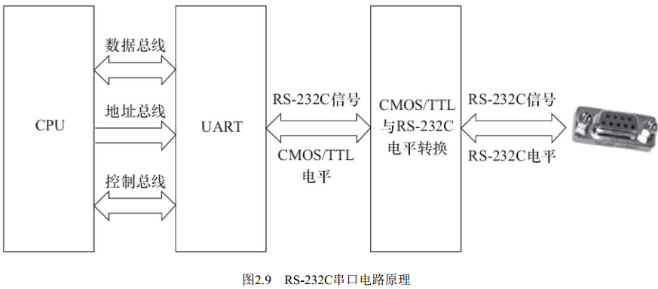
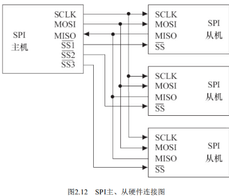
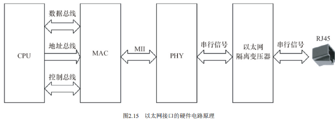

# 1 处理器
主流的通用处理器（GPP） 多采用**SoC（片上系统）** 的芯片设计方法， 集成了各种功能模块， 每一种功能都是由**硬件描述语言**设计程序， 然后在SoC内由电路实现的。 在SoC中， 每一个模块不是一个已经设计成熟的ASIC器件， 而是利用芯片的一部分资源去实现某种传统的功能， 将各种组件采用类似搭积木的方法组合在一起。 ARM Soc是目前的主流平台。

## 1.1 结构分类
中央处理器的体系结构可以分为两类， 一类为**冯·诺依曼结构**， 另一类为**哈佛结构**。

- 冯·诺伊曼结构：将程序指令存储器和数据存储器合并在一起，程序指令存储地址和数据存储地址指向同一个存储器的不同物理位置，**程序指令和数据的宽度相同**
- 哈佛结构：程序指令和数据分开存储， **指令和数据可以有不同的数据宽度**。 独立的**程序总线**和**数据总线**， 分别作为CPU与每个存储器之间的专用通信路径， 具有较高的执行效率
   - **改进哈佛结构**：具有独立的地址总线和数据总线， 两条总线由程序存储器和数据存储器分时共用

## 1.2 指令集分类
从指令集的角度来讲， 中央处理器也可以分为两类， 即**RISC**（精简指令集计算机） 和**CISC**（复杂指令集计算机） ：

- RISC：强调尽量减少指令集、 指令单周期执行， 但是目标代码会更大。ARM，MIPS，PowerPC都是RISC指令集
- CISC：强调增强指令的能力、 减少目标代码的数量， 但是指令复杂， 指令周期长

## 1.3 DSP数字信号处理器
数字信号处理器（DSP） 针对**通信、 图像、 语音和视频处理**等领域的算法而设计。 它包含**独立的硬件乘法器**。DSP的乘法指令一般在单周期内完成， 且优化了卷积、 数字滤波、 FFT（快速傅里叶变换） 、 相关矩阵运算等算法中的大量重复乘法。
DSP分为两类， 一类是定点DSP， 另一类是浮点DSP：

- 浮点DSP：浮点运算用硬件来实现， 可以在单周期内完成， 因而其浮点运算处理速度高于定点DSP
- 定点DSP：用定点运算模拟浮点运算

# 2 存储器

## 2.1 存储器分类
分类如下：

## 2.2 flash
NOR（或非） 和NAND（与非） 是市场上两种主要的Flash闪存技术。**NOR Flash**和CPU的接口属于典型的类**SRAM接口**（如下图）， 不需要增加额外的控制电路。 NOR Flash的特点是可芯片内执行（eXecute In Place， XIP） ， 程序可以直接在NOR内运行。

**NAND Flash**和CPU的接口必须由相应的**控制电路**进行转换，当然也可以通过地址线或GPIO产生**NAND Flash**接口的信号。 NAND Flash以块方式进行访问， 不支持芯片内执行。

# 2.3 特定类型的RAM
**DPRAM**：通信速度快，时效性强，接口简单，用于两个处理器之间交互

**CAM**：内容寻址RAM，将一个输入数据项与存储在CAM中的所有数据项自动进行比较， 判别该输入数据项与CAM中存储的数据项是否相匹配， 并输出该数据项对应的匹配信息

**FIFO**：先进先出队列，先进先出， 进出有序， FIFO多用于数据缓冲

# 3 接口与总线

## 3.1 串口标准
RS-232C是嵌入式系统中应用最广泛的串行接口，为连接DTE（数据终端设备） 与DCE（数据通信设备） 而制定 。

常用以下9个信号：

- RTS： 用来表示DTE请求DCE发送数据， 当终端要发送数据时， 使该信号有效。
- CTS： 用来表示DCE准备好接收DTE发来的数据， 是对RTS的响应信号。
- RxD： DTE通过RxD接收从DCE发来的串行数据。
- TxD： DTE通过TxD将串行数据发送到DCE。
- DSR： 有效（ON状态） 表明DCE可以使用。
- DTR： 有效（ON状态） 表明DTE可以使用。
- DCD： 当本地DCE设备收到对方DCE设备送来的载波信号时， 使DCD有效， 通知DTE准备接收， 并且由DCE将接收到的载波信号解调为数字信号， 经RxD线送给DTE。
- Ringing-RI： 当调制解调器收到交换台送来的振铃呼叫信号时， 使该信号有效（ON状态） ， 通知终端， 已被呼叫
- SG：信号地

## 3.2 SPI
SPI（ Serial Peripheral Interface， 串行外设接口） 总线系统是一种同步串行外设接口， 它可以使CPU与各种外围设备以串行方式进行通信以交换信息。SPI接口一般使用4条线：**串行时钟线**（ SCLK） 、 **主机输入/从机输出数据线MISO**、 **主机输出/从机输入数据线MOS**I和低电平有效的**从机选择线SS**。

## 3.3 USB
USB提供了多种传输方式以适应各种设备的需要：

- 控制传输：双向传输，数据量小，用来查询、配置和给USB设备发送通用命令
- 同步传输：用于时间要求严格并具有较强容错性的流数据传输，或要求恒定数据传送率的即时应用
- 中断传输：单向，输入到主机，用于定时查询设备是否有中断数据要传送
- 批量传输：应用在没有带宽、 间隔时间要求的批量数据的传送和接收中， 要求保证传输，例如打印机

## 3.4 以太网接口
以太网接口由MAC（以太网媒体接入控制器） 和PHY（物理接口收发器） 组成，MAC和PHY之间采用MII（媒体独立接口） 连接。

# 4 CPLD和FPGA
CPLD（**复杂可编程逻辑器件**） 由完全可编程的与或门阵列以及宏单元构成，基本逻辑单元是宏单元， 宏单元由一些“与或”阵列加上触发器构成。
与CPLD不同， FPGA（**现场可编程门阵列**） 基于LUT（查找表） 工艺。 查找表本质上是一片RAM， 当用户通过原理图或HDL（硬件描述语言） 描述了一个逻辑电路以后， FPGA开发软件会自动计算逻辑电路所有可能的结果， 并把结果事先写入RAM。 这样， 输入一组信号进行逻辑运算就等于输入一个地址进行查表以输出对应地址的内容。
对于驱动工程师而言， 我们只需要这样看待CPLD和FPGA：

- 如果它完成的是特定的接口和控制功能， 我们就直接把它当成由很多逻辑门（与、 非、 或、 D触发器） 组成的可完成一系列时序逻辑和组合逻辑的ASIC；
- 如果它完成的是CPU的功能， 我们就直接把它当成CPU

# 5 硬件分析

## 5.1  原理图分析
原理图分析的含义：通过阅读电路板的原理图获得各种存储器、 外设所使用的**硬件资源、 接口和引脚连接关系**。
硬件原理图包含如下元素：

- **符号**：描述芯片的外围引脚以及引脚的信号， 对于复杂的芯片， 可能会被分割为几个符号
- **网络**：描述芯片、 接插件和分离元器件引脚之间的互连关系
- **描述**：辅助描述原理图（类似源代码中的注释）

## 5.2 硬件时序分析

**时序分析**：让芯片之间的访问满足芯片数据手册中**时序图信号有效的先后顺序、 采样建立时间（Setup Time） 和保持时间（Hold Time）** 的要求， 在电路板工作不正常的时候， 准确地定位时序方面的问题。

- **建立时间**：在触发器的时钟信号边沿到来以前， 数据**已经保持稳定不变**的时间， 如果建立时间不够， 数据将不能在这个时钟边沿被打入触发器；
- **保持时间**：在触发器的时钟信号边沿到来以后， 数据**还需稳定不变**的时间， 如果保持时间不够， 数据同样不能被打入触发器

## 5.3  仪表使用
万用表主要调试功能：

- 测量电平
- 使用**二极管挡**测量电路板上网络的连通性， 当示波器被设置在二极管挡， 测量连通的网络会发出“嘀嘀”的鸣叫， 否则， 没有连通。
