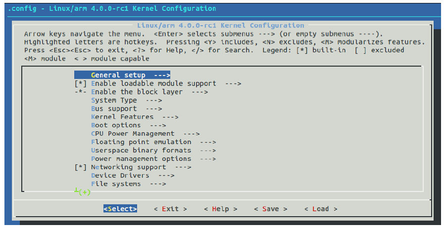
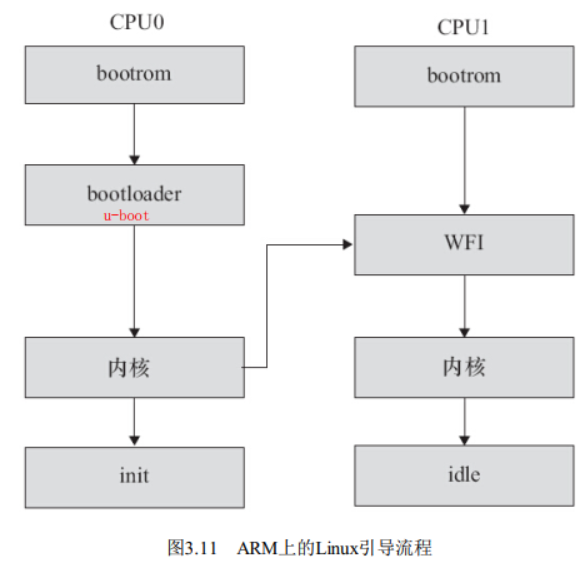

# 1 Linux内核编译

## 1.1 配置内核
使用下面命令中的其中一个配置内核：
```bash
make config       #（基于文本的最为传统的配置界面， 不推荐使用）
make menuconfig   #（基于文本菜单的配置界面，推荐）
make xconfig      #（要求 QT 被安装）
make gconfig      #（要求 GTK+ 被安装）

# 使用make config、 make menuconfig等命令后， 会生成一个.config配置文件， 记录哪些部分被编译入内核、 哪些部分被编译为内核模块。
```

内核配置包含的条目相当多， arch/arm/configs/**xxx_defconfig**文件包含了许多电路板的默认配置。 只需要运行`make ARCH=arm xxx_defconfig`就可以为xxx开发板配置内核。
linux内核的配置系统有以下3个部分：

- makefile：分布于各个目录，定义编译规则
- 配置文件Kconfig：给用户提供配置选择功能
- 配置工具：命令解释器，配置用户界面等，使用脚本语言完成


下图就是根据各层的Kconfig文件包含的条目生成的配置界面：




## 1.2 编译内核
命令如下：
```bash
make ARCH=arm zImage
make ARCH=arm modules
```

如果ARCH=arm已经作为环境变量导出， 则不再需要在make命令后书写该选项。
执行完上述命令后， 在源代码的根目录下会得到未压缩的内核映像vmlinux和内核符号表文件System.map， 在**arch/arm/boot/**目录下会得到压缩的内核映像zImage， 在内核各对应目录内得到选中的内核模块。

## 1.3 如何在内核中增加编译
在Linux内核中增加程序需要完成以下3项工作：

- 将编写的源代码复制到Linux内核源代码的**相应目录**中。
- 在目录的Kconfig文件中增加关于新源代码对应项目的**编译配置选项**。
- 在目录的Makefile文件中增加对新源代码的**编译条目**


### 内核Makefile语法
**目标定义**：定义哪些内容要作为模块编译， 哪些要编译并链接进内核

- `obj-y += foo.o`: 表示无条件编译foo.o并链接进内核，不受Kconfig文件控制
- `obj-$(CONfiG_ISDN) += isdn.o`: 由Kconfig文件配置，对应Kconfig中`CONFIG 变量`条目。可编译入内核， 可不编译， 也可编译为内核模块， 选项分别为“Y”、 “N”和“M”


除了具有obj-形式的目标以外， 还有lib-y library库、 hostprogs-y主机程序等目标，格式和上面一致。
**目录层次的迭代**：`obj-$(CONfiG_EXT2_FS) += ext2/`当CONFIG_EXT2_FS的值为y或m时， 编译系统将会把ext2目录列入向下迭代的目标中，继续查找下一级makefile。


### Kconfig配置选项语法
**配置选项格式**：大多数内核配置选项都对应Kconfig中的一个配置选项：

- **config**关键字： 定义新的配置选项， 之后的几行代码定义了该配置选项的属性。 配置选项的属性包括**类型、 数据范围、 输入提示、 依赖关系、 选择关系及帮助信息、 默认值**等
- 每个配置选项都必须指定类型， 类型包括bool、 tristate、 string、 hex和int， 其中tristate和string是两种基本类型，其他类型都基于这两种基本类型


```makefile
config MODVERSIONS
	bool "Module versioning support"  # 类型输输入提示，也可以使用下面格式，等价
	# bool
	# prompt "Networking support"
	help                              # help信息，靠文本缩进识别结束
		Usually, you have to use modules compiled with your kernel.
		Saying Y here makes it ...
	default <expr> [if <expr>]        # 默认值
	depends on (或者 requires) <expr>   # 依赖关系，多重依赖关系， 它们之间用“&&”间隔
	select <symbol> [if <expr>]       # 反向依赖关系
	range <symbol> <symbol> [if <expr>]  # 数据范围
```

**菜单结构**：配置选项在菜单树结构中的位置可由两种方法决定：

- 处于“menu”和“endmenu”之间的配置选项都会成为“Network device support”的子菜单，子菜单（config） 选项都会继承父菜单（menu） 的依赖关系
```makefile
menu "Network device support"
	depends on NET
config NETDEVICES
	…
endmenu
```


- 通过分析依赖关系生成菜单结构。 如果菜单项在一定程度上依赖于前面的选项， 它就能成为该选项的子菜单。 如果父选项为“n”， 子选项不可见； 如果父选项可见， 子选项才可见
```makefile
config MODULES
	bool "Enable loadable module support"
config MODVERSIONS   # MODVERSIONS直接依赖MODULES， 只有MODULES不为“n”时， 该选项才可见
	bool "Set version information on all module symbols"
	depends on MODULES
comment "module support disabled"
	depends on !MODULES
```

**引用新的Kconfig文件**：使用`source`关键字

## 1.4 内核引导
对于CPU0而言， bootrom会去引导bootloader， 而其他CPU则判断自己是不是CPU0， 进入WFI的状态等待CPU0来唤醒它。 CPU0引导bootloader， bootloader引导Linux内核， 在内核启动阶段， CPU0会发中断唤醒CPU1， 之后CPU0和CPU1都投入运行：
**对于ARm linux，需要把设备树文件dtb和内核镜像绑定在一次启动（参照QEMU启动命令）**。
zImage的内核镜像实际上是由没有压缩的解压算法和被压缩的内核组成， bootlaoder会首先解压内核镜像，然后启动init进程，之后整个系统启动，形成一个**进程树**。

# 2 内核简介和源码结构

## 2.1 微内核和宏内核
| 内核分类 | 原理 | 优势 | 劣势 |
| --- | --- | --- | --- |
| 单内核 | 整个内核都在一个大内核地址空间上运行 | 1. 简单；2. 高效：所有内核都在一个大的地址空间上，所以内核各个功能之间的调用和调用函数类似，几乎没有性能开销 | 一个功能的崩溃会导致整个内核无法使用 |
| 微内核 | 内核按功能被划分成各个独立的过程。每个过程独立的运行在自己的地址空间上 | 安全：内核的各种服务独立运行，一种服务挂了不会影响其他服务 | 内核各个服务之间的调用涉及进程间的通信，比较复杂且效率低 |


Linux的内核虽然是_基于单内核_的，但是经过这么多年的发展，也具备微内核的一些特征。主要有以下特征：

- 支持动态加载内核模块
- 支持对称多处理（SMP）
- 内核可以抢占（preemptive），允许内核运行的任务有优先执行的能力
- 不区分线程和进程


## 2.2 源码结构
| 目录 | 说明 | 目录 | 说明 |
| --- | --- | --- | --- |
| arch | 特定体系结构的代码 | block | 块设备I/O层 |
| crypo | 加密API | Documentation | 内核源码文档 |
| drivers | 设备驱动程序 | firmware | 使用某些驱动程序而需要的设备固件 |
| fs | VFS和各种文件系统 | include | 内核头文件 |
| init | 内核引导和初始化 | ipc | 进程间通信代码 |
| kernel | 像调度程序这样的核心子系统 | lib | 内核函数，库文件代码 |
| mm | 内存管理子系统和VM | net | 网络子系统 |
| samples | 示例，示范代码 | scripts | 编译内核所用的脚本 |
| security | Linux 安全模块，SElinux | sound | 语音子系统 |
| usr | 早期用户空间代码（所谓的initramfs） | tools | 在Linux开发中有用的工具 |
| virt | 虚拟化基础结构 |  |  |


## 2.3 内核编码风格
Linux有独特的编码风格， 在内核源代码下存在一个文件**Documentation/CodingStyle**， 进行了比较详细的描述。内核下的**scripts/checkpatch.pl**提供了1个检查代码风格的脚本（perl语言）。


# 3 内核开发特点

- **无标准C库**：为了保证内核的小和高效，内核开发中不能使用C标准库，所以连最常用的printf函数也没有，但是有个_printk函数_来代替。
- **使用GNU C**：推荐用gcc 4.4或以后的版本来编译内核，因为使用GNU C，所有内核中常使用GNU C中的一些扩展：
- **没有内存保护**：因为内核是最低层的程序，所以如果内核访问的非法内存，那么整个系统都会挂掉！！所以内核开发的风险比用户程序开发的风险要大。而且，**内核中的内存是不分页的**，每用一个字节的内存，物理内存就少一个字节。所以内核中使用内存一定要谨慎。
- **不使用浮点数**：内核不能完美的支持浮点操作，使用浮点数时，需要人工保存和恢复浮点寄存器及其他一些繁琐的操作。
- **内核栈容积小且固定**：内核栈的大小有编译内核时决定的，对于不用的体系结构，内核栈的大小虽然不一样，但都是固定的。查看内核栈大小的方法：`ulimit -a | grep "stack size"`
- **同步和并发**：Linux是多用户的操作系统，所以必须处理好同步和并发操作，防止因竞争而出现死锁。
- **可移植性**：Linux内核可用于不同的体系结构，支持多种硬件。所以开发时要时刻注意可移植性，尽量使用体系结构无关的代码。


# 4 GNU C扩展
在使用gcc编译C程序的时候， 如果使用“**-ansi–pedantic**”编译选项， 则会告诉编译器不使用GNU扩展语法.


## 4.1 内联函数
内联函数在编译时会在它被调用的地方展开，减少了函数调用的开销，性能较好。但是，频繁的使用内联函数也会使代码变长，从而在运行时占用更多的内存。

所以内联函数使用时最好要满足以下几点：

- 函数较小
- 会被反复调用
- 对程序的时间要求比较严格。


内联函数示例：`static inline void sample();`


## 4.2 内联汇编
内联汇编用于**偏近底层或对执行时间严格要求的地方**。示例如下：
```c
unsigned int low， high;
asm volatile("rdtsc" : "=a" (low)， "=d" (high));
/* low 和 high 分别包含64位时间戳的低32位和高32位 */
```


## 4.3 分支声明
如果能事先判断一个if语句时经常为真还是经常为假，那么可以用**unlikely和likely**来优化这段判断的代码。
```c
/* 如果error在绝大多数情况下为0(假) */
if (unlikely(error)) {
    /* ... */
}

/* 如果success在绝大多数情况下不为0(真) */
if (likely(success)) {
    /* ... */
}
```


## 4.4 零长度和变长数组
GNU C允许使用**零长度数组**， 在定义变长对象的头结构时， 这个特性非常有用：
```c
struct var_data {
	int len;
	char data[0];  //0长度数组
};
//char data[0]仅仅意味着程序中通过var_data结构体实例的data[index]成员可以访问len之后的第index个地址
//它并没有为data[]数组分配内存， 因此sizeof（struct var_data） =sizeof（int）
```

GNU C中也可以使用1个**变量定义数组**， 例如如下代码中定义的“double x[n]”：
```c
int main (int argc, char *argv[])
{
    int i, n = argc;
    double x[n];
    for (i = 0; i < n; i++)
    x[i] = i;
    return 0;
}
```


## 4.5 case支持区间范围表示
GNU C支持case x…y这样的语法， 区间[x， y]中的数都会满足这个case的条件：
```c
switch (ch) {
case '0'... '9': c -= '0';
	break;
case 'a'... 'f': c -= 'a' - 10;
	break;
case 'A'... 'F': c -= 'A' - 10;
	break;
}
```


## 4.6 语句表达式
GNU C把包含在**括号中的复合语句**看成是一个表达式， 称为语句表达式， 它可以出现在任何允许表达式的地方。 我们可以在语句表达式中使用原本只能在复合语句中使用的循环、 局部变量等：
```c
#define min_t(type,x,y) \
	( {type _ _x =(x);type _ _y = (y); _ _x<_ _y _ _x: _ _y; })
```


## 4.7 可变宏参数
标准C和GNU C都支持函数的可变参数，格式如下：
```c
int printf( const char *format [, argument]... )
```

GNU C还额外支持宏定义的可变参数：
```c
#define pr_debug(fmt,arg...) \
	printk(fmt,##arg)
//使用“##”是为了处理arg不代表任何参数的情况， 这时候， 前面的逗号就变得多余了。 使用“##”之后， GNU C预处理器会丢弃前面的逗号
```


## 4.8 特殊属性声明
GNU C允许声明函数、 变量和类型的特殊属性， 以便手动优化代码和定制代码检查的方法。 要指定一个声明的属性， 只需要在声明后添加`___attribute___`（（ATTRIBUTE） ） 。 其中ATTRIBUTE为属性说明， 如果存在多个属性， 则以逗号分隔。
GNU C支持noreturn、 format、 section、 aligned、 packed等十多个属性。:

- noreturn: 作用于函数， 表示该函数从不返回。 这会让编译器优化代码， 并消除不必要的警告信息。`# define ATTRIB_NORET __attribute__((noreturn))`
- format: 也用于函数， 表示该函数使用printf、 scanf或strftime风格的参数， 指定format属性可以让编译器根据格式串检查参数类型。`int printk(const char * fmt, ...) __attribute__ ((format (printf, 1, 2)));`
- unused: 作用于函数和变量， 表示该函数或变量可能不会用到， 这个属性可以避免编译器产生警告信息
- aligned: 用于变量、 结构体或联合体， 指定变量、 结构体或联合体的对齐方式， 以字节为单位
```c
struct example_struct {
    char a;
    int b;
    long c;
} __attribute__((aligned(4)));
```


- packed: 作用于变量和类型， 用于变量或结构体成员时表示使用最小可能的对齐， 用于枚举、 结构体或联合体类型时表示该类型使用最小的内存
```cql
struct example_struct {
    char a;
    int b;
    long c __attribute__((packed));
};
```


## 4.9 内建函数
GNU C提供了大量内建函数， 其中大部分是**标准C库函数的GNU C编译器内建版本**， 例如memcpy（） 等， 它们与对应的标准C库函数功能相同。不属于库函数的其他内建函数的命名通常以**__builtin**开始， 例如：__builtin_constant_p（EXP），__builtin_expect（EXP， C）。


## 4.10 do{} while(0) 语句
do{} while(0) 主要用于宏定义：`#define SAFE_FREE(p) do{ free(p); p = NULL;} while(0)`，保证宏定义的使用者能无编译错误地使用宏， 它不对其使用者做任何假设。
上面的宏用于下面的调用，不会出现问题，不加do/while则会导致else没有对应的if语句，导致编译错误：
```c
if(NULL != p)
	SAFE_DELETE(p)
else
	.../* do something */
```

