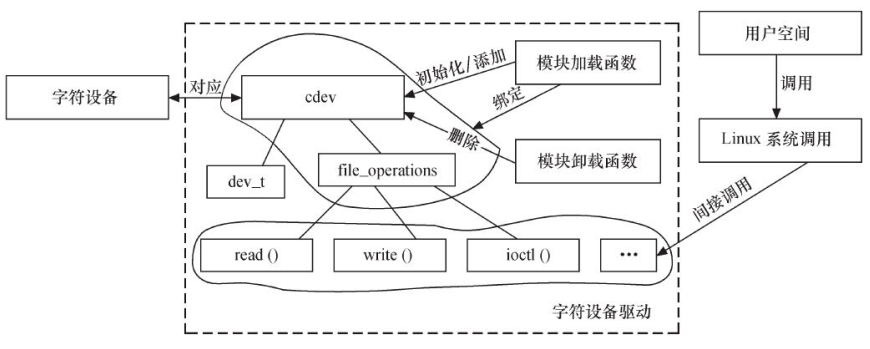

# 1 字符设备

## 1.1 Struct cdev
cdev结构体用于描述一个字符设备，定义如下：
```c
// include/linux/cdev.h
struct cdev {
	struct kobject kobj;                 //内嵌kobject对象
	struct module *owner;                //该设备所属的模块
	const struct file_operations *ops;   //读写字符设备的操作结构体, 驱动要实现的主要部分
	struct list_head list;
	dev_t dev;                           //设备号
	unsigned int count;
} __randomize_layout; //此宏表示结构体内成员不按顺序存储，防止被攻击
```
内核提供现成的函数用于操作struct cdev：
- void **cdev_init**(struct cdev *, struct file_operations *)：初始化cdev，绑定file_operation
- struct cdev ***cdev_alloc**(void)：动态申请cdev结构体
- void **cdev_put**(struct cdev *p);
- int **cdev_add**(struct cdev *, dev_t, unsigned)：模块加载时，向系统添加一个cdev，注册字符设备
- void **cdev_del**(struct cdev *)：模块卸载时，从系统删除一个cdev，注销字符设备

## 1.2 申请释放字符设备号
当我们要注册一个字符设备时，从cdev_add的参数可以看出，我们需要一个设备号。申请设备号可以用如下两个函数：
```c
//需要输入起始设备号
int register_chrdev_region(dev_t from, unsigned count, const char *name);
//用于随便申请设备号，没有起始设备号
int alloc_chrdev_region(dev_t *dev, unsigned baseminor, unsigned count, const char *name);
```
卸载字符设备时，需要同时释放字符设备号，函数如下：
```c
void unregister_chrdev_region(dev_t from, unsigned count);
```

## 1.3 用户空间内存的复制
由于内核空间和用户空间的内存地址不能直接读写，所以在驱动中操作数据时，**首先需要把数据在内核空间和用户空间进行复制。**相关函数定义如下：
```c
//include/linux/uaccess.h
static __always_inline unsigned long __must_check \
copy_from_user(void *to, const void __user *from, unsigned long n);

static __always_inline unsigned long __must_check
copy_to_user(void __user *to, const void *from, unsigned long n);
```

- 完全复制返回0
- 部分复制返回未被复制的字节数
- 复制失败返回负数


另外对于简单的数据类型(char、int等)，可以使用更简单的`put_user()`和`get_user()`。这四个函数内部都会先检查用户空间缓冲区的合法性，在操作数据。很多Linux漏洞就是忘了检查，所以**推荐使用这四个函数，避免自创新函数**。

# 2 字符驱动的结构和模板

## 2.1 字符设备驱动的结构


## 2.2 驱动模块加载和卸载
Linux的编码习惯：**定义一个和设备相关的结构体，包含cdev、私有数据、锁等信息，驱动代码操作这个自定义的结构体**。
```c
//设备相关结构体
struct xxx_dev_t {
    struct cdev cdev;
 	...
} xxx_dev;
//设备驱动模块加载函数
static int __init xxx_init(void)
{
	...
 	cdev_init(&xxx_dev.cdev, &xxx_fops); // 初始化 cdev，xxx_fops的定义看下面2.3
 	xxx_dev.cdev.owner = THIS_MODULE;
 	//获取字符设备号
 	if (xxx_major) {
 		register_chrdev_region(xxx_dev_no, 1, DEV_NAME);
 	} else {
 		alloc_chrdev_region(&xxx_dev_no, 0, 1, DEV_NAME);
 	}
 	ret = cdev_add(&xxx_dev.cdev, xxx_dev_no, 1); //注册设备
 	...
}
//设备驱动模块卸载函数
static void __exit xxx_exit(void)
{
 	unregister_chrdev_region(xxx_dev_no, 1); //释放占用的设备号
 	cdev_del(&xxx_dev.cdev); //注销设备
 	...
}
```

## 2.3 file_operations成员函数
file_operations是驱动和虚拟文件系统的接口，实现了它内部的成员函数，用户才能正常的使用系统调用操作设备。
```c
//定义文件操作的结构体，用于cdev_init
struct file_operations xxx_fops = {
	.owner = THIS_MODULE,
	.read = xxx_read,
	.write = xxx_write,
	.unlocked_ioctl= xxx_ioctl,
	...
};
//读设备 
ssize_t xxx_read(struct file *filp, char __user *buf, size_t count, loff_t*f_pos)
{
	...
	copy_to_user(buf, ..., ...);//把数据复制到用户空间
	...
}
//写设备 
ssize_t xxx_write(struct file *filp, const char __user *buf, size_t count, loff_t *f_pos)
{
	...
	copy_from_user(..., buf, ...);//先从用户空间复制数据，再处理
	...
}
//ioctl 函数 
long xxx_ioctl(struct file *filp, unsigned int cmd, unsigned long arg)
{
	...
	switch (cmd) {
	case XXX_CMD1:
		...
		break;
	case XXX_CMD2:
		...
		break;
	default://不能支持的命令 
		return - ENOTTY;
	}
	return 0;
}
```
### 指定函数指针的方式
根据不同的C语言标准,我们有两种方式书写给file_operations设置对应的函数指针:
* 新标准格式
```c
struct file_operations fops = {
    read: device_read,
    write: device_write,
    open: device_open,
    release: device_release
};
```
* C99格式
```c
struct file_operations fops = {
    .read = device_read,
    .write = device_write,
    .open = device_open,
    .release = device_release
};
```

### ioctl命令的定义
在file_opeartion的ioctl函数中，驱动需要支持IO控制命令，为了防止不同的设备驱动使用相同的命令号，建议**采用同一的Ioctl命令生成方式**。内核中也提供了一些预定义的IO控制命令（**定义在include/uapi/asm-generic/ioctls.h中**），这些命令会被内核处理，不会被设备驱动处理。
Linux建议的命令生成格式如下：

| 设备类型 | 序列号 | 方向 | 数据尺寸 |
| :---: | :---: | :---: | :---: |
| 8位 | 8位 | 2位 | 13/14位 |

- 设备类型：内核中**iocrl_bumber.txt**文件给出了一些推荐和已经被使用的设备类型，新的类型需要避免重复。
- 方向：从app角度看数据传送的方向，分为如下四种，可以用内核提供的宏函数（#include <linux/ioctl.h>)生成命令号
   - _IOC_NONE：无数据传输，对应生成函数`_IO(type,nr)`
   - _IOC_READ：读，对应`_IOR(type,nr,size)`
   - _IOC_WRITE：写，对应`_IOW(type,nr,size)`
   - _IOC_READ_LOC_WRITE：双向，对应`_IOWR(type,nr,size)`
- 数据尺寸：用户数据的大小


使用示例：
```c
#define GLOBALMEM_MAGIC 'g'
#define MEM_CLEAR _IO(GLOBALMEM_MAGIC,0)
```

# 3 模拟开发示例
```c
//假设有个globalmem的字符设备，如何编写字符设备驱动
#include <linux/module.h>
#include <linux/fs.h>
#include <linux/init.h>
#include <linux/cdev.h>
#include <linux/uaccess.h>
#include <linux/slab.h>
#include <linux/ioctl.h>

//定义宏
#define GLOBALMEM_SIZE 0X1000
#define GLOBALMEM_MAGIC 'g'
#define MEM_CLEAR _IO(GLOBALMEM_MAGIC,0)
#define GLOBALMEM_MAJOR 230 //默认主设备号

//添加模块参数，主设备号
static int globalmem_major = GLOBALMEM_MAJOR;
module_param(globalmem_major, int, S_IRUGO);

//定义字符驱动结构体
struct globalmem_dev
{
    struct cdev cdev;//系统字符设备结构体
    unsigned char mem[GLOBALMEM_SIZE];//模拟设备占用的内存
};
struct globalmem_dev* globalmem_devp;//指针，指向申请的设备空间

//file_operation成员函数
static int globalmem_open(struct inode* inode, struct file* filp)
{
    filp->private_data = globalmem_devp;
    return 0;
}
static int globalmem_release(struct inode* inode, struct file* filp)
{
    return 0;//释放文件，没什么特殊操作
}
static ssize_t globalmem_read(struct file* filp, char __user * buf, size_t size, loff_t* ppos)
{
    unsigned long p = *ppos;
    unsigned int count = size;
    int ret = 0;
    //文件的私有数据一般指向设备结构体,在open函数中设置
    struct globalmem_dev* dev = filp->private_data;
    
    if (p >= GLOBALMEM_SIZE)
        return 0;//偏移位置不能超过空间容量

    if (count > (GLOBALMEM_SIZE - p))
        count = GLOBALMEM_SIZE - p;//字节数不能超过容量

    if (copy_to_user(buf, dev->mem + p, count))//复制内容到用户空间
    {
        ret = -EFAULT;
    }
    else
    {
        *ppos += count;
        ret = count;
        printk(KERN_INFO"read %u bytes from %lu", count, p);
    }
    return ret;
}
static ssize_t globalmem_write(struct file* filp, const char __user * buf, size_t size, loff_t* ppos)
{
    unsigned long p = *ppos;
    unsigned int count = size;
    int ret = 0;
    struct globalmem_dev* dev = filp->private_data;

    if (p >= GLOBALMEM_SIZE)
        return 0;//偏移位置不能超过空间容量

    if (count > (GLOBALMEM_SIZE - p))
        count = GLOBALMEM_SIZE - p;//字节数不能超过容量

    if (copy_from_user(dev->mem + p, buf, count))//从用户空间复制内容
    {
        ret = -EFAULT;
    }
    else
    {
        *ppos += count;
        ret = count;
        printk(KERN_INFO"write %u bytes from %lu", count, p);
    }
    return ret;
}
static loff_t globalmem_llseek(struct file* filp, loff_t offset, int orig)
{
    loff_t ret = 0;

    switch(orig)
    {
        case 0://从文件开头seek
            if (offset < 0 || (unsigned int)offset > GLOBALMEM_SIZE)
            {
                ret = -EINVAL;
                break;
            }
            filp->f_pos = (unsigned int)offset;//设置文件对象新位置
            ret = filp->f_pos;
            break;
        case 1://从文件当前位置seek
            if ((filp->f_pos + offset) > GLOBALMEM_SIZE || (filp->f_pos + offset) < 0)
            {
                ret = -EINVAL;
                break;
            }
            filp->f_pos += (unsigned int)offset;//设置文件对象新位置
            ret = filp->f_pos;
            break;
        default:
            ret = -EINVAL;
            break;
    }
    return ret;
}
static long globalmem_ioctl(struct file* filp, unsigned int cmd, unsigned long arg)
{
    struct globalmem_dev* dev = filp->private_data;

    switch(cmd)
    {
        case MEM_CLEAR: //本示例里我们只支持clear命令
            memset(dev->mem, 0, GLOBALMEM_SIZE);
            printk(KERN_INFO"globalmem is set to zero\n");
            break;
        default:
            return -EINVAL;
    }
    return 0;
}
//定义文件操作结构体
static const struct file_operations globalmem_fops = 
{
    .owner = THIS_MODULE,
    .llseek = globalmem_llseek,
    .read = globalmem_read,
    .write = globalmem_write,
    .unlocked_ioctl = globalmem_ioctl,
    .open = globalmem_open,
    .release = globalmem_release
};

//驱动模块加载函数
static void globalmem_setup_cdev(struct globalmem_dev* dev, int index)
{
    int err, devno = MKDEV(globalmem_major, index); //获得dev_t对象
    cdev_init(&dev->cdev, &globalmem_fops);//初始化设备
    dev->cdev.owner = THIS_MODULE;
    //注册设备
    err = cdev_add(&dev->cdev, devno, 1);
    if (err)
    {
        printk(KERN_NOTICE"Error %d adding globalmem %d", err, index);
    }
}
static int __init globalmem_init(void)
{
    int ret;
    dev_t devno = MKDEV(globalmem_major, 0);
    //申请设备号
    if (globalmem_major)
    {
        ret = register_chrdev_region(devno, 1, "globalmem");
    }
    else
    {
        ret = alloc_chrdev_region(&devno, 0, 1, "globalmem");
        globalmem_major = MAJOR(devno);
    }

    if (ret < 0)
        return ret;

    globalmem_devp = kzalloc(sizeof(struct globalmem_dev), GFP_KERNEL);
    if (!globalmem_devp)
    {
        //空间申请失败
        ret = -ENOMEM;
        goto fail_malloc;
    }

    globalmem_setup_cdev(globalmem_devp, 0);
    return 0;

fail_malloc:
    unregister_chrdev_region(devno, 1);
    return ret;
}
module_init(globalmem_init);

//驱动模块卸载函数
static void __exit globalmem_exit(void)
{
    cdev_del(&globalmem_devp->cdev);//注销设备
    kfree(globalmem_devp);
    unregister_chrdev_region(MKDEV(globalmem_major, 0), 1);//释放设备号
}
module_exit(globalmem_exit);

//模块声明
MODULE_AUTHOR("BARRET REN <barret.ren@outlook.com>");
MODULE_LICENSE("GPL v2");
MODULE_DESCRIPTION("A driver for virtual globalmem charactor device");
MODULE_ALIAS("globalmem device driver");
```
运行结果如下：
```bash
# 加载模块后，可以看到已经加载230的设备
$ cat /proc/devices
Character devices:
  1 mem
  4 /dev/vc/0
...
226 drm
230 globalmem
241 hidraw
242 aux
# 创建设备号位230，0的设备
$ sudo mknod /dev/globalmem c 230 0
$ sudo chmod 777 /dev/globalmem

$ echo "hello world" > /dev/globalmem  # 写入数据
$ cat /dev/globalmem
hello world              #刚才的输入可以打印出来，读写没有问题
```

