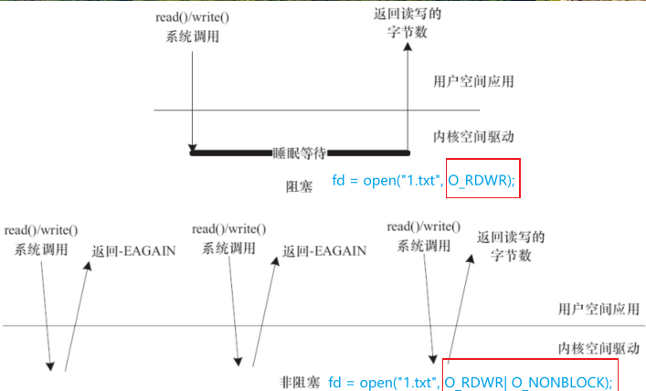
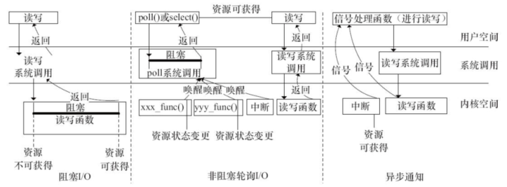
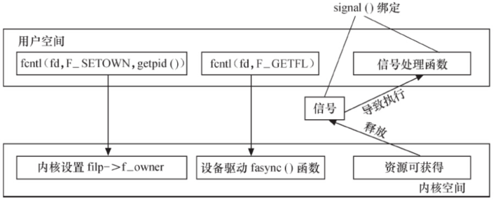
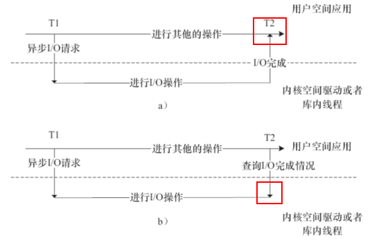

# 1 等待队列与阻塞IO
**阻塞和非阻塞I/O**是访问设备的两种方式，驱动程序应该灵活的支持这两种方式。两者的概念如下：

- **阻塞：**当进程无法获得资源时，挂起进程直到所需的条件满足之后再进行操作
- **非阻塞：**当进程无法获得资源时，要么放弃，要么不停的查询，直到条件满足


在Linux驱动程序中，可以使用等待队列(Wait Queue)来记录挂起的进程并实现阻塞进程的唤醒。

## 1.1 等待队列相关函数
linux内核提供了如下关于等待队列的操作，头文件`#include <linux/wait.h>`：
```c
//1 定义等待队列head
wait_queue_head_t my_queue;
//2 初始化head
init_waitqueue_head(&my_queue);
//3 定义并初始化一个名为name的元素
DECLARE_WAITQUEUE(name, tsk);

//4 添加、移除等待队列
void add_wait_queue(wait_queue_head_t *q, wait_queue_t *wait);
void remove_wait_queue(wait_queue_head_t *q, wait_queue_t *wait);

//5 等待条件，条件满足后队列头部进程被唤醒
wait_event(queue, condition); //不能被中断打断
wait_event_interruptible(queue, condition); //可以被中断打断
wait_event_timeout(queue, condition, timeout);
wait_event_interruptible_timeout(queue, condition, timeout);
//6 唤醒队列所有进程
void wake_up(wait_queue_head_t *queue);
void wake_up_interruptible(wait_queue_head_t *queue);

//7 挂起所有进程
void sleep_on(wait_queue_head_t *q );
void interruptible_sleep_on(wait_queue_head_t *q );
```

## 1.2 在驱动中如何使用
我们用等待队列为第五节的字符驱动添加了阻塞挂起的功能。

- 读进程会在有数据的时候才读取数据，没有数据的时候一直循环，也允许其他进程挂起读进程
- 写进程在数据内存有空闲的时候写入数据，数据内存满的时候一直循环等待，也允许其他进程观其写进程
```c
//在驱动6互斥量globalmem的基础上，把驱动中的mem内存变成FIFO
//只有FIFNO有数据时，读进程才能把数据读出来并清空
//只有FIFO不满时，写进程才能写入数据
#include <linux/module.h>
#include <linux/fs.h>
#include <linux/init.h>
#include <linux/cdev.h>
#include <linux/uaccess.h>
#include <linux/slab.h>
#include <linux/ioctl.h>
#include <linux/wait.h>
#include <linux/sched/signal.h>

//定义宏
#define GLOBALFIFO_SIZE 0X1000
#define globalfifo_MAGIC 'g'
#define MEM_CLEAR _IO(globalfifo_MAGIC,0)
#define globalfifo_MAJOR 231 //默认主设备号

//添加模块参数，主设备号
static int globalfifo_major = globalfifo_MAJOR;
module_param(globalfifo_major, int, S_IRUGO);

//定义字符驱动结构体
struct globalfifo_dev
{
    struct cdev cdev;//系统字符设备结构体
    unsigned char mem[GLOBALFIFO_SIZE];//模拟设备占用的内存
    struct mutex mutex; //增加互斥量
    //添加阻塞队列
    wait_queue_head_t r_wait; //读队列
    wait_queue_head_t w_wait; //写队列
    unsigned int current_len; //当前mem中数据长度
};
struct globalfifo_dev* globalfifo_devp;//指针，指向申请的设备空间

//file_operation成员函数
static int globalfifo_open(struct inode* inode, struct file* filp)
{
    filp->private_data = globalfifo_devp;
    return 0;
}
static int globalfifo_release(struct inode* inode, struct file* filp)
{
    return 0;//释放文件，没什么特殊操作
}
static ssize_t globalfifo_read(struct file* filp, char __user * buf, size_t size, loff_t* ppos)
{
    int ret = 0;
    unsigned int count = size;
    //文件的私有数据一般指向设备结构体,在open函数中设置
    struct globalfifo_dev* dev = filp->private_data;
    //声明一个阻塞队列元素
    DECLARE_WAITQUEUE(wait, current);
    
    //获取互斥量
    mutex_lock(&(dev->mutex));
    //添加元素到读队列
    add_wait_queue(&(dev->r_wait), &wait);

    while(dev->current_len == 0)//等待有数据可读
    {
        if (filp->f_flags & O_NONBLOCK)
        {
            ret = -EAGAIN;//非阻塞模式，直接返回，不循环等待
            goto out;
        }
        //如果没有数据可读，则挂起读进程
        __set_current_state(TASK_INTERRUPTIBLE);//标记进程浅度睡眠，可抢占
        mutex_unlock(&(dev->mutex));//释放互斥量

        schedule();
        if (signal_pending(current))
        {
            ret = -ERESTARTSYS;
            goto out2;
        }

        mutex_lock(&(dev->mutex));
    }

    if (count > dev->current_len)
        count = dev->current_len;

    if (copy_to_user(buf, dev->mem, count))//复制内容到用户空间
    {
        ret = -EFAULT;
        goto out;
    }
    else
    {
        memcpy(dev->mem, dev->mem + count, dev->current_len - count);
        dev->current_len -= count;
        printk(KERN_INFO"read %u bytes, current_len:%d\n", count, dev->current_len);
        wake_up_interruptible(&(dev->w_wait));//读出了数据，可能有数据要写，唤醒写进程队列
        ret = count;
    }
out:
    mutex_unlock(&(dev->mutex));
out2:
    remove_wait_queue(&(dev->r_wait), &wait);
    set_current_state(TASK_RUNNING);

    return ret;
}
static ssize_t globalfifo_write(struct file* filp, const char __user * buf, size_t size, loff_t* ppos)
{
    unsigned int count = size;
    int ret = 0;
    struct globalfifo_dev* dev = filp->private_data;
    //声明一个阻塞队列元素
    DECLARE_WAITQUEUE(wait, current);

    //获取互斥量
    mutex_lock(&(dev->mutex));
    add_wait_queue(&(dev->w_wait), &wait);
    while (dev->current_len == GLOBALFIFO_SIZE)
    {
        if (filp->f_flags & O_NONBLOCK)
        {
            ret = -EAGAIN;
            goto out;
        }
        //如果数据区时满的，则挂起写进程
        __set_current_state(TASK_INTERRUPTIBLE);
        mutex_unlock(&(dev->mutex));

        schedule();
        if (signal_pending(current))
        {
            ret = -ERESTARTSYS;
            goto out2;
        }
        mutex_lock(&(dev->mutex));
    }

    if (count > (GLOBALFIFO_SIZE - dev->current_len))
        count = GLOBALFIFO_SIZE - dev->current_len;

    if (copy_from_user(dev->mem + dev->current_len, buf, count))//从用户空间复制内容
    {
        ret = -EFAULT;
        goto out;
    }
    else
    {
        dev->current_len += count;
        ret = count;
        printk(KERN_INFO"write %u bytes, current_len:%d\n", count, dev->current_len);
        wake_up_interruptible(&(dev->r_wait));
        ret = count;
    }
out:
    mutex_unlock(&(dev->mutex));
out2:
    remove_wait_queue(&(dev->w_wait), &wait);
    set_current_state(TASK_RUNNING);

    return ret;
}
static loff_t globalfifo_llseek(struct file* filp, loff_t offset, int orig)
{
    loff_t ret = 0;

    switch(orig)
    {
        case 0://从文件开头seek
            if (offset < 0 || (unsigned int)offset > GLOBALFIFO_SIZE)
            {
                ret = -EINVAL;
                break;
            }
            filp->f_pos = (unsigned int)offset;//设置文件对象新位置
            ret = filp->f_pos;
            break;
        case 1://从文件当前位置seek
            if ((filp->f_pos + offset) > GLOBALFIFO_SIZE || (filp->f_pos + offset) < 0)
            {
                ret = -EINVAL;
                break;
            }
            filp->f_pos += (unsigned int)offset;//设置文件对象新位置
            ret = filp->f_pos;
            break;
        default:
            ret = -EINVAL;
            break;
    }
    return ret;
}
static long globalfifo_ioctl(struct file* filp, unsigned int cmd, unsigned long arg)
{
    struct globalfifo_dev* dev = filp->private_data;

    switch(cmd)
    {
        case MEM_CLEAR: //本示例里我们只支持clear命令
            //获取互斥量
            mutex_lock(&(dev->mutex));
            memset(dev->mem, 0, GLOBALFIFO_SIZE);
            //释放互斥量
            mutex_unlock(&(dev->mutex));
            printk(KERN_INFO"globalfifo is set to zero\n");
            break;
        default:
            return -EINVAL;
    }
    return 0;
}
//定义文件操作结构体
static const struct file_operations globalfifo_fops = 
{
    .owner = THIS_MODULE,
    .llseek = globalfifo_llseek,
    .read = globalfifo_read,
    .write = globalfifo_write,
    .unlocked_ioctl = globalfifo_ioctl,
    .open = globalfifo_open,
    .release = globalfifo_release
};

//驱动模块加载函数
static void globalfifo_setup_cdev(struct globalfifo_dev* dev, int index)
{
    int err, devno = MKDEV(globalfifo_major, index); //获得dev_t对象
    cdev_init(&dev->cdev, &globalfifo_fops);//初始化设备
    dev->cdev.owner = THIS_MODULE;
    //注册设备
    err = cdev_add(&dev->cdev, devno, 1);
    if (err)
    {
        printk(KERN_NOTICE"Error %d adding globalfifo %d", err, index);
    }
}
static int __init globalfifo_init(void)
{
    int ret;
    dev_t devno = MKDEV(globalfifo_major, 0);
    //申请设备号
    if (globalfifo_major)
    {
        ret = register_chrdev_region(devno, 1, "globalfifo");
    }
    else
    {
        ret = alloc_chrdev_region(&devno, 0, 1, "globalfifo");
        globalfifo_major = MAJOR(devno);
    }

    if (ret < 0)
        return ret;

    globalfifo_devp = kzalloc(sizeof(struct globalfifo_dev), GFP_KERNEL);
    if (!globalfifo_devp)
    {
        //空间申请失败
        ret = -ENOMEM;
        goto fail_malloc;
    }

    globalfifo_setup_cdev(globalfifo_devp, 0);
    //初始化互斥量
    mutex_init(&(globalfifo_devp->mutex));
    //初始化阻塞队列
    init_waitqueue_head(&(globalfifo_devp->r_wait));
    init_waitqueue_head(&(globalfifo_devp->w_wait));
    return 0;

fail_malloc:
    unregister_chrdev_region(devno, 1);
    return ret;
}
module_init(globalfifo_init);

//驱动模块卸载函数
static void __exit globalfifo_exit(void)
{
    cdev_del(&globalfifo_devp->cdev);//注销设备
    kfree(globalfifo_devp);
    unregister_chrdev_region(MKDEV(globalfifo_major, 0), 1);//释放设备号
}
module_exit(globalfifo_exit);

//模块声明
MODULE_AUTHOR("BARRET REN <barret.ren@outlook.com>");
MODULE_LICENSE("GPL v2");
MODULE_DESCRIPTION("A driver for virtual globalfifo charactor device");
MODULE_ALIAS("globalfifo device driver");
```
上面代码作为模块加载后内核后，运行结果如下：
```bash
# 加载模块后，可以看到已经加载231的设备
$ cat /proc/devices
Character devices:
  1 mem
  4 /dev/vc/0
...
226 drm
231 globalfifo
241 hidraw
242 aux
# 创建设备号位231，0的设备
$ sudo mknod /dev/globalfifo c 231 0
$ sudo chmod 666 /dev/globalfifo

# 打开一个shell，一直运行cat命令，会一直等待
$ cat /dev/globalfifo
# 写入数据后，cat命令会自动输出数据
$ echo "hello world" > /dev/globalfifo
```

# 2 轮询与非阻塞IO
使用非阻塞I/O的应用程序通常会使用select和poll()系统调用查询是否可对设备进行无阻塞的访问。select()和poll()系统调用最终会使设备驱动中f**ile_operations的poll()函数被执行**。

## 2.1 App层如何实现轮询
Linux系统调用提供了**select()、poll()、epoll()**三种轮询方法。一般来说：

- 当涉及的fd数量较少的时候，使用select和poll是合适的
- 如果涉及的fd很多，如在大规模并发的服务器中侦听许多socket的时候，适合选用epoll


三个函数的定义如下：

## 2.2 驱动如何支持轮询
在驱动中，需要实现**file_operations文件操作中的poll函数**：`__poll_t (*poll) (struct file *, struct poll_table_struct *);`
第1个参数为file结构体指针，第2个参数为轮询表指针。这个函数应该进行两项工作：

1. 对可能引起设备文件状态变化的等待队列**调用poll_wait()函数**，将对应的等待队列头部添加到poll_table中
   1. poll_wait()函数所做的工作是把当前进程添加到wait参数指定的等待列表(poll_table)中，实际作用是让唤醒参数queue对应的等待队列可以唤醒因select/poll/epoll而睡眠的进程。poll_wait函数定义为
```c
#include <linux/poll.h>
static inline void poll_wait(struct file * filp, wait_queue_head_t * wait_address, poll_table *p);
```

2. 返回设备资源的可获取状态，即POLLIN、POLLOUT、POLLPRI、POLLERR、POLLNVAL等宏的位“或”结果，每个宏的含义都表明设备的一种状态


poll的实现模板如下：
```c
static unsigned int xxx_poll(struct file *filp, poll_table *wait)
{
    unsigned int mask = 0;
    struct xxx_dev *dev = filp->private_data; /* 获得设备结构体指针 */

    //...
    poll_wait(filp, &dev->r_wait, wait); /* 加入读等待队列 */
    poll_wait(filp, &dev->w_wait, wait); /* 加入写等待队列 */

     if (...) /* 可读 */
        mask |= POLLIN | POLLRDNORM; /* 标示数据可获得（对用户可读） */

     if (...) /* 可写 */
        mask |= POLLOUT | POLLWRNORM; /* 标示数据可写入 */
     //...
     return mask；
}
```

## 2.3 驱动中实现poll示例
```c
static unsigned int globalfifo_poll(struct file* filp, poll_table* wait)
{
    unsigned int mask = 0;
    struct globalfifo_dev* dev = filp->private_data;

    mutex_lock(&(dev->mutex));//获取互斥量
    //将设备中的读写队列加入到poll_table中，这样设备读写进程可以唤醒select中的进程
    poll_wait(filp, &(dev->r_wait), wait);
    poll_wait(filp, &(dev->w_wait), wait);

    if (dev->current_len != 0)
        mask |= POLLIN | POLLRDNORM; //有数据，返回可读状态

    if (dev->current_len != GLOBALFIFO_SIZE)
        mask |= POLLOUT | POLLWRNORM; //数据区未满，返回可写状态

    mutex_unlock(&(dev->mutex));
    return mask;
}
```
我们可以写一个select的应用程序，轮询我们自定义的驱动设备是否可读可写：
```c
//使用select测试一下编写的poll_golbalfifo驱动的poll函数是否OK
#include <stdio.h>
#include <sys/select.h>
#include <sys/types.h>
#include <sys/stat.h>
#include <fcntl.h>
#include <sys/ioctl.h>

#define FIFO_CLEAR 0x1
#define BUFFER_LEN 20

void main(void)
{
    int fd, num;
    char rd_ch[BUFFER_LEN];
    fd_set rfds, wfds; /* 读 / 写文件描述符集 */

    /* 以非阻塞方式打开 /dev/globalfifo 设备文件 */
    fd = open("/dev/globalfifo", O_RDONLY | O_NONBLOCK);
    if (fd != -1) 
    {
        /* FIFO 清 0 */
        if (ioctl(fd, FIFO_CLEAR, 0) < 0)
            printf("ioctl command failed\n");

        while (1)
        {
            FD_ZERO(&rfds);
            FD_ZERO(&wfds);
            FD_SET(fd, &rfds);
            FD_SET(fd, &wfds);

            select(fd + 1, &rfds, &wfds, NULL, NULL);
            /* 数据可获得 */
            if (FD_ISSET(fd, &rfds))
                printf("Poll monitor:can be read\n");
            /* 数据可写入 */
            if (FD_ISSET(fd, &wfds))
                printf("Poll monitor:can be written\n");
        }
    }
    else
    {
        printf("Device open failure\n");
    }
}
```
当驱动模块被加载后，运行测试程序，会不断输出Poll monitor:can be written；当写入一些数据后，会打印Poll monitor:can be written和Poll monitor:can be read；当数据写满时，只打印Poll monitor:can be read。

# 3 信号与异步通知
异步通知的意思是：一旦设备就绪，主动通知App，这样就不需要使用阻塞和非阻塞方式一直查询设备状态了（类似于硬件的中断）。三者的区别如下：

## 3.1 信号类型
异步通知使用Linux信号来实现，Linux支持的信号可以查看：设置信号对应的处理函数，两种方式：

- `void (*signal(int signum, void (*handler))(int)))(int);`，handler可以有三种配置：
   - SIG_IGN：忽略该信号
   - SIG_DFL：系统默认处理行为
   - 自定义函数：自定义处理
- `int sigaction(int signum,const struct sigaction *act,struct sigaction *oldact));`，
   - 参数1：信号值，除SIGKILL和SIGSTOP之外的信号
   - 参数2：结构体sigaction只指定处理函数
   - 参数3：保存原来信号的处理函数

## 3.2 App层如何接收信号
为了能在用户空间中处理一个设备释放的信号，它必须完成3项工作：

1. **通过F_SETOWN控制命令设置设备文件的拥有者为本进程**， 这样从设备驱动发出的信号才能被本进程接收到
1. **通过F_SETFL控制命令设置设备文件以支持FASYNC**，即异步通知模式
1. 通过signal()函数连接信号和信号处理函数


应用层处理信号举例如下：
```c
//测试字符驱动的异步通知功能，接受SIGIO信号处理
#include <stdio.h>
#include <signal.h>
#include <sys/types.h>
#include <sys/stat.h>
#include <fcntl.h>
#include <unistd.h>

void signal_handler(int signo)
{
    printf("release a ginal from globalfifo, signum:%d\n", signo);
}

int main()
{
    int fd,flags;
    fd = open("/dev/globalfifo", O_RDWR, S_IRUSR | S_IWUSR);
    if (fd != -1)
    {
        //注册信号处理函数
        signal(SIGIO, signal_handler);
        //设置本进程为fd的拥有者，这样内核才能把信号发到此进程
        fcntl(fd, F_SETOWN, getpid());
        flags = fcntl(fd, F_GETFL);//获取设备当前配置
        fcntl(fd, F_SETFL, flags | FASYNC);//添加异步配置

        while(1)
            sleep(100);
    }
    else
        printf("open device failed\n");
    return 0;
}
```

## 3.3 驱动如何发出信号
为了使设备支持异步通知机制，驱动程序中涉及3项工作：

1. 支持**F_SETOWN命令**，能在这个控制命令处理中设置filp->f_owner为对应进程ID。不过此项工作已由内核完成， 设备驱动无须处理
1. 支持**F_SETFL命令**的处理，每当FASYNC标志改变时，驱动程序中的fasync()函数将得以执行。**驱动中应该实现fasync()函数**
   1. `int (*fasync) (int, struct file *, int);`
3. 在设备资源可获得时， **调用kill_fasync()函数激发相应的信号**（<fcntl.h>)
   1. `void kill_fasync(struct fasync_struct **fp, int sig, int band)`


 驱动的三个工作和App层是相互对应的，关系如下：
```c
//设备结构体添加异步结构体
struct globalfifo_dev
{
    struct cdev cdev;//系统字符设备结构体
    unsigned char mem[GLOBALFIFO_SIZE];//模拟设备占用的内存
    struct mutex mutex; //增加互斥量
    //添加阻塞队列
    wait_queue_head_t r_wait; //读队列
    wait_queue_head_t w_wait; //写队列
    unsigned int current_len; //当前mem中数据长度
    struct fasync_struct* async_queue;//异步结构体指针
};

//添加file_operations的fasync函数：
static int globalfifo_fasync(int fd, struct file* filp, int mode)
{
    struct globalfifo_dev* dev = filp->private_data;
    return fasync_helper(fd, filp, mode, &(dev->async_queue));
}
//添加到file_operations中：

//释放设备时，要把文件描述符从异步通知列表中移除
static int globalfifo_release(struct inode* inode, struct file* filp)
{
    globalfifo_fasync(-1, filp, 0);//将文件filp从异步通知列表删除
    return 0;//释放文件，没什么特殊操作
}
//在需要的地方发送信号到应用层
if (dev->async_queue)
{
	printk(KERN_DEBUG"driver send SIGIO\n");
	kill_fasync(&(dev->async_queue), SIGIO, POLL_IN);
 }
```

# 4 异步IO
应用程序发起I/O动作后，直接开始执行，并不等待I/O结束，它要么过一段时间来查询之前的I/O请求完成情况，要么I/O请求完成了会自动被调用与I/O完成绑定的回调函数。

## 4.1 glibc的AIO函数

## 4.2 内核AIO函数
内核AIO提供了如下的函数：
```c
int io_setup(int maxevents, io_context_t *ctxp);
int io_destroy(io_context_t ctx);
int io_submit(io_context_t ctx, long nr, struct iocb *ios[]);//下发读写请求
int io_cancel(io_context_t ctx, struct iocb *iocb, struct io_event *evt);
int io_getevents(io_context_t ctx_id, long min_nr, long nr, struct io_event *events, struct timespec *timeout);
void io_set_callback(struct iocb *iocb, io_callback_t cb);//等待IO完成事件
void io_prep_pwrite(struct iocb *iocb, int fd, void *buf, size_t count, long long offset);//AIO完成时的回调函数
void io_prep_pread(struct iocb *iocb, int fd, void *buf, size_t count, long long offset);
void io_prep_pwritev(struct iocb *iocb, int fd, const struct iovec *iov, int iovcnt, long long offset);
void io_prep_preadv(struct iocb *iocb, int fd, const struct iovec *iov, int iovcnt, long long offset);
```
AIO一般由内核空间的通用代码处理，对于块设备和网络设备而言，一般在Linux核心层的代码已经解决。**字符设备驱动一般不需要实现AIO支持**。
