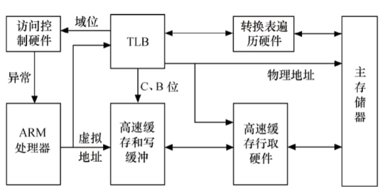
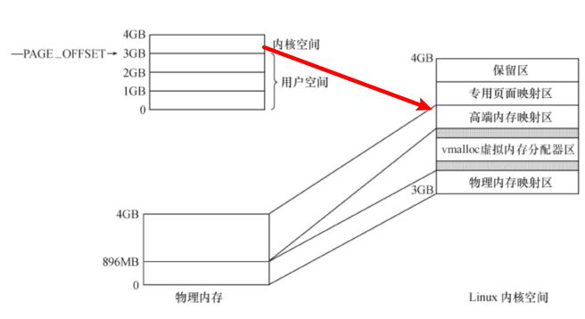
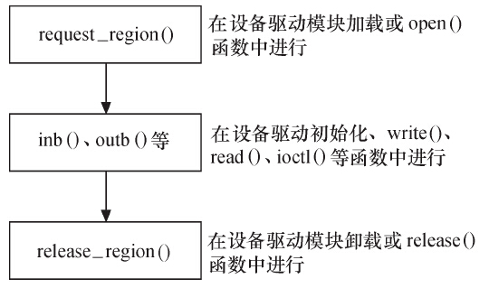
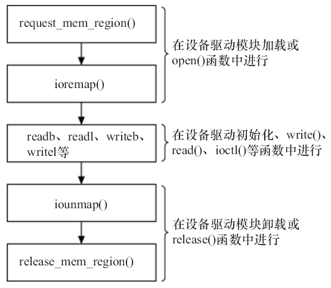

# 1 处理器MMU
高性能处理器一般会提供一个内存管理单元（MMU） ，该单元辅助操作系统进行内存管理，提供**虚拟地址和物理地址的映射、内存访问权限保护和Cache缓存控制**等硬件支持。

- ** TLB（Translation Lookaside Buffer）**：即转换旁路缓存，MMU的核心部件，它**缓存少量的虚拟地址与物理地址的转换关系**，是转换表的Cache，因此也经常被称为“快表”。
- **TTW（Translation Table walk）**：即转换表漫游，当TLB中没有缓冲对应的地址转换关系时， 需要通过对内存中转换表（大多数处理器的转换表为多级页表）的访问来获得虚拟地址和物理地址的对应关系。 TTW成功后， 结果应写入TLB中。


下图为ARM处理器的MMU结构（powerPC、mips等处理器也有类似的操作）：

# 2 Linux内存管理

## 2.1 用户空间和内核空间


- 每个进程的用户空间无安全独立，互不相干，进程有不同的页表
- 空格空间时固定的，被所有进程共享

## 2.2 用户空间内存申请
用户空间使用如下两个函数进行动态的内存申请和释放：
```c
void *malloc(size_t size);//会调用brk()和mmap()两个系统调用
void free(void *ptr);
```
Linux内核总是采用**按需调页**（Demand Paging），当malloc（）返回的时候，虽然是成功返回，但是内核并没有真正给这个进程内存，这个时候如果去读申请的内存，内容全部是0，这个页面的映射是只读的。**只有当写到某个页面的时候，内核才在页错误后，真正把这个页面给这个进程**。

## 2.3 内核空间内存申请

# 3 IO访问
设备通常会提供**一组寄存器**来控制设备、读写设备和获取设备状态，即控制寄存器、数据寄存器和状态寄存器。

- 当外部寄存器或内存映射到IO空间时，通常被称为**I/O端口**；
- 当外部寄存器或内存映射到内存空间时， 对应的内存空间被称为**I/O内存**。
> **注：对ARM体系来说，没有IO空间的概念，所以外接设备寄存器访问都需要使用IO内存。**


## 3.1 IO端口访问函数
IO端口访问的流程如下：
```c
//IO端口申请和释放
#include <linux/ioport.h>
#define request_region(start,n,name) __request_region(&ioport_resource, (start), (n), (name), 0)
#define release_region(start,n)	__release_region(&ioport_resource, (start), (n))

//读写字节端口8bit
#include <asm/io.h>
static inline unsigned int inb(unsigned long port);
static inline void outb(unsigned char val, unsigned long port)
//读写16bit端口
static inline unsigned int inw(unsigned long port);
static inline void outw(unsigned short val, unsigned long port);
//读写32bit端口
static inline unsigned int inl(unsigned long port);
static inline void outl(unsigned int val, unsigned long port);

//读写一串字节
static inline void insb(unsigned long port, void *dst, unsigned long count);
static inline void outsb(unsigned long port, const void *src, unsigned long count);
//读写一串字word
static inline void insw(unsigned long port, void *dst, unsigned long count);
static inline void outsw(unsigned long port, const void *src, unsigned long count);
//读写一串长字
static inline void insl(unsigned long port, void *dst, unsigned long count);
static inline void outsl(unsigned long port, const void *src, unsigned long count);
```

## 3.2 IO内存访问函数
IO内存访问流程如下：
```c
//IO内存申请和释放
#include <linux/ioport.h>
#define request_mem_region(start,n,name) __request_region(&iomem_resource, (start), (n), (name), 0)
#define release_mem_region(start,n)	__release_region(&iomem_resource, (start), (n))

//映射设备的物理地址和虚拟地址
#include <asm/io.h>
void __iomem *ioremap(phys_addr_t offset, size_t size);
void iounmap(void __iomem *addr);

//读寄存器
static inline unsigned char readb(const volatile void __iomem *addr);
static inline unsigned short readw(const volatile void __iomem *addr);
static inline unsigned int readl(const volatile void __iomem *addr);

//写寄存器
static inline void writeb(unsigned char b, volatile void __iomem *addr);
static inline void writew(unsigned short w, volatile void __iomem *addr);
static inline void writel(unsigned int l, volatile void __iomem *addr);
```

# 4 驱动中mmap的实现
当用户调用mmap()系统调用的时候，驱动中file_operations的mmap函数会被调用：`int (*mmap) (struct file *, struct vm_area_struct *);`当用户调用mmap() 的时候, 内核会进行如下处理:

1. 在进程的虚拟空间查找一块VM Area
1. 将这块VMA进行映射
1. 如果设备驱动程序或者文件系统的file_operations定义了mmap() 操作，则调用它
1. 将这个VMA插入进程的VMA链表中


> 对于大多数驱动都不需要提供设备内存大用户空间映射的能力。对于显示、视频等设备，映射可以减少用户空间和内核空间的内存复制，还是很有帮助的。


## 4.1 什么是VMA

## 4.2 驱动中映射内存的函数
在驱动程序中， 我们能使用remap_pfn_range()映射内存中的保留页、设备I/O、framebuffer、camera等内存:
```c
#include <linux/mm.h>
//addr参数表示内存映射开始处的虚拟地址。 remap_pfn_range函数为addr~addr+size的虚拟地址构造页表
//pfn是虚拟地址应该映射到的物理地址的页帧号， 实际上就是物理地址右移PAGE_SHIFT位
//prot是新页所要求的保护属性
int remap_pfn_range(struct vm_area_struct *, unsigned long addr,
			unsigned long pfn, unsigned long size, pgprot_t prot);
```
另外下面的函数是在remap_pfn_range基础上进一步的封装：

- `int vm_iomap_memory(struct vm_area_struct *vma, phys_addr_t start, unsigned long len);`
- `#define io_remap_pfn_range remap_pfn_range`


一个简单mmap实现的示例如下：
```c
static int xxx_nocache_mmap(struct file *filp, struct vm_area_struct *vma)
{
    vma->vm_page_prot = pgprot_noncached(vma->vm_page_prot);/* 赋 nocache 标志 */
    vma->vm_pgoff = ((u32)map_start >> PAGE_SHIFT);
    /* 映射 */
    if (remap_pfn_range(vma, vma->vm_start, vma->vm_pgoff, vma->vm_end - vma->vm_start, vma->vm_page_prot))
        return -EAGAIN;
    return 0;
}
```

## 4.3 VMA的fault函数
在驱动程序中实现VMA的fault()函数通常可以为设备提供更加灵活的内存映射途径。当访问的页不在内存里，即发生缺页异时， fault()会被内核自动调用，基本处理流程为：

1. 找到缺页的虚拟地址所在的VMA
1. 如果必要，分配中间页目录表和页表
1. 果页表项对应的物理页面不存在，则调用这个VMA的fault()方法，返回物理页面的页描迏符
1. 将物理页面的地址填充到页表中


实现模板如下：
```c
static int xxx_fault(struct vm_area_struct *vma, struct vm_fault *vmf) {
    unsigned long paddr;
    unsigned long pfn;
    pgoff_t index = vmf->pgoff;
    struct vma_data *vdata = vma->vm_private_data;
    //...
    pfn = paddr >> PAGE_SHIFT;

    vm_insert_pfn(vma, (unsigned long) vmf->virtual_address, pfn);

    return VM_FAULT_NOPAGE;
}
```

# 5 DMA通信
DMA是一种无须CPU的参与就可以让外设与系统内存之间进行双向数据传输的**硬件机制**。使用DMA可以使系统CPU从实际的I/O数据传输过程中摆脱出来，从而大大提高系统的吞吐率。DMA通常与硬件体系结构，特别是外设的总线技术密切相关。DMA本身不属于一种等同于字符设备、 块设备和网络设备的外设， 它**只是一种外设与内存交互数据的方式**。

## 5.1 映射相关函数
```c
//申请DMA内存
#include <linux/floppy.h>
static unsigned long dma_mem_alloc(unsigned long size);

//虚拟地址和总线地址的转换
#include <asm/io.h>
static inline unsigned long virt_to_bus(void *address);
static inline void *bus_to_virt(unsigned long address);

//DMA地址掩码
#include <linux/dma-mapping.h>
int dma_set_mask(struct device *dev, u64 mask);

//分配一个DMA一致性的内存区域，产生设备可访问的地址
void * dma_alloc_coherent(struct device *dev, size_t size, dma_addr_t *handle, gfp_t gfp);
void dma_free_coherent(struct device *dev, size_t size, void *cpu_addr, dma_addr_t dma_handle);//释放

//PCI设备申请释放DMA缓冲区
#include <linux/pci_dma-compat.h>
void *pci_alloc_consistent(struct pci_dev *hwdev, size_t size, dma_addr_t *dma_handle);
void pci_free_consistent(struct pci_dev *hwdev, size_t size, void *vaddr, dma_addr_t dma_handle);
```
并不是所有的DMA缓冲区都是驱动申请的，**如果是驱动申请的，用一致性DMA缓冲区自然最方便**， 这直接考虑了Cache一致性问题。

## 5.2 流式DMA映射
在许多情况下， 缓冲区来自内核的较上层（ 如网卡驱动中的网络报文、 块设备驱动中要写入设备的数据等），上层很可能用普通的kmalloc()、 __get_free_pages()等方法申请， 这时候就要使用流式DMA映射。流式DMA映射操作在本质上大多就是进Cache的使无效或清除操作， 以解决Cache一致性问题。

### 流式DMA函数
相关函数如下：
```c
#include <linux/dma-mapping.h>
//流式DMA映射，映射成功，返回的是总线地址，否则返回NULL
//第4个参数为DMA的方向，可能的值包括DMA_TO_DEVICE、DMA_FROM_DEVICE、DMA_BIDIRECTIONAL和DMA_NONE
#define dma_map_single(d, a, s, r) dma_map_single_attrs(d, a, s, r, 0)
dma_addr_t dma_map_single_attrs(struct device *dev, void *ptr, size_t size, enum dma_data_direction dir,
                                unsigned long attrs);
//去除映射
#define dma_unmap_single(d, a, s, r) dma_unmap_single_attrs(d, a, s, r, 0)
void dma_unmap_single_attrs(struct device *dev, dma_addr_t addr, size_t size, enum dma_data_direction dir,
                            unsigned long attrs);

//设备驱动获得DMA缓冲区的拥有权
void dma_sync_sgtable_for_cpu(struct device *dev, struct sg_table *sgt, enum dma_data_direction dir);
//归还DMA所有权给设备
void dma_sync_sgtable_for_device(struct device *dev, struct sg_table *sgt, enum dma_data_direction dir);
```

### DMA SG函数
如果设备要求较大的DMA缓冲区，在其支持SG模式的情况下，申请多个相对较小的不连续的DMA缓冲区通常是防止申请太大的连续物理空间的方法
```c
//申请多个相对较小的不连续的DMA SG缓冲区
//nents是散列表（ scatterlist）入口的数量，该函数的返回值是DMA缓冲区的数量，可能小于nents。
#define dma_map_sg(d, s, n, r) dma_map_sg_attrs(d, s, n, r, 0)
int dma_map_sg_attrs(struct device *dev, struct scatterlist *sg, int nents, enum dma_data_direction dir,
				   unsigned long attrs);
//去除DMA SG映射
#define dma_unmap_sg(d, s, n, r) dma_unmap_sg_attrs(d, s, n, r, 0)
void dma_unmap_sg_attrs(struct device *dev, struct scatterlist *sg, int nents, enum dma_data_direction dir,
				      unsigned long attrs);
    
//设备驱动获得DMA SG缓冲区的拥有权
void dma_sync_sg_for_cpu(struct device *dev, struct scatterlist *sg, int nelems, enum dma_data_direction dir);
//归还DMA SG所有权给设备
void dma_sync_sg_for_device(struct device *dev, struct scatterlist *sg, int nelems, enum dma_data_direction dir);
```
scatterlist结构体的定义如下：
```c
#include <linux/scatterlist.h>
struct scatterlist {
	unsigned long	page_link;
	unsigned int	offset;
	unsigned int	length;
	dma_addr_t	dma_address;
#ifdef CONFIG_NEED_SG_DMA_LENGTH
	unsigned int	dma_length;
#endif
};
//返回scatterlist对应缓冲区的总线地址和长度
#define sg_dma_address(sg)	((sg)->dma_address)
#define sg_dma_len(sg)		((sg)->dma_length)
```

