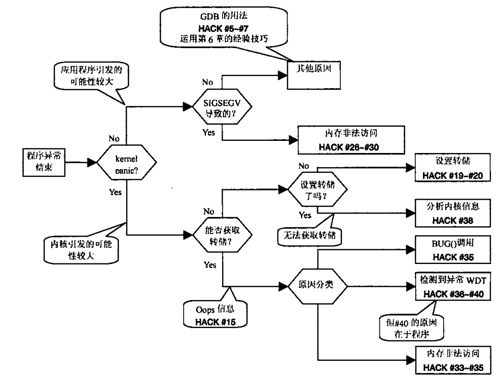
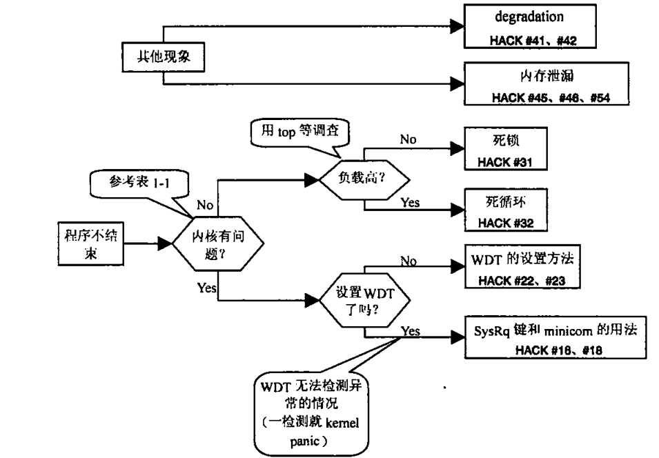
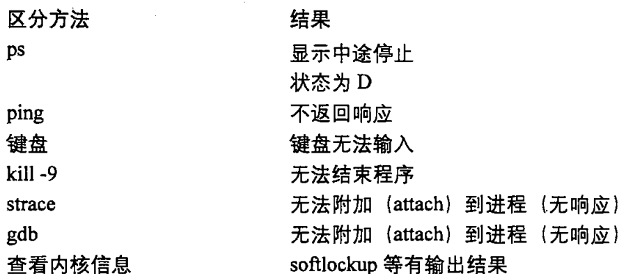

# 1 基本应对方法

## 1.1 程序异常结束的应对方法


## 1.2 程序不结束时的应对方法


## 1.3 内核有问题的现象


# 2 获取进程的core dump
core dump可以保存问题发生时的状态和函数调用栈。
**查看当前coredump功能是否开启**：
```shell
barret@Barret-PC:~$ ulimit -c
0 //0表示当前没有开启core dump
barret@Barret-PC:~$ ulimit -c unlimited //开启coredump，不显示文件大小
barret@Barret-PC:~$ ulimit -c xxxx //开启coredump，限定文件大小
```
当执行程序崩溃时，会输出以下内容并生成core文件
```shell
barret@Barret-PC:~$ ./a.out
Segmentation fault (core dumped)
barret@Barret-PC:~$ ls
a.cpp  a.out  core
# 使用如下gdb命令进行调试
barret@Barret-PC:~$ gdb -c core a.out
```

