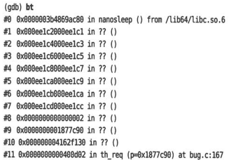
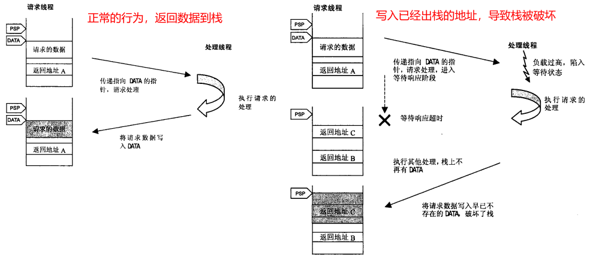

# 1 segmentation fault段错误
程序执行了非法的访问内存操作，就触发**SIGSEGV异常。**一般时发生如下情况：

- **访问NULL指针**
- **指针被破坏等原因，导致非法地址访问**
- **栈溢出，导致访问超出已分配范围的内存地址**


# 2 backtrace丢失
backtrace信息依赖于栈中保存的信息，出现下面的清空，基本可以认为栈被破坏。如果栈被破坏，就不能信任调试器生成的backtrace信息了。
下面是有个栈内破坏的例子：

# 3 内存双重释放
malloc、free导致SIGSEGV时，最危险的情况是：程序可能不会收到内存破坏的影响而继续执行，导致下列后果

- 在完全没有关系的地方产生SIGSEGV
- 使用被破坏的数据进行计算，产生错误的结果

## 利用MALLOC_CHECK_进行调试
glibc有个方便的调试标志**MALLOC_CHECK_**，可以发现内存操作相关的bug。

- MALLOC_CHECK_=0, 和没设置一样，将忽略这些错误 
- MALLOC_CHECK_=1, 将打印一个错误告警 
- MALLOC_CHECK_=2, 程序将收到SIGABRT信号退出


如下面例子：
```c
#include <stdio.h>
#include <stdlib.h>
#include <string.h>

#define BUF_SIZE 32

int main()
{
    int i;
    char *buf1 = (char *)malloc(BUF_SIZE);
    printf("buf1: [%x] %p\n", buf1, buf1);

    memset(buf1, 'c', BUF_SIZE + 10); //这里内存越界
    printf("%s:%d buf1: [%x]\n", __func__, __LINE__, buf1);
    free(buf1);

    return 0;
}
```
在编译之后，运行时可以设置环境变量，会产生告警和中断执行：
```bash
barret@Barret-PC:~$ export MALLOC_CHECK_=0
barret@Barret-PC:~$ ./a.out 
buf1: [7f2f82a0] 0x56077f2f82a0
main:14 buf1: [7f2f82a0]
barret@Barret-PC:~$ export MALLOC_CHECK_=1
barret@Barret-PC:~$ ./a.out 
buf1: [aa54010] 0x55db0aa54010
main:14 buf1: [aa54010]
free(): invalid pointer
Aborted
barret@Barret-PC:~$ export MALLOC_CHECK_=2
barret@Barret-PC:~$ ./a.out 
buf1: [cc08e010] 0x556acc08e010
main:14 buf1: [cc08e010]
free(): invalid pointer
Aborted
```

# 4 死锁的调试
看下面例子：
```c
#include <stdio.h>
#include <unistd.h>
#include <pthread.h>

pthread_mutex_t mutex = PTHREAD_MUTEX_INITIALIZER;
int cnt = 0; //计数

void resetCnt()
{
    pthread_mutex_lock(&mutex);
    cnt = 0;
    pthread_mutex_unlock(&mutex);
}

void* subThread(void*)
{
    //子线程
    while(1)
    {
        pthread_mutex_lock(&mutex);
        if (cnt > 2)
            resetCnt(); //这里会死锁，重复锁定mutex
        else
            cnt++;
        pthread_mutex_unlock(&mutex);

        printf("%d\n", cnt);
        sleep(1);
    }
}

int main()
{
    pthread_t tid;
    pthread_create(&tid, NULL, subThread, NULL);
    pthread_join(tid, NULL);

    return 0;
}
```
在cnt=3的时候，调用reset，导致重复请求锁定mutex，造成死锁，输出结果会夯死在打印3的位置：
```bash
barret@Barret-PC:~$ gcc a.cpp -lpthread
barret@Barret-PC:~$ ./a.out 
1
2
3
#本来期待显示0，但是这里死锁了，没有新的显示
```
那么这样的问题如何debug呢？

- 首先确认程序是**失去控制还是在等待**，可以用ps命令查看。第二列为进程状态
   - R：进程仍在执行
   - S：进程在睡眠。如果睡眠时间大于代码规定的时间，则基本上就是死锁了
```bash
barret@Barret-PC:~$ ps ax -l | grep a.out 
F S   UID   PID  PPID  C PRI  NI ADDR SZ WCHAN  TTY        TIME CMD
0 S  1000   325    63  0  80   0 - 19094 futex_ pts/1      0:00 ./a.out
```

- 使用`gdb attach`命令进入这个进程，进行调试
```bash
(gdb) attach 340
Attaching to process 340
[New LWP 341]
[Thread debugging using libthread_db enabled]
Using host libthread_db library "/lib/x86_64-linux-gnu/libthread_db.so.1".
__pthread_clockjoin_ex (threadid=140699237369600, thread_return=0x0, 
    clockid=<optimized out>, abstime=<optimized out>, block=<optimized out>)
    at pthread_join_common.c:145
(gdb) bt==================可以看到bt出来的调用栈是主线程的，需要切换到子线程
#0  __pthread_clockjoin_ex (threadid=140699237369600, thread_return=0x0, 
    clockid=<optimized out>, abstime=<optimized out>, block=<optimized out>)
    at pthread_join_common.c:145
#1  0x000055dd590092ed in main ()
(gdb) thread 2==================切换到第二个线程，即子线程
[Switching to thread 2 (Thread 0x7ff718104700 (LWP 341))]
#0  __lll_lock_wait (futex=futex@entry=0x55dd5900c040 <mutex>, private=0)
    at lowlevellock.c:52
52      lowlevellock.c: No such file or directory.
(gdb) bt=======================打印子线程的调用栈
#0  __lll_lock_wait (futex=futex@entry=0x55dd5900c040 <mutex>, private=0)
    at lowlevellock.c:52
#1  0x00007ff7183060a3 in __GI___pthread_mutex_lock (mutex=0x55dd5900c040 <mutex>)
    at ../nptl/pthread_mutex_lock.c:80====================可以看到在这里进入内核空间并睡眠
#2  0x000055dd5900921d in resetCnt() ()===========该函数中lock时导致死锁睡眠等待
#3  0x000055dd59009262 in subThread(void*) ()
#4  0x00007ff718303609 in start_thread (arg=<optimized out>) at pthread_create.c:477
#5  0x00007ff71822a103 in clone () at ../sysdeps/unix/sysv/linux/x86_64/clone.S:95

```

- 从gdb我们分析到原因时死锁，但是无法知道第一次lock在什么地方。那我们就需要自定义一个**gdb命令脚本，自动记录lock和unlock被调用时的backtrace**。命令脚本如下，保存为**debug.cmd**文件
```
set pagination off       #显示行数超过终端，继续显示
set logging file debug.log  #保存屏幕输出
set logging overwrite
set logging on
start
set $addr1 = pthread_mutex_lock
set $addr2 = pthread_mutex_unlock
b *$addr1     #在lock和unlock调用的地方设置断点
b *$addr2
while 1
    c
    if $pc != $addr1 && $pc != $addr2
        quit
    end
    bt  #打印调用栈
end
```

- 使用命令`gdb a.out -x debug.cmd`执行程序，然后查看得到的debug.log，查看在哪些地方进行的lock和unlock操作。debug.log内容如下：
```
Temporary breakpoint 1 at 0x40078d: file a.cpp, line 35.
[Thread debugging using libthread_db enabled]
Using host libthread_db library "/lib64/libthread_db.so.1".

Temporary breakpoint 1, main () at a.cpp:35
35	    pthread_create(&tid, NULL, subThread, NULL);
Breakpoint 2 at 0x7ffff7bc8cc0
Breakpoint 3 at 0x7ffff7bc9ea0

Breakpoint 2, 0x00007ffff7bc8cc0 in pthread_mutex_lock () from /lib64/libpthread.so.0
#0  0x00007ffff7bc8cc0 in pthread_mutex_lock () from /lib64/libpthread.so.0
#1  0x00007ffff792e292 in _dl_addr () from /lib64/libc.so.6
#2  0x00007ffff7877b1c in ptmalloc_init.part.7 () from /lib64/libc.so.6
#3  0x00007ffff7877e2e in malloc_hook_ini () from /lib64/libc.so.6
#4  0x00007ffff7877701 in calloc () from /lib64/libc.so.6
#5  0x00007ffff7ded735 in _dl_allocate_tls () from /lib64/ld-linux-x86-64.so.2
#6  0x00007ffff7bc783c in pthread_create@@GLIBC_2.2.5 () from /lib64/libpthread.so.0
#7  0x00000000004007a8 in main () at a.cpp:35

Breakpoint 3, 0x00007ffff7bc9ea0 in pthread_mutex_unlock () from /lib64/libpthread.so.0
#0  0x00007ffff7bc9ea0 in pthread_mutex_unlock () from /lib64/libpthread.so.0
#1  0x00007ffff792e49e in _dl_addr () from /lib64/libc.so.6
#2  0x00007ffff7877b1c in ptmalloc_init.part.7 () from /lib64/libc.so.6
#3  0x00007ffff7877e2e in malloc_hook_ini () from /lib64/libc.so.6
#4  0x00007ffff7877701 in calloc () from /lib64/libc.so.6
#5  0x00007ffff7ded735 in _dl_allocate_tls () from /lib64/ld-linux-x86-64.so.2
#6  0x00007ffff7bc783c in pthread_create@@GLIBC_2.2.5 () from /lib64/libpthread.so.0
#7  0x00000000004007a8 in main () at a.cpp:35
[New Thread 0x7ffff77f0700 (LWP 26497)]
[Switching to Thread 0x7ffff77f0700 (LWP 26497)]

Breakpoint 2, 0x00007ffff7bc8cc0 in pthread_mutex_lock () from /lib64/libpthread.so.0
#0  0x00007ffff7bc8cc0 in pthread_mutex_lock () from /lib64/libpthread.so.0
#1  0x0000000000400737 in subThread () at a.cpp:20
#2  0x00007ffff7bc6e65 in start_thread () from /lib64/libpthread.so.0
#3  0x00007ffff78ef88d in clone () from /lib64/libc.so.6

Breakpoint 3, 0x00007ffff7bc9ea0 in pthread_mutex_unlock () from /lib64/libpthread.so.0
#0  0x00007ffff7bc9ea0 in pthread_mutex_unlock () from /lib64/libpthread.so.0
#1  0x0000000000400762 in subThread () at a.cpp:25
#2  0x00007ffff7bc6e65 in start_thread () from /lib64/libpthread.so.0
#3  0x00007ffff78ef88d in clone () from /lib64/libc.so.6

Breakpoint 2, 0x00007ffff7bc8cc0 in pthread_mutex_lock () from /lib64/libpthread.so.0
#0  0x00007ffff7bc8cc0 in pthread_mutex_lock () from /lib64/libpthread.so.0
#1  0x0000000000400737 in subThread () at a.cpp:20
#2  0x00007ffff7bc6e65 in start_thread () from /lib64/libpthread.so.0
#3  0x00007ffff78ef88d in clone () from /lib64/libc.so.6

Breakpoint 3, 0x00007ffff7bc9ea0 in pthread_mutex_unlock () from /lib64/libpthread.so.0
#0  0x00007ffff7bc9ea0 in pthread_mutex_unlock () from /lib64/libpthread.so.0
#1  0x0000000000400762 in subThread () at a.cpp:25
#2  0x00007ffff7bc6e65 in start_thread () from /lib64/libpthread.so.0
#3  0x00007ffff78ef88d in clone () from /lib64/libc.so.6

Breakpoint 2, 0x00007ffff7bc8cc0 in pthread_mutex_lock () from /lib64/libpthread.so.0
#0  0x00007ffff7bc8cc0 in pthread_mutex_lock () from /lib64/libpthread.so.0
#1  0x0000000000400737 in subThread () at a.cpp:20
#2  0x00007ffff7bc6e65 in start_thread () from /lib64/libpthread.so.0
#3  0x00007ffff78ef88d in clone () from /lib64/libc.so.6

Breakpoint 3, 0x00007ffff7bc9ea0 in pthread_mutex_unlock () from /lib64/libpthread.so.0
#0  0x00007ffff7bc9ea0 in pthread_mutex_unlock () from /lib64/libpthread.so.0
#1  0x0000000000400762 in subThread () at a.cpp:25
#2  0x00007ffff7bc6e65 in start_thread () from /lib64/libpthread.so.0
#3  0x00007ffff78ef88d in clone () from /lib64/libc.so.6
===================可以看到前几次lock和unlock都是成对出现的==============================
=====================这里子线程进行了一次lock，没有unlock
Breakpoint 2, 0x00007ffff7bc8cc0 in pthread_mutex_lock () from /lib64/libpthread.so.0
#0  0x00007ffff7bc8cc0 in pthread_mutex_lock () from /lib64/libpthread.so.0
#1  0x0000000000400737 in subThread () at a.cpp:20
#2  0x00007ffff7bc6e65 in start_thread () from /lib64/libpthread.so.0
#3  0x00007ffff78ef88d in clone () from /lib64/libc.so.6

=====================紧接着resetCnt函数进行第二次lock，造成死锁
Breakpoint 2, 0x00007ffff7bc8cc0 in pthread_mutex_lock () from /lib64/libpthread.so.0
#0  0x00007ffff7bc8cc0 in pthread_mutex_lock () from /lib64/libpthread.so.0
#1  0x000000000040070b in resetCnt () at a.cpp:10
#2  0x0000000000400747 in subThread () at a.cpp:22
#3  0x00007ffff7bc6e65 in start_thread () from /lib64/libpthread.so.0
#4  0x00007ffff78ef88d in clone () from /lib64/libc.so.6

Program received signal SIGINT, Interrupt.
[Switching to Thread 0x7ffff7fd8740 (LWP 26493)]
0x00007ffff7bc7fd7 in pthread_join () from /lib64/libpthread.so.0
A debugging session is active.

	Inferior 1 [process 26493] will be killed.

Quit anyway? (y or n) [answered Y; input not from terminal]
```
通过lock和unlock的成对检测，看一看到最终在debug.log的68行和74行出现了连续的两次lock操作，导致程序死锁睡眠。
