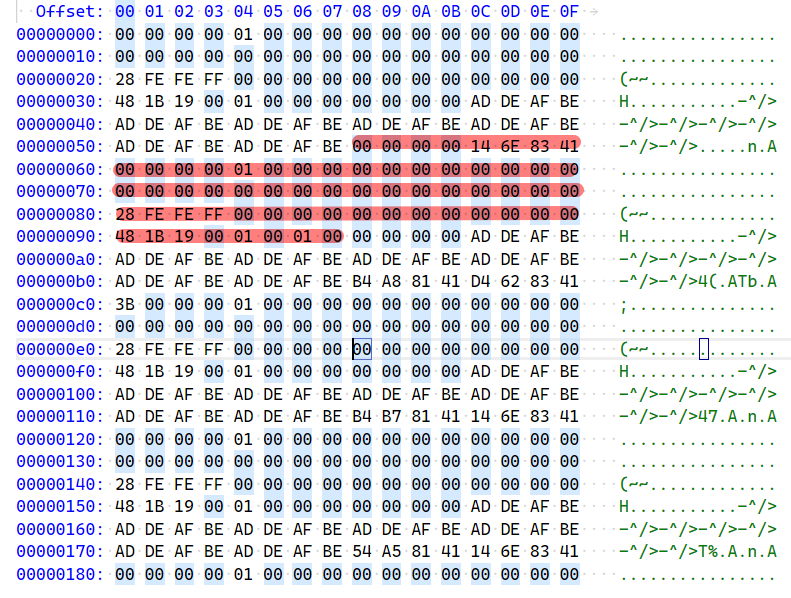

# 问题
产品代码使用内建的MemMgnt模块申请了一个Request结构体的内容，用于传递消息处理请求。后来再调用MemMgnt模块的free()函数释放这块内存时，导致了系统重启。通过阅读代码可以看到，申请和释放分别用到了下面的两个函数

- MemMngt::AllocatorPool::tryMalloc
- MemMngt::AllocatorPool::tryFree


而在tryFree时，上报了Status_NotAllowed，导致系统重启。打印了一下申请和释放时候指针的内容，完全一致，没有发现什么问题：
```
alloc:
{pstParentReq = 0x0, pstChnl = 0x41836e14, uiID = 0, usReqState = 1, 
	stNode = {pstNext = 0x0, pstPrev = 0x0}, pvExecData = 0x0, pvUserData = 0x0, 
  pvCallbackData = 0x0, uiCallbkDataLen = 0, Status = -66008, pstSemReqComp = 0x0,
  pfnCallback = 0x0, uiReqId = 0, pfnReqFSMHdlr = 0x191b48 <VFSM_StopConnection>,
  ucInProgress = 1 '\001', ucCmdLevel = 0 '\000', ucThreadContext = 1 '\001', 
  bIsSync = False}
 
 free:
 {pstParentReq = 0x0, pstChnl = 0x41836e14, uiID = 0, usReqState = 1,
  stNode = {pstNext = 0x0, pstPrev = 0x0}, pvExecData = 0x0, pvUserData = 0x0,
  pvCallbackData = 0x0, uiCallbkDataLen = 0, Status = -66008, pstSemReqComp = 0x0,
  pfnCallback = 0x0, uiReqId = 0, pfnReqFSMHdlr = 0x191b48 <VFSM_StopConnection>,
  ucInProgress = 1 '\001', ucCmdLevel = 0 '\000', ucThreadContext = 1 '\001',
  bIsSync = False}
```


# GDB调试coredump

1. 显示调用栈信息
```
(gdb) bt
#0  0x40095c88 in raise (sig=6) at ../sysdeps/unix/sysv/linux/pt-raise.c:35
#1  0x0022bab0 in abort_application () at src/reborn/exception_handling/exception_handling.c:507
#2  0x0022dc64 in do_reset () at src/reborn/resets.c:69
#3  0x0022dcc4 in board_reset () at src/reborn/resets.c:87
#4  0x0022dcdc in software_reset () at src/reborn/resets.c:96
#5  0x001a9e14 in hot_reset () at src/StartupCo/OS/resets.c:305
#6  0x0026c0b0 in reset_callback (rl=ERR_RECOV_HOT_RESET, error_class=1, ctxt=0) at src/reborn/init_app/root.c:67
#7  0x00233190 in err_handling_common (errortype=335875, errorclass=2, name=0x9565ac "FREE", file=0x956488 "src/MEMMNGT/sources/memmngt.cpp", line=175) at src/ERROR/error.c:1387
#8  0x00236010 in err_report_bin_intrs (with_intrs=1, errortype=335875, errorclass=2, name=0x9565ac "FREE", file=0x956488 "src/MEMMNGT/sources/memmngt.cpp", line=175, errorinfo=0x0, errorinfolength=0, 
    datatype=ERR_DATA_RAW) at src/ERROR/error.c:2983
#9  0x002360a4 in err_report_bin (errortype=335875, errorclass=2, name=0x9565ac "FREE", file=0x956488 "src/MEMMNGT/sources/memmngt.cpp", line=175, errorinfo=0x0, errorinfolength=0, datatype=ERR_DATA_RAW)
    at src/ERROR/error.c:3002
#10 0x002396ec in err_report (errortype=335875, errorclass=2, name=0x9565ac "FREE", file=0x956488 "src/MEMMNGT/sources/memmngt.cpp", line=175, errorinfo=0x0, errorinfolength=0) at src/ERROR/error_printing.c:45
#11 0x001f126c in MemMngt::Main::handleError (name=0x9565ac "FREE", error=MemMngt::Status_NotAllowed, defOptions=270, options=270) at src/MEMMNGT/sources/memmngt.cpp:175
#12 0x001f56d8 in MemMngt::AllocatorCtrl::handleError (this=0xd620a0 <vapiMemifc>, name=0x9565ac "FREE", error=MemMngt::Status_NotAllowed, options=270) at src/MEMMNGT/sources/allocatorctrl.cpp:528
#13 0x001f4e70 in MemMngt::AllocatorCtrl::free (this=0xd620a0 <vapiMemifc>, buffer=0x4181a734, options=0, protCtxt=0x0) at src/MEMMNGT/sources/allocatorctrl.cpp:284
#14 0x00318cbc in vapi_free (ptr=<optimized out>) at src/VoiceCommon/Generic_Voice_Hardware_wrapper/src/gen_voice_hww.cc:1024
#15 0x0018b310 in UT_free (ptr=0x4181a734) at src/VoiceCommon/M823xx_Mindspeed_VAPI/common/ut/ut.c:60
#16 0x0018b41c in __UT_free (ptr=0x5983b674, fName=0x9472a8 "src/VoiceCommon/M823xx_Mindspeed_VAPI/common/vapi/vcore.c", lineNo=1504) at src/VoiceCommon/M823xx_Mindspeed_VAPI/common/ut/ut.c:92
#17 0x001a37a4 in VCORE_FreeRequest (pstVapiReq=0x4181a734) at src/VoiceCommon/M823xx_Mindspeed_VAPI/common/vapi/vcore.c:1504
#18 0x001a32d8 in VCORE_DoReqCompletion (pstChnl=0x41836e14, pstVapiReq=0x4181a734, Status=-66008) at src/VoiceCommon/M823xx_Mindspeed_VAPI/common/vapi/vcore.c:1189
#19 0x00191d90 in VFSM_StopConnection (pstChnl=0x41836e14, pstVapiReq=0x4181a734, Event=0, pstMsg=0x0) at src/VoiceCommon/M823xx_Mindspeed_VAPI/common/vapi/connection_fsm.c:3174
#20 0x001a1fc8 in VCORE_ProcessRequestList (pstChnl=0x41836e14) at src/VoiceCommon/M823xx_Mindspeed_VAPI/common/vapi/vcore.c:347
#21 0x001a6574 in VCORE_StartChannelChildRequest (pstChnl=0x41836e14, pstVapiReq=0x4181a734) at src/VoiceCommon/M823xx_Mindspeed_VAPI/common/vapi/vcore.c:3244
#22 0x0018f4e0 in VFSM_DestroyConnection (pstChnl=0x41836e14, pstVapiReq=0x4181be14, Event=0, pstMsg=0x0) at src/VoiceCommon/M823xx_Mindspeed_VAPI/common/vapi/connection_fsm.c:390
#23 0x001a1ce4 in VCORE_ProcessRequest (pstChnl=0x41836e14, pstReq=0x4181be14) at src/VoiceCommon/M823xx_Mindspeed_VAPI/common/vapi/vcore.c:210
#24 0x00193920 in VAPI_DestroyConnection (ConnId=0, pstRequest=0x0) at src/VoiceCommon/M823xx_Mindspeed_VAPI/common/vapi/connection_itf.c:426
#25 0x002fb480 in gvhw_vapi_driver::destroyConnection (this=0x58a83bb0, connId_i=0) at src/VoiceCommon/Generic_Voice_Hardware_wrapper/src/MSP/src/dsp_driver/vapi_driver/vapi_mm_itf.cpp:701
#26 0x002f3eb8 in gvhw_dsp_driver::initiateCall (this=0x58a83bb0, lineId_i=lineId_i@entry=105, coder_i=coder_i@entry=GEN_MLAW, pTime_i=<optimized out>, pTime_i@entry=20, connId_o=@0x417d9d54: 4294967295)
    at src/VoiceCommon/Generic_Voice_Hardware_wrapper/src/MSP/src/dsp_driver/dsp_driver.cpp:291
#27 0x00314ed4 in gvhw_msp_adapter::initiateCall (this=0x58a8c9e4, lineID_i=105, coder_i=coder_i@entry=GEN_MLAW, pTime_i=20, connID_o=@0x417d9d54: 4294967295)
    at src/VoiceCommon/Generic_Voice_Hardware_wrapper/src/MSP/src/mm_itf.cpp:102
#28 0x008301a0 in sipw_assignDspWithCodec (pTerm=pTerm@entry=0x417ca650, tdmCodec=GEN_MLAW) at src/VoiceCommon/SipWrapper/Sipw_proxy_ifc.cc:6646
#29 0x008211b4 in handle_res_alloc_req_from_ppu (msg_buf_id=msg_buf_id@entry=1479543404, p_msg=p_msg@entry=0x58300a6c) at src/VoiceCommon/SipWrapper/SipWrapper.c:7133
#30 0x00825504 in SipWrapper_main () at src/VoiceCommon/SipWrapper/SipWrapper.c:3533
#31 0x400373e0 in task_trampoline (arg=0x4079e228) at task.c:229
#32 0x40053e70 in thread_trampoline (arg=0x4101585c) at internal.c:251
#33 0x4008ad4c in start_thread (arg=0x5983c1c0) at pthread_create.c:335
#34 0x406e4b10 in ?? () at ../sysdeps/unix/sysv/linux/arm/clone.S:89
   from /repo/barretr/fdt1265/sw/vobs/esam/build/reborn/buildroot-isam-reborn-comcerto-niata/output/host/usr/arm-buildroot-linux-gnueabi/sysroot/lib/libc.so.6
Backtrace stopped: previous frame identical to this frame (corrupt stack?)
```

2. 可以看到在13位置进行free然后出错的，所以下一步定位到13。根据代码上的层次关系，最终找到申请内存的pool的位置。**因为代码中要申请的结构体大小为68，所以肯定是在第6个pool中申请（因为pool的单位大小为96）。**
```
(gdb) frame 13
#13 0x001f4e70 in MemMngt::AllocatorCtrl::free (this=0xd620a0 <vapiMemifc>, buffer=0x4181a734, options=0, protCtxt=0x0) at src/MEMMNGT/sources/allocatorctrl.cpp:284
284        handleError("FREE", retVal, opt);
(gdb) l
279        info.ptr_m = buffer;
280        TraceDebug::generateTrace(info);
281    }
282
283    if (retVal)
284        handleError("FREE", retVal, opt);
285    else {
286
287#ifdef TARG_ARCH_HOST
288        if (purify_is_running()) {
(gdb) p *_alloc
$1 = {_vptr.Allocator = 0x9572e4 <vtable for MemMngt::AllocatorMultiple+8>}
(gdb) p *(MemMngt::AllocatorMultiple*)_alloc
$2 = {<MemMngt::Allocator> = {_vptr.Allocator = 0x9572e4 <vtable for MemMngt::AllocatorMultiple+8>}, _alloc = 0xd61e4c <vapi_initMemory()::allocator>, _size = 18}
(gdb) p (*(MemMngt::AllocatorMultiple*)_alloc)->_alloc
$3 = (MemMngt::Allocator **) 0xd61e4c <vapi_initMemory()::allocator>
(gdb) p **(MemMngt::Allocator **)((*(MemMngt::AllocatorMultiple*)_alloc)->_alloc)
$4 = {_vptr.Allocator = 0x9571c8 <vtable for MemMngt::AllocatorPool+8>}
(gdb) p (*((MemMngt::AllocatorPool**)((*(MemMngt::AllocatorMultiple*)_alloc)->_alloc))[6])
$5 = {<MemMngt::Allocator> = {_vptr.Allocator = 0x9571c8 <vtable for MemMngt::AllocatorPool+8>}, _chunkType = 1 '\001', _eSize = 96, _currElem = 97, _lowestCnt = 95, _poolSize = 100, _incSize = 0, _incCnt = 0, 
  _head = 0x4181a4f4, _tail = 0x4181a734, _blocks = 0x41819cac, _alloc = @0xc9d6fc}
```

3. 找到pool，就可以找到申请到的内存的起始位置，然后打印附近的内存信息
```
(gdb) p &(*((MemMngt::AllocatorPool**)((*(MemMngt::AllocatorMultiple*)_alloc)->_alloc))[6])->_blocks->mem[0]
$8 = 0x41819cb4 ""
(gdb) p &(*((MemMngt::AllocatorPool**)((*(MemMngt::AllocatorMultiple*)_alloc)->_alloc))[6])->_blocks->mem[2688]
$9 = 0x4181a734 ""---->这个就是申请到的内存地址
(gdb) dump memory /home/barretr/mem1.dump &(*((MemMngt::AllocatorPool**)((*(MemMngt::AllocatorMultiple*)_alloc)->_alloc))[6])->_blocks->mem[2600] &(*((MemMngt::AllocatorPool**)((*(MemMngt::AllocatorMultiple*)_alloc)- 
>_alloc))[6])->_blocks->mem[3000]
```

4. 查看dump文件，可以看到红线中间的内容即为结构体的内容，可以和前面的对照一下，内容完全一致



5. frame 13的位置已经开始调用handleError处理异常了，所以到这里内存应该已经被删除才对。但是看内心dump可以看到，内存内容还在，并没有变成默认值BEAFDEAD。所以得出结论：**tryFree并没有走到真正释放内存的地方就已经返回失败了。也就是说前面的各种check没有通过，导致返回异常，真正释放的代码并没有走到。也并不是释放空指针或多次释放（如果时多次释放，内容应该不存在）导致的重启。**
