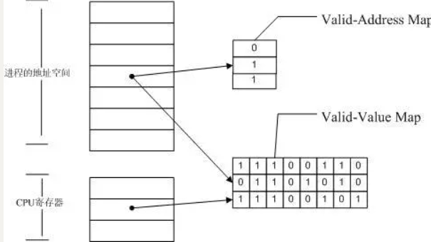

# 1 原理
valgrind 是一个提供了一些 debug 和优化的工具的工具箱，可以使得你的程序减少内存泄漏或者错误访问。valgrind 默认使用 memcheck 去检查内存问题。memcheck 检测内存问题的原理如下图所示



Memcheck 能够检测出内存问题，关键在于其建立了两个全局表。

1. **valid-value map：**对于进程的整个地址空间中的每一个字节(byte)，都有与之对应的 8 个 bits；对于 CPU 的每个寄存器，也有一个与之对应的 bit 向量。这些 bits 负责记录该字节或者寄存器值是否具有有效的、已初始化的值。
1. **valid-address map：**对于进程整个地址空间中的每一个字节(byte)，还有与之对应的 1 个 bit，负责记录该地址是否能够被读写。


在两个全局表的基础上，以如下方式进行检测：

- 当要读写内存中某个字节时，首先检查 valid-address map 中这个字节对应的 A bit。**如果该A bit显示该位置是无效位置，memcheck 则报告读写错误。**
- 内核（core）类似于一个虚拟的 CPU 环境，这样当内存中的某个字节被加载到真实的 CPU 中时，该字节对应的 V bit (在 valid-value map 中) 也被加载到虚拟的 CPU 环境中。一旦寄存器中的值，被用来产生内存地址，或者该值能够影响程序输出，则 memcheck 会检查对应的 V bits，如果该值尚未初始化，则会报告使用未初始化内存错误。


**不过valgrind也不是万能的，对与栈上的内存空间操作就无法检测到。**

# 2 命令选项
基本命令：`valgrind --leak-check=yes ./a.out arg1 arg2`
> 为了能够定位到源代码的行，建议编译时加上-g选项，并选择O0优化


# 3 使用示例
示例代码：
```c
#include <stdlib.h>

int main()
{
    int* x = (int*)malloc(10 * sizeof(int));
    x[10] = 1; //问题1，越界了
    return 0; //问题2，没有释放内存
}
```
执行valgrind检测后的结果：
```bash
barret@Barret-PC:~$ valgrind --leak-check=yes ./a.out
==393== Memcheck, a memory error detector
==393== Copyright (C) 2002-2017, and GNU GPL'd, by Julian Seward et al.
==393== Using Valgrind-3.15.0 and LibVEX; rerun with -h for copyright info
==393== Command: ./a.out
==393== 
==393== Invalid write of size 4
==393==    at 0x10916B: main (a.cpp:6)
==393==  Address 0x4a47068 is 0 bytes after a block of size 40 alloc'd
==393==    at 0x483B7F3: malloc (in /usr/lib/x86_64-linux-gnu/valgrind/vgpreload_memcheck-amd64-linux.so)
==393==    by 0x10915E: main (a.cpp:5)
==393== 
==393== 
==393== HEAP SUMMARY:
==393==     in use at exit: 40 bytes in 1 blocks
==393==   total heap usage: 1 allocs, 0 frees, 40 bytes allocated
==393== 
==393== 40 bytes in 1 blocks are definitely lost in loss record 1 of 1
==393==    at 0x483B7F3: malloc (in /usr/lib/x86_64-linux-gnu/valgrind/vgpreload_memcheck-amd64-linux.so)
==393==    by 0x10915E: main (a.cpp:5)
==393== 
==393== LEAK SUMMARY:
==393==    definitely lost: 40 bytes in 1 blocks
==393==    indirectly lost: 0 bytes in 0 blocks
==393==      possibly lost: 0 bytes in 0 blocks
==393==    still reachable: 0 bytes in 0 blocks
==393==         suppressed: 0 bytes in 0 blocks
==393== 
==393== For lists of detected and suppressed errors, rerun with: -s
==393== ERROR SUMMARY: 2 errors from 2 contexts (suppressed: 0 from 0)
```
结果解析如下：

- ==393==：执行程序的进程ID
- Invalid write of size 4：表示发现一个错误，这里显示源代码第6行有错误，这里很明显是越界了，所以显示**invalid write错误**
- 40 bytes in 1 blocks are definitely lost in loss record 1 of 1：内存泄露错误，泄漏的大小是`10* sizeof(int)`40byte。
- LEAK summary也会显示内存泄漏的情况


# 4 分析常见内存问题

## 4.1 写入非法内存地址
上面的例子已经展示了这种情况，访问分配的内存区域之外的空间，valgrind会上报如下的错误：

- Invalid **write **of size x
- 后跟调用栈信息

## 4.2 读取非法内存地址
和上一个情况类似，不同 的是读取而不是写入，错误信息如下：

- Invalid **read **of size x
- 后跟调用栈信息

## 4.3 读取未初始化内存区域
示例
```c
#include <stdlib.h>

int main()
{
    int* x = (int*)malloc(10 * sizeof(int));
    int a = x[1] + 1; //不初始化就使用内存的值
    free(x);
    return a;
}
```
valgrind显示如下错误：==427== Syscall param exit_group(status)** contains uninitialised byte(s)**==427==    at 0x4938136: _Exit (_exit.c:31)==427==    by 0x489BB41: __run_exit_handlers (exit.c:132)==427==    by 0x489BBDF: exit (exit.c:139)==427==    by 0x48790B9: (below main) (libc-start.c:342)

## 4.4 内存双重释放
示例
```c
#include <stdlib.h>

int main()
{
    int* x = (int*)malloc(10 * sizeof(int));
    free(x); //free两次
    free(x);
    return 0;
}
```
valgrind显示如下错误，显示两次free的位置：=436== Invalid free() / delete / delete[] / realloc()==436==   ** at 0x483CA3F: free **(in /usr/lib/x86_64-linux-gnu/valgrind/vgpreload_memcheck-amd64-linux.so)==436==  **  by 0x10919A: main (a.cpp:7)**==436==  Address 0x4a47040 is 0 bytes inside a block of size 40 free'd==436==    **at 0x483CA3F: free **(in /usr/lib/x86_64-linux-gnu/valgrind/vgpreload_memcheck-amd64-linux.so)==436==    **by 0x10918E: main (a.cpp:6)**==436==  Block was alloc'd at==436==    at 0x483B7F3: malloc (in /usr/lib/x86_64-linux-gnu/valgrind/vgpreload_memcheck-amd64-linux.so)==436==    by 0x10917E: main (a.cpp:5)

