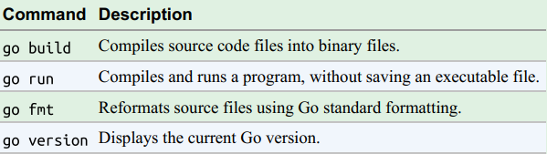
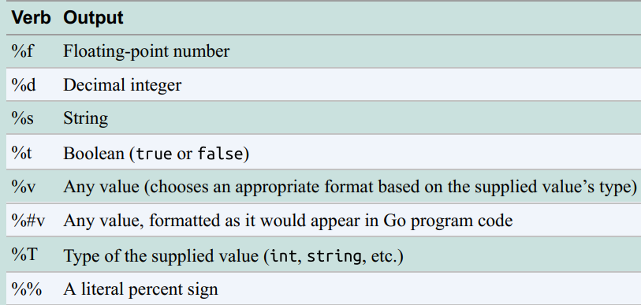

# 1 Go项目的构建
一个Go工程中主要包含以下三个目录：

- src：源代码文件，编写程序代码xxx.go，执行命令`go build xxx.go`会生成*.exe文件；执行`go run xxx.go`可以直接运行文件
- pkg：包文件，执行`go install name`会在此目录下生成*.a文件，用于import
- bin：相关bin文件，执行`go install xxx`会在此母名生成*.exe文件，可以直接运行

go的基本命令如下：



# 2. 变量和常量
Go的程序是保存在多个.go文件中，文件的第一行就是package XXX声明，用来说明该文件属于哪个包(package)，package声明下来就是import声明，再下来是类型，变量，常量，函数的声明。Go语言的变量声明格式为：
```
var 变量名 变量类型 [ = 表达式或值]
```
变量声明以`关键字var`开头，变量类型放在变量的后面，行尾无需分号。 举个例子：
```go
var name string
var age int
//批量声明，一个var带多个不同类型的变量声明
var (
	a string
	b int
	c bool
	d float32
)
```
类型推断

- 我们可以将变量的类型省略，编译器会根据等号右边的值来推导变量的类型完成初始化
- 在函数内部，可以使用更简略的 := 方式（省略var和type）声明并初始化变量。但是有限制：
   - 不能用在函数外
   -  := 操作符的左边至少有一个变量是尚未声明的


 常量的声明和变量声明非常类似，只是把var换成了`const`，常量在定义的时候必须赋值。`const`同时声明多个常量时，如果省略了值则表示和上面一行的值相同。 例如：
```go
const (
        n1 = 100
        n2
        n3
    )
```

# 3 内置数据类型
| **类型** | **长度(字节)** | **默认值** | **说明** |
| --- | --- | --- | --- |
| **bool** | 1 | false |  |
| **byte** | 1 | 0 | uint8 |
| **rune** | 4 | 0 | 代表一个UTF8字符, int32 |
| **int, uint** | 4或8 | 0 | 32 或 64 位 |
| **int8, uint8** | 1 | 0 | -128 ~ 127, 0 ~ 255，byte是uint8 的别名 |
| **int16, uint16** | 2 | 0 | -32768 ~ 32767, 0 ~ 65535 |
| **int32, uint32** | 4 | 0 | -21亿~ 21亿, 0 ~ 42亿，rune是int32 的别名 |
| **int64, uint64** | 8 | 0 |  |
| **float32** | 4 | 0.0 |  |
| **float64** | 8 | 0.0 |  |
| **complex64** | 8 |  | 复数，实部和虚部为32位，创建方式：- 使用函数[complex](https://golang.org/pkg/builtin/#complex)创建- a := 6 + 7i |
| **complex128** | 16 |  | 复数，实部和虚部为64位 |
| **uintptr** | 4或8 |  | 以存储指针的 uint32 或 uint64 整数 |
| **array** |  |  | 值类型 |
| **struct** |  |  | 值类型 |
| **string** |  | "" | UTF-8 字符串 |
| **slice** |  | nil | 引用类型 |
| **map** |  | nil | 引用类型 |
| **channel** |  | nil | 引用类型 |
| **interface** |  | nil | 接口 |
| **function** |  | nil | 函数 |
| **nil** |  |  | 空指针 |


## 3.1 格式化打印
fmt包支持如下几种打印方式

- fmt.Println：打印一行内容，类似`std::cout`，难以设置格式
- fmt.Print：打印内容，并不换行
- fmt.Printf：**格式化打印**，与C语言`printf`同理
- fmt.Sprintf：**格式化打印**，不同之处使返回string类型，不是打印到屏幕

格式化打印支持的格式符：



```go
fmt.Printf("type of a is %T, size of a is %d", a, unsafe.Sizeof(a)) // a 的类型和大小
```

## 3.2 类型转换
**Go语言中只有强制类型转换，没有隐式类型转换**。该语法只能在两个类型之间支持相互转换的时候使用。强制类型转换的基本语法如下：
```go
T(表达式)
```

# 4 基本语句

## 4.1 if语句
```go
//可省略条件表达式括号。
//持初始化语句，可定义代码块局部变量。 
//代码块左 括号必须在条件表达式尾部。
if 布尔表达式 {
    //。。。
} else { //else不能单独一行，golang的自动分号插入机制导致的
  //。。。
}
//另一种格式，在条件判断前执行一条指令
if statement; condition {  
}
```

## 4.2 switch语句
```go
switch var1 {
    case val1:
        ...
    case val2,val3,val4://通过用逗号分隔，可以在一个 case 中包含多个表达式
        ...
    default:
        ...
}
//可以看到每个case不需要break来分割
//switch 语句还可以被用于type-switch 来判断某个interface 变量中实际存储的变量类型
switch x.(type){
    case type:
       statement(s)      
    case type:
       statement(s)
    /* 你可以定义任意个数的case */
    default: /* 可选 */
       statement(s)
}
```
注意：

- **case可以是字符、字符串，表达式**，不一定是常量
- 每个case语句块自动结束退出switch，**不需要使用break**
- 如果需要接着执行下一个case的内容，需要使用**`fallthrough` **

## 4.3 for循环
三种形式
```go
for init; condition; post { }
for condition { }
for { }
//init： 一般为赋值表达式，给控制变量赋初值；
//condition： 关系表达式或逻辑表达式，循环控制条件；
//post： 一般为赋值表达式，给控制变量增量或减量。
```
range循环语句：range类似迭代器操作，返回 (索引, 值) 或 (键, 值)
```go
for key, value := range oldMap {
    newMap[key] = value
}
```

# 5 函数

## 5.1 函数定义
在 Go 语言中，函数声明通用语法如下：
```go
func functionname(parametername type) returntype {  
    // 函数体（具体实现的功能）
}
//如果有连续若干个函数参数，它们的类型一致，那么无须一一罗列，只需在最后一个参数后添加该类型。
```

Go 语言支持一个函数可以有多个返回值（也用括号包含），并且可以给返回值命名，这样可以不在return里添加需要返回的变量：
```go
func rectProps(length, width float64)(float64, float64) {//两个括号，一个函数参数，一个返回列表  
    var area = length * width
    var perimeter = (length + width) * 2
    return area, perimeter//返回多返回值
}
//返回值命名
func rectProps(length, width float64)(area, perimeter float64) {  
    area = length * width
    perimeter = (length + width) * 2
    return // 不需要明确指定返回值，默认返回 area, perimeter 的值
}
```
**_** 在 Go 中被用作空白符，可以用作表示任何类型的任何值，通常用在接收函数多返回值，过滤掉不需要的返回值：
```go
area, _ := rectProps(10.8, 5.6) // 返回值周长被丢弃
```

## 5.2 可变参数
如果函数最后一个参数被记作 `...T` ，这时函数可以接受任意个 `T` 类型参数作为最后一个参数。**可变参数函数的工作原理是把可变参数转换为一个新的切片。**
```go
func find(num int, nums ...int) {
    fmt.Printf("type of nums is %T\n", nums)//nums相当于整型slice
    found := false
    for i, v := range nums {
        if v == num {
            fmt.Println(num, "found at index", i, "in", nums)
            found = true
        }
    }
    if !found {
        fmt.Println(num, "not found in ", nums)
    }
    fmt.Printf("\n")
}
func main() {
    find(89, 89, 90, 95)//传入数多个参数
    nums := []int{89, 90, 95}
    find(89, nums...)//传入一个slice
}
```

## 5.3 返回error信息
我们可以使用errors包或fmt包来生成error类型的对象，用于返回函数的内部错误：
```go
//实现自定义函数同时返回err和其他返回值
package main

import (
	"errors"
	"fmt"
)

func f1() (int, error) { //设置多返回值
	err := errors.New("I am the error") //使用errors包生成error
	return 1, err
}

func f2() (int, error) {
	//使用fmt包生成error
	err := fmt.Errorf("I am a error created by fmt")
	return 2, err
}

func main() {
	a, err := f1()
	if err != nil {
		fmt.Println(err.Error())
	}
	fmt.Println(a)
	b, err := f2()
	if err != nil {
		fmt.Println(err.Error())
	}
	fmt.Println(b)
}
```

## 5.4 指针传址参数
对于需要在函数内部修改的参数，需要使用传址参数，GO中指针和C语言使一样的，基本符号也是***和&**。
```go
//指针传址参数，和函数返回指针
package main

import "fmt"

func fun1(value *int) *float64 {
	*value += 10
	myFloat := 98.5
	//虽然myFloat是局部变量，但GO并不会释放它，因为所有权被转移到函数外了
	return &myFloat
}

func main() {
	number := 10
	ret := fun1(&number)
	fmt.Println(number, "  ", *ret)
}
```

# 6 数组
一个数组的表示形式为`[n]T`。n表示数组中元素的数量，T代表每个元素的类型。使用示例如下：
```go
var a [3]int //所有元素有默认值0
a := [3]int{12, 78, 50}//简要声明，赋值
a := [3]int{12} //只给第一个元素赋值
var b = [...]int{1, 2, 3} // 定义长度为3的int型数组, 元素为 1, 2, 3

fmt.Println(a) //数组可以直接打印出来
fmt.Println(len(a)) //打印数组长度
//打印内容
for i := range a {
    fmt.Printf("a[%d]: %d\n", i, a[i])
}
for i, v := range b {
    fmt.Printf("b[%d]: %d\n", i, v)
}
```
Go中的数组是值类型而不是引用类型。一个数组变量即表示整个数组，它并不是隐式的指向第一个元素的指针（比如C语言的数组）。这意味着当**数组赋值给一个新的变量时，该变量会得到一个原始数组的一个副本**。如果对新变量进行更改，则不会影响原始数组。
```go
a := [...]string{"USA", "China", "India", "Germany", "France"}
b := a // a copy of a is assigned to b
b[0] = "Singapore" //修改b，a不会改变，这不是C++的数组基地址指针
```
数组的长度是数组类型的一个部分，不同长度或不同类型的数据组成的数组都是不同的类型，因此在Go语言中很少直接使用数组（**不同长度的数组因为类型不同无法直接赋值**），因此推荐使用切片。

# 7 slice切片
切片是由数组建立的一种方便、灵活且功能强大的包装（Wrapper），切片本身不拥有任何数据。它们只是对现有数组的引用。可以理解为**简化版的动态数组**，slice才是C++的数组指针类似的存在，**修改slice就是修改原数组**。

## 7.1 创建slice
带有T类型元素的切片由`[]T`表示，**切片的长度是切片中的元素数，切片的容量是从创建切片的索引开始算起到数组末尾的元素数**。创建slice如下：
```go
var (
    a []int               // nil切片, 和 nil 相等, 一般用来表示一个不存在的切片
    b = []int{}           // 空切片, 和 nil 不相等, 一般用来表示一个空的集合
    c = []int{1, 2, 3}    // 有3个元素的切片, len和cap都为3
    d = c[:2]             // 有2个元素的切片, len为2, cap为3
    e = c[0:2:cap(c)]     // 有2个元素的切片, len为2, cap为3
    f = c[:0]             // 有0个元素的切片, len为0, cap为3
    g []int = a[1:4] // creates a slice from a[1] to a[3]
    g = make([]int, 3)    // 有3个元素的切片, len和cap都为3
    i = make([]int, 2, 3) // 有2个元素的切片, len为2, cap为3
    j = make([]int, 0, 3) // 有0个元素的切片, len为0, cap为3
)
```

## 7.2 修改slice
切片自己不拥有任何数据。它只是底层数组的一种表示。**对切片所做的任何修改都会反映在底层数组中**。当多个切片共用相同的底层数组时，每个切片所做的更改将反映在数组中。
```go
func main() {
    numa := [3]int{78, 79 ,80}
    nums1 := numa[:] // creates a slice which contains all elements of the array
    nums2 := numa[:]
    fmt.Println("array before change 1", numa)
    nums1[0] = 100
    fmt.Println("array after modification to slice nums1", numa)
    nums2[1] = 101
    fmt.Println("array after modification to slice nums2", numa)
}
//输出
//array before change 1 [78 79 80]  
//array after modification to slice nums1 [100 79 80]  
//array after modification to slice nums2 [100 101 80]
```

`append`函数可以追加新元素，原数组长度会变化（不是不能改变长度吗？？）。其原理是**当新的元素被添加到slice时，会创建一个新的数组。现有数组的元素被复制到这个新数组中，并返回这个新数组的新切片引用，新切片的容量是旧切片的两倍**。
```go
//在切片尾部追加元素
var a []int
a = append(a, 1)               // 追加1个元素
a = append(a, 1, 2, 3)         // 追加多个元素, 手写解包方式
a = append(a, []int{1,2,3}...) // 追加一个切片, 切片需要解包
```
删除切片元素：
```go
//删除尾部元素
a = []int{1, 2, 3}
a = a[:len(a)-1]   // 删除尾部1个元素
a = a[:len(a)-N]   // 删除尾部N个元素
//删除开头元素，徐娅移动指针位置
a = a[1:] // 删除开头1个元素
a = a[N:] // 删除开头N个元素
```
对于删除中间的元素，需要**对剩余的元素进行一次整体挪动**，同样可以用`append`或`copy`原地完成：
```go
a = []int{1, 2, 3, ...}
a = append(a[:i], a[i+1:]...) // 删除中间1个元素
a = append(a[:i], a[i+N:]...) // 删除中间N个元素
a = a[:i+copy(a[i:], a[i+1:])]  // 删除中间1个元素
a = a[:i+copy(a[i:], a[i+N:])]  // 删除中间N个元素
```

## 7.3 slice的内存优化
假设我们有一个非常大的数组，我们只想处理它的一小部分。然后，我们由这个数组创建一个切片，并开始处理切片。这里需要重点注意的是，在切片引用时数组仍然存在内存中。**只要切片在内存中，数组就不能被垃圾回收**。可以使用`copy`函数获取一个原始slice的的副本，这样原始slice和原数组都可以被自动释放了。
```go
func countries() []string {
    countries := []string{"USA", "Singapore", "Germany", "India", "Australia"}
    neededCountries := countries[:len(countries)-2]
    countriesCpy := make([]string, len(neededCountries))
    copy(countriesCpy, neededCountries) //复制slice
    return countriesCpy
}
```
另外，更严重的是：假设切片里存放的是指针对象，那么下面删除末尾的元素后，**被删除的元素依然被切片底层数组引用**，从而导致不能及时被自动垃圾回收器回收。保险的方式是先将需要自动内存回收的元素设置为`nil`，保证自动回收器可以发现需要回收的对象，然后再进行切片的删除操作：
```go
var a []*int{ ... }
a[len(a)-1] = nil // GC回收最后一个元素内存
a = a[:len(a)-1]  // 从切片删除最后一个元素
```

# 8 map
通过向 `make` 函数传入键和值的类型，可以创建 map，map默认是空指针nil，必须使用make进行初始化。`make(map[type of key]type of value)` 是创建 map 的语法：
```go
//先make，再添加key-value
func main() {
    personSalary := make(map[string]int)
    personSalary["steve"] = 12000
    personSalary["jamie"] = 15000
    personSalary["mike"] = 9000
    fmt.Println("personSalary map contents:", personSalary)
}

//创建时添加key-value
func main() {  
    personSalary := map[string]int {
        "steve": 12000,
        "jamie": 15000,
    }
    personSalary["mike"] = 9000
    fmt.Println("personSalary map contents:", personSalary)
}
```
如果获取一个不存在的元素，**map 会返回该元素类型的零值**。既然无法通过返回值判断key是否存在，我们应该这么做：
```go
value, ok := map[key]
//如果 ok 是 true，表示 key 存在，key对应的值就是value ，反之表示 key 不存在。
```
删除 map 中 key 的语法是` delete(map, key)`。这个函数没有返回值。和 slices 类似，map 也是引用类型。当 map 被赋值为一个新变量的时候，它们指向同一个内部数据结构。因此，改变其中一个变量，就会影响到另一变量。

# 9 字符串和rune
Go 语言中的字符串是一个**字节切片或rune切片**，可以使用index获取每个字符，并且使用 UTF-8 进行编码。字符串是不可变的。一旦一个字符串被创建，那么它将无法被修改。**为了修改字符串，可以把字符串转化为一个 rune 切片。然后这个切片可以进行任何想要的改变，然后再转化为一个字符串。**
```go
func mutate(s []rune) string { //接收一个rune切片，修改后返回string
    s[0] = 'a' 
    return string(s)
}
func main() {  
    h := "hello"
    fmt.Println(mutate([]rune(h)))
}
```
****注意：**在 UTF-8 编码中，一个代码点可能会占用超过一个字节的空间，如果超过一个字节还使用普通string类型的话，就会出现乱码。**对于这种情况，应该使用`rune`类型的slice。**rune 是 Go 语言的内建类型，它也是 int32 的别称。在 Go 语言中，rune 表示一个代码点。代码点无论占用多少个字节，都可以用一个 rune 来表示。举例如下：
```go
func printChars(s string) {
	runes := []rune(s) //先将string转换为rune
	for i := 0; i < len(runes); i++ {
		fmt.Printf("%c ", runes[i])
	}
}
func main() {
	name := "Hello World"
	printChars(name)
	fmt.Printf("\n\n")

	name = "Señor"
	printChars(name)
}
```

# 10 结构体
下面示例为如何创建结构体并初始化：
```go
type Employee struct { //命名结构体
    firstName, lastName string
    age, salary         int
}

func main() {

    //creating structure using field names
    emp1 := Employee{
        firstName: "Sam",
        age:       25,
        salary:    500,
        lastName:  "Anderson",
    }

    //creating structure without using field names
    emp2 := Employee{"Thomas", "Paul", 29, 800}

    fmt.Println("Employee 1", emp1)
    fmt.Println("Employee 2", emp2)
    //创建匿名结构体，并直接生成一个结构体对象
    emp3 := struct {
        firstName, lastName string
        age, salary         int
    }{
        firstName: "Andreah",
        lastName:  "Nikola",
        age:       31,
        salary:    5000,
    }

    fmt.Println("Employee 3", emp3)
}
```
点号操作符 `.` 用于访问结构体的字段。

## 10.1 匿名字段
当我们创建结构体时，字段可以只有类型，而没有字段名。这样的字段称为**匿名字段**（Anonymous Field）。**虽然匿名字段没有名称，但其实匿名字段的名称就默认为它的类型**。以下代码创建一个 `Person` 结构体，它含有两个匿名字段 `string` 和 `int`。
```go
type Person struct {  
    string
    int
}
```

## 10.2 导出结构体和字段
如果结构体名称以**大写字母开头**，则它是其他包可以访问的导出类型（Exported Type）。同样，如果结构体里的字段**首字母大写**，它也能被其他包访问到。

## 10.3 结构体比较

- 结构体是值类型。如果**它的每一个字段都是可比较的**，则该结构体也是可比较的。如果两个结构体变量的对应字段相等，则这两个变量也是相等的。
- 如果结构体包含不可比较的字段，则结构体变量也不可比较
