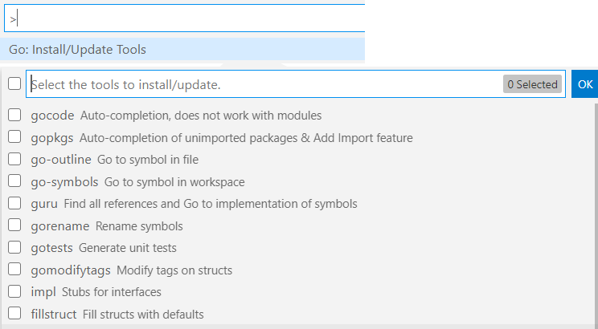

# 1 Linux环境安装

### 解压移动
```
$ tar -zxvf go1.15.6.linux-amd64.tar.gz
$ mv go /usr/local/
```

### 创建工作空间
```
$ mkdir -p  ~/golang/{bin,pkg,src}
```
bin : 目录包含可执行命令pkg : 目录包含包对象src : 目录包含go的源文件，它们被组织成包（每个目录都对应一个包）

### 配置环境变量
```
$ vim .zshrc 或 .bashrc
export GOROOT=/usr/local/go              # 安装目录。
export GOPATH=$HOME/golang     # 工作环境
export GOBIN=$GOPATH/bin           # 可执行文件存放
export PATH=$GOPATH:$GOBIN:$GOROOT/bin:$PATH       # 添加PATH路径
$ go version
```

# 2 安装Vscode插件
首先安装GO插件：


```bash
go env -w GO111MODULE=on
go env -w GOPROXY=https://goproxy.io,direct
```
打开vs code，在命令面板上选择安装相应的包：


