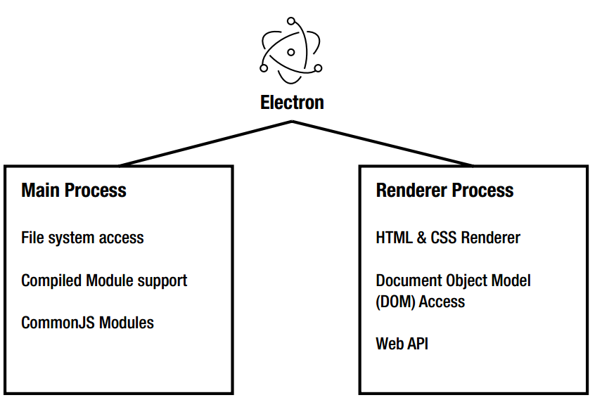
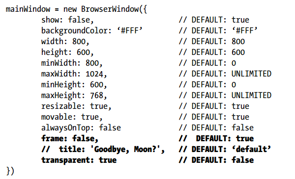
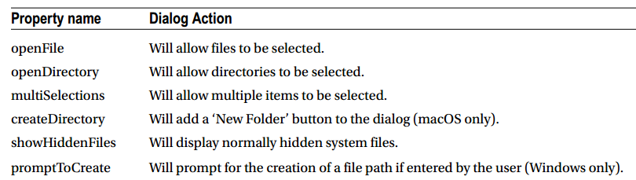
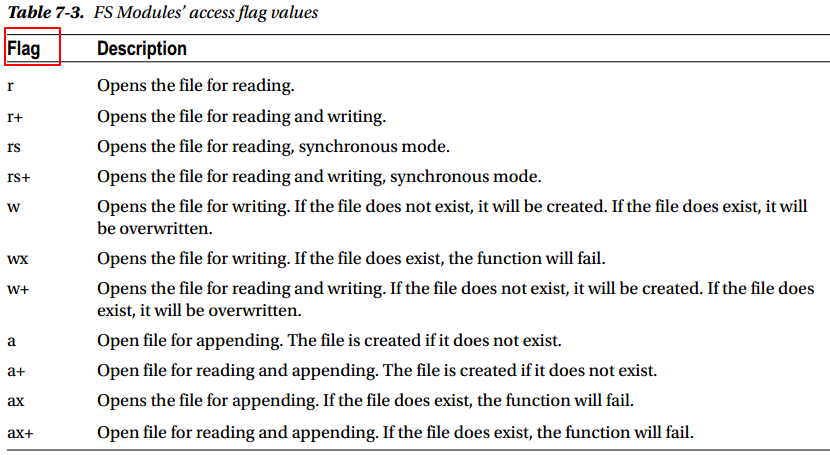

# 1. electron架构
项目文件中main.js用于main进程，renderer.js用于renderer进程

在渲染进程中，直接调用原生的GUI接口是十分危险的。如果你想在渲染进程中使用原生的GUI的功能，需要让渲染进程与主进程进行通信，再由主进程去调用对应接口。


# 2. BrowserWindow对象


## 1. 基本窗口属性


解释:

- title: 设置窗口标题，会被html中的title覆盖
- frame：是否只显示html内容，去除边框，工具栏等。注意在MAC上该选项无效，需要用titleBarStyle:'hidden'
- transparent: 设置是否透明


## 2. 设置任务栏进度条

```javascript
mainWindow.setProgressBar(0.5);
```

显示样式如下：


# 3.Menu对象：自定义菜单

```javascript
// create menu from template
let template = [
    {
      label: 'Edit App',
      submenu: [{
        label: 'Undo',  //菜单名称
        accelerator: 'CmdOrCtrl+Z', //快捷键
        role: 'undo' //点击时行为，可以使用内建
      },
      {
        type: 'separator' //菜单分割线
      },
      {
        label: 'item1',
        type: 'checkbox', //单选框，radio则为多选框
        checked: true //是否选中
      }
      }]
    }]
const menu = Menu.buildFromTemplate(template)
Menu.setApplicationMenu(menu)
```


## 1.内建role：定义好的行为，不需要代码定义行为

- undo
- redo
- cut
- copy
- paste
- pasteandmatchstyle
- selectall
- delete
- minimize - Minimize current window
- close - Close current window
- quit- Quit the application
- reload - Reload the current window
- toggledevtools - Toggle developer tools in the current window
- togglefullscreen- Toggle full screen mode on the current window
- resetzoom - Reset the focused page’s zoom level to the original size
- zoomin - Zoom in the focused page by 10%
- zoomout - Zoom out the focused page by 10%

mac特有的role:

- about - Map to the orderFrontStandardAboutPanel action
- hide - Map to the hide action
- hideothers - Map to the hideOtherApplications action
- unhide - Map to the unhideAllApplications action
- startspeaking - Map to the startSpeaking actionChapter
- stopspeaking - Map to the stopSpeaking action
- front - Map to the arrangeInFront action
- zoom - Map to the performZoom action
- window - The submenu is a “Window” menu
- help - The submenu is a “Help” menu
- services - The submenu is a “Services” menu


## 2. 自定义菜单行为

不使用role属性，改为click，后跟自己编写的函数名：

```json
{
label: 'Generate Icon',
click: doGenerateIcon //函数名
}
//或
{
	label: 'Reload',
	accelerator: 'CmdOrCtrl+R',
	click: function (item, focusedWindow) {
		if (focusedWindow) {
			// on reload, start fresh and close any old
			// open secondary windows
			if (focusedWindow.id === 1) {
				BrowserWindow.getAllWindows().forEach(function (win) {
					if (win.id > 1) {
						win.close()
					}
				})
			}
			focusedWindow.reload()
		}
	}
}
```

对于自定义函数，Electron会传递如下三个参数作为函数参数：

- menuItem: 触发函数的菜单项
- browerWindow: 触发函数的窗口实例
- event: 触发的事件


## 3. 右键菜单

右键菜单只能在renderer进程中创建，无法在mian中创建。
在renderer.js中创建菜单：

```javascript
//创建右键菜单
function createContextMenu() {
    const { remote } = require('electron')
    const { Menu, MenuItem } = remote

    const menu = new Menu()
    menu.append(new MenuItem({ label: 'MenuItem1', click() { console.log('item 1 clicked') } }))
    menu.append(new MenuItem({ type: 'separator' }))
    menu.append(new MenuItem({ label: 'MenuItem2', type: 'checkbox', checked: true }))

    window.addEventListener('contextmenu', (e) => {
        e.preventDefault()
        menu.popup({ window: remote.getCurrentWindow() })
    }, false)
}
```


# 4.IPC进程通信


## 1. sync同步通信

renderer进程需要使用ipcRenderer,使用sendSync向指定channel发送信息

```javascript
//进程间同步通信
const ipc = require('electron').ipcRenderer
const syncMsgBtn = document.getElementById("sendSyncMsgBtn")
syncMsgBtn.addEventListener('click', function(){
    const reply = ipc.sendSync("synchronous-message", "sync message from renderer process")  //sendSync表示同步消息
    document.getElementById("syncReply").innerHTML = reply
})
```

主进程中使用ipcMain监听指定channel，设置returnValue回复信息. arg为发送过来的数据

```javascript
//进程间通信
const ipc = require('electron').ipcMain
ipc.on("synchronous-message", function(event, arg){
  event.returnValue = "I know you!" 
})
```


## 2. async异步通信

异步通信，两个进程都需要发送消息来通信，不能使用return value这同步的方式了。同时，进程发送完消息后，可以进行其他任务，只需要设置监听reply的函数即可，不需要一直等待回复。

renderer进程

```javascript
//进程间异步通信
const asyncMsgBtn = document.getElementById("sendAsyncMsgBtn")
asyncMsgBtn.addEventListener("click", function(){
    ipc.send("async-message", "async message sent to you")
})
//因为是异步，设置监听函数，不需要在send之后浪费时间继续等待
ipc.on("async-reply", function(event, arg){ 
    document.getElementById("asyncReply").innerHTML = arg
})
```

主进程

```javascript
//进程间异步通信
ipc.on("async-message", function(event, arg){
  if(arg === "async message sent to you")
  {
    //因为是异步，需要发送消息指定channel，不能直接return value
    event.sender.send("async-reply", "got your async message")
  }
})
```


## 3. 删除监听

对于指定channel的监听，可以通过以下两个函数删除，对于ipcMain和ipcRenderer一样：

- removeListener(channel name, function): 删除指定监听函数
- removeAllListeners(channel): 删除所有监听

如果有个监听函数只需要使用一次，可以使用如下方法设置只有一次效果的监听：

- ipc.once(channel, listener)


# 5.dialog对话框


## 1. file open dialog

文件对话框类别：通过设置properties属性



dialog实现示例
dialog需要在主进程中显示，因此需要renderer和mian进程进行通信，获取到选定的文件或文件名之后再返回给renderer进程：

```javascript
//readerer.js:
//打开文件对话框,需要主进程来完成，这里用到同步通信
const selectDirBtn = document.getElementById("select-direcotry")
selectDirBtn.addEventListener("click", function (event) {
    const path = ipc.sendSync('open-directory-dialog')
    document.getElementById("selectedItem").innerHTML = path
})

//main.js
//接收renderer进程消息，打开对话框，获取选中文件或目录路径
const dia = dialog
ipc.on('open-directory-dialog', function (event) {
  //dialog需要附着于主windows，不然主窗口将可以操作
  dia.showOpenDialog(mainWindow, { properties: ['openDirectory'] }, function (file) {
    if (file)
      event.returnValue = file
  })
})
```


## 2. file save dialog

dialog实现示例

```javascript
//readerer.js:
//打开文件保存对话框
const saveBtn = document.getElementById("save-file")
saveBtn.addEventListener("click", function (event) {
    ipc.sendSync('save-file-dialog')
})

//main.js
//文件保存对话框
ipc.on('save-file-dialog', function (event) {
  //dialog需要附着于主windows，不然主窗口将可以操作
  dia.showSaveDialog(mainWindow, { defaultPath: '/Users/<username>/Documents/' }, function (file) {
    //文件保存在主进程中进行
    if (file) {
      var theStr = "hello barret!"
      var FS = require('fs')
      FS.writeFile(file, theStr, function (err) {
        if (err === null)
          console.log("saved")
        else
          console.log("error")
      })
    }
  })
})
```


## 3.  message dialog

```javascript
//直接上main.js
dia.showMessageBox({
    type: dialogType, //type可以为：info,error,question,none.并配有默认图标
    buttons: ['Save', 'Cancel', 'Don\'t Save'],
    defaultId: 0,
    cancelId: 1,
    title: 'Save Score',
    message: 'Backup your score file?',
    detail: 'Message detail'
  }, function(index){
    //选中哪个按钮
    console.log(index)
  })
```


## 4. error box

```javascript
//error box只有主标题和附加信息两个参数，没有其他操作
dialog.showErrorBox('Frak!', 'Cyclons reported on the port hanger deck!')
```


# 6. Nodejs FS模块


## 1. open file

对于普通的write和read，不需要显式调用open，write和read可以自动打开文件。对于输入流格式，需要显式调用open函数打开文件：

`fs.open(path, flags[, mode], callback)`




## 2. 获取文件状态

使用fs.stat函数：

```javascript
fs.stat(filePath, function (err, stats) {
	if (err) {
		return console.error(err)
	}
	console.log(stats)
	console.log("Got file info successfully!")
	// Check file type
	console.log("isFile ? " + stats.isFile())
	console.log("isDirectory ? " + stats.isDirectory())
})
```


## 3. 读写文件

```javascript
fs.writeFile(fileName, content, function (err) {
	if(err){
		console.log("An error occurred creating the file "+ err.message)
	} else {
		console.log ("The file has been successfully saved")
	}
})
```

```javascript
fs.readFile(filepath, 'utf-8', function (err, data) {
if(err){
alert("An error occurred reading the file :" + err.message)
return
}
//Display the file contents
console.log("The file content is : " + data)
})
```

**Note**: fs.readFileSync()用于异步读取文件内容


## 4.删除文件

```javascript
if ( fs.existsSync(filePath) ) {
	fs.unlink(filepath,function(err){
		if(err){
			console.log("An error ocurred updating the file"+ err.message)
			return
		}
		console.log("File succesfully deleted")
	})
}
```


## 5. 目录操作

```javascript
//创建目录
fs.mkdir(myDir, function(err){
	if (err) {
		console.log('mkdir err:'+err)
	}
	console.log('New Directory Created')
})
//获取目录下文件
fs.readdir('./', function(err, files){
	if (err) {
	console.log(‘readdir err:'+err)
	return
	}
	console.log(files)
})
//删除目录
fs.rmdir(myDir, function(err){
	if (err) {
		console.log('rmdir err:'+err)
		return
	}
	console.log('deleted the directory')
})
```


# 7. webContents


## 1. webContents支持的event

webContents支持如下事件，可以使用BrowserWindow.webContents.on('eventname', function(event))来设置监听：

| event | event | event |
| --- | --- | --- |
| “before-input-event” | “certificate-error” | “context-menu” |
| “crashed” | “cursor-changed” | “destroyed” |
| “devtools-closed” | “devtools-focused” | “devtools-opened” |
| “devtools-reload-page” | “did-change-theme-color” | “did-fail-load” |
| “did-finish-load” | “did-frame-finish-load” | “did-get-response-details” |
| “did-get-redirect-request” | “did-navigate” | “did-navigate-in-page” |
| “did-start-loading” | “did-stop-loading” | “dom-ready” |
| “found-in-page” | “login” | “media-started-playing” |
| “media-paused” | “new-window” | “page-favicon-updated” |
| “paint” | “plugin-crashed” | “select-client-certificate” |
| “select-bluetooth-device” | “update-target-url” | “will-attach-webview” |
| “will-navigate” | “will-prevent-unload” |  |


## 2. capturePage截屏

```javascript
//截屏并保存
ipc.on('capture-png', function (event) {
  windowTobeCaptured = BrowserWindow.fromId(event.sender.webContents.id); //获取要截屏的webContents对象
  bounds = windowTobeCaptured.getBounds(); //获取宽高,bouds保存x,y,widh,height
  //调用capturePage，截屏
  windowTobeCaptured.webContents.capturePage({ x: 0, y: 0, width: bounds.width, height: bounds.height }, function (image) {
    desktop = app.getPath('desktop');//桌面路径
    filePath = desktop + "/" + windowTobeCaptured.getTitle() + ".png";
    console.log(filePath);
    FS.writeFileSync(filePath, image.toPNG());//输入流形式写入文件
  })
    //调用capturePage，延时截屏， 等待500ms
  setTimeout(() => {
    windowTobeCaptured.webContents.capturePage({ x: 0, y: 0, width: bounds.width, height: bounds.height }, function (image) {
          desktop = app.getPath('desktop');//获取桌面路径
          filePath = desktop + "/" + windowTobeCaptured.getTitle() + ".png";
          console.log(filePath);
          FS.writeFileSync(filePath, image.toPNG());//输入流形式写入文件
     })
   }, 500);
});
```


## 3.  printToPDF

```javascript
//打印为PDF
ipc.on("print-pdf", function(event){
  windowTobePrint = BrowserWindow.fromId(event.sender.webContents.id); //获取要打印的webContents对象
  windowTobePrint.webContents.printToPDF({}, function(error, data){
      desktop = app.getPath('desktop');//获取桌面路径
      filePath = desktop + "/" + windowTobePrint.getTitle() + ".pdf";
      if(data){
        FS.writeFile(filePath, data, function(error){
          if(error)
            console.error(error.message);
        });
      }
  });
});.
```


# 8. Screens

Screens module提供屏幕信息，可以监听屏幕元素增删，窗口大小变化等。

```javascript
function getScreenInfo(){
  var screen = require('electron').screen;
  console.log('screen', screen.getAllDisplays());
  console.log('screen', screen.getPrimaryDisplay());
}
```


# 9. 如何引用jquery等第三方库

先用npm安装好bootstrap和jquery，然后使用require来调用(如果无法安装，则加上–global参数)

然后将html页面改成

```html
<link href="http://cdn.static.runoob.com/libs/bootstrap/3.3.7/css/bootstrap.min.css" rel="stylesheet">
<script>
    window.$ = window.jQuery = require('jQuery');
</script>
```
