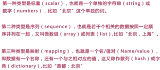
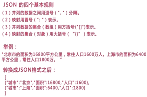

# 1 Json的三种变量类型

1. json必须使用unicode编码字符集，不是utf-8
1. 对象转换为json，只能转换公有的成员

**

# 2 json基本语法

# 3 json与其他数据类型转换

- son_encode将其他格式转换为json格式

`print_r(json_encode($array1)); `

- json_decode将json还原为原始类型,true表示原始类型，false表示json对象

`print_r(json_decode($json,true)); `

