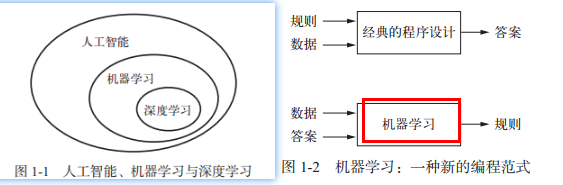
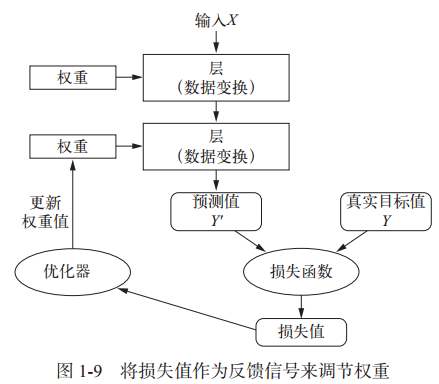
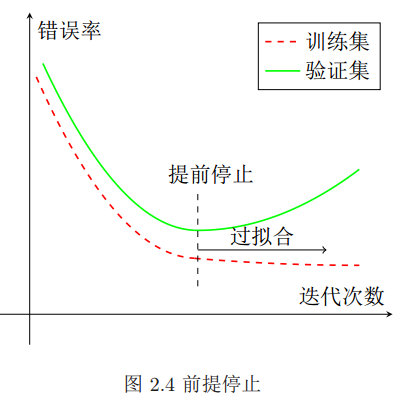
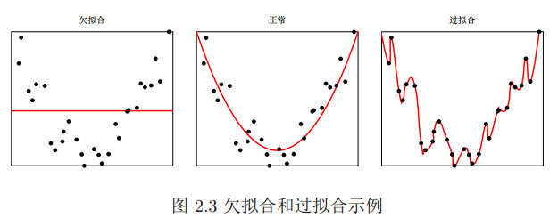
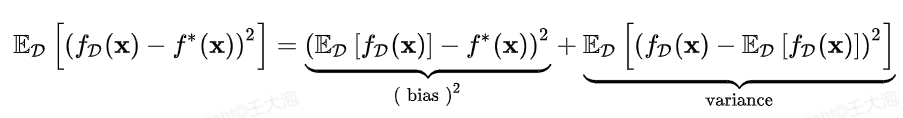
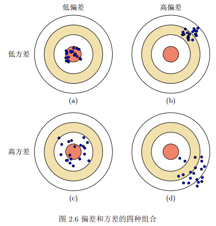
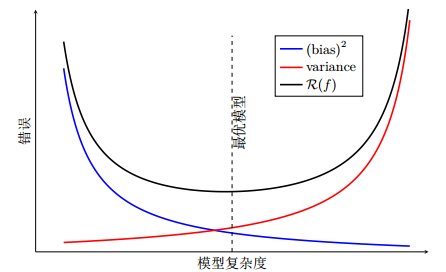
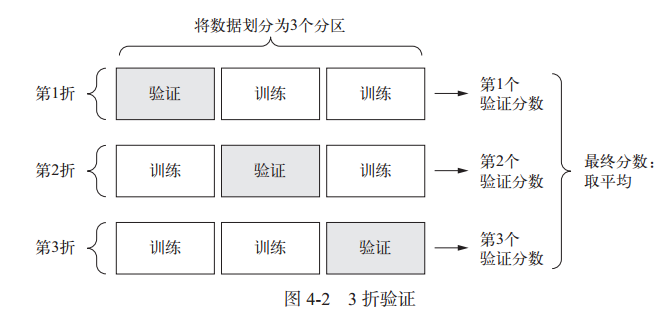

## 1 什么是机器学习

利用机器学习，人们输入的是数据和从这些数据中预期得到的答案，系统输出的是规则。这些规则随后可应用于新的数据，并使计算机自主生成答案。

机器学习（尤其是深度学习）呈现出相对较少的数学理论（可能太少了），并且是以工程为导向的。这是一门需要上手实践的学科，**想法更多地是靠实践来证明，而不是靠理论推导**。

### 1.1 深度学习

数据模型中包含多少层，这被称为模型的深度（depth）。 现代深度学习通常包含数十个甚至上百个连续的表示层，这些表示层全都是从训练数据中自动学习（**神经网络**）的。

当前工业界所使用的绝大部分机器学习算法都不是深度学习算法。**深度学习不一定总是解决问题的正确工具**：有时没有足够的数据，深度学习不适用；有时用其他算法可以更好地解决问题。

**要想在如今的应用机器学习中取得成功，你应该熟悉这两种技术：梯度提升机，用于浅层学习问题；深度学习，用于感知问题**。

## 2 机器学习三要素

利用机器学习，人们输入的是数据和从这些数据中预期得到的答案，系统输出的是规则。这些规则可用于新的数据，并使计算机自主生成答案。

### 2.1 要素1：模型

机器学习的目标是找到一个**模型**来近似真实映射函数g(x)或真实条件概率分布pr(y|x)。 通常是根据经验确定一个假设的函数集合，从中选择一个理想的模型。模型分为**线性和非线性两种模型**。

- 线性模型： 一个参数话的线性函数族，w为权重向量，b为偏移量，函数公式为：%20%3D%20w%5ETx%20%2B%20b#card=math&code=f%28x%3B%20%CE%B8%29%20%3D%20w%5ETx%20%2B%20b&height=23&width=129)。
- 非线性模型：多个非线性基函数的线性组合，ϕ(x) = [ϕ1(x), ϕ2(x), · · · , ϕK(x)]T 为 K 个非线性基函数组成的向量，参数θ 包含了权重向量 w和偏置 b。函数公式为$f(x; θ) = w^Tϕ(x) + b $。

### 2.2 要素2：学习准则

#### 2.2.1 损失函数

损失函数（也叫**目标函数**）是一个非负实数函数，用来量化模型预测和真实标签之间的差异。常见损失函数如下：

- **0-1损失函数**：直接判断预测值和真实值是否相等
- **平方损失函数**：计算预测值和真实值差值的平方
- **交叉熵损失函数**：公式为$L(y, f(x; θ)) = - log f{y}(x; θ) %20%3D%20%5B0.3%2C%200.3%2C%200.4%5DT%EF%BC%8C%E5%88%99%E5%AE%83%E4%BB%AC%E7%9A%84%E4%BA%A4%E5%8F%89%E7%86%B5%E4%B8%BA%EF%BC%9A#card=math&code=%EF%BC%8C%E9%80%82%E7%94%A8%E4%B8%8E%E5%88%86%E7%B1%BB%E9%97%AE%E9%A2%98%E3%80%82%E4%BE%8B%E5%A6%82%E5%AF%B9%E4%BA%8E%E4%B8%89%E7%B1%BB%E5%88%86%E7%B1%BB%E9%97%AE%E9%A2%98%EF%BC%8C%E4%B8%80%E4%B8%AA%E6%A0%B7%E6%9C%AC%E7%9A%84%E6%A0%87%E7%AD%BE%E5%90%91%E9%87%8F%E4%B8%BA%20y%20%3D%20%5B0%2C%200%2C%201%5DT%EF%BC%8C%E6%A8%A1%E5%9E%8B%E9%A2%84%E6%B5%8B%E7%9A%84%E6%A0%87%E7%AD%BE%E5%88%86%E5%B8%83%E4%B8%BA%20f%28x%3B%20%CE%B8%29%20%3D%20%5B0.3%2C%200.3%2C%200.4%5DT%EF%BC%8C%E5%88%99%E5%AE%83%E4%BB%AC%E7%9A%84%E4%BA%A4%E5%8F%89%E7%86%B5%E4%B8%BA%EF%BC%9A&height=24&width=1062)L(θ) = -0 × log(0.3) + 0 × log(0.3) + 1 × log(0.4)$。
- **Hinge损失函数**

对于常见的问题，可以遵循一些简单的指导原则选择正确的损失函数

#### 2.2.2 激活函数

神经层如果没有**激活函数**，就只能学习输入数据的线性变换。这种假设空间非常有限，无法利用多个表示层的优势，因为**多个线性层堆叠实现的仍是线性运算，添加层数并不会扩展假设空间**。

为了得到更丰富的假设空间，从而充分利用多层表示的优势，需要添加**非线性或激活函数**。**relu**是深度学习中最常用的激活函数。

| 问题类型 | 最后一层激活函数 | 损失函数 |
| --- | --- | --- |
| 二分类问题 | sigmoid | binary_crossentropy |
| 多分类、单标签问题 | softmax | categorical_crossentropy |
| 多分类、多标签问题 | sigmoid | binary_crossentropy |
| 回归到任意值 | 无 | mse |
| 回归到 0~1 范围内的值 | sigmoid | mse 或 binary_crossentropy |

### 2.3 要素3：优化算法

优化又可以分为参数优化和超参数优化。模型f(x; θ)中的 θ 称为模型的**参数**； 还有一类参数是用来定义模型结构或优化策略的，这类参数叫做**超参数**。常见的超参数包括：聚类算法中的类别个数、梯度下降法的步长、正则项的系数、神经网络的层数、支持向量机中的核函数等。
优化算法更新权重值，重新进行训练（即**反向传播算法**），其基本流程如下：

在机器学习中，最简单、常用的优化算法就是**梯度下降法，**即通过迭代的方法来计算训练集D 上风险函数的最小值。**梯度下降过程必须基于单个标量损失值**。因此，对于具有多个损失函数的网络，需要将所有损失函数取平均，变为一个标量值。
针对梯度下降的优化算法，除了加正则化项之外，还可以通过**提前停止**来防止过拟合：在每次迭代时，把新得到的模型 f(x; θ) 在验证集上进行测试，并计算错误率。 如果在验证集上的错误率不再下降，就停止迭代。

- **随机梯度下降法**：为了减少每次迭代的计算复杂度，我们也可以在每次迭代时**只采集一个样本**，计算这个样本损失函数的梯度并更新参数。该方法收敛速度快，但是可能错过局部最优点
- **小批量梯度下降法**：批量梯度下降和随机梯度下降的折中。每次迭代时，我们**随机选取一小部分训练样本**来计算梯度并更新参数，这样既可以兼顾随机梯度下降法的优点，也可以提高训练效率

## 3 偏差-方差分解

### 3.1 过拟合和欠拟合

通常情况下，我们无法获取无限的训练样本，并且训练样本往往是真实数据的一个很小的子集或者包含一定的噪声数据，不能很好地反映全部数据的真实分布。经验风险最小化原则很容易导致模型**在训练集上错误率很低，但是在未知数据上错误率很高**。这就是所谓的**过拟合(overfit)**。
过拟合问题往往是由于训练数据少和噪声以及模型能力强等原因造成的。为了解决过拟合问题，一般在经验风险最小化的基础上再引入参数的**正则化（Regularization）**，来限制模型能力，使其不要过度地最小化经验风险。

和过拟合相反的一个概念是**欠拟合（Underfitting）**，即模型不能很好地拟合训练数据，在训练集的错误率比较高。欠拟合一般是由于模型能力不足造成的。

### 3.2 偏差-方差评估

对于单个样本 x，不同训练集 D 得到模型 fD(x)和最优模型 f ∗(x)的上的期望差距为

- 第一项为**偏差**（Bias），是指一个模型的在不同训练集上的平均性能和最优模型的差异。偏差可以用来衡量一个模型的**拟合能力**
- 第二项是**方差**（Variance），是指一个模型在不同训练集上的差异，可以用来衡量一个模型**是否容易过拟合**

**就像打靶一样，偏差是打靶前瞄准的位置与靶心的距离（拟合能力）；方差是实际射出的箭与瞄准点的差距（泛化能力）。**
下图给出了机器学习算法的偏差和方差的四种不同组合情况。每个图的中心点为最优模型f ∗(x)，蓝点为不同训练集D上得到的模型fD(x) ：

- 图2.6a给出了一种理想情况，方差和偏差都比较小。
- 图2.6b为高偏差低方差的情况，表示模型的泛化能力很好，但拟合能力不足。
- 图2.6c为低偏差高方差的情况，表示模型的拟合能力很好，但泛化能力比较差。当训练数据比较少时会导致过拟合。
- 图2.6d为高偏差高方差的情况，是一种最差的情况

下图给出了机器学习模型的期望错误、偏差和方差随复杂度的变化情况，**最优的模型并不一定是偏差曲线和方差曲线的交点**

- 当一个模型在训练集上的错误率比较高时，说明模型的拟合能力不够，偏差比较高：可以**增加数据特征、提高模型复杂度，减少正则化系数**等操作来改进模型
- 当模型在训练集上的错误率比较低，但验证集上的错误率比较高时，说明模型过拟合，方差比较高：可以通过**降低模型复杂度，加大正则化系数，引入先验**等方法来缓解

## 4 模型评估标准

### 4.1 评估标准

为了衡量一个机器学习模型的好坏，需要给定一个测试集，用模型对测试集中的每一个样本进行预测，并根据预测结果计算评价分数。常见的评价标准有：

- **准确率**：
  $$
  \mathcal{A C C}=\frac{1}{N} \sum_{n=1}^{N} I\left(y^{(n)}=\hat{y}^{(n)}\right)
  $$
- **错误率**：
  $$
  \begin{aligned} \mathcal{E} &=\frac{1}{N} \sum_{n=1}^{N} I\left(y^{(n)} \neq \hat{y}^{(n)}\right) \end{aligned}
  $$
- **查准率**：类别c的查准率为是所有预测为类别c的样本中，预测正确的比例 
  $$
  \mathcal{P}_{c}=\frac{T P_{c}}{T P_{c}+F P_{c}}
  $$
- **查全率**：也叫召回率，所有真实标签为类别c的样本中，预测正确的比例
  $$
  \mathcal{R}_{c}=\frac{T P_{c}}{T P_{c}+F N_{c}}
  $$
- **F值**：查准率和查全率的调和平均:
  $$
  \mathcal{F}_{c}=\frac{\left(1+\beta^{2}\right) \times \mathcal{P}_{c} \times \mathcal{R}_{c}}{\beta^{2} \times \mathcal{P}_{c}+\mathcal{R}_{c}}
  $$
- **宏平均**：每一类的性能指标的算术平均值

- **微平均**：每一个样本的性能指标的算术平均

## 5 数据集划分方式

### 5.1 简单的留出验证

流出一定比例的数据作为**测试集**，剩余作为训练集。有一个缺点：如果可用的数据很少，那么可能验证集和测试集包含的样本就太少，从而无法在统计学上代表数据 。

### 5.2 K折交叉验证

把原始数据集平均分为 K 组（K>3）不重复的子集，每次选 K - 1组子集作为训练集，剩下的一组子集作为验证集。这样可以进行 K 次试验并得到K 个模型。这 K 个模型在各自验证集上的错误率的平均作为分类器的评价

另外一种变形叫**重复K折验证**，即多次使用 K 折验证，在每次将数据划分为 K 个分区之前都先将数据打乱。最终分数是每次 K 折验证分数的平均值， 这种方法一共要训练和评估 P×K 个模型（P是重复次数），计算代价很大。
