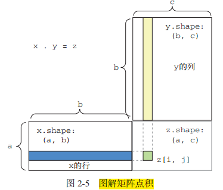
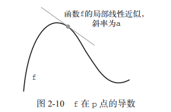
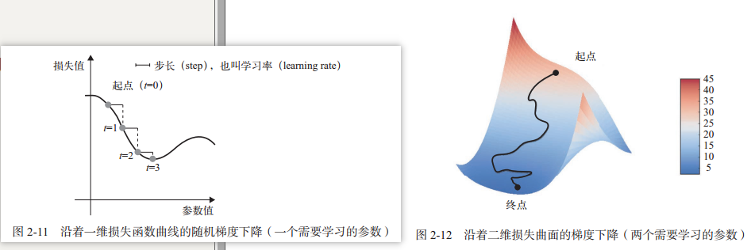
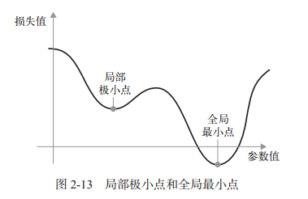
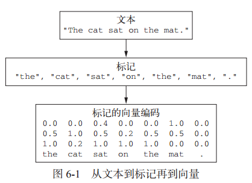
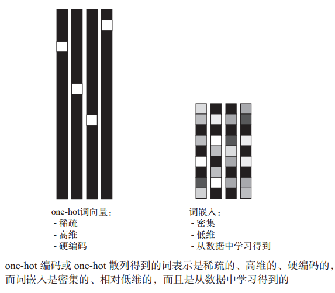

在机器学习中，分类问题中的某个类别叫作**类**（class）。数据点叫作**样本**（sample）。某个样本对应的类叫作**标签**（label）。
一个简单的keras神经网络代码：

```python
from keras.datasets import mnist
from keras import models
from keras import layers
from keras.utils import to_categorical

(train_images, train_labels), (test_images, test_labels) = mnist.load_data()

network = models.Sequential()
#添加两个密集层，每层做简单张量运算
network.add(layers.Dense(512, activation='relu', input_shape=(28*28,)))
network.add(layers.Dense(10, activation='softmax')) #第二层，输出为10个概率值的数组，对应0-9十个数的概率
network.compile(optimizer='rmsprop',                   # 设置梯度下降的具体方法
                loss='categorical_crossentropy',       # 指定损失函数
                metrics=['accuracy'])                  # 要监测的指标


# 对数据集进程预处理
train_images = train_images.reshape((60000, 28 * 28))
train_images = train_images.astype('float32') / 255 # 变换为一个 float32 数组，其形状为 (60000, 28 * 28)，取值范围为 0~1
test_images = test_images.reshape((10000, 28 * 28))
test_images = test_images.astype('float32') / 255 # 变换为一个 float32 数组，其形状为 (10000, 28 * 28)，取值范围为 0~1

# 标签处理
train_labels = to_categorical(train_labels)
test_labels = to_categorical(test_labels)

# 模型训练循环
network.fit(train_images, train_labels, epochs=5, batch_size=128) # 分5次训练，每次128个样本

# 得到训练结果，在测试集上验证准确率
test_loss, test_acc = network.evaluate(test_images, test_labels)
print('test_acc:', test_acc)
```


## 1 数据如何表示

张量这一概念的核心在于，它是一个数据容器。它包含的数据几乎总是数值数据，因此它是**数字的容器**。张量的**维度**（dimension）通常叫作**轴**（axis）或**阶** 。


### 1.1 标量 - 0D张量

**标量**是仅仅包含**一个数字**的张量（0维张量）。**ndim**属性标识一个Numpy张量的轴个数，标量的ndim为0。

```python
x = np.array(12)
```


### 1.2 向量 - 1D张量

数字组成的数组叫作**向量**（vector）或一维张量（1D 张量）。一维张量只有一个轴。

```python
x = np.array([12, 3, 6, 14, 7])   # 一维张量，这里5个元素，也叫5维向量
```


### 1.3 矩阵 - 2D张量

向量组成的数组叫作**矩阵**（matrix）或二维张量（2D 张量）。矩阵**有 2 个轴**（通常叫作行和列） 。

```python
x = np.array([[5, 78, 2, 34, 0],
			[6, 79, 3, 35, 1],
			[7, 80, 4, 36, 2]])
```

深度学习处理的一般是 0D 到 4D 的张量，但处理视频数据时可能会遇到 5D 张量。


## 2 Numpy张量运算


### 2.1 张量的关键属性
| 属性 | numpy中属性名 | 说明 |
| --- | --- | --- |
| 轴个数 | **ndim** | 即张量的维度，也叫阶 |
| 形状 | **shape** | 张量的每个轴上大小组成的元组，2维的即长和宽 |
| 数据类型 | **dtype** | 数据的类型，不允许字符串张量 |


### 2.2 张量切片

选择张量的特定元素叫作张量切片（tensor slicing）， **[]**加上每个轴上的**起始索引和结束索引**，可以对张量进行切片。索引格式为：`起始索引 ：结束索引`，**：**等同于整个轴，某一边不写，默认带开头或结尾。

```python
my_slice = train_images[10:100]
my_slice = train_images[10:100, :, :]  #等同，选取10-100之间的90个张量

my_slice = train_images[:, 14:, 14:] # 选取所有张量，从右下角开始裁剪为14x14
```


### 2.3 广播

如果将两个形状不同的张量相加，会发生什么？
较小的张量会被**广播**（broadcast），以匹配较大张量的形状。广播包含以下两步：

- 向较小的张量添加轴（叫作广播轴），**使其 ndim 与较大的张量相同**。
- 将较小的张量**沿着新轴重复**，使其形状与较大的张量相同

在实际的实现过程中并不会创建新的 2D 张量，因为那样做非常低效。重复的操作完全是虚拟的，它只出现在算法中，而没有发生在内存中。 例如，下面的大小比较，在numpy中是可以执行的：

```python
import numpy as np
x = np.random.random((64, 3, 32, 10)) # x 是形状为 (64, 3, 32, 10) 的随机张量
y = np.random.random((32, 10)) # x 是形状为 (64, 3, 32, 10) 的随机张量
z = np.maximum(x, y) # 输出 z 的形状是 (64, 3, 32, 10)，与 x 相同
```


### 2.4  点积

在Numpy中，**点积是用标准的dot运算符表示**（逐元素乘积用==*==表示）。

- **一维向量的点积**：两个向量之间的点积是**一个标量**，而且只有元素个数相同的向量之间才能做点积
- **二维矩阵和一维向量的点积**：返回一个向量，其中每个元素是y与x的每一行的点积。矩阵第 1 维和向量的第 0 维大小必须相同。**如果两个张量中有一个的 ndim 大于 1，那么 dot 运算就不再是对称的**，也就是说，dot(x, y) 不等于 dot(y, x)
- **矩阵的点积**：对于两个矩阵 x 和 y，当且仅当 x.shape[1] == y.shape[0] 时，你才可以对它们做点积（dot(x, y)）。得到的结果是一个形状为 (x.shape[0], y.shape[1]) 的矩阵，其元素为 **x的行与 y 的列之间的点积**。图示如下：




### 2.5 张量变形

张量**变形是指改变张量的行和列**，以得到想要的形状。**变形后的张量的元素总个数与初始张量相同**，行和列的长度可以随意变换。

```python
x = np.array([[0., 1.],[2., 3.],[4., 5.]])
x = x.reshape((6, 1)) # 调用reshape

# array([[ 0.],
# [ 1.],
# [ 2.],
# [ 3.],
# [ 4.],
# [ 5.]])
```

**转置**（transposition）是一种特殊的变形，是指**将行和列互换**，使 x[i, :] 变为 x[:, i] 。

```python
>>> x = np.zeros((300, 20))
>>> x = np.transpose(x)
>>> print(x.shape)
(20, 300)
```


## 3 导数和梯度下降优化


### 3.1 导数和梯度

假设有一个连续的光滑函数 f(x) = y ，在某个点 p 附近，如果 epsilon_x足够小，就可以将 f 近似为**斜率为 a **的线性函数。
**斜率 a 被称为 f 在 p 点的导数**（derivative）。如果 a 是负的，说明 x 在 p 点附近的微小变化将导致 f(x) 减小（如图 2-10 所示）；如果 a 是正的，那么 x 的微小变化将导致 f(x) 增大。此外， a 的绝对值（导数大小）表示增大或减小的速度快慢。图示如下：



**可微函数**意思为**可以被求导**，即都存在一个导数函数 f'(x)，将 x 的值映射为 f 在该点的局部线性近似的斜率。

**梯度就是张量运算的导数**。


### 3.2 随机梯度下降

基于当前在随机数据批量上的损失，一点一点地对参数进行调节。由于处理的是一个可微函数，你可以计算出它的梯度，沿着梯度的反方向更新权重，损失每次都会变小一点。

**小批量随机梯度下降**流程：

- 抽取训练样本 x 和对应目标 y 组成的数据批量。在 x 上运行网络，得到预测值 y_pred。
- 计算网络在这批数据上的损失，用于衡量 y_pred 和 y 之间的距离。
- 计算损失相对于网络参数的梯度［一次**反向传播（**backward pass）］。
- 将参数沿着梯度的反方向移动一点，比如 W -= step * gradient，从而使这批数据上的损失减小一点。



从上图一维图可以看到，**学习率**的取值比较关键：如果取值太小，则梯度下降的迭代会很多，可能陷入**局部极小点**（比如想象有两个低谷的曲线，下图）；取值太大，可能直接掠过loss最小点。



**动量方法**（相信一个小球滑下，会停留在哪里）可以优化局部极小点的问题，在更新参数值时不仅要考虑当前梯度值，还要考虑上一次的参数更新：

```python
past_velocity = 0.
momentum = 0.1    # 固定值，动量因子（类似小球的重力加速度）
while loss > 0.01: 
	w, loss, gradient = get_current_parameters()
	velocity = past_velocity * momentum - learning_rate * gradient # 计算收敛速度时，参考上一次速度
	w = w + momentum * velocity - learning_rate * gradient # 更新参数w值
	past_velocity = velocity # 将本次收敛速度保存
	update_parameter(w)
```


## 4 文本序列数据的表示

**文本向量化**是指将文本转换为数值张量的过程，主要实现方式有：

- 将文本分割为**单词**，每个单词转换为一个向量
- 将文本分割为**字符**，每个字符转换为一个向量
- 提取单词或字符的**n-gram**，将每个n-gram转换为一个向量。（**n-gram是多个连续单词或字符的集合**）

如下图，将文本分割为**标记**（单词，字符，n-gram)后，可以通过**one-hot编码**和**词嵌入**转换为向量。




### 4.1 one-hot编码

one-hot编码将**每个单词或字符与一个唯一的证书索引关联，然后将这个证书索引index转换为长度为N（N为整个词表大小）的二进制向量，这个向量只有第index个元素为1，其他为0**。

Keras 的内置函数可以对原始文本数据进行单词级或字符级的 one-hot 编码，推荐使用**keras内置函数**，因为它们实现了许多重要特性：

```python
from keras.preprocessing.text import Tokenizer

samples = ['The cat sat on the mat.', 'The dog ate my homework.']
# 创建一个分词器，设置值考虑前1000个单词
tokenizer = Tokenizer(num_words=1000)
# 构建单词索引
tokenizer.fit_on_texts(samples)
# 将字符串转换为整数索引列表
sequences = tokenizer.texts_to_sequences(samples)
# 得到one-hot二进制编码
one_hot_results = tokenizer.texts_to_matrix(samples, mode='binary')
print(one_hot_results)
# 得到单词索引
word_index = tokenizer.word_index
print('Found %s unique tokens.' % len(word_index))
```


### 4.2 one-hot哈希编码

如果词表中唯一标记的数量太大而无法直接处理，推荐使用该方法。

该方法没有为每个单词显式分配一个索引并将这些索引保存在一个字典中，而是**将单词散列编码为固定长度的向量**，通常用一个非常简单的**哈希函数**来实现。

这种方法的主要优点在于，它避免了维护一个显式的单词索引，从而节省内存并允许数据的在线编码（在读取完所有数据之前，你就可以立刻生成标记向量）。

这种方法有一个缺点，就是可能会出现**散列冲突**（hash collision），即两个不同的单词可能具有相同的散列值，随后任何机器学习模型观察这些散列值，都无法区分它们所对应的单词。

```python
import numpy as np

samples = ['The cat sat on the mat.', 'The dog ate my homework.']

dimensionality = 1000  # 哈希长度为1000，如果单词个数接近1000，会出现哈希冲突，暴露缺点
max_length = 10

results = np.zeros((len(samples), max_length, dimensionality))
for i, sample in enumerate(samples):
    for j, word in list(enumerate(sample.split()))[:max_length]:
        index = abs(hash(word)) % dimensionality
        results[i, j, index] = 1.

print(results)
```


### 4.3 词嵌入

one-hot 编码得到的向量是二进制的、稀疏的（绝大部分元素都是 0）、维度很高的（维度大小等于词表中的单词个数）；而词嵌入是低维的浮点数向量（即密集向量，与稀疏向量相对），词向量可以将更多的信息塞入更低维度：



有两种方法可以获取词嵌入：


#### 4.3.1 利用Embedding层学习词嵌入

在完成主任务（比如稳定分类或情感预测）的同时学习词嵌入，和学习神经网络的权重相同。

可以将 Embedding 层理解为一个**字典**，将整数索引（表示特定单词）映射为密集向量，它接收整数作为输入，并在内部字典中查找这些整数，然后返回相关联的向量。Embedding 层的**输入是一个二维整数张量**，其形状为 (samples, sequence_length) ，**返回一个形状为 (samples, sequence_length, dim) 的三维浮点数张量**，然后可以用 RNN 层或一维卷积层来处理这个三维张量。

如果有大量的样本，该方法比使用预训练的词嵌入要更有效。

代码示例如下：

```python
# 利用embedding层在训练网络的同时学习词嵌入
from keras.layers import Embedding, Flatten, Dense
from keras.datasets import imdb
from keras.models import Sequential
from keras import preprocessing

max_features = 10000  # 作为特征的单词个数
maxlen = 20  # 值选取评论的前20个单词

(x_train, y_train), (x_test, y_test) = imdb.load_data(num_words=max_features)
# 将整数列表转换为二维整数张量
x_train = preprocessing.sequence.pad_sequences(x_train, maxlen=maxlen)
x_test = preprocessing.sequence.pad_sequences(x_test, maxlen=maxlen)

# 在IMDB数据集上使用Embedding层和分类器
model = Sequential()
# 新建embedding层，至少需要两个参数，标记的个数&嵌入的维度
model.add(Embedding(10000, 8, input_length=maxlen))  # 输出形状为(sample, maxlen, 8)
model.add(Flatten())  # 将三位的嵌入张量展平为(sample,maxlen*8)的二位张量
model.add(Dense(1, activation='sigmoid'))  # 添加分类器，分为两类

model.compile(optimizer='rmsprop', loss='binary_crossentropy', metrics=['acc'])
print(model.summary())

# 训练模型
history = model.fit(x_train,
                    y_train,
                    epochs=10,
                    batch_size=32,
                    validation_split=0.2)
```


#### 4.3.2 使用预训练的词嵌入

有时可用的训练数据很少，以至于只用手头数据无法学习适合特定任务的词嵌入。与使用预训练的卷积网络一样的原理，没有足够的数据来自己学习真正强大的特征，但你**需要的特征应该是非常通用的**，比如常见的视觉特征或语义特征。在这种情况下，重复使用在其他问题上学到的特征，这种做法称为**预训练的词嵌入**。

示例：下载[GloVe](https://nlp.stanford.edu/projects/glove)词嵌入(斯坦福基于维基百科数据训练的)，并应用与EmBedding层

```python
glove_dir = './glove.6B'
embeddings_index = {}  # 保存解析过的Glove词嵌入

f = open(os.path.join(glove_dir, 'glove.6B.100d.txt'))
for line in f:
    values = line.split()
    word = values[0]
    coefs = np.asarray(values[1:], dtype='float32')
    embeddings_index[word] = coefs
f.close()


embedding_dim = 100
# 准备词嵌入矩阵
embedding_matrix = np.zeros((max_features, embedding_dim))

for word, i in word_index.items():  # 单词索引，通过tokenizer从原始文本获得
    if i < max_features:
        embedding_vector = embeddings_index.get(word)
        if embedding_vector is not None:
            embedding_matrix[i] = embedding_vector

model = Sequential()
# 添加Embedding层作为第一层，用于载入词嵌入矩阵
model.add(Embedding(max_features, embedding_dim, input_length=maxlen))
model.add(Flatten())
model.add(Dense(32, activation='relu'))
model.add(Dense(1, activation='sigmoid'))

# 将预训练的词嵌入矩阵加载到Embedding层
model.layers[0].set_weights([embedding_matrix])
model.layers[0].trainable = False  # 冻结Embedding层，避免被重新训练

# 后面正常compile和fit训练
```
