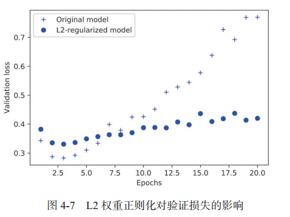

## 1 keras入门

在 Keras 中，构建深度学习模型就是将相互兼容的多个层拼接在一起，以建立有用的数据变换流程，不同的张量格式与不同的数据处理类型需要用到不同的层 。**每一层只接受特定形状的输入张量，并返回特定形状的输出张量**。

- Dense类密集层：简单的向量数据，形状为 (samples, features) 的 2D 张量
- LSTM循环层：序列数据，形状为 (samples, timesteps, features) 的 3D 张量
- Conv2D二维卷积层：图像数据，4D张量

典型的keras开发流程如下：

1. 定义训练数据：输入张量和目标张量。
2. 定义层组成的网络（或模型），将输入映射到目标。
3. 配置学习过程：选择损失函数、优化器和需要监控的指标。
4. 调用模型的 fit 方法在训练数据上进行迭代。


### 1.1 定义模型的方法

定义模型有两种方法：一种是使用 **Sequential 类（**仅用于层的线性堆叠，这是目前最常见的网络架构），另一种是**函数式 API**（functional API，用于层组成的有向无环图，让你可以构建任意形式的架构）。

```python
# sequential类：
model = models.Sequential()
model.add(layers.Dense(32, activation='relu', input_shape=(784,)))
model.add(layers.Dense(10, activation='softmax'))

# 函数API
input_tensor = layers.Input(shape=(784,))
x = layers.Dense(32, activation='relu')(input_tensor)
output_tensor = layers.Dense(10, activation='softmax')(x)
model = models.Model(inputs=input_tensor, outputs=output_tensor)
```


### 1.2 层的堆叠

对于**全连接层Dense**的堆叠，需要确定以下两个关键架构：

- 网络有多少层
- 每层有多少个隐藏单元

`model.summary()`可以查看当前网络的架构。

```python
>>> model = models.Sequential()
>>> model.add(layers.Dense(32, activation='relu', input_shape=(784,)))
>>> model.add(layers.Dense(10, activation='softmax'))
>>> model.summary()
_________________________________________________________________
Layer (type)                 Output Shape              Param #
=================================================================
dense_3 (Dense)              (None, 32)                25120
_________________________________________________________________
dense_4 (Dense)              (None, 10)                330
=================================================================
Total params: 25,450
Trainable params: 25,450
Non-trainable params: 0
_________________________________________________________________
```


### 1.3 获取训练过程中的数据

model.fit()返回了一个 **History 对象**。这个对象有一个成员 history，它是一个字典，包含训练过程中的所有数据：**['acc', 'loss', val_acc', 'val_loss'] 分别代表训练集精度，训练集loss，验证集精度，验证集loss**。

另外，如果只想得到模型在训练数据上的精度和loss，可以使用**model.evaluate(x_test, y_test)**方法获取。


### 1.4 将训练好的模型用于生成结果

上面1.3只能得到数据集上的精度和loss，而我们最终要用模型得到预测结果而不是精度。可以用**model.predict(x_test)**方法获取在训练集上的预测结果：

```python
>>model.predict(x_test)
array([[ 0.98006207]
[ 0.99758697]
[ 0.99975556]
...,
[ 0.82167041]
[ 0.02885115]
[ 0.65371346]], dtype=float32)
```


## 2 二分类问题示例：IMDB电影评价


### 2.1 要点

下面是你应该从这个例子中学到的要点：

- **通常需要对原始数据进行大量预处理**，以便将其转换为张量输入到神经网络中。单词序
列可以编码为二进制向量，但也有其他编码方式。
- **带有 relu 激活的 Dense 层堆叠，可以解决很多种问题**（包括情感分类），你可能会经
常用到这种模型。
- 对于二分类问题（两个输出类别），网络的**最后一层应该是只有一个单元并使用 sigmoid**
**激活的 Dense 层，网络输出应该是 0~1 范围内的标量**，表示概率值。
- 对于二分类问题的 sigmoid 标量输出，你应该使用 **binary_crossentropy** 损失函数。
- **无论你的问题是什么， rmsprop 优化器通常都是足够好的选择**。这一点你无须担心。
- 随着神经网络在训练数据上的表现越来越好，模型最终会**过拟合**，并在前所未见的数据
上得到越来越差的结果。一定要一直监控模型在训练集之外的数据上的性能。


### 2.2 源代码

完整代码如下：

```python
# IMDB数据集分类，将电影库的评论分为好和坏两种评论
from keras.datasets import imdb
from keras import models
from keras import layers
import numpy as np
import matplotlib.pyplot as plt

# 从数据中选择10000个单词
(train_data, train_labels), (test_data,
                             test_labels) = imdb.load_data(num_words=10000)


# 将整数序列编码为二进制矩阵
# 举个例子，序列 [3, 5] 将会被转换为 10 000 维向量，只有索引为 3 和 5 的元素是 1，其余元素都是 0。
def vectorize_sequences(sequeces, dimension=10000):
    results = np.zeros((len(sequeces), dimension))  # 创建一个0矩阵
    for i, sequence in enumerate(sequeces):
        results[i, sequence] = 1
    return results
# 注意keras内置to_categorical方法实现one-hot编码，可以将array转换成二进制矩阵，和上面函数操作一样，但是输入必须是array，上面的是sequeces，所以这里还不能用。

# 将训练数据和测试数据向量化
x_train = vectorize_sequences(train_data)
x_test = vectorize_sequences(test_data)
# 将标签向量化
y_train = np.asarray(train_labels).astype('float32')
y_test = np.asarray(test_labels).astype('float32')
# 留出验证集
x_val = x_train[:10000]
partial_x_train = x_train[10000:]
y_val = y_train[:10000]
partial_y_train = y_train[10000:]

# 构建神经网络层
model = models.Sequential()
model.add(layers.Dense(16, activation='relu', input_shape=(10000, )))
model.add(layers.Dense(16, activation='relu'))  # relu将所有负值归零
model.add(layers.Dense(1, activation='sigmoid'))  # sigmoid将任意值压缩到0-1之间

# 编译模型，选择损失函数和优化器
model.compile(optimizer='rmsprop',
              loss='binary_crossentropy',
              metrics=['accuracy'])

# 训练模型, history包含训练过程中所有数据
history = model.fit(partial_x_train,
                    partial_y_train,
                    epochs=20,
                    batch_size=500,
                    validation_data=(x_val, y_val))

# 绘制训练损失和验证损失
history_dic = history.history
loss_value = history_dic['loss']
val_loss_values = history_dic['val_loss']
epochs = range(1, len(loss_value) + 1)

plt.plot(epochs, loss_value, 'bo', label='training loss')  # bo为蓝色圆点
plt.plot(epochs, val_loss_values, 'b', label='test loss')  # b为蓝色线
plt.title('training and test loss')
plt.xlabel('Epochs')
plt.ylabel('Loss')
plt.legend()
plt.show()

# 绘制训练精度和验证精度
plt.clf()  # 清空之前图像
acc = history_dic['acc']
val_acc = history_dic['val_acc']
plt.plot(epochs, acc, 'bo', label='Training acc')
plt.plot(epochs, val_acc, 'b', label='Test acc')
plt.title('Training and validation accuracy')
plt.xlabel('Epochs')
plt.ylabel('Accuracy')
plt.legend()
plt.show()

# 上面的模型会出现过拟合，在第4轮之后的训练都朝着过拟合发展了。下面开始一个新的模型，只训练4轮
model.fit(x_train, y_train, epochs=4, batch_size=512)
result = model.evaluate(x_test, y_test)
print(result)

# 获取在测试集上的预测结果
print(model.predict(x_test))
```


## 3 多分类问题示例：新闻分类


### 3.1 要点

下面是你应该从这个例子中学到的要点:

- 如果要对 N 个类别的数据点进行分类，网络的最后一层应该是**大小为 N 的 Dense 层**。
- 对于单标签、多分类问题，网络的最后一层应该**使用 softmax 激活函数**，这样**可以输出在 N个输出类别上的概率分布**。
- 这种问题的损失函数几乎总是应该使用分类交叉熵。它将网络输出的概率分布与目标的真实分布之间的距离最小化。
- 处理多分类问题的标签有两种方法。
   - 通过分类编码（也叫 **one-hot 编码**）对标签进行编码，然后使用 **categorical_crossentropy** 作为损失函数。
   - 将标签编码为**整数**，然后使用 **sparse_categorical_crossentropy** 损失函数。
- 如果你需要将数据划分到许多类别中，应该**避免使用太小的中间层**，以免在网络中造成信息瓶颈


### 3.2 源代码

```python
# 路透社新闻分类问题，将新闻分为46个不同的主题。
# 与 IMDB 评论一样，每个样本都是一个整数列表（表示单词索引）;标签是一个0-45的整数，对应46个话题
from keras.datasets import reuters
import numpy as np
from keras.utils.np_utils import to_categorical
from keras import models
from keras import layers
import matplotlib.pyplot as plt

(train_data, train_labels), (test_data,
                             test_labels) = reuters.load_data(num_words=10000)


# 将整数序列编码为二进制矩阵
# 举个例子，序列 [3, 5] 将会被转换为 10 000 维向量，只有索引为 3 和 5 的元素是 1，其余元素都是 0。
def vectorize_sequences(sequeces, dimension=10000):
    results = np.zeros((len(sequeces), dimension))  # 创建一个0矩阵
    for i, sequence in enumerate(sequeces):
        results[i, sequence] = 1
    return results


# 将训练数据和测试数据向量化
x_train = vectorize_sequences(train_data)
x_test = vectorize_sequences(test_data)
# 使用keras内置方法将标签向量化，将array变为one-hot编码
one_hot_train_labels = to_categorical(train_labels)
one_hot_test_labels = to_categorical(test_labels)
# 留出验证集
x_val = x_train[:1000]
partial_x_train = x_train[1000:]
y_val = one_hot_train_labels[:1000]
partial_y_train = one_hot_train_labels[1000:]

# 定义模型
model = models.Sequential()
model.add(layers.Dense(64, activation='relu', input_shape=(10000, )))
model.add(layers.Dense(64, activation='relu'))
# 这里使用softmax激活函数，输出在46个类别上的概率分布
model.add(layers.Dense(46, activation='softmax'))

# 编译模型，指定损失函数和优化器
model.compile(
    optimizer='rmsprop',
    loss='categorical_crossentropy',  # 多分类交叉熵损失函数
    metrics=['accuracy'])

# 训练模型
history = model.fit(partial_x_train,
                    partial_y_train,
                    epochs=20,
                    batch_size=512,
                    validation_data=(x_val, y_val))

# 绘制训练损失和验证损失
history_dic = history.history
loss_value = history_dic['loss']
val_loss_values = history_dic['val_loss']
epochs = range(1, len(loss_value) + 1)

plt.plot(epochs, loss_value, 'bo', label='training loss')  # bo为蓝色圆点
plt.plot(epochs, val_loss_values, 'b', label='test loss')  # b为蓝色线
plt.title('training and test loss')
plt.xlabel('Epochs')
plt.ylabel('Loss')
plt.legend()
plt.show()

# 绘制训练精度和验证精度
plt.clf()  # 清空之前图像
acc = history_dic['acc']
val_acc = history_dic['val_acc']
plt.plot(epochs, acc, 'bo', label='Training acc')
plt.plot(epochs, val_acc, 'b', label='Test acc')
plt.title('Training and validation accuracy')
plt.xlabel('Epochs')
plt.ylabel('Accuracy')
plt.legend()
plt.show()

# 上面的模型会出现过拟合，在第9轮之后的训练都朝着过拟合发展了。下面开始一个新的模型，只训练9轮
model.fit(partial_x_train,
          partial_y_train,
          epochs=9,
          batch_size=512,
          validation_data=(x_val, y_val))
result = model.evaluate(x_test, one_hot_test_labels)
print(result)

# 获取在测试集上的预测结果
print(model.predict(x_test))
```


## 4 回归问题示例：预测房价


### 4.1 要点

回归问题和分类问题不一样，回归问题要预测的是一个**连续值**而不是一个离散的标签。

下面是你应该从这个例子中学到的要点:

- 回归问题使用的损失函数与分类问题不同。**回归常用的损失函数是均方误差**（MSE）
- 回归问题使用的评估指标也与分类问题不同。显而易见，**精度的概念不适用于回归问题。常见的回归指标是平均绝对误差**（MAE）。
- 如果输入数据的特征具有不同的取值范围，应该先进行预处理，对每个特征单独进行缩放。
- 如果可用的数据很少，使用 **K 折交叉验证**可以可靠地评估模型。
- 如果可用的训练数据很少，最好**使用隐藏层较少（通常只有一到两个）的小型网络**，以避免严重的过拟合


### 4.2 源代码

```python
from keras.datasets import boston_housing
import numpy as np
from keras import layers, models

(train_data, train_targets), (test_data,
                              test_targets) = boston_housing.load_data()

# 数据取值范围差异很大，需要借助numpy进行数据标准化
# 即：对于输入数据的每个特征（输入数据矩阵中的列），减去特征平均值，再除以标准差
mean = train_data.mean(axis=0)  # 获取特征平均值
train_data -= mean
std = train_data.std(axis=0)  # 获取标准差
train_data /= std

test_data -= mean  # 这里用训练集得到的mean和std。在深度学习中，不能使用测试集上得到的任何结果
test_data /= std


# 定义模型，因为同一模型需要多测实例化，这里写成一个函数
def build_model():
    model = models.Sequential()
    model.add(
        layers.Dense(64,
                     activation='relu',
                     input_shape=(train_data.shape[1], )))
    model.add(layers.Dense(64, activation='relu'))
    # 网络的最后一层只有一个单元，没有激活函数，是一个线性层,这是回归的典型设置
    model.add(layers.Dense(1))
    # mse损失函数，即均方误差，是回归问题常用的损失函数
    model.compile(optimizer='rmsprop', loss='mse',
                  metrics=['mae'])  # 监测项为平均绝对误差
    return model


# 使用K折交叉验证来训练模型，由于训练集只有404个样本，所以这里K=4
k = 4
num_val = len(train_data) // k
all_results = []

for i in range(k):
    print('processing fold #', i)
    tmp_data = train_data[i * num_val:(i + 1) * num_val]  # 获取第i个分区的数据
    tmp_targets = train_targets[i * num_val:(i + 1) * num_val]

    # 其他分区数据作为训练数据
    tmp_train_data = np.concatenate(
        [train_data[:i * num_val], train_data[(i + 1) * num_val:]], axis=0)
    tmp_train_targets = np.concatenate(
        [train_targets[:i * num_val], train_targets[(i + 1) * num_val:]],
        axis=0)

    # 开始训练模型
    model = build_model()
    model.fit(tmp_train_data,
              tmp_train_targets,
              epochs=80,
              batch_size=16,
              verbose=0)  # verbose表示静默模式
    val_mse, val_mae = model.evaluate(tmp_data, tmp_targets, verbose=0)
    all_results.append(val_mae)

print(np.mean(all_results))
```


## 5 正则化

从上面三个例子可以看到，训练模型总是很快就到达过拟合的点，因此降低过拟合对于机器学习十分重要。

为了防止模型从训练数据中学到错误或无关紧要的模式， 最优解决方法是获取更多的训练数据。**模型的训练数据越多，泛化能力自然也越好**。
如果无法获取更多数据，次优解决方法是调节模型允许存储的信息量，或对模型允许存储的信息加以约束。如果一个网络只能记住几个模式，那么优化过程会**迫使模型集中学习最重要的模式**，这样更可能得到良好的泛化。这种**降低过拟合**的方法叫作**正则化**（regularization） 。

常见的正则化方法有：


### 5.1 减小模型大小

防止过拟合的最简单的方法就是减小模型大小，即**减少模型中可学习参数的个数**（这由层数和每层的输出单元个数决定）。更小的网络模型开始过拟合的时间要晚于大模型，而且开始过拟合之后，它的性能变差的速度也更慢 。但是需要找一个折中，不能一味减少参数，**模型应该有足够多的额参数，防止导致欠拟合**。
要找到合适的模型大小，一般的工作流程是开始时选择相对较少的层和参数，然后逐渐增加层的大小或增加新层，直到这种增加对验证损失的影响变得很小。


### 5.2 权重正则化

奥卡姆剃刀（Occam’s razor）原理：如果一件事情有两种解释，那么最可能正确的解释就是最简单的那个，即假设更少的那个。应用于神经网络，即**简单模型比复杂模型更不容易过拟合**。

**权重正则化**：强制让模型权重只能取较小的值，从而限制模型的复杂度，这使得权重值的分布更加规则。 实现方式是**向网络损失函数中添加与较大权重值相关的成本**。有两种形式：

- **L1正则化**：添加的成本与**权重系数的绝对值**［权重的 L1 范数（norm）］成正比
- **L2正则化**：添加的成本与**权重系数的平方**（权重的 L2 范数）成正比

在Keras中，添加权重正则化是在添加层的时候指定关键字参数：

```python
from keras import regularizers
# l2(0.001)的意思是该层权重矩阵的每个系数都会使网络总损失增加 0.001 * weight_value
model2.add(
    layers.Dense(16,
                 activation='relu',
                 input_shape=(10000, ),
                 kernel_regularizer=regularizers.l2(0.001)))
# 还可以使用l1, L1_l2正则化：
regularizers.l1(0.001)
regularizers.l1_l2(l1=0.001, l2=0.001)
```

**注意**：0.001 * weight_value这个惩罚项只在训练时添加，所以这个网络的训练损失会比测试损失大很多。因此权重正则化后的模型更不容易过拟合：




### 5.3 dropout 正则化

对某一层使用 dropout，就是在训练过程中**随机将该层的一些输出特征舍弃**（设置为 0）。**dropout 比率**（dropout rate）是被设为 0 的特征所占的比例，通常在 0.2~0.5范围内。

测试时不会使用dropput，但是该层的输出值需要按 dropout 比率缩小，保持和训练时一样大小的数据。 常用做法是，在训练时**先dropput，然后成比例增大**，这样测试集就不需要改变大小。

在Keras中，具体做法是，在Dense层之后添加dropout层，dropout将用于前面一层侧输出：

```python
model2 = models.Sequential()
model2.add(layers.Dense(16, activation='relu', input_shape=(10000, )))
model2.add(layers.Dropout(0.5))  # 舍弃50%输出
model2.add(layers.Dense(16, activation='relu'))  # relu将所有负值归零
model2.add(layers.Dropout(0.5))
model2.add(layers.Dense(1, activation='sigmoid'))  # sigmoid将任意值压缩到0-1之间
```
