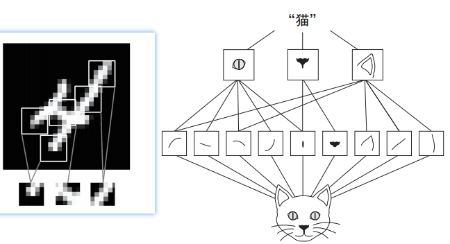
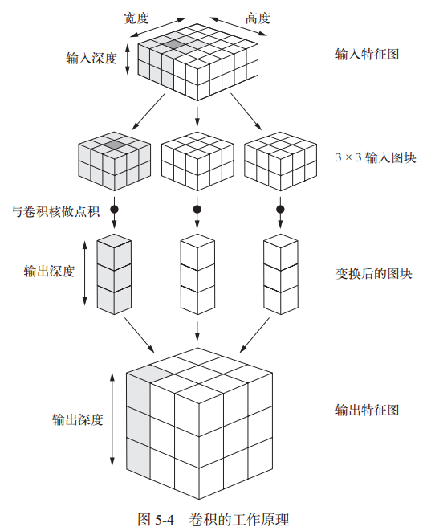
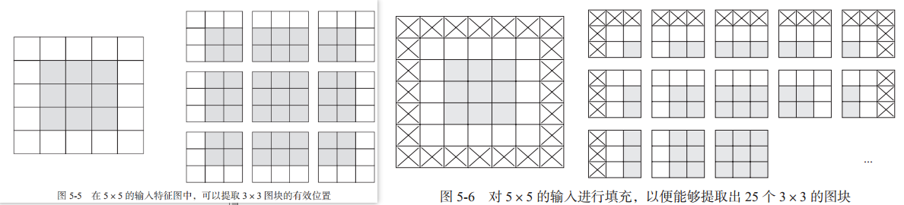
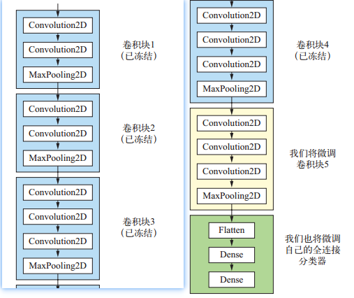
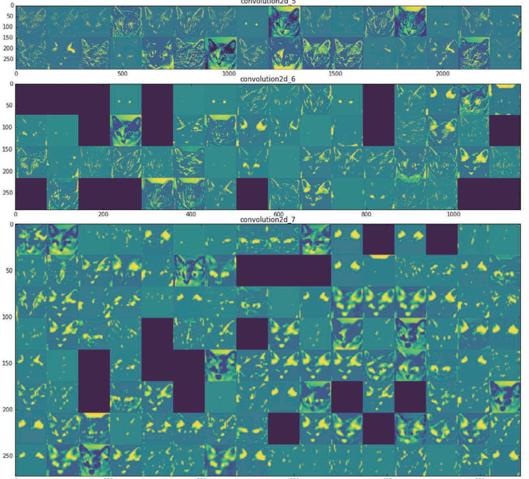
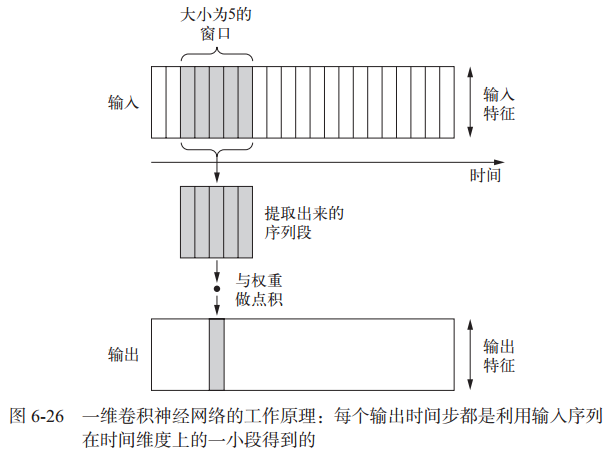
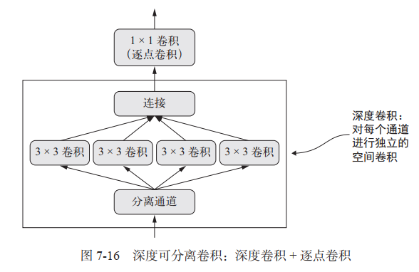

卷积神经网络又称CNN（convnet network），是计算机视觉应用几乎都在使用的一种深度学习模型。下面是CNN处理mnist问题的示例，精度可以达到99%。

```python
# 使用卷积神经网络模型的mnist分类问题，精度会比密集层高
from keras import layers, models
from keras.datasets import mnist
from keras.utils import to_categorical

(train_images, train_labels), (test_images, test_labels) = mnist.load_data()

model = models.Sequential()
# 添加卷积层
model.add(layers.Conv2D(32, (3, 3), activation='relu', input_shape=(
    28, 28, 1)))  # 卷积神经网络接收形状为 (image_height, image_width, image_channels)
model.add(layers.MaxPooling2D((2, 2)))
model.add(layers.Conv2D(64, (3, 3), activation='relu'))
model.add(layers.MaxPooling2D((2, 2)))
model.add(layers.Conv2D(64, (3, 3), activation='relu'))
# 添加密集层连接到分类器
model.add(layers.Flatten())  # 将图像3d张量变为1d张量
model.add(layers.Dense(64, activation='relu'))
model.add(layers.Dense(10, activation='softmax'))  # 多分类，用softmax

model.compile(
    optimizer='rmsprop',  # 设置优化器
    loss='categorical_crossentropy',  # 设置损失函数
    metrics=['accuracy'])  # 要监测的指标

# 对数据集进程预处理
train_images = train_images.reshape((60000, 28, 28, 1))
train_images = train_images.astype(
    'float32') / 255  # 变换为一个 float32 数组，其形状为 (60000, 28, 28, 1)，取值范围为 0~1
test_images = test_images.reshape((10000, 28, 28, 1))
test_images = test_images.astype(
    'float32') / 255  # 变换为一个 float32 数组，其形状为 (10000, 28, 28, 1)，取值范围为 0~1

# 标签处理
train_labels = to_categorical(train_labels)
test_labels = to_categorical(test_labels)

# 训练模型
model.fit(train_images, train_labels, epochs=5, batch_size=64)

# 得到训练结果，在测试集上验证准确率
test_loss, test_acc = model.evaluate(test_images, test_labels)
print('test_acc:', test_acc)

# 保存模型
model.save("mnist_cnn.h5")
```


## 1 二维卷积层Conv2D


### 1.1 卷积层和Dense层的区别
|  | Dense | CNN |
| --- | --- | --- |
| 学到的模式 | **全局模式**，涉及图像所有的像素 | **局部模式**，图像分解成小的卷积核（代码中3 x 3），再学习 |
| 平移不变性 | 同样模式出现再新的位置，需要重新学习 | 因为已经分解，所以学到一个模式之后，可以在任何其他地方识别该模式 |
| 空间层次结构 | 不能 | 可以分解再组成更大的模式，因此CNN可以学习复杂抽象的视觉概念（如下图） |





### 1.2 卷积层的原理

卷积由以下两个关键参数所定义:

- 从输入中**提取的卷积核尺寸**：这些图块的大小通常是 3×3 或 5×5。本例中为 3×3，这是很常见的选择。window_height, window_width,
- **输出特征图的深度**：卷积所计算的过滤器的数量。本例第一层的深度为 32，最后一层的深度是 64。 output_depth

Keras 的 Conv2D 层，这些参数都是向层传入的前几个参数： Conv2D(output_depth,(window_height, window_width))

**卷积的工作原理**：在 3D 输入特征图上滑动（slide）这些 3×3 或 5×5 的窗口，在每个可能的位置停止并提取周围特征的 3D 图块［形状为 **(window_height, window_width, input_depth)**］。然后每个 3D 图块与学到的同一个**权重矩阵**［叫作卷积核（convolution kernel）］做**张量积**，转换成形状为 (**output_depth**,) 的 1D 向量。然后对所有这些向量进行空间重组，使其转换为形状为 (**height, width, output_depth**) 的 3D 输出特征图。输出特征图中的每个空间位置都对应于输入特征图中的相同位置。图示如下：



网络中特征图的**深度**在逐渐增大，而特征图的**尺寸**在逐渐减小，这几乎是所有卷积神经网络的模式。

注意，输出的宽度和高度可能与输入的宽度和高度不同


### 1.3 如何保持输入和输出相同宽高

上面的图示暴露了卷积层的一个问题，输入图和输出图的宽高不一致，理想情况下**宽高应该一致，深度有conv2D的第一个参数决定**。不一致的原因一般有两种，如下为详细介绍


#### 1.3.1 边界效应

在指定步幅下，输入特征图可能并不能满足我们定义的过滤器的尺寸，导致提取到的有效位置有限，如下左图：



这种情况下，可以采取**填充**方式补全输入特征图：在输入特征图的每一边添加适当数目的行和列，使得每个输入方块都能作为卷积窗口的中心，如上右图。
下面的动态图（输入数据集为二维，更高维自己想象吧）可以更形象的展示边界填充：


在Keras中，可以在添加Conv2D层试，指定**padding参数**：

- ‘valid’： 表示不填充，默认值
- 'same'：表示进行填充，使输出宽高和输入相同


#### 1.3.2 卷积步幅

**步幅（Stride）**：定义了卷积核遍历图像时的步幅大小（即每次前进的幅度）。其默认值通常设置为1，也可将步幅设置为2后对图像进行下采样，这种方式与最大池化类似（一般用最大池化，不用改变步幅）。
从上面动图可以看到步幅为1，即每次前进1。


## 2 最大池化运算MaxPooling2D

最大池化的作用：对特征图进行**下采样**，与步进卷积类似。最大池化使用硬编码的 max 张量运算对局部图块进行变换，而不是使用学到的线性变换。
最大池化与卷积的最大不同之处在于，**最大池化通常使用 2×2 的窗口和步幅 2，其目的是将特征图下采样 2 倍。卷积通常使用 3×3 窗口和步幅 1**。

**下采样**的作用：

- 减少需要处理的特征图的元素个数
- 通过让连续卷积层的观察窗口越来越大（即窗口覆盖原始输入的比例越来越大），从而引入空间过滤器的层级结构


## 3 数据增强

计算机视觉领域可以使用**数据增强**防止过拟合。数据增强是从现有的训练样本中生成更多的训练数据，其方法是利用多种能够**生成可信图像的随机变换**来增加（augment）样本。

在 Keras 中，这可以通过对 **ImageDataGenerator 实例读取的图像执行多次随机变换**来实现：

```python
from keras.preprocessing.image import ImageDataGenerator

# 进行数据增强
datagen = ImageDataGenerator(
            rotation_range=40,  # 角度值，表示图像随机旋转的角度范围
            width_shift_range=0.2, # 图像在水平方向平移的范围
            height_shift_range=0.2, # 图像在垂直方向平移的范围
            shear_range=0.2, # 随机错切变换的角度
            zoom_range=0.2, # 随机缩放的范围
            horizontal_flip=True, # 随机将一般图像水平翻转
            fill_mode='nearest') # 填充新创建像素的方法

# 根据图像生成批量的RGB数据张量
train_generator = datagen.flow_from_directory(
		train_dir,   #图像所在目录
		target_size=(150, 150), # 图像大小
		batch_size=20,
		class_mode='binary')
```

下图为数据增强后生成的三个新图像与原图像的对比：


## 4 预训练的卷积模型

**预训练网络**（pretrained network）是一个保存好的网络，之前已在大型数据集（通常是大规模图像分类任务）上训练好。如果这个原始数据集足够大且足够通用，那么预训练网络学到的特征的空间层次结构可以有效地作为视觉世界的通用模型，因此这些特征可用于各种不同的计算机视觉问题，即使这些新问题涉及的类别和原始任务完全不同。

自定义的网络可以使用**save方法**保存模型，见文章开头的代码。

下面是**keras.applications**中的一部分图像分类模型（都是在 ImageNet 数据集上预训练得到的）：

- Xception
- Inception V3
- ResNet50
- VGG16
- VGG19
- MobileNet

实例化模型代码如下：

```python
from keras.applications import VGG16

conv_base = VGG16(weights='imagenet', # 模型初始化的权重检查点
		include_top=False,   # 模型最后是否包含分类器，对应imageNet的1000个类型
		input_shape=(150, 150, 3)) # 输入的图像张量形状
```


### 4.1 原有模型上添加分类器的两种方法

1. 在你的数据集上运行卷积基，将输出的图像和标签保存成硬盘中的 Numpy 数组，然后用这个数据作
为输入，**输入到独立的密集连接分类器**中 。速度快，计算代价低，但不允许你使用数据增强
2. 在**顶部添加 Dense 层**来扩展已有模型（即 conv_base），并在输入数据上端到端地运行整个模型。 可以使用数据增强，但运行代价高，**需要在GPU上运行**

**方法1代码**：

```python
def extract_features(directory, sample_count):
    features = np.zeros(shape=(sample_count, 4, 4, 512))
    labels = np.zeros(shape=(sample_count))
    generator = datagen.flow_from_directory(
    				directory,
    				target_size=(150, 150),
    				batch_size=batch_size,
    				class_mode='binary')
    i = 0
    for inputs_batch, labels_batch in generator:
        features_batch = conv_base.predict(inputs_batch) #调用prefict获取预测结果（即预测的特征）
        features[i * batch_size : (i + 1) * batch_size] = features_batch
        labels[i * batch_size : (i + 1) * batch_size] = labels_batch
        i += 1
        if i * batch_size >= sample_count:
        	break
    return features, labels  # 返回预测的结果和实际标签

train_features, train_labels = extract_features(train_dir, 2000)
validation_features, validation_labels = extract_features(validation_dir, 1000)
# 模型只需要添加分类器就可以了，直接使用原有模型的输出数据作为输入
model = models.Sequential()
model.add(layers.Dense(256, activation='relu', input_dim=4 * 4 * 512))
model.add(layers.Dropout(0.5))
model.add(layers.Dense(1, activation='sigmoid'))

model.compile(optimizer=optimizers.RMSprop(lr=2e-5),
		loss='binary_crossentropy',
		metrics=['acc'])
history = model.fit(train_features, train_labels,
		epochs=30,
		batch_size=20,
		validation_data=(validation_features, validation_labels))
```

**方法2代码**：

```python
conv_base.trainable = False   #冻结原有模型，保持其参数权重不会被修改

model = models.Sequential()
model.add(conv_base) #新建model，将原有模型添加进去
model.add(layers.Flatten())
model.add(layers.Dense(256, activation='relu')) # 后面在添加新的分类器，组成完整的新模型
model.add(layers.Dense(1, activation='sigmoid'))
```

在编译和训练模型之前，一定要“冻结”卷积基。 **冻结（freeze）一个或多个层是指在训练过程中保持其权重不变**。如果不这么做，那么卷积基之前学到的表示将会在训练过程中被修改。因为其上添加的 Dense 层是随机初始化的，所以非常大的权重更新将会在网络中传播，对之前学到的表示造成很大破坏。


### 4.2 微调模型

对于用于特征提取的冻结的模型基，微调是指**将其顶部的几层“解冻”**，并将这解冻的几层和新增加的
部分联合训练。即略微修改了复用模型中的几层。如下图，微调最后一层，加上自己的分类器：



为什么只微调最后的几层？

- 卷积模型中越靠近底层的层编码是更加**通用的可复用特征**，靠近顶部的是更**专业化的特征**。所以微调专业化的特征更有用。
- 训练参数越多，过拟合的风险越大。所以尽量微调更少的层

冻结卷积模型中某些层：

```python
for layer in conv_base.layers:
    layer.trainable = True   # layer.tainable = False
```


## 5 卷积网络可视化

卷积神经网络学到的表示很容易可视化，卷积神经网络不是黑盒。


### 5.1 显示中间激活

是指对于给定输入，展示网络中各个卷积层和池化层输出的特征图（层的输出通常被称为该层的激活，即激活函数的输出），需要用到keras.Model类用于可视化显示，代码如下：

```python
# 可视化中间输出
from keras.models import load_model
import matplotlib.pyplot as plt
from keras import models
import numpy as np
from keras.preprocessing import image

model = load_model('cats_dogs.h5')  # 加载之前保存的卷积模型

# 预处理单张图片
img = image.load_img('./cats.jpg', target_size=(150, 150))
img_tensor = image.img_to_array(img)
img_tensor = np.expand_dims(img_tensor, axis=0)
img_tensor /= 255.

layer_outputs = [layer.output for layer in model.layers[:8]]  # 提取前8层的输出
# 创建一个Model用于可视化输出，输入和输出都来自卷积模型
view_model = models.Model(inputs=model.input, outputs=layer_outputs)
# 运行可视化Model
views = view_model.predict(img_tensor)  # 这里使用mnist测试集的第一个图像

# 可视化每个中间激活的通道
layer_names = []
for layer in model.layers[:8]:
    layer_names.append(layer.name)  # 保存每一层的名字

images_per_row = 16  # 一行显示16个图像

for layer_name, layer_view in zip(layer_names, views):
    n_features = layer_view.shape[-1]  # 特征图中的特征个数

    size = layer_view.shape[1]  # 特征图的形状为 (1, size, size, n_features)

    n_rows = n_features // images_per_row  # 行数
    display_grid = np.zeros((size * n_rows, images_per_row * size))

    for row in range(n_rows):
        for col in range(images_per_row):
            channel_image = layer_view[0, :, :, row * images_per_row + col]
            # 对特征进程处理，使其看起来更美观
            # channel_image -= channel_image.mean()
            # channel_image /= channel_image.std()
            # channel_image *= 64
            # channel_image += 128
            # channel_image = np.clip(channel_image, 0, 255).astype('uint8')
            # 填充网格
            display_grid[row * size:(row + 1) * size, col * size:(col + 1) *
                         size] = channel_image

    scale = 1. / size  # 缩小比例
    plt.figure(figsize=(scale * display_grid.shape[1],
                        scale * display_grid.shape[0]))
    plt.title(layer_name)
    plt.grid(False)
    plt.imshow(display_grid, aspect='auto', cmap='viridis')

plt.show()
```

随着层数的加深，层所提取的特征变得越来越抽象；**层数越深，其表示中关于图像视觉内容的信息就越少，而关于类别的信息就越多**。代码执行结果部分截图如下:




### 5.2 显示过滤器

卷积神经网络中每一层都学习一组过滤器，以便将其输入表示为**过滤器的组合**（5.1中的输出就是过滤器的组合）。 随着层数的加深，卷积神经网络中的过滤器变得越来越复杂，越来越精细。

要显示过滤器，构建一个损失函数，其目的是让某个卷积层的某个过滤器的值最大化；然后，我们要使用随机梯度下降来调节输入图像的值，以便让这个激活值最大化。

代码如下：

```python
# 可视化每层的过滤器
import numpy as np
from keras import backend as K
import matplotlib.pyplot as plt
from keras.models import load_model


# 将张量转换为有效图像的实用函数：输入格式为(,,,)
def deprocess_image(x):
    # 对张量做标准化，使其均值为0，标准差为0.1
    x -= x.mean()
    x /= (x.std() + 1e-5)
    x *= 0.1

    # 将x裁切到[0,1]区间
    x += 0.5
    x = np.clip(x, 0, 1)

    # 将x转换为RGB数组
    x *= 255
    x = np.clip(x, 0, 255).astype('uint8')
    return x


# 构建一个损失函数，将该层第n个过滤器的激活最大化
def generate_pattern(model, layer_name, filter_index, size=150):
    layer_output = model.get_layer(layer_name).output
    loss = K.mean(layer_output[:, :, :, filter_index])
    # 计算这个损失相对于输入图像的梯度
    grads = K.gradients(loss, model.input)[0]
    # 对梯度进行L2标准化
    grads /= (K.sqrt(K.mean(K.square(grads))) + 1e-5)
    # 返回给定输入图像的损失和梯度
    iterate = K.function([model.input], [loss, grads])
    input_img_data = np.random.random((1, size, size, 3)) * 20 + 128

    # 进行40次梯度上升
    step = 1.
    for i in range(40):
        loss_value, grads_value = iterate([input_img_data])
        input_img_data += grads_value * step

    img = input_img_data[0]
    return deprocess_image(img)


model = load_model('cats_dogs.h5')  # 加载之前保存的卷积模型
layer_name = 'conv2d_2'
filter_index = 0

# 生成第4层卷积的64个过滤器,每个网格是一个 64 像素×64 像素的过滤器模式
size = 64
margin = 5
# 保存结果
results = np.zeros((8 * size + 7 * margin, 8 * size + 7 * margin, 3))

for i in range(8):
    for j in range(8):
        filter_img = generate_pattern(model,
                                      layer_name,
                                      i + (j * 8),
                                      size=size)
        horizontal_start = i * size + i * margin
        horizontal_end = horizontal_start + size
        vertical_start = j * size + j * margin
        vertical_end = vertical_start + size
        results[horizontal_start:horizontal_end, vertical_start:
                vertical_end, :] = filter_img

plt.figure(figsize=(20, 20))
plt.imshow(results)
plt.show()
```


### 5.3 显示类激活热力图

**类激活热力图**有助于了解一张图像的哪一部分让卷积神经网络做出了最终的分类决策。

Grad-CAM代码显示热力图如下：

```python
# 可视化类激活热力图
from keras.models import load_model
import matplotlib.pyplot as plt
import numpy as np
from keras.preprocessing import image
from keras import backend as K
import cv2

model = load_model('cats_dogs.h5')  # 加载之前保存的卷积模型

# 预处理单张图片
img = image.load_img('./cats.jpg', target_size=(150, 150))
img_tensor = image.img_to_array(img)
img_tensor = np.expand_dims(img_tensor, axis=0)
img_tensor /= 255.

# 得到模型结果
preds = model.predict(img_tensor)

# 应用Grad-CAM算法
cat_output = model.output[:, 0]  # 得到输出中猫类别，0通过np.argmax(preds[0])获取
last_conv_layer = model.get_layer('conv2d_4')  # 层名
# 计算猫类别对于第4层输出特征图的梯度
grads = K.gradients(cat_output, last_conv_layer.output)[0]
pooled_grads = K.mean(grads, axis=(0, 1, 2))

iterate = K.function([model.input], [pooled_grads, last_conv_layer.output[0]])
pooled_grads_value, conv_layer_output_value = iterate([img_tensor])
# 将特征图数组的每个通道乘以通道对猫类别的重要程度
for i in range(128):  # 128为图像大小
    conv_layer_output_value[:, :, i] *= pooled_grads_value[i]

# 得到类激活热力图
heatmap = np.mean(conv_layer_output_value, axis=-1)
# 显示热力图
heatmap = np.maximum(heatmap, 0)
heatmap /= np.max(heatmap)
plt.matshow(heatmap)
plt.show()
# 将热力图与原图叠加
img = cv2.imread('./cats.jpg')  # 加载原图
# 将热力图大小调整为与原图相同
heatmap = cv2.resize(heatmap, (img.shape[1], img.shape[0]))
# 热力图转换为RGB格式
heatmap = np.uint8(255 * heatmap)
heatmap = cv2.applyColorMap(heatmap, cv2.COLORMAP_JET)
superimposed_img = heatmap * 0.4 + img
cv2.imwrite('./cat_cam.jpg', superimposed_img)
```

得到叠加的热力图如下，可以看到图像中哪块对于判断猫起到的作用最大：


## 6 一维卷积处理序列问题

对于某些序列处理问题（文本分类和时间序列预测 ），**一维卷积神经网络**的效果可以媲美 RNN（循环神经网络），而且计算代价通常要小很多。

一维卷积层可以识别序列中的局部模式。因为对每个序列段执行相同的输入变换，所以在句子中某个位置学到的模式稍后可以在其他位置被识别。其工作原理如下：




### 6.1 一维卷积层Conv1D

Keras 中的一维卷积神经网络是 **Conv1D** 层，其接口类似于 Conv2D。它接收的输入是形状为 **(samples, time, features)** 的三维张量，并返回类似形状的三维张量。卷积窗口是时间轴上的一维窗口。一维卷积神经网络分别处理每个输入序列段，所以它对时间步的顺序不敏感 ,不适合基于时间顺序的序列。

```python
# 一维卷积网络处理文本序列问题
from keras.datasets import imdb
from keras.preprocessing import sequence
from keras.models import Sequential
from keras import layers
from keras.optimizers import RMSprop
import matplotlib.pyplot as plt

max_features = 10000
max_len = 500

(x_train, y_train), (x_test, y_test) = imdb.load_data(num_words=max_features)
# 将整数列表转换为二维整数张量
x_train = sequence.pad_sequences(x_train, maxlen=max_len)
x_test = sequence.pad_sequences(x_test, maxlen=max_len)

# 构建一维卷积神经网络
model = Sequential()
model.add(layers.Embedding(max_features, 128, input_length=max_len))
model.add(layers.Conv1D(32, 7, activation='relu'))  # 添加一维卷积层和池化层
model.add(layers.MaxPool1D(5))
model.add(layers.Conv1D(32, 7, activation='relu'))
model.add(layers.GlobalMaxPool1D())  # 添加全局池化层
model.add(layers.Dense(1))

model.compile(optimizer=RMSprop(lr=1e-4),
              loss='binary_crossentropy',
              metrics=['acc'])
history = model.fit(x_train,
                    y_train,
                    epochs=10,
                    batch_size=128,
                    validation_split=0.2)

# 绘制结果
acc = history.history['acc']
val_acc = history.history['val_acc']
loss = history.history['loss']
val_loss = history.history['val_loss']
epochs = range(1, len(acc) + 1)

plt.plot(epochs, acc, 'bo', label='Training acc')
plt.plot(epochs, val_acc, 'b', label='Validation acc')
plt.title('Training and validation accuracy')
plt.legend()

plt.figure()
plt.plot(epochs, loss, 'bo', label='Training loss')
plt.plot(epochs, val_loss, 'b', label='Validation loss')
plt.title('Training and validation loss')
plt.legend()
plt.show()
```


## 7 深度可分离卷积

有一个层可以替代 Conv2D，并可以让模型更加轻量（即更少的可训练权重参数）、速度更快（即更少的浮点数运算），还可以让任务性能提高几个百分点。

深度可分离卷积层（ **SeparableConv2D**）的作用。这个层对输入的每个通道分别执行空间卷积，然后通过逐点卷积（ 1× 1 卷积）将输出通道混合，架构如下：



```python
model = Sequential()
model.add(layers.SeparableConv2D(32, 3,activation='relu',input_shape=(height, width, channels,)))
model.add(layers.SeparableConv2D(64, 3, activation='relu'))
model.add(layers.MaxPooling2D(2))

model.add(layers.SeparableConv2D(64, 3, activation='relu'))
model.add(layers.SeparableConv2D(128, 3, activation='relu'))
model.add(layers.MaxPooling2D(2))

model.add(layers.SeparableConv2D(64, 3, activation='relu'))
model.add(layers.SeparableConv2D(128, 3, activation='relu'))
model.add(layers.GlobalAveragePooling2D())

model.add(layers.Dense(32, activation='relu'))
model.add(layers.Dense(num_classes, activation='softmax'))

model.compile(optimizer='rmsprop', loss='categorical_crossentropy')
```
