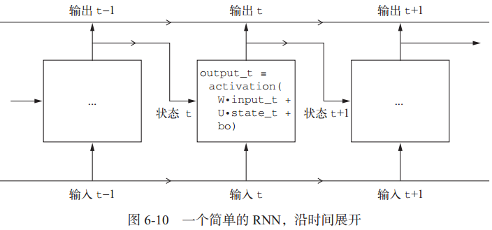
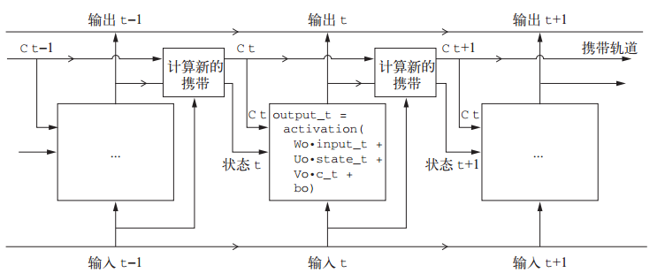
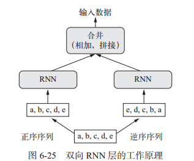

循环神经网络（RNN， recurrent neural network）一般用于处理**序列问题**，处理序列的方式为：**遍历所有的序列元素，并保存一个状态，其中包含与已查看内容相关的信息。当处理另一条序列时，RNN状态被重置**。即一个序列为一个数据点，而不是之前网络模型中一个单词或字符为一个数据点。

简单点说，RNN就是一个**for循环，它重复使用循环前一次迭代的计算结果**。RNN的特征在于其**时间步函数**。



输出张量中的**每个时间步 t 包含输入序列中时间步0~t 的信息**，即关于全部过去的信息。因此，在多数情况下，你并不需要这个所有输出组成的序列，你**只需要最后一个输出（循环结束时的 output_t），因为它已经包含了整个序列的信息**。


## 1 循环层


### 1.1 SimpleRNN层

SimpleRNN层可以处理批量的序列，接收形状为 **(batch_size, timesteps,input_features)** 的输入。SimpleRNN可以在两种不同的模式（由 return_sequences参数控制）下运行：

- 返回每个时间步连续输出的完整序列(return_sequences = true)，即形状为 **(batch_size, timesteps, output_features)**的三维张量
- 只返回每个输入序列的最终输出(default value)，形状为 **(batch_size, output_features)** 的二维张量

为了提高网络的表示能力，将多个循环层逐个堆叠有时也是很有用的。在这种情况下，你需要让所有中间层都返回完整的输出序列。

```python
model = models.Sequential()
model.add(layers.Embedding(10000, 32))
# 为了提高网络的表示能力，将多个循环层逐个堆叠有时也是很有用的。在这种情况下，你需要让所有中间层都返回完整的输出序列
model.add(layers.SimpleRNN(32, return_sequences=True))
model.add(layers.SimpleRNN(32, return_sequences=True))
model.add(layers.SimpleRNN(32, return_sequences=True))
model.add(layers.SimpleRNN(32))
```

**SimpleRNN不擅长处理长序列(比如文本)，实用价值不高**，比如下面示例值考虑评论的前500个单词，得到的模型精度并不是很高：

```python
# 使用SimpleRNN循环神经网络处理IMDB电影评价分类问题
from keras import models
from keras import layers
from keras.datasets import imdb
from keras import preprocessing
import matplotlib.pyplot as plt

# 准备IMDB数据
max_features = 10000  # 作为特征的单词个数
maxlen = 500  # 只截取评价的前500个单词

(x_train, y_train), (x_test, y_test) = imdb.load_data(num_words=max_features)
# 将整数列表转换为二维整数张量
x_train = preprocessing.sequence.pad_sequences(x_train, maxlen=maxlen)
x_test = preprocessing.sequence.pad_sequences(x_test, maxlen=maxlen)

print('input train shape:', x_train.shape)
print('input test shape:', x_test.shape)

# 用Embedding词嵌入层和SimpleRnn层构建模型
model = models.Sequential()
model.add(layers.Embedding(max_features, 32))
model.add(layers.SimpleRNN(32))
model.add(layers.Dense(1, activation='sigmoid'))  # 添加分类器，分为两类

model.compile(optimizer='rmsprop', loss='binary_crossentropy', metrics=['acc'])
print(model.summary())

# 训练模型
history = model.fit(x_train,
                    y_train,
                    epochs=10,
                    batch_size=128,
                    validation_split=0.2)
```


### 1.2 LSTM层

LSTM层是SimpleRNN的变体，基于**长短期记忆算法（LSTM）**，增加了一种携带信息跨越多个时间步的方法。其原理为：**时间步的值ct与输入连接和循环连接（即RNN的输出）进行运算，作为下一次的输入状态**。



你不需要理解关于 LSTM 单元具体架构的任何内容。**作为人类，理解它不应该是你要做的**。你只需要记住 LSTM 单元的作用：**允许过去的信息稍后重新进入，从而解决梯度消失问题**（较早期的信号在处理过程中逐渐消失 ）。

```python
# 使用LSTM循环神经网络处理IMDB电影评价分类问题
from keras import models
from keras import layers
from keras.datasets import imdb
from keras import preprocessing
import matplotlib.pyplot as plt

# 准备IMDB数据
max_features = 10000  # 作为特征的单词个数
maxlen = 500  # 只截取评价的前500个单词

(x_train, y_train), (x_test, y_test) = imdb.load_data(num_words=max_features)
# 将整数列表转换为二维整数张量
x_train = preprocessing.sequence.pad_sequences(x_train, maxlen=maxlen)
x_test = preprocessing.sequence.pad_sequences(x_test, maxlen=maxlen)

print('input train shape:', x_train.shape)
print('input test shape:', x_test.shape)

# 用Embedding词嵌入层和LSTM层构建模型
model = models.Sequential()
model.add(layers.Embedding(max_features, 32))
model.add(layers.LSTM(32))
model.add(layers.Dense(1, activation='sigmoid'))  # 添加分类器，分为两类

model.compile(optimizer='rmsprop', loss='binary_crossentropy', metrics=['acc'])
print(model.summary())

# 训练模型
history = model.fit(x_train,
                    y_train,
                    epochs=10,
                    batch_size=128,
                    validation_split=0.2)
```


### 1.3 GRU层

**门控循环单元**（GRU， gated recurrent unit）层的工作原理与 LSTM 相同。但它做了一些简化，因此运行的计算代价更低（虽然表示能力可能不如 LSTM）。

```python
# 使用LSTM循环神经网络处理IMDB电影评价分类问题
from keras import models
from keras import layers
from keras.datasets import imdb
from keras import preprocessing
import matplotlib.pyplot as plt

# 准备IMDB数据
max_features = 10000  # 作为特征的单词个数
maxlen = 500  # 只截取评价的前500个单词

(x_train, y_train), (x_test, y_test) = imdb.load_data(num_words=max_features)
# 将整数列表转换为二维整数张量
x_train = preprocessing.sequence.pad_sequences(x_train, maxlen=maxlen)
x_test = preprocessing.sequence.pad_sequences(x_test, maxlen=maxlen)

print('input train shape:', x_train.shape)
print('input test shape:', x_test.shape)

# 用Embedding词嵌入层和LSTM层构建模型
model = models.Sequential()
model.add(layers.Embedding(max_features, 32))
model.add(layers.GRU(32))
model.add(layers.Dense(1, activation='sigmoid'))  # 添加分类器，分为两类

model.compile(optimizer='rmsprop', loss='binary_crossentropy', metrics=['acc'])
print(model.summary())

# 训练模型
history = model.fit(x_train,
                    y_train,
                    epochs=10,
                    batch_size=128,
                    validation_split=0.2)
```


## 2 RNN高级技巧


### 2.1 先尝试基本机器学习方法

在开始研究复杂且计算代价很高的模型（比如 RNN）之前，**尝试使用简单且计算代价低的机器学习模型也是很有用的**，比如小型的密集连接网络。这可以保证进一步增加问题的复杂度是合理的，并且会带来真正的好处。


### 2.2 循环dropout降低过拟合

在循环层前面应用 dropout，这种正则化会妨碍学习过程，因此需要在每个时间步中间使用dropout。**对每个时间步使用相同的 dropout 掩码，可以让网络沿着时间正确地传播其学习误差**；而随时间随机变化的 dropout 掩码则会破坏这个误差信号，并且不利于学习过程。

Keras的每个循环层都有两个与 dropout 相关的参数：

- 一个是 dropout，它是一个浮点数，指定该层输入单元的 dropout 比率；
- 另一个是 recurrent_dropout，指定循环单元的 dropout 比率

**使用dropout正则化的网络总是需要更长的时间才能完全收敛，所以网络训练轮次(epochs)需要增加**。

使用示例：

```python
model = Sequential()
# 添加循环dropput
model.add(
    layers.GRU(32,
               dropout=0.2,
               recurrent_dopout=0.2,
               input_shape=(None, float_data.shape[-1])))
model.add(layers.Dense(1))
```


### 2.3 循环层叠加

增加网络容量通常是一个好主意，直到过拟合变成主要的障碍（假设你已经采取基本步骤来降低过拟合，比如使用 dropout）。只要过拟合不是太严重，那么很可能是容量不足的问题。**循环层堆叠（recurrent layerstacking）是构建更加强大的循环网络的经典方法**。

在 Keras 中逐个堆叠循环层，所有中间层都应该返回完整的输出序列（一个 3D 张量），而不是只返回最后一个时间步的输出。这可以通过指定 **return_sequences=True** 来实现 。

```python
model = Sequential()
# 添加循环dropput和两个GRU层
model.add(
    layers.GRU(32,
               dropout=0.1,
               recurrent_dropout=0.5,
               return_sequences=True,
               input_shape=(None, float_data.shape[-1])))
model.add(layers.GRU(64, activation='relu', dropout=0.1,
                     recurrent_dropout=0.5))
model.add(layers.Dense(1))
```

有以下结论需要注意：

- 过拟合不是很严重，所以可以放心地增大每层的大小，以进一步改进验证损失。但这么做的计算成本很高。
- 添加一层后模型并没有显著改进，所以可能提高网络能力的回报在逐渐减小


### 2.4 双向RNN

双向RNN是一种常见的RNN变体，再有些任务上的性能比普通RNN更好，常用于自然语言处理。
双向 RNN 利用了 RNN 的顺序敏感性：**它包含两个普通 RNN**， 比如你已经学过的 GRU 层和 LSTM 层，**每个 RNN分别沿一个方向对输入序列进行处理（时间正序和时间逆序）**，然后将它们的表示合并在一起。通过沿这两个方向处理序列，双向RNN 能够捕捉到可能被单向 RNN 忽略的模式。



按时间正序的模型必然会优于时间逆序的模型。重要的是，对许多其他问题（包括自然语言）而言，正序并不一定比逆序表现好。

```python
# 构建一个双向LSTM
model = models.Sequential()
model.add(layers.Embedding(max_features, 32))
model.add(layers.Bidirectional(layers.LSTM(32)))
model.add(layers.Dense(1, activation='sigmoid'))
```


### 2.5 RNN和一维CNN结合

前面章节4提到一维CNN可以处理非时间顺序序列，虽然效果不如LSTM，但速度更快。下图所示可以结合CNN的速度和RNN的顺序敏感性，这种方法**允许操作更长的序列，而且执行时间不会过长**。


代码示例如下：

```python
model = Sequential()
# 添加一维CNN和池化层
model.add(
    layers.Conv1D(32,
                  5,
                  activation='relu',
                  input_shape=(None, float_data.shape[-1])))
model.add(layers.MaxPool1D(3))
model.add(layers.Conv1D(32, 5, activation='relu'))
model.add(layers.GRU(32, dropout=0.1, recurrent_dropout=0.5))
model.add(layers.Dense(1))
```
