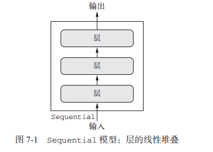
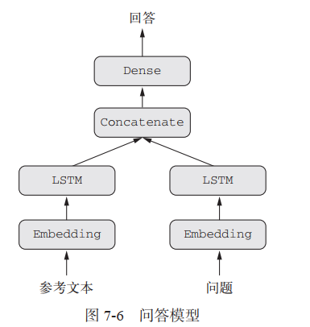
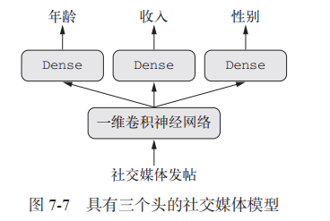
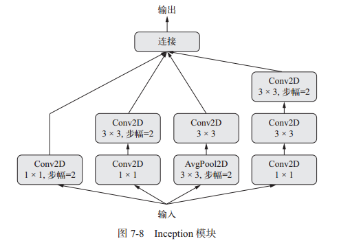
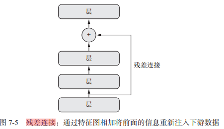
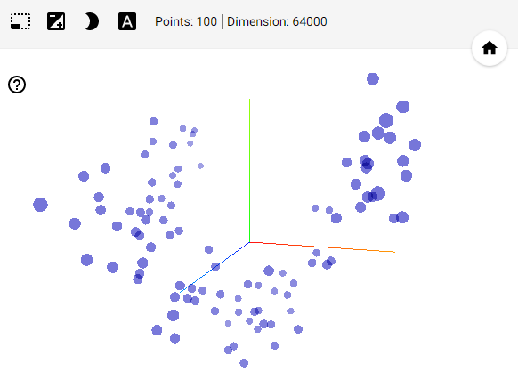
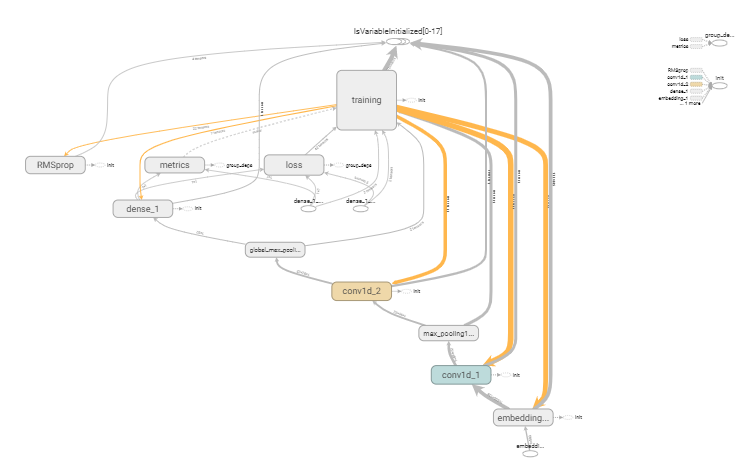

## 1 Keras函数式API

前面所有的例子的model都是基于**Sequential**模型，**Sequential模型假设网络只有一个输入，一个输出，并且网络每一层都是线性堆叠的**，图示如下：



许多新的神经网络架构都是非线性的拓扑结构（即有向无环图），这些网络是无法使用Keras的Sequential模型来构建的。因此需要**Keras函数式API**来自定义所有操作和网络模型。

使用函数式 API，可以直接操作张量，也可以把层当作函数来使用，接收张量并返回张量。 下面是同一密集网络模型的两种实现方式：

```python
from keras.models import Sequential, Model
from keras import layers
from keras import Input
# 1. 使用sequential模型，一般方式
seq_model = Sequential()
seq_model.add(layers.Dense(32, activation='relu', input_shape=(64,)))
seq_model.add(layers.Dense(32, activation='relu'))
seq_model.add(layers.Dense(10, activation='softmax'))

# 2. 使用函数API
input_tensor = Input(shape=(64,))
x = layers.Dense(32, activation='relu')(input_tensor)
x = layers.Dense(32, activation='relu')(x)
output_tensor = layers.Dense(10, activation='softmax')(x)
model = Model(input_tensor, output_tensor)  # 将输入张量和输出张量转换为一个模型

# 后面的compile和fit都是一样的
```


### 1.1 多输入模型的构建

通常情况下，多输入模型会在某一时刻**用一个可以组合多个张量的层将不同的输入分支合并**，张量组合方式可能是相加、连接等。这通常利用 **Keras 的合并运算**来实现，比如 keras.layers.add、keras.layers.concatenate 等。

下图的问答模型就是一个简单的多输入模型：模型根据问题描述和一个文本片段生成一个回答。



代码示例如下：

```python
# 用Keras 函数API实现多输入模型，Sequential模型是单输入的，无法实现
from keras.models import Model
from keras import layers
from keras import Input
from keras import utils
import numpy as np

# 定义序列的大小
text_size = 10000
question_size = 10000
answer_size = 500
# 模型的文本输入，一个长度可变的证书序列
text_input = Input(shape=(None, ), dtype='int32', name='text')
# 创建词嵌入，将文本输入嵌入长度64的向量
embedded_text = layers.Embedding(text_size, 64)(text_input)
# 对文本输入向量添加循环层LSTM
encoded_text = layers.LSTM(32)(embedded_text)

# 对问题输入执行相同的操作
question_input = Input(shape=(None, ), dtype='int32', name='question')
embedded_question = layers.Embedding(question_size, 32)(question_input)
encoded_question = layers.LSTM(16)(embedded_question)

# 将编码后的两个输入连接在一起
conbinded = layers.concatenate([encoded_text, encoded_question], axis=-1)
# 添加分类器
answer = layers.Dense(answer_size, activation='softmax')(conbinded)

# 实例化模型，指定输入和输出
model = Model([text_input, question_input], answer)
model.compile(optimizer='rmsprop',
              loss='categorical_crossentropy',
              metrics=['acc'])

# 生成虚拟数据，进行训练
num_samples = 1000
max_length = 100

text = np.random.randint(1, text_size, size=(num_samples, max_length))
question = np.random.randint(1, question_size, size=(num_samples, max_length))
answers = np.random.randint(answer_size, size=(num_samples))
answers = utils.to_categorical(answers, answer_size)  # answers转化为one-hot编码

model.fit([text, question], answers, epochs=10, batch_size=128)  # 参数要与模型实例化时一致
```


### 1.2 多输出模型的构建

训练这种模型需要能够对网络的**各个头指定不同的损失函数**，但是，梯度下降要求将一个标量最小化，所以为了能够训练模型，我们必须将这些损失合并为单个标量。合并不同损失最简单的方法就是**对所有损失求和**。
为了防止模型表示针对单个损失值最大的任务优先进行优化，而不考虑其他任务的优化，可以为每个损失值对最终损失的贡献分配不同大小的重要性（**添加权重**）。

下图的模型就是多输出模型：根据帖子内容预测不同的特征



代码示例：

```python
# 用Keras 函数API实现多输出模型，Sequential模型是单输入的，无法实现
from keras.models import Model
from keras import layers
from keras import Input
from keras import utils
import numpy as np

vocabulary_size = 50000
num_income_groups = 10

# 模型的输入
post_input = Input(shape=(None, ), dtype='int32', name='posts')
# 创建词嵌入，将文本输入嵌入长度64的向量
embedded_posts = layers.Embedding(256, vocabulary_size)(post_input)

# 添加以为卷积和池化
x = layers.Conv1D(128, 5, activation='relu')(embedded_posts)
x = layers.MaxPooling1D(5)(x)
x = layers.Conv1D(256, 5, activation='relu')(x)
x = layers.Conv1D(256, 5, activation='relu')(x)
x = layers.MaxPooling1D(5)(x)
x = layers.Conv1D(256, 5, activation='relu')(x)
x = layers.Conv1D(256, 5, activation='relu')(x)
x = layers.GlobalMaxPool1D()(x)
# 添加分类器
x = layers.Dense(128, activation='relu')(x)

# 输出层
age_output = layers.Dense(1, name='age')(x)
income_output = layers.Dense(num_income_groups,
                             activation='softmax',
                             name='income')
gender_output = layers.Dense(1, actiation='sigmoid', name='gender')

# 实例化模型，指定输入和输出
model = Model(post_input, [age_output, income_output, gender_output])
# 由于有多个输出，所以需要进行多重损失函数的设置
model.compile(
    optimizer='rmsprop',
    loss={  # 维每个输出指定损失函数
        'age': 'mse',
        'income': 'categorical_crossentropy',
        'gender': 'binary_crossentropy'
    },
    loss_weights={  # 为每个输出添加权重，防止对单个损失进行过度优化
        'age': 0.25,
        'income': 1.,
        'gender': 10.
    })

# 进行训练
model.fit(posts, [age_targets, income_targets, gender_targets],
          epochs=10,
          batch_size=64)  # 参数要与模型实例化时一致
```


### 1.3 有向无环图的构建


#### 1.3.1 Inception模型

inception是流行的卷积神经网络的架构类型，它是模块的堆叠，这些模块本身看起来像是小型的独立网络，被分为多个并行分支。这种设置**有助于网络分别学习空间特征和逐通道的特征（用1x1卷积来区分，也叫逐点卷积，是inception模型的特色）**，这比联合学习这两种特征更加有效。
下图为inception模型的示意图：



代码示例：

```python
from keras import layers
# 每个个分支都有相同的步幅2，所以最后输出才可以将所有分支连接在一起
branch_a = layers.Conv2D(128, 1,activation='relu', strides=2)(x)

branch_b = layers.Conv2D(128, 1, activation='relu')(x)
branch_b = layers.Conv2D(128, 3, activation='relu', strides=2)(branch_b)

branch_c = layers.AveragePooling2D(3, strides=2)(x)
branch_c = layers.Conv2D(128, 3, activation='relu')(branch_c)

branch_d = layers.Conv2D(128, 1, activation='relu')(x)
branch_d = layers.Conv2D(128, 3, activation='relu')(branch_d)
branch_d = layers.Conv2D(128, 3, activation='relu', strides=2)(branch_d)

output = layers.concatenate([branch_a, branch_b, branch_c, branch_d], axis=-1)
```


#### 1.3.2 残差链接

**残差连接**是让前面某层的输出作为后面某层的输入，从而在序列网络中有效地创造了一条捷径。前面层的输出没有与后面层的激活连接在一起，而是与后面层的激活相加。
它解决了困扰所有大规模深度学习模型的两个共性问题：**梯度消失和表示瓶颈**。通常来说，向任何多于 10 层的模型中添加残差连接，都可能会有所帮助。 模型图如下：



代码示例：

```python
# 特征图尺寸一致，恒等残差连接
from keras import layers
x = ...
y = layers.Conv2D(128, 3, activation='relu', padding='same')(x)  # 对x进行变换
y = layers.Conv2D(128, 3, activation='relu', padding='same')(y)
y = layers.Conv2D(128, 3, activation='relu', padding='same')(y)

y = layers.add([y, x])  # 将原始x与输出特征y相加


# 特征图尺寸不一致，线性残差连接：用一个线性变换将前面层的激活变为目标形状
# 线性变换可以是不带激活的Dense层；或不带激活的1x1卷积
from keras import layers
x = ...
y = layers.Conv2D(128, 3, activation='relu', padding='same')(x)  # 对x进行变换
y = layers.Conv2D(128, 3, activation='relu', padding='same')(y)
y = layers.MaxPooling2D(2, strides=2)(y)  # 这里输出的y和前面形状已经不一样了

residual = layers.Conv2D(128, 1, strides=2, padding='same')(x)  # 对x进行1x1卷积，使之与Y有相同形状

y = layers.add([y, residual])
```


### 1.4 层实例重复使用

函数式 API 还有一个重要特性，那就是**能够多次重复使用一个层实例**。如果你对一个层实例调用两次，而不是每次调用都实例化一个新层，那么每次调用可以重复使用相同的权重。这样你可以构建具有共享分支的模型，即几个分支全都共享相同的知识并执行相同的运算。即**共享层**。

例如下面例子就是用同一个LSTM层处理两个不同的输入文本序列：

```python
from keras import layers
from keras import Input
from keras.models import Model

lstm = layers.LSTM(32)  # LSTM实例化一次，使用相同的权重

left_input = Input(shape=(None, 128))  # 构建左分支，处理输入序列
left_output = lstm(left_input)

right_input = Input(shape=(None, 128))  # 构建右分支，处理输入序列
right_output = lstm(right_input)

merged = layers.concatenate([left_output, right_output], axis=-1)  # 合并两个中间输出
predictions = layers.Dense(1, activation='sigmoid')(merged)

model = Model([left_input, right_input], predictions)
model.fit([left_data, right_data], targets)
```


### 1.5 模型实例重复使用

可以将模型看作“更大的层”。 Sequential 类和 Model 类都是如此，所以可重复使用已经定义好的模型。
**在调用模型实例时，就是在重复使用模型的权重，正如在调用层实例时，就是在重复使用层的权重**。

例如下面例子使用同一内置的模型实例处理两个不同的输入图像：

```python
from keras import layers
from keras import applications
from keras import Input

xception_base = applications.Xception(weights=None, include_top=False)  # Keras内置的Xception网络模型

left_input = Input(shape=(250, 250, 3))
right_input = Input(shape=(250, 250, 3))

left_features = xception_base(left_input)  # 对left输入调用模型
right_input = xception_base(right_input)  # 对right输入调用模型

merged_features = layers.concatenate([left_features, right_input], axis=-1)  # 合并中间输出
```


## 2 Keras回调函数

> 使用 model.fit()或 model.fit_generator() 在一个大型数据集上启动数十轮的训练，有点类似于扔一架纸飞机，一开始给它一点推力，之后你便再也无法控制其飞行轨迹或着陆点。如果我们能监控模型的内部过程，就像用一架无人机，它可以感知其环境，将数据发回给操纵者，并且能够基于当前状态自主航行。这样开发者可以更好的调整模型。


**keras.callbacks**模块包含了许多内置的回调函数。回调函数是在调用fit时传入模型的一个对象，他在训练过程中的不同时间点被调用，它可以访问关于模型状态和性能的所有可用数据，并可以采取行为。

**回调函数的用法示例**：

- **模型检查点**（model checkpointing）：在训练过程中的不同时间点**保存模型的当前权重**。
- **提前终止**（early stopping）：如果验证损失不再改善，则中断训练（同时保存在训练过程中得到的最佳模型）。
- 在训练过程中**动态调节某些参数值**：比如优化器的学习率。
- 在训练过程中**记录训练指标和验证指标**，或将模型学到的表示可视化（这些表示也在不断更新）

常见回调函数：


### 2.1 ModelCheckpoint和EarlyStopping

ModelCheckpoint在训练过程中不断保存模型当前权重；EarlyStopping则在过拟合开始的时候中断训练。两种回调函数结合，中断训练时可以保证保存**当前的最佳模型**。

```python
import keras

# 回调函数列表
callbacks_list = [
    keras.callbacks.EarlyStopping(  # earlystopping回调，
        monitor='acc',   # 监控精度作为标准
        patience=1,  # 如果精度在1轮的时间内不再改善，中断训练
    ),
    keras.callbacks.ModelCheckpoint(  # checkpoint回调
        filepath='my_model.h5',  # 保存模型的路径
        monitor='val_loss',  # 监控loss作为标准，通过loss判断是否为最佳模型
        save_best_only=True,  # 是否只保存最佳模型
    )
]

model.compile(optimizer='rmsprop', loss='binary_crossentropy', metrics=['acc'])

model.fit(x,
          y,
          epochs=10,
          batch_size=32,
          callbacks=callbacks_list,  # 调用fit时传递回调函数列表
          validation_data=(x_val, y_val))  # 上面的标准需要验证数据，不能空
```


### 2.2 ReduceLROnPlateau

如果验证loss不再改善，可以使用该回调来降低学习率。

```python
import keras

callbacks_list = [
    keras.callbacks.ReduceLROnPlateau(
        monitor='val_loss'  # loss作为监控标准
        factor=0.1,  # 触发时学习率*0.1
        patience=10,  # 如果精度在10轮的时间内不再改善，触发该回调
    )
]

model.fit(x, y,
        epochs=10,
        batch_size=32,
        callbacks=callbacks_list,
        validation_data=(x_val, y_val))
```


### 2.3 自定义回调函数

**自定义回调函数**的实现方式是创建**keras.callbacks.Callback 类**的子类。然后你可以实现下面这些方法，它们分别在训练过程中的不同时间点被调用。

| 类方法 | 调用时刻 | 类方法 | 调用时刻 |
| --- | --- | --- | --- |
| on_epoch_begin | 在每轮开始时调用 | on_batch_begin | 在处理每个批次前调用 |
| on_epoch_end | 在每轮结束时调用 | on_batch_end | 在处理每个批次后调用 |
| on_train_begin | 在训练开始时调用 | on_train_end | 在训练结束时调用 |


自定义回调函数的实现示例：

```python
import keras
import numpy as np

# 在每轮结束后将模型每层对验证集的第一个样本的激活保存到硬盘
class ActivationLogger(keras.callbacks.Callback):  # 继承Callback类
    def set_model(self, model):
        self.model = model  # 获取父类的模型，这样才知道时哪个模型在调用该回调
        layer_outputs = [layer.output for layer in model.layers]
        # 返回每层的激活
        self.activations_model = keras.models.Model(model.input, layer_outputs)

    def on_epoch_end(self, epoch, logs=None):
        if self.validation_data is None:
            raise RuntimeError('Requires validation_data.')
        # 获取验证数据的第一个输入样本
        validation_sample = self.validation_data[0][0:1]
        activations = self.activations_model.predict(validation_sample)
        f = open('activations_at_epoch_' + str(epoch) + '.npz', 'w')
        np.savez(f, activations)  # 保存数组

        f.close()
```


## 3 TensorBoard回调

TensorBoard 的主要用途是，在训练过程中帮助你**以可视化的方法监控模型内部发生的一切**。 具体功能如下：

- 在训练过程中以可视化的方式监控指标
- 将模型架构可视化
- 将激活和梯度的直方图可视化
- 以三维的形式研究嵌入

代码示例：**保存TensorBoard数据很占用内存，所以不要使用太大的数据集，不然8G内存也hold不住**

```python
# 一维卷积网络处理文本序列,TensorBoard可视化显示
from keras.datasets import imdb
from keras.preprocessing import sequence
from keras.models import Sequential
from keras import layers
from keras.optimizers import RMSprop
from keras import callbacks

max_features = 500  # tensorboard回调是一件占用内存挺高的操作,数据量不要太大
max_len = 500

(x_train, y_train), (x_test, y_test) = imdb.load_data(num_words=max_features)
# 将整数列表转换为二维整数张量
x_train = sequence.pad_sequences(x_train, maxlen=max_len)
x_test = sequence.pad_sequences(x_test, maxlen=max_len)

# 构建一维卷积神经网络
model = Sequential()
model.add(layers.Embedding(max_features, 128, input_length=max_len))
model.add(layers.Conv1D(32, 7, activation='relu'))  # 添加一维卷积层和池化层
model.add(layers.MaxPool1D(5))
model.add(layers.Conv1D(32, 7, activation='relu'))
model.add(layers.GlobalMaxPool1D())  # 添加全局池化层
model.add(layers.Dense(1))

model.compile(optimizer=RMSprop(lr=1e-4),
              loss='binary_crossentropy',
              metrics=['acc'])

# 添加一个TensorBoard回调函数
callback = [
    callbacks.TensorBoard(
        log_dir='tboard',  # 日志文件位置
        histogram_freq=1,  # 每一轮之后记录激活直方图
        embeddings_freq=1,  # 每一轮之后记录嵌入数据,
        embeddings_data=x_train[:100].astype("float32")  # 要嵌入的数据
    )
]

history = model.fit(x_train,
                    y_train,
                    epochs=10,
                    batch_size=128,
                    validation_split=0.2,
                    callbacks=callback)
```

TensorBoard各个页面的显示内容：

- scalars：精度和loss指标
- projector页：查看输入嵌入位置和空间关系。在生成时会自动降为二维或三维



- graphs页：显示模型的数据流图



- histograms和distributions页：直方图和平面图页页，可以看到每层的激活值


## 4 批标准化

**标准化**用于让机器学习模型看到的**不同样本彼此之间更加相似**，有助于模型的学习和对新数据的泛化。最常见的数据标准化形式是：**将数据减去其平均值使其中心为0，然后除以其标准差使其标准差为1**，只有数据服从正态分布。

```python
normalized_data = (data - np.mean(data, axis=...)) / np.std(data, axis=...)
```

**批标准化BatchNormalization **即使在训练过程中均值和方差随时间发生变化，它也可以适应性地将数据标准化。批标准化的工作原理是，训练过程中在内部保存已读取每批数据均值和方差的指数移动平均值。
批标准化通常在卷积层和密集层之后使用：

```python
conv_model.add(layers.Conv2D(32, 3, activation='relu')) # 卷积层之后使用
conv_model.add(layers.BatchNormalization())

dense_model.add(layers.Dense(32, activation='relu'))  # 密集层之后使用
dense_model.add(layers.BatchNormalization())
```

BatchNormalization 层接收一个 **axis 参数，它指定应该对哪个特征轴做标准化**。这个参数的默认值是 -1，即输入张量的最后一个轴。
