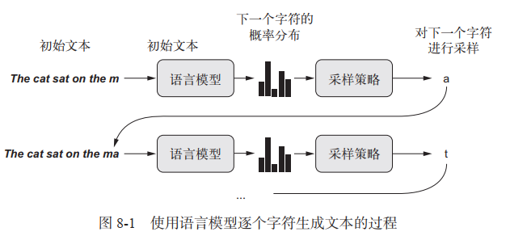
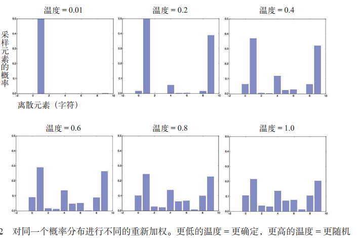
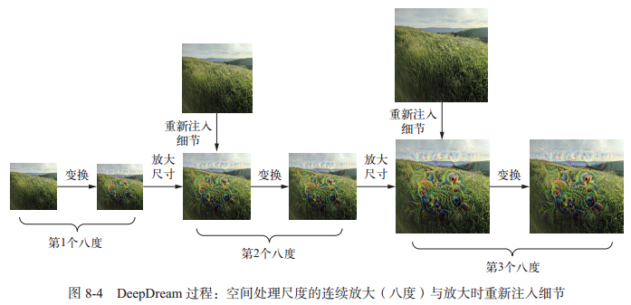
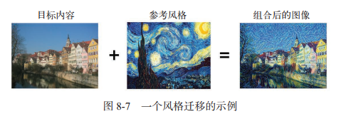
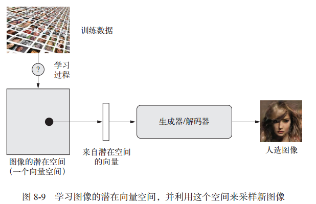
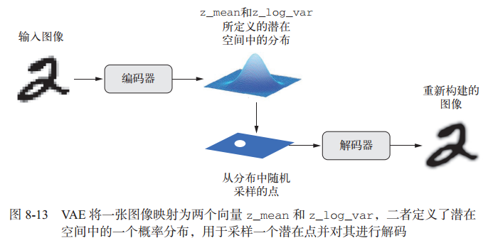
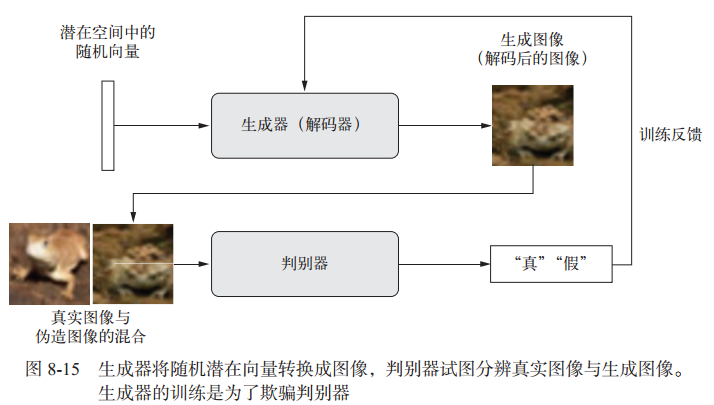

## 1 LSTM生成文本序列

用深度学习生成序列数据的通用方法，就是使用前面的标记作为输入，训练一个网络（通常是循环神经网络或一维卷积神经网络，该网络被称为**语言模型**）来预测序列中接下来的一个或多个标记。其过程如下：




### 1.1 采样策略

生成文本时，如何选择下一个字符至关重要。**贪婪采样**和**完全随机采样**都不是很理想。

为了在采样过程中控制随机性的大小，可以使用**softmax温度**参数，用于表示采样概率分布的熵，即表示所选择的下一个字符会有多么出人意料或多么可预测。
给定一个 temperature 值，将按照下列方法对原始概率分布（即模型的 softmax 输出）进行重新加权，计算得到一个新的概率分布，然后再进行随机采样：

```python
# 函数：给定模型预测结果，采样下一个字符
def selectNextChar(perds, temperature=1.0):
    preds = np.asarray(perds).astype('float64')
    # 根据softmax温度，对分布重新加权
    preds = np.log(preds) / temperature
    exp_preds = np.exp(preds)  # 指数运算
    preds = exp_preds / np.sum(exp_preds)
    # 加权后，对下一字符进行随机采样
    index = np.random.multinomial(1, preds, 1)
    return np.argmax(index)  # 返回下一字符index
```

更高的温度得到的是熵更大的采样分布，会生成更加出人意料、更加无结构的生成数据；而更低的温度对应更小的随机性，以及更加可预测的生成数据。




### 1.2 LSTM生成文本代码

**Note:** 利用更多的数据训练一个更大的模型，并且训练时间更长，生成的样本会比上面的结果看起来更连贯、更真实。但是，**不要期待能够生成任何有意义的文本**，除非是很偶然的情况。你所做的只是从一个统计模型中对数据进行采样，这个模型是关于字符先后顺序的模型。语言是一种信息沟通渠道，**信息的内容与信息编码的统计结构是有区别的**。

```python
# 使用循环神经网络LSTM层生成序列文本
import random
import sys
import keras
import numpy as np
from keras import layers

# 下载解析初始文本，这里用尼采的作品数据
path = keras.utils.get_file(
    'nietzsche.txt',
    origin='https://s3.amazonaws.com/text-datasets/nietzsche.txt')
text = open(path).read().loswe()  # 读取所有文本，转换为小写

# 将字符向量化，one-hot编码
max_len = 60  # 提取60个字符组成的序列
step = 3  # 每三个字符采样一个新序列
sentences = []  # 保存提取的序列
next_chars = []  # 保存下一目标

for i in range(0, len(text) - max_len, step):
    sentences.append(text[i:i + max_len])
    next_chars.append(text[i + max_len])

print('number of sequences:', len(sentences))

chars = sorted(list(set(text)))
# 字典，将唯一字符映射为索引位置
char_indices = dict((char, chars.index(char)) for char in chars)

# 对字符one-hot编码
x = np.zeros((len(sentences), max_len, len(chars)), dtype=np.bool)
y = np.zeros((len(sentences), len(chars)), dtype=np.bool)
for i, sentence in enumerate(sentences):
    for t, char in enumerate(sentence):
        x[i, t, char_indices[char]] = 1
    y[i, char_indices[next_chars[i]]] = 1

# 构建网络
model = keras.models.Sequential()
model.add(layers.LSTM(128, input_shape=(max_len, len(chars))))
model.add(layers.Dense(len(chars), activation='softmax'))
model.compile(loss='categorical_crossentropy', optimizer='rmsprop')

# 文本生成循环
for epoch in range(1, 60):  # 训练60轮
    print('epoch', epoch)
    model.fit(x, y, batch_size=128, epochs=1)  # 模型在数据上训练一次
    # 随机选择一个文本种子
    start_index = random.randint(0, len(text) - max_len - 1)
    generated_text = text[start_index:start_index + max_len]
    print('--- Generating with seed: "' + generated_text + '"')
    for temperature in [0.2, 0.5, 1.0, 1.2]:  # 尝试不同的采样温度
        print('------ temperature:', temperature)
        sys.stdout.write(generated_text)

        for i in range(400):  # 从种子文本开始，生成400个字符
            sampled = np.zeros((1, max_len, len(chars)))
            for t, char in enumerate(generated_text):
                sampled[0, t, char_indices[char]] = 1.  # one-hot编码

            preds = model.predict(sampled, verbose=0)[0]  # 根据模型训练的权重，获取验证结果
            next_index = selectNextChar(preds, temperature)  # 放入采样函数，获取下一字符
            next_char = chars[next_index]
            generated_text += next_char
            generated_text = generated_text[1:]
            sys.stdout.write(next_char)
```


## 2 DeepDream

DeepDream 算法与前面的**卷积神经网络过滤器可视化技术**几乎相同，都是**反向运行一个卷积神经网络**：对卷积神经网络的输入做梯度上升，以便将卷积神经网络靠顶部的某一层的某个过滤器激活最大化。其过程如下：



- DeepDream 的过程是反向运行一个卷积神经网络，基于网络学到的表示来生成输入。
- 得到的结果是很有趣的，有些类似于通过迷幻剂扰乱视觉皮层而诱发的视觉伪影。
- 注意，这个过程并不局限于图像模型，甚至并不局限于卷积神经网络。它可以应用于语音、音乐等更多内容

具体示例代码请参考原PDF


## 3 神经风格迁移


### 3.1 内容损失和风格损失

除 DeepDream 之外，深度学习驱动图像修改的另一项重大进展是**神经风格迁移**。

神经风格迁移是指将参考图像的风格（图像中不同空间尺度的纹理、颜色和视觉图案 ）应用于目标图像，同时保留目标图像的内容（图像的高级宏观结构 ）， 如下图示例：



你可以使用预训练的卷积神经网络来定义**内容损失和风格损失**。

- 在**目标内容图像和生成图像之间保持相似的较高层激活，从而能够保留内容**。卷积神经网络应该能够“看到”目标图像和生成图像包含相同的内容。
- 在**较低层和较高层的激活中保持类似的相互关系（correlation），从而能够保留风格**。特征相互关系捕捉到的是**纹理**（texture），生成图像和风格参考图像在不同的空间尺度上应该具有相同的纹理

**Note**: **神经风格迁移可以用任何预训练卷积神经网络来实现。**神经风格迁移的一般过程如下:

1. 创建一个网络，它能够同时计算风格参考图像、目标图像和生成图像的激活。
2. 使用这三张图像上计算的层激活来定义下面的损失函数，为了实现风格迁移，需要将这个损失函数最小化。

```python
loss = distance(style(reference_image) - style(generated_image)) + distance(content(original_image) - content(generated_image))
# distance：范数函数
# content：输出图像内容表示
# style：输出图像的风格表示
# 该loss函数的含义是：风格表示越接近，图像内容越接近，loss越小
```

3. 设置梯度下降过程来将这个损失函数最小化。

实现快速风格迁移的方法是，首先利用下面示例代码介绍的方法，花费大量的计算时间**对一张固定的风格参考图像生成许多输入 - 输出训练样例**，然后训练一个简单的卷积神经网络来**学习这个特定风格的变换**。一旦完成之后，对一张图像进行风格迁移是非常快的，只是这个小型卷积神经网络的一次前向传递而已。


### 3.2 VGG19风格迁移代码示例

```python
# 基于VGG19卷积网络的诗经风格迁移
import time
import numpy as np
from keras import backend as K
from keras.applications import vgg19
from keras.preprocessing.image import img_to_array, load_img
import cv2
from scipy.optimize import fmin_l_bfgs_b

target_path = './base.png'  # 要变换的图像的路径
style_path = './style.png'  # 风格图像的路径

width, height = load_img(target_path).size
img_height = 400  # 限定宽高
img_width = int(width * img_height / height)


# 辅助函数
def preprocess_img(image_path):
    img = load_img(image_path, target_size=(img_height, img_width))
    img = img_to_array(img)
    img = np.expand_dims(img, axis=0)
    img = vgg19.preprocess_input(img)
    return img


def deprocess_img(x):
    # vgg19.preprocess_input的逆操作
    x[:, :, 0] += 103.939
    x[:, :, 1] += 116.779
    x[:, :, 2] += 123.68
    # 将BGR格式转换为RGB格式图像，也是vgg19.preprocess_input逆操作的一部分
    x = x[:, :, ::-1]
    x = np.clip(x, 0, 255).astype('uint8')
    return x


# 加载与训练的VGG19网络，应用于三张图像
target_image = K.constant(preprocess_img(target_path))
style_image = K.constant(preprocess_img(style_path))
combind_image = K.placeholder((1, img_height, img_width, 3))
# 将三张图像合并为一个批量
input_tensor = K.concatenate([target_image, style_image, combind_image],
                             axis=0)
# 作为VGG19网络模型的输入，进行训练
model = vgg19.VGG19(input_tensor=input_tensor,
                    weights='imagenet',
                    include_top=False)
print('Model loaded')


# 定义内容损失，保证目标图像和生成图像在 VGG19 卷积神经网络的顶层具有相似的结果
def content_loss(base, combind):
    return K.sum(K.square(combind - base))


# 定义风格损失
# 使用一个辅助函数来计算输入矩阵的格拉姆矩阵
def gram_matrix(x):
    feature = K.batch_flatten(K.permute_dimensions(x, (2, 0, 1)))
    gram = K.dot(feature, K.transpose(feature))
    return gram


def style_loss(style, combind):
    S = gram_matrix(style)
    C = gram_matrix(combind)
    channels = 3
    size = img_height * img_width
    return K.sum(K.square(S - C)) / (4. * (channels**2) * (size**2))


# 计算总变差损失，对生成的组合图像的像素进行操作。它促使生成图像具有空间连续性，从而避免结果过度像素化
def total_variation_loss(x):
    a = K.square(x[:, :img_height - 1, :img_width - 1, :] -
                 x[:, 1:, :img_width - 1, :])
    b = K.square(x[:, :img_height - 1, :img_width - 1, :] -
                 x[:, :img_height - 1, 1:, :])
    return K.sum(K.pow(a + b, 1.25))


# 获取模型中各层的字典，层名称和层输出
outputs_dict = dict([(layer.name, layer.output) for layer in model.layers])
content_layer = 'block5_conv2'  # 内容损失，只用VGG19的顶层
# 风格损失，需要用VGG19的所有层
style_layers = [
    'block1_conv1', 'block2_conv1', 'block3_conv1', 'block4_conv1',
    'block5_conv1'
]
# 计算loss所用的权重
total_variation_weight = 1e-4
style_weight = 1.
content_weight = 0.025

# 定义最终损失，并添加内容损失
loss = K.variable(0.)
layer_features = outputs_dict[content_layer]
target_image_features = layer_features[0, :, :, :]
combination_features = layer_features[2, :, :, :]
loss += content_weight * content_loss(target_image_features,
                                      combination_features)

# 添加每一层的风格损失
for layer_name in style_layers:
    layer_features = outputs_dict[layer_name]
    style_reference_features = layer_features[1, :, :, :]
    combination_features = layer_features[2, :, :, :]
    sl = style_loss(style_reference_features, combination_features)
    loss += (style_weight / len(style_layers)) * sl

# 添加总变差损失
loss += total_variation_weight * total_variation_loss(combind_image)

# 设置梯度下降过程
grads = K.gradients(loss, combind_image)[0]  # 获取损失相对于生成图像的梯度
fetch_loss_and_grads = K.function([combind_image],
                                  [loss, grads])  # 获取当前损失之和当前梯度值的函数


# 类，将 fetch_loss_and_grads 包装起来，让你可以利用两个单独的方法调用来获取损失和梯度，这是我们要使用的 SciPy 优化器所要求的
class Evaluator(object):
    def __init__(self):
        self.loss_value = None
        self.grads_values = None

    def loss(self, x):
        assert self.loss_value is None
        x = x.reshape((1, img_height, img_width, 3))
        outs = fetch_loss_and_grads([x])
        loss_value = outs[0]
        grad_values = outs[1].flatten().astype('float64')
        self.loss_value = loss_value
        self.grad_values = grad_values
        return self.loss_value

    def grads(self, x):
        assert self.loss_value is not None
        grad_values = np.copy(self.grad_values)
        self.loss_value = None
        self.grad_values = None
        return grad_values


evaluator = Evaluator()  # 实例化类

# 神经风格迁移循环
# 使用L_BFGS算法运行梯度上升，在算法每一次迭代时白痴当前的生成图像
result_prefix = 'my_result'
iterations = 20

x = preprocess_img(target_path)
x = x.flatten()  # 将图像展平，fmin_l_bfgs_b 只能处理展平的向量
for i in range(iterations):
    print('Start of iteration', i)
    start_time = time.time()
    # 运行L_BFGS算法，将神经风格损失最小化，此处传入自定义类的loss和grads函数
    x, min_val, info = fmin_l_bfgs_b(evaluator.loss,
                                     x,
                                     fprime=evaluator.grads,
                                     maxfun=20)
    print('Current loss value:', min_val)
    # 保存当前图像
    img = x.copy().reshape((img_height, img_width, 3))
    img = deprocess_img(img)
    fname = result_prefix + '_at_iteration_%d.png' % i
    cv2.imwrite(fname, img)
    print('Image saved as', fname)
    end_time = time.time()
    print('Iteration %d completed in %ds' % (i, end_time - start_time))
```


## 4 从图像潜在空间生成图像

从图像的**潜在空间**中采样，并创建全新图像或编辑现有图像，这是目前最流行也是最成功的创造性人工智能应用。**变分自编码器**（VAE，variational autoencoder）和**生成式对抗网络**（GAN， generative adversarial network）是该领域的主要技术。

图像生成的关键思想就是找到一个**低维的表示潜在空间**（latent space，也是一个向量空间），其中**任意点都可以被映射为一张逼真的图像**。 而完成这种映射的就称为**解码器**或**生成器**。下图展示了这个过程：



- VAE 非常适合用于学习**具有良好结构**的潜在空间，其中特定方向表示数据中有意义的变化轴
- GAN 生成的图像可能非常**逼真**，但它的潜在空间可能没有良好结构和连续性


### 4.1 变分自编码器 VAE

VAE是一种生成式网络模型，特别适用于利用概念向量进行图像编辑的任务，它将输入编码到低维潜在空间，然后再解码回来。

VAE 不是将输入图像压缩成潜在空间中的固定编码，而是**将图像转换为统计分布的参数**，即平均值和方差，其工作原理如下：



- 一个编码器模块将输入样本 input_img 转换为表示潜在空间中的两个参数 z_mean 和z_log_variance。
- 我们假定潜在正态分布能够生成输入图像，并从这个分布中随机采样一个点 z： `z =z_mean + exp(z_log_variance) * epsilon`，其中 epsilon 是取值很小的随机张量。
- 一个解码器模块将潜在空间的这个点映射回原始输入图像。

VAE中有两个损失函数：

- **重构损失**（reconstruction loss），它迫使解码后的样本匹配初始输入
- **正则化损失**（regularization loss），它有助于学习具有良好结构的潜在空间，并可以降低在训练数据上的过拟合

示例代码：

```python
import keras
import numpy as np
from keras import backend as K
from keras import layers
from keras.datasets import mnist
from keras.models import Model
import matplotlib.pyplot as plt
from scipy.stats import norm

img_shape = (28, 28, 1)
batch_size = 16
latent_dim = 2  # 潜在空间维度：一个二维平面

# VAE编码器
input_img = keras.Input(shape=img_shape)
x = layers.Conv2D(32, 3, padding='same', activation='relu')(input_img)
x = layers.Conv2D(64, 3, padding='same', activation='relu', strides=(2, 2))(x)
x = layers.Conv2D(64, 3, padding='same', activation='relu')(x)
x = layers.Conv2D(64, 3, padding='same', activation='relu')(x)
shape_before_flattening = K.int_shape(x)

x = layers.Flatten()(x)
x = layers.Dense(32, activation='relu')(x)
# 输入图像最终被编码为这两个参数
z_mean = layers.Dense(latent_dim)(x)
z_log_var = layers.Dense(latent_dim)(x)


# 潜在空间采样函数
def sampling(args):
    z_mean, z_log_var = args
    epsilon = K.random_normal(shape=(K.shape(z_mean)[0], latent_dim),
                              mean=0.,
                              stddev=1.)
    return z_mean + K.exp(z_log_var) * epsilon


z = layers.Lambda(sampling)([z_mean, z_log_var])

# VAE解码器
decoder_input = layers.Input(K.int_shape(z)[1:])  # Z的输出作为解码器输入
# 对输入进行上采样
x = layers.Dense(np.prod(shape_before_flattening[1:]),
                 activation='relu')(decoder_input)
# 将输入转换为特征图，使其形状与编码器最后一个Flatten层前形状相同
x = layers.Reshape(shape_before_flattening[1:])(x)
# Conv2DTranspose层和Conv2D层，将输入解码为与原始输入图像相同尺寸的特征图
x = layers.Conv2DTranspose(32,
                           3,
                           padding='same',
                           activation='relu',
                           strides=(2, 2))(x)
x = layers.Conv2D(1, 3, padding='same', activation='sigmoid')(x)

decoder = Model(decoder_input, x)
z_decoded = decoder(z)  # 解码器构建完成，z作为输入


# 编写一个自定义层，并在其内部使用内置的 add_loss 层方法来创建一个你想要的损失
class CustomVariationalLayer(keras.layers.Layer):
    def vae_loss(self, x, z_decoded):
        x = K.flatten(x)
        z_decoded = K.flatten(z_decoded)
        xent_loss = keras.metrics.binary_crossentropy(x, z_decoded)
        kl_loss = -5e-4 * K.mean(
            1 + z_log_var - K.square(z_mean) - K.exp(z_log_var), axis=-1)
        return K.mean(xent_loss + kl_loss)

    def call(self, inputs):  # call方法来调用自定义层
        x = inputs[0]
        z_decoded = inputs[1]
        loss = self.vae_loss(x, z_decoded)
        self.add_loss(loss, inputs=inputs)
        return x


y = CustomVariationalLayer()([input_img, z_decoded])

# 训练VAE
vae = Model(input_img, y)
vae.compile(optimizer='rmsprop', loss=None)  # loss已经包含在自定义层，不用再这里指定
vae.summary()
(x_train, _), (x_test, y_test) = mnist.load_data()
x_train = x_train.astype('float32') / 255.
x_train = x_train.reshape(x_train.shape + (1, ))
x_test = x_test.astype('float32') / 255.
x_test = x_test.reshape(x_test.shape + (1, ))
vae.fit(x=x_train,
        y=None,
        shuffle=True,
        epochs=10,
        batch_size=batch_size,
        validation_data=(x_test, None))

# 从二维潜在空间采用一组点的网格，解码为图像
n = 15
digit_size = 28
figure = np.zeros((digit_size * n, digit_size * n))
# 使用 SciPy 的 ppf 函数对线性分隔的坐标进行变换，以生成潜在变量 z 的值
grid_x = norm.ppf(np.linspace(0.05, 0.95, n))
grid_y = norm.ppf(np.linspace(0.05, 0.95, n))

for i, yi in enumerate(grid_x):
    for j, xi in enumerate(grid_y):
        z_sample = np.array([[xi, yi]])
        z_sample = np.tile(z_sample, batch_size).reshape(batch_size, 2)
        x_decoded = decoder.predict(z_sample, batch_size=batch_size)
        digit = x_decoded[0].reshape(digit_size, digit_size)
        figure[i * digit_size:(i + 1) * digit_size, j * digit_size:(j + 1) *
               digit_size] = digit

plt.figure(figsize=(10, 10))
plt.imshow(figure, cmap='Greys_r')
plt.show()
```


### 4.2 生成式对抗网络 GAN

GAN 的工作原理：一个伪造者网络和一个专家网络，二者训练的目的都是为了打败彼此。因此， GAN 由以下两部分组成。



- **生成器网络**（generator network）：它以一个随机向量（潜在空间中的一个随机点）作为输入，并将其解码为一张合成图像。
- **判别器网络**（discriminator network）或对手（adversary）：以一张图像（真实的或合成的均可）作为输入，并预测该图像是来自训练集还是由生成器网络创建

GAN是一个动态的系统，其**最优化过程寻找的不是一个最小值，而是两股力量之间的平衡**。


#### 4.2.1 公认技巧

训练 GAN 和调节 GAN 实现的过程非常困难。你应该记住一些公认的技巧。这些技巧更像是炼金术而不是科学，没有理论支持。

- 使用 **tanh** 作为生成器最后一层的激活，而不用 sigmoid，后者在其他类型的模型中更加常见。
- 使用**正态分布**（高斯分布）对潜在空间中的点进行采样，而不用均匀分布。
- 随机性能够提高稳健性。训练 GAN得到的是一个动态平衡，所以 GAN可能以各种方式“卡住”。在训练过程中引入随机性有助于防止出现这种情况。我们通过两种方式引入随机性：一种是**在判别器中使用 dropout**，另一种是**向判别器的标签添加随机噪声**。
- 稀疏的梯度会妨碍 GAN 的训练。在深度学习中，稀疏性通常是我们需要的属性，但在GAN 中并非如此。有两件事情可能导致梯度稀疏：最大池化运算和 ReLU 激活。推荐使用**步进卷积代替最大池化**来进行下采样，还**推荐使用 LeakyReLU 层来代替 ReLU 激活**。 LeakyReLU 和 ReLU 类似，但它允许较小的负数激活值，从而放宽了稀疏性限制。
- 在生成的图像中，经常会见到棋盘状伪影，这是由生成器中像素空间的不均匀覆盖导致的。为了解决这个问题，每当在生成器和判别器中都使用步进的 Conv2DTranpose或 Conv2D 时，**使用的内核大小要能够被步幅大小整除**。


#### 4.2.2 如何训练GAN

训练循环的大致流程如下所示。每轮都进行以下操作。

1. 从潜在空间中抽取随机的点（随机噪声）。
2. 利用这个随机噪声用 generator 生成图像。
3. 将生成图像与真实图像混合。
4. 使用这些混合后的图像以及相应的标签（真实图像为“真”，生成图像为“假”）来训练discriminator
5. 在潜在空间中随机抽取新的点。
6. 使用这些随机向量以及全部是“真实图像”的标签来训练 gan。这会更新生成器的权重（只更新生成器的权重，因为判别器在 gan 中被冻结），其更新方向是使得判别器能够将生成图像预测为“真实图像”。这个过程是训练生成器去欺骗判别器。

**Note:训练时你可能会看到，对抗损失开始大幅增加，而判别损失则趋向于零，即判别器最终支配了生成器。如果出现了这种情况，你可以尝试减小判别器的学习率，并增大判别器的 dropout 比率。**


#### 4.2.3 代码示例

```python
# 生成式对抗网络示例
import os
import keras
import numpy as np
from keras import layers
from keras.preprocessing import image

# GAN的生成器网络：将来自潜在空间的向量转换为一张候选图像
latent_dim = 32
height = 32
width = 32
channels = 3

generator_input = keras.Input(shape=(latent_dim, ))
# 将输入转换为大小为16x16的128个通道的特征图
x = layers.Dense(128 * 16 * 16)(generator_input)
x = layers.LeakyReLU()(x)
x = layers.Reshape((16, 16, 128))(x)

x = layers.Conv2D(256, 5, padding='same')(x)
x = layers.LeakyReLU()(x)
# 上采样为32x32
x = layers.Conv2DTranspose(256, 4, strides=2, padding='same')(x)
x = layers.LeakyReLU()(x)

x = layers.Conv2D(256, 5, padding='same')(x)
x = layers.LeakyReLU()(x)
x = layers.Conv2D(256, 5, padding='same')(x)
x = layers.LeakyReLU()(x)
# 生成一个大小为32x32的单通道特征图
x = layers.Conv2D(channels, 7, activation='tanh', padding='same')(x)
generator = keras.models.Model(generator_input, x)  #实例化模型
generator.summary()

# GAN的判别器网络：接受一张候选图像，判断是生成的图像或真是图像
discriminator_input = layers.Input(shape=(height, width, channels))
x = layers.Conv2D(128, 3)(discriminator_input)
x = layers.LeakyReLU()(x)
x = layers.Conv2D(128, 4, strides=2)(x)
x = layers.LeakyReLU()(x)
x = layers.Conv2D(128, 4, strides=2)(x)
x = layers.LeakyReLU()(x)
x = layers.Conv2D(128, 4, strides=2)(x)
x = layers.LeakyReLU()(x)
x = layers.Flatten()(x)

x = layers.Dropout(0.4)(x)  # 判别器添加一个dropout层，重要技巧
x = layers.Dense(1, activation='sigmoid')(x)  # 分类曾
discriminator = keras.models.Model(discriminator_input, x)
discriminator.summary()
# 优化器使用梯度裁剪，限制梯度值的范围
discriminator_optimizer = keras.optimizers.RMSprop(lr=0.0008,
                                                   clipvalue=1.0,
                                                   decay=1e-8)
discriminator.compile(optimizer=discriminator_optimizer,
                      loss='binary_crossentropy')

# 对抗网络：将生成器和判别器连接在一起
# 设置判别器权重为不可训练，不然在训练过程中签字改变，预测结果会始终为真
discriminator.trainable = False
gan_input = keras.Input(shape=(latent_dim, ))
gan_output = discriminator(generator(gan_input))  # 连接生成器和判别器

gan = keras.models.Model(gan_input, gan_output)
gan_optimizer = keras.optimizers.RMSprop(lr=0.0004, clipvalue=1.0, decay=1e-8)
gan.compile(optimizer=gan_optimizer, loss='binary_crossentropy')

# 训练GAN
(x_train, y_train), (_, _) = keras.datasets.cifar10.load_data()  # 加载数据
x_train = x_train[y_train.flatten() == 6]  # 只选择数据集中的青蛙图像
x_train = x_train.reshape((x_train.shape[0], ) +
                          (height, width, channels)).astype('float32') / 255.

iterations = 10000
batch_size = 20
save_dir = 'your_dir'  # 生成图像保存路径
start = 0

for step in range(iterations):
    # 在潜在空间随机采样
    random_latent_vectors = np.random.normal(size=(batch_size, latent_dim))
    # 随机采样点通过生成器得到虚假图像
    generated_images = generator.predict(random_latent_vectors)

    stop = start + batch_size
    real_images = x_train[start:stop]

    # 将虚假图像和真是图像合在一起
    combined_images = np.concatenate([generated_images, real_images])
    # 合并标签区分真实和虚假图像
    labels = np.concatenate(
        [np.ones((batch_size, 1)),
         np.zeros((batch_size, 1))])
    # 想标签添加噪声，重要技巧
    labels += 0.05 * np.random.random(labels.shape)
    # 合并图像用于训练判别器
    d_loss = discriminator.train_on_batch(combined_images, labels)

    # 在潜在空间再随机采样一次
    random_latent_vectors = np.random.normal(size=(batch_size, latent_dim))
    misleading_targets = np.zeros((batch_size, 1))  # 标签设置为全真
    # 通过GAN训练生成器
    a_loss = gan.train_on_batch(random_latent_vectors, misleading_targets)

    start += batch_size
    if start > len(x_train) - batch_size:
        start = 0
    if step % 100 == 0:  # 每100步保存并绘图
        gan.save_weights('gan.h5')  # 保存权重

        print('discriminator loss:', d_loss)
        print('adversarial loss:', a_loss)
        # 保存虚假图像
        img = image.array_to_img(generated_images[0] * 255., scale=False)
        img.save(os.path.join(save_dir, 'generated_frog' + str(step) + '.png'))
        # 保存真实图像
        img = image.array_to_img(real_images[0] * 255., scale=False)
        img.save(os.path.join(save_dir, 'real_frog' + str(step) + '.png'))
```
