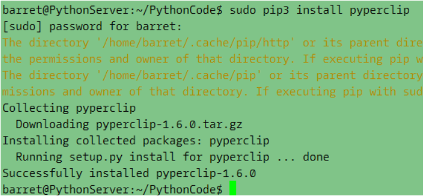

## 1. 基本概念的忽视

1. 在用于两个整型或浮点型值时， *操作符表示乘法。但其用于一个字符串
值和一个整型值时，它变成了“字符串复制” 操作符。

```
>>> 'Alice' * 5 
'AliceAliceAliceAliceAlice'
```

2. print函数打印字符串+数字问题。 一部分开发者受到C++的影响，常会写出如下错误语句。在Python中，+作用于字符串和数字相加是错误的，如果要打印如下语句，需要将数字29转换为字符串再打印：

```
print('I am ' + 29 + ' years old.')    #错误
# 正确，str()将传入值变为字符串，相同用法还有int()、float()
print('I am ' + str(29) + ' years old.')
```

3. bool的值到底怎么写？各种编程语言都支持bool类型，不过对于写法却不尽相同，很容易混淆。在Python中，True和False都是首字母大写，其余字母小写。如果写错，运行时会提示未定义（可惜没有编译过程，不然能检查出来）

```
>>> true Traceback (most recent call last):
File "<pyshell#2>", line 1, in <module>
true
NameError: name 'true' is not defined
```

4. 是不是想念C++中的for循环? range函数可以满足你：

```
for i in range(5) ====>  for(int i = 0; i < 5; i++)
for i in range(12, 16) ====> for(int i = 12; i < 16; i++)
for i in range(0, 12, -1) ====> for(int i = 10; i < 0; i--)
for i in range(0, 10, 2) ====> for(int i = 0; i < 10; (i++)++)
```

---


## 2. Python列表你熟悉吗

1. Python如何删除某个下标的值，并自动整理列表？
在C++中要达到这种效果只能使用链表，或者使用vector的erase方法，最简单实用的数组没有却没有这样的功能。Python中，要实现十分简单，直接**del 表项**或者实用**remove**方法即可：
如果知道想要删除的值在列表中的下标， del 语句就很好用。如果知道想要从列表中删除的值， remove()方法就很好用

```cpp
>>> spam = ['cat', 'bat', 'rat', 'elephant'] 
>>> del spam[2] 
>>> spam ['cat', 'bat', 'elephant']
或者
>>> spam = ['cat', 'bat', 'rat', 'elephant'] 
>>> spam.remove('bat') 
>>> spam ['cat', 'rat', 'elephant']
```

2. Python多重赋值
Python中，如何将列表中的表项直接赋值给多个变量呢（C++中只能for循环遍历了）？很简单，变量名在左，依次排开，赋值就完成了（注意与列表项个数要相等）：

```
>>> cat = ['fat', 'black', 'loud'] 
>>> size, color, disposition = cat
```

3. copy和deepcopy？
Python的copy模块提供了复制列表的功能，因为传统等号只是将列表的首地址(原谅我用了C++的概念）即引用复制了，多个变量还是指向统一列表，一变则具变。要完全复制一个列表，使之互不相干，需要使用copy函数。
不同的是copy只能复制一层列表，多维列表需要使用deepcopy函数：

```
>>> import copy
>>> spam = ['A', 'B', 'C', 'D']
>>> cheese = copy.copy(spam)
>>> cheese[1] = 42
>>> spam
['A', 'B', 'C', 'D']
>>> cheese
['A', 42, 'C', 'D']
```

---


## 3. 字符串你懂了吗


### 3.1 常用方法
| 方法 | 含义 |
| --- | --- |
| [i:j] | 切片，获取子字符串，和列表相同的操作方式 |
| in、not in | 判断字符串是否在另一个字符串中(区分大小写) |
| upper() | 返回新字符串，全部大写 |
| lower() | 返回新字符串，全部小写 |
| isupper() | 判断字符串是否全为大写 |
| islower() | 判断字符串是否全为小写 |
| isalpha() | 判断是否只包含字母 |
| isalnum() | 判断是否只包含字母和数字 |
| isdecimal() | 判断是否只包含数字 |
| isspace() | 判断是否只包含空格、制表符、换行符 |
| istitle() | 判断是否仅报告大写字母开头，后面全为小写字母的单词 |
| startwith() | 判断是否以某字符串开头 |
| endwith() | 判断是否以某字符结尾 |
| ' '.join() | 将字符串列表连接成字符串，' '中指的分隔符，一般是空格 |
| split() | 将字符串按照指定分隔符，fengeweu列表 |
| rjust()、ljust()、center() | 右对齐，左对齐，居中，参数为对齐长度和填充字符(注) |
| rstrip()、lstrip()、strip() | 删除右/左/两端空白字符(空格，制表符，换行符) |


**注：**

> rjust,ljust,center函数的第一个参数是指对齐时整个字符串的长度，不是对齐的偏移量。例如hello需要右对齐，左边留2个空格，代码应该是'hello'.rust(7), 参数7为5+2。参数不能写成2！！


### 3.2 pyperclip模块

pyperclip 模块有 copy()和 paste()函数， 可以向计算机的剪贴板发送文本， 或从它接收文本。
不过首先你需要使用pip安装这个模块：



基本使用：

```
>>> import pyperclip 
>>> pyperclip.copy('Hello world!') 
>>> pyperclip.paste() 'Hello world!'
```


## 4. 一维切片

- [-1]： 取最后一个元素
- [:-1]  ：  除了最后一个取全部
- [::-1]：  取从后向前（相反）的元素
- [2::-1]) ：  取从下标为2的元素翻转读取
