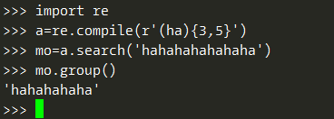

## 1. 正则表达式对象

正则表达式， 简称为 regex， 是文本模式的描述方法。例如， \d 是一个正则表
达式， 表示一位数字字符，即任何一位 0 到 9 的数字。

Python 中所有正则表达式的函数都在 **re** 模块中。向 re.compile()传入一个字符串值，表示正则表达式，它将返回一个 Regex 模式对象（或者就简称为 Regex 对象）。Regex 对象的**search**()方法查找传入的字符串， 寻找该正则表达式的所有匹配。如果字符串中没有找到该正则表达式模式， search()方法将返回 None。如果找到了该模式， search()方法将返回一个 **Match** 对象。 Match 对象有一个 **group**()方法，它返回被查找字符串中实际匹配的文本。

```
import re
phoneNumRegex = re.compile(r'\d\d\d-\d\d\d-\d\d\d\d') 
mo = phoneNumRegex.search('My number is 415-555-4242.') 
print('Phone number found: ' + mo.group()) 
>>>Phone number found: 415-555-4242
```


## 2. 高级功能


### 1. 分组

添加括号将在正则表达式中创建“分组”，然后可以使用 **group**()匹配对象方法，从一个分组中获取匹配的文本；或者使用**groups**()函数获取包含所有分组的列表。

```
import re
phoneNumRegex = re.compile(r'(\d\d\d)-(\d\d\d-\d\d\d\d)')
mo = phoneNumRegex.search('My number is 415-555-4242.') 
mo.group(1) >>>'415'
mo.group(2) >>> '555-4242'
```


### 2. |管道

字符|称为“管道”。希望匹配许多表达式中的一个时， 就可以使用它。例如，正则表达式 r'Batman|Tina Fey'将匹配'Batman'或'Tina Fey'。

```
import re
batRegex = re.compile(r'Bat(man|mobile|copter|bat)')
mo = batRegex.search('Batmobile lost a wheel')
mo.group() >>> 'Batmobile'
mo.group(1) >>> 'mobile'
```


### 3. ?可选匹配

字符?表明它前面的分组在这个模式中是可选的，不论这段文本在不在， 正则表达式
都会认为匹配。即：匹配这个问号之前的分组零次或一次

```
import re
batRegex = re.compile(r'Bat(wo)?man')
mo1 = batRegex.search('The Adventures of Batman')
mo1.group()  >>> 'Batman'
mo2 = batRegex.search('The Adventures of Batwoman')
mo2.group() >>> 'Batwoman'
```


### 4. 其他常用字符
| 字符 | 正则表达式中含义 |
| --- | --- |
| * | 匹配*号前面的分组零次或多次 |
| + | 匹配+号前面的分组一次或多次 |
| {n} | 匹配{}前面的分组n次 |
| {n,} | 匹配 n 次或更多前面的分组 |
| {,m} | 匹配零次到 m 次前面的分组 |
| {n,m} | 匹配至少 n 次、至多 m 次前面的分组 |
| ^ | 匹配必须发生在被查找文本开始处 |
| $ | 必须以这个正则表达式的模式结束 |
| . | 匹配换行符外的所有字符；加上re.DOTALL参数可匹配换行符 |
| \\d | 匹配数字 |
| \\w | 匹配单词 |
| \\s | 匹配空格 |
| \\D | 匹配除数字外所有字符 |
| \\W | 匹配除单词外所有字符 |
| \\S | 匹配除空格外的所有字符 |
| [abc] | 匹配方括号内的任意字符（诸如 a、 b 或 c） |
| [^abc] | 匹配不在方括号内的任意字符 |


### 5. sub 替换字符串

Regex 对象的 sub()方法需要传入两个参数。第一个参数是一个字符串， 用于取代发现的匹配。第二个参数是一个字符串，即正则表达式。 sub()方法返回替换完成后的字符串。

```
namesRegex = re.compile(r'Agent \w+') 
namesRegex.sub('CENSORED', 'Agent Alice gave the secret documents to Agent Bob.') 
>>> 'CENSORED gave the secret documents to CENSORED.'
或：
re.sub(r'Agent \w+', 'CENSORED', 'Agent Alice gave the secret documents to Agent Bob.')
```

**note:** sub默认会替换全部匹配项，如果想要指定替换的个数可以设置sub函数的第四个参数，同时第五个参数可以指定大小写的flag：

```
text = re.sub(r'(adjective)', adjective, text, 1, re.I)
```


## 3. 贪心匹配和非贪心匹配

看下面例子，正则表达式(ha){3,5}表示匹配hahaha或者hahahahaha，但为什么下面例子输出却是5个ha，没有3个ha？



Python 的正则表达式默认是“**贪心**” 的， 这表示在有二义的情况下，它们会尽可能匹配最长的字符串。因此要切换到**非贪心**版本，需要在匹配分组后面加上？号。

```
import re
a=re.compile(r'(ha){3,5}?')
mo=a.search('hahahahahahaha')
mo.group() >>> 'hahaha'
```


## 4. 大小写匹配

通常， 正则表达式用你指定的大小写匹配文本。要让正则表达式不区分大小写，可以向 re.compile()传入 **re.IGNORECASE** 或 **re.I**，作为第二个参数。

**Note**: re.compile()函数只接受一个值作为它的第二参数。因此需要使用管道字符（|）将变量组合起来，才能同时指定多个参数。

---

