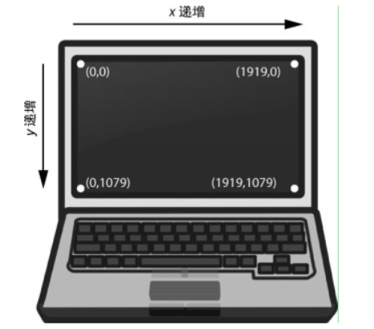
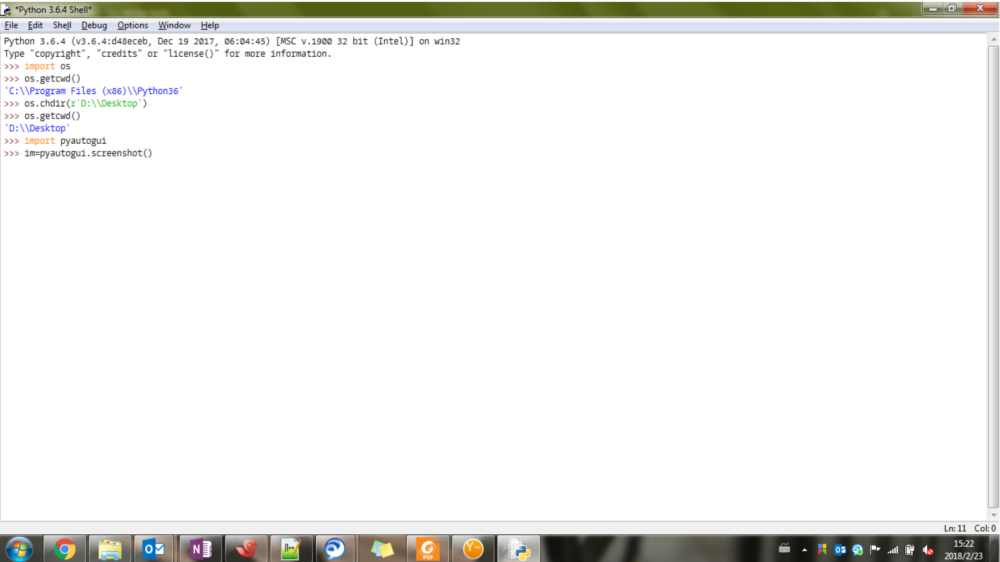

## 1. pyautogui安装

pyautogui 模块包含了一些函数，可以模拟鼠标移动、按键和滚动鼠标滚轮。pyautogui 模块可以向 Windows、 OS X 和 Linux 发送虚拟按键和鼠标点击。

在安装 pyautogui 之前，可能需要安装一些其他模块：

- 在 Windows 上，不需要安装其他模块。
- 在 OS X 上，运行 sudo pip3 install pyobjc-framework-Quartz， sudo pip3 install pyobjc-core，然后 sudo pip3 install pyobjc。
- 在 Linux 上，运行 sudo pip3 install python3-xlib， sudo apt-get install scrot， sudo apt-get install python3-tk，以及 sudo apt-get install python3-dev


## 2. 鼠标控制


### 2.1 鼠标移动

pyautogui 的鼠标函数使用 x、 y 坐标，原点的 x、 y 都是零，在屏幕的左上角。所有坐标都是正整数，没有负数坐标。



pyautogui.**size**() 函数返回两个整数的元组，包含屏幕的宽和高的像素数。

pyautogui.**moveTo**() 函数将鼠标立即移动到屏幕的指定位置。表示 x、 y 坐标的整数值分别构成了函数的第一个和第二个参数。可选的 duration 整数或浮点数关键字参数，指定了将鼠标移到目的位置所需的秒数。如果不指定，默认值是零，表示立即移动。
pyautogui.**moveRel**() 函数相对于当前的位置移动鼠标。

pyautogui.**position**() 函数，可以确定鼠标当前的位置。它将返回函数
调用时，鼠标 x、 y 坐标的元组。


### 2.2 鼠标点击

pyautogui.**click**() 方法。
默认情况下，点击将使用鼠标左键，点击发生在鼠标当前所在位置。如果希望点击在鼠标当前位置以外的地方发生，可以传入 x、 y 坐标作为可选的第一第二参数。
如果想指定鼠标按键，就加入 button 关键字参数，值分别为 'left'、 'middle' 或 'right'。

pyautogui.**doubleClick**() 函数执行双击鼠标左键 。
pyautogui.**rightClick**() 和 pyautogui.**middleClick**() 函数将分别执行双击右键和双击中键。


### 2.3 拖动鼠标

“拖动”意味着移动鼠标，同时按住一个按键不放。

pyautogui.**dragTo**() 和 pyautogui.**dragRel**() 函数，将鼠标拖动到一个新的位置，或相对当前位置的位置。 dragTo() 和 dragRel() 的参数与 moveTo() 和 moveRel() 相同。

```python
import pyautogui, time
time.sleep(5)
pyautogui.click() # click to put drawing program in focus
distance = 200
while distance > 0:
	pyautogui.dragRel(distance, 0, duration=0.2) # move right
	distance = distance - 5
	pyautogui.dragRel(0, distance, duration=0.2) # move down
	pyautogui.dragRel(-distance, 0, duration=0.2) # move left
	distance = distance - 5
	pyautogui.dragRel(0, -distance, duration=0.2) # move up
```


### 2.4 滚动鼠标

pyautogui.**scroll**()你向它提供一个整型参数，说明向上或向下滚动多少单位：传递正整数表示向上滚动，传递负整数表示向下滚动。


## 3. 屏幕快照

要在 Python 中获取屏幕快照，就调用 pyautogui.screenshot() 函数，返回一个Image对象（可以使用Image的方法了）。

```python
import pyautogui
im=pyautogui.screenshot()
im.save('1.png')
```

得到的结果如下：




## 4. 识别图像

pyautogui.**locateOnScreen**()方法可以在屏幕上寻找指定的图像，返回４个整数的元组， 是屏幕上首次发现该图像时左边的 x 坐标、顶边的 y 坐标、宽度以及高度。
如果屏幕上找不到该图像， locateOnScreen() 函数将返回 None。请注意要成功识别，屏幕上的图像必须与提供的图像完全匹配。即使只差一个像素， locateOnScreen() 函数也会返回 None。

如果该图像在屏幕上能够找到多处， locateAllOnScreen() 函数将返回一个 **Generator** 对象。可以将它传递给 list() ，返回一个 4 整数元组的列表。

```python
>>> list(pyautogui.locateAllOnScreen('s.png'))
[(2, 198, 35, 17), (2, 215, 35, 17), (2, 232, 35, 17), (2, 249, 35, 17)]
```


## 5. 键盘控制


### 5.1 发送按键

pyautogui 有一些函数向计算机发送虚拟按键，让你能够填充表格，或在应用中输入文本。
pyautogui.**typewrite**(str,duration)： 发送文本str，duration为每个字符之间暂停时间。

下表列举了pyautogui支持发送的按键，包括字符和其他特殊按键：

| 键盘键字符串 | 含义 |
| --- | --- |
| 'a', 'b', 'c', 'A', 'B', 'C', '1', '2', '3','!', '@', '#'，等等 | 单个字符的键 |
| 'enter'（or 'return' or '\\n'） | 回车键 |
| 'esc' | Esc 键 |
| 'shiftleft', 'shiftright' | 左右 Shift 键 |
| 'altleft', 'altright' | 左右 Alt 键 |
| 'ctrlleft', 'ctrlright' | 左右 Ctrl 键 |
| 'tab'（or '\\t'） | Tab 键 |
| 'backspace', 'delete' | Backspace 和 Delete 键 |
| 'pageup', 'pagedown' | Page Up 和 Page Down 键 |
| 'home', 'end' | Home 和 End 键 |
| 'up', 'down', 'left', 'right' | 上下左右箭头键 |
| 'f1', 'f2', 'f3'，等等 | F1 至 F12 键 |
| 'volumemute', 'volumedown', 'volumeup' | 静音、减小音量、放大音量键（有些键盘没有这些键，但你的操作系统仍能理解这些模拟的按键） |
| 'pause' | Pause 键 |
| 'capslock', 'numlock', 'scrolllock' | Caps Lock， Num Lock 和 Scroll Lock 键 |
| 'insert' | Ins 或 Insert 键 |
| 'printscreen' | Prtsc 或 Print Screen 键 |
| 'winleft', 'winright' | 左右 Win 键（在 Windows 上） |
| 'command' | Command 键（在 OS X 上） |
| 'option' | Option 键（在 OS X 上） |


### 5.2 快捷键组合

“热键”或“快捷键”是一种按键组合，它调用某种应用功能。通常需要在按住某个键不放的情况下按另一个键。

可以使用 pyautogui.**hotkey**() 函数，它接受多个键字符串参数，按顺序按下，再按相反的顺序释放。例如对于 Ctrl-C：

```python
pyautogui.hotkey('ctrl', 'c')
```

---

