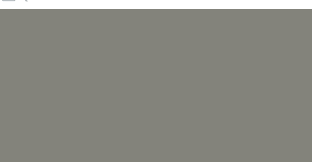
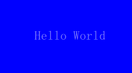
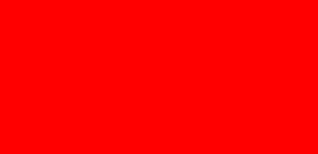
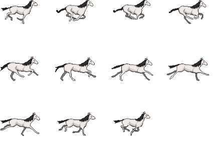
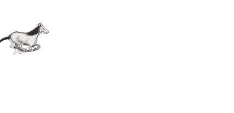

# 1 QML Animation
上述两个章节都是用Qt Widget + C++实现的动画，在Qt Quick中，可以仅仅使用QML实现动画，不需要C++的参与（C++只负责后台，不负责GUI绘制）。

## 1.1 QML动画类别
在QML中，有8中不同的动画类别，需要添加动画时直接在qml文件中添加，不需要到C++代码文件添加操作：

- **Anchor animation:** Animates changes in anchor values
- **Color animation: **Animates changes in color values
- **Number animation: **Animates changes in qreal-type values
- **Parent animation:** Animates changes in parent values
- **Path animation: **Animates an item along a path
- **Property animation: **Animates changes in property values
- **Rotation animation: **Animates changes in rotation values
- **Vector3d animation: **Animates changes in QVector3D values


在qml中，这个动画类型都是**属性层别**的，可以**针对同一个控件的不同属性设置不同的动画效果**。

## 1.2 color animation示例
```javascript
Rectangle{
    id:background;
    anchors.fill: parent;
    color: "blue";
    SequentialAnimation on color {
        ColorAnimation { to: "yellow"; duration: 1000 }
        ColorAnimation { to: "red"; duration: 1000 }
        ColorAnimation { to: "blue"; duration: 1000 }
        loops: Animation.Infinite;
    }
}
```
在上面qml中，我们加入了一个color属性上的的顺序动画SequentialAnimation，依次变换颜色，动画不停循环，显示效果如下：



## 1.3 number animation示例
```javascript
Text {
    id: txt;
    text: qsTr("Hello World");
    anchors.centerIn: parent;
    color: "white";
    font.pointSize: 15;
    SequentialAnimation on opacity {
        NumberAnimation { to: 0.0; duration: 1000}
        NumberAnimation { to: 1.0; duration: 1000}
        loops: Animation.Infinite;
    }
}
```
在上面qml中，我们加入了一个opacity（透明度）属性上的顺序动画，透明度从1到0再到1，动画不停循环。效果如下：



## 1.4 state machine示例
和C++的实现类似，也需要三个部分的操作，只不过全都是在qml中定义的：
```javascript
Rectangle{
    id:background;
    anchors.fill: parent;
    color: "blue";
    //1.add state machine
    states: [
        State {
            name: "PRESSED"
            PropertyChanges { target: background; color: "blue" }
        },
        State {
            name: "RELEASED"
            PropertyChanges { target: background; color: "red" }
        }
    ]
    //2.add animation transition
    transitions: [
        Transition {
            from: "PRESSED"
            to: "RELEASED"
            ColorAnimation { target: background; duration: 1000}
        },
        Transition {
            from: "RELEASED"
            to: "PRESSED"
            ColorAnimation { target: background; duration: 1000}
        }
    ]
    //3.bind the event to the state change
    MouseArea{
        anchors.fill: parent;
        onPressed: background.state = "PRESSED";
        onReleased: background.state = "RELEASED";
    }
}
```
上面qml实现的效果如下：



## 1.5 Easing curve in qml
```javascript
//可以添加在任何一个animation type中
easing.type: Easing.InOutElastic;
easing.amplitude: 2.0;
easing.period: 1.5;
```

## 1.6 QML Animator
Animator是直接在Qt Quick的场景中操作的动画类型。它不像一般的动画和QML组件那样，当UI线程阻塞的时候，动画渲染线程也阻塞。这个类型的属性值，在动画运行的时候，不会发生变化。只有当动画运行完毕，其属性才会更新。我们可以像使用其它动画类型那样去使用它。QT中包括如下具体的类型：[OpacityAnimator](https://doc.qt.io/qt-5/qml-qtquick-opacityanimator.html), [RotationAnimator](https://doc.qt.io/qt-5/qml-qtquick-rotationanimator.html), [ScaleAnimator](https://doc.qt.io/qt-5/qml-qtquick-scaleanimator.html), [UniformAnimator](https://doc.qt.io/qt-5/qml-qtquick-uniformanimator.html), [XAnimator](https://doc.qt.io/qt-5/qml-qtquick-xanimator.html), and [YAnimator](https://doc.qt.io/qt-5/qml-qtquick-yanimator.html)。
使用示例，和其他qml动画可以放在一个group中，而且格式没有太大差别：
```javascript
Rectangle{
    id:myBox;
    anchors.horizontalCenter: parent.horizontalCenter;
    anchors.verticalCenter: parent.verticalCenter;
    width: 50;
    height: 50;
    color: "blue";
    ParallelAnimation {
        ColorAnimation {
            target: myBox
            property: "color"
            from: "forestgreen"
            to: "lightsteelblue";
            duration: 1000
        }
        ScaleAnimator {
            target: myBox
            from: 2
            to: 1
            duration: 1000
        }
        running: true
    }
}
```
动画效果如下：


## 1.7 sprite animation
**精灵图又叫帧动画**，采用一张大图的形式来保存一个角色的所有帧信息（游戏中经常用）。Qt Quick可以将帧动画生成动画的形式（CSS也可以），需要用到AnimatedSprite：一个帧动画的例子：



```javascript
AnimatedSprite {
    id: sprite;
    width: 128;
    height: 128;
    source: "qrc:/horse_1.png";
    frameCount: 11; //帧数
    frameWidth: 128;
    frameHeight: 128;
    frameRate: 25;
    loops: Animation.Infinite;
    running: true;

    NumberAnimation {//添加平移动画，x坐标移动
        target: sprite;
        property: "x";
        from: -128;
        to: 512;
        duration: 3000;
        loops: Animation.Infinite;
        running: true;
    }
}

MouseArea {
    anchors.fill: parent
    onClicked: {//控制sprite的暂停
        if (sprite.paused)
            sprite.resume();
        else
            sprite.pause();
    }
}
```
帧动画动起来之后是这样的：


