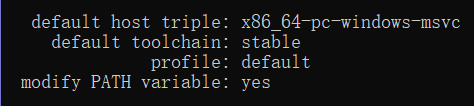

# 1 Rust环境配置

## 1.1 Rust的安装
首先切换使用国内的源，国外源速度太慢容易中断，设置如下环境变量（Linux设置shell配置文件，windows设置用户环境变量）：以Linux为例，添加如下环境变量，标明使用中科大源：
```shell
export RUSTUP_DIST_SERVER="https://mirrors.ustc.edu.cn/rust-static"
export RUSTUP_UPDATE_ROOT="https://mirrors.ustc.edu.cn/rust-static/rustup"
```
设置之后，windows直接双击exe安装即可，linux使用如下脚本自动安装：
```shell
$ curl --proto '=https' --tlsv1.2 -sSf https://sh.rustup.rs | sh
```
安装完成后，运行`rustc --version`即可看到版本信息​

## 1.2 windows with Mingw安装
如果咋windows已经安装了visual studio和MSVC编译器，则可以按照下面的默认配置进行安装：



## 1.3 更新和卸载
通过 rustup 安装了 Rust 之后， 很容易更新到最新版本。 在 shell 中运行如下更新脚本：
```shell
$ rustup update
```
为了卸载 Rust 和 rustup ， 在 shell 中运行如下卸载脚本:
```shell
$ rustup self uninstall
```

# 2 hello world
代码示例如下：
```rust
fn main() {
    println!("hello world"); //!表示rust宏，这里是打印一行内容的宏，函数不带！
}
```
> 注意，代码风格可以用**rustfmt**命令自动格式化，不需要手动或编辑器调整

编译rs源代码文件使用**rustc**编译命令，类似**gcc**命令的使用。
Rust 是一种 **预编译静态类型（ ahead-of-time compiled） 语言**， 这意味着你可以编译程序， 并将可执行文件送给其他人， 他们甚至不需要安装 Rust 就可以运行。


# 3 cargo
Cargo 是 Rust 的**构建系统和包管理器**。我们使用 Cargo 来管理Rust项目， 因为它可以为你处理很多任务， 比如构建代码、 下载依赖库并编译这些库。（类似C++的cmake，java的gradle）。

## 3.1 cargo创建项目
```shell
barret@Barret-PC:~/rustCode$ cargo new hello_world
     Created binary (application) `hello_world` package
barret@Barret-PC:~/rustCode$ cd hello_world/
barret@Barret-PC:~/rustCode/hello_world$ ls -a
.  ..  .git  .gitignore  Cargo.toml  src
```
可以看到 Cargo 生成了如下内容：

- 一个Cargo.toml 文件，保存项目信息和依赖库（rust中叫**crates**）
-  一个 src 目录， 以及位于 src 目录中的 main.rs 文件。
- 初始化了一个 git 仓库， 以及一个 .gitignore 文件。不想自动生成git，可以使用`cargo new --vcs none`


## 3.2 编译和运行

- 可以使用 `cargo build` 或 `cargo check` 构建项目
- 使用`cargo build --release  `进行发布构建
- 可以使用 `cargo run` 一步构建并运行项目
- 有别于将构建结果放在与源码相同的目录， Cargo 会将其放到 target/debug 目录


示例：
```shell
barret@Barret-PC:~/rustCode/hello$ cargo build
   Compiling hello v0.1.0 (/home/barret/rustCode/hello)
    Finished dev [unoptimized + debuginfo] target(s) in 0.25s
barret@Barret-PC:~/rustCode/hello$ cargo run
    Finished dev [unoptimized + debuginfo] target(s) in 0.05s
     Running `target/debug/hello`
Hello, world!
```

## 3.3 添加外部依赖库
当Rust内置的标准库没有一些功能的时候，就需要添加外部的依赖库（Rust称为crate）。基本步骤如下：

1. 修改cargo的全局配置文件`~/.cargo/config`，修改使用国内的源（速度快）
```yaml
[cargo-new]
name = "Barret Ren"
email = "barret.ren@outlook.com"
vcs = "none"
[source.crates-io]
replace-with = 'ustc'
[source.ustc]
registry = "https://mirrors.ustc.edu.cn/crates.io-index"
```

2. 修改Cargo.toml，加上需要的依赖库。`[dependencies]` 片段告诉 Cargo 本项目依赖了哪些外部 crate 及其版本。
```yaml
[dependencies]
rand = "0.7.3"
```

3. 执行cargo build会自动下载依赖库
```shell
Downloaded rand v0.7.3 (registry `https://mirrors.tuna.tsinghua.edu.cn/git/crates.io-index.git`)
  Downloaded rand_chacha v0.2.2 (registry `https://mirrors.tuna.tsinghua.edu.cn/git/crates.io-index.git`)
  Downloaded getrandom v0.1.14 (registry `https://mirrors.tuna.tsinghua.edu.cn/git/crates.io-index.git`)
  Downloaded ppv-lite86 v0.2.8 (registry `https://mirrors.tuna.tsinghua.edu.cn/git/crates.io-index.git`)
  Downloaded rand_core v0.5.1 (registry `https://mirrors.tuna.tsinghua.edu.cn/git/crates.io-index.git`)
  Downloaded libc v0.2.71 (registry `https://mirrors.tuna.tsinghua.edu.cn/git/crates.io-index.git`)
  Downloaded cfg-if v0.1.10 (registry `https://mirrors.tuna.tsinghua.edu.cn/git/crates.io-index.git`)
   Compiling libc v0.2.71
   Compiling getrandom v0.1.14
   Compiling cfg-if v0.1.10
   Compiling ppv-lite86 v0.2.8
   Compiling rand_core v0.5.1
   Compiling rand_chacha v0.2.2
   Compiling rand v0.7.3
```

# 4 一个猜数字的高级例子
```rust
use rand::Rng;
use std::cmp::Ordering;
use std::io; //导入IO库，使用use关键字，类似include

fn main() {
    println!("Guess the number!");

    let secret_number = rand::thread_rng().gen_range(1, 101); //生成1-100的随机数
    println!("the secret number is {}", secret_number);

    loop {
        println!("Please input your guess.");
        //let关键字用于创建变量, mut表示该变量可被修改，默认是不可变的
        let mut guess = String::new(); //调用String类的静态方法new
        io::stdin()
            .read_line(&mut guess) //调用read_line从标准输入获取一行内容，&表示引用
            .expect("Failed to read line"); //read_line异常时的处理

        //字符串转为数字
        let guess: u32 = match guess.trim().parse() {
            Ok(num) => num,
            Err(_) => continue, //继续循环
        };
        //比大小
        match guess.cmp(&secret_number) {
            //match表达式，类似switch
            Ordering::Less => println!("too small"),
            Ordering::Greater => println!(" too big"),
            Ordering::Equal => {
                println!("you win");
                break; //退出loop循环
            }
        }
    }
}
```
从上面例子可以学到

- `std::io`是标准IO库，可以处理标准输入和输出
- 调用外部依赖库`rand`，生成随机数
- `String::new`是调用了String类的new静态方法，生成一个string对象
- `read_line`获取一行内容，返回值是`io:Reslut`类型。该类型的`expcet`方法用于处理失败的异常
- `println!`中的**{}**是占位符，可以格式化输出后面参数的内容
- Rust 允许用一个新值来 隐藏 （ shadow） guess 之前的值。这个功能常用在需要转换值类型之类的场景。它允许我们复用 guess 变量的名字， 而不是被迫创建两个不同变量
- match表达式由**分支**组成，一个分支包含一个模式和表达式，其实就是C++的switch
- 代码中引用了`Ordering`枚举类型作为match的匹配模式
- `loop{}`是循环语句，break用于退出循环，continue用于继续下次循环


Rust 标准库中有很多叫做 Result 的类型：一个通用的`Result`以及在子模块中的特化版本， 比如 io::Result。Result 的成员是 Ok 和 Err：

- Ok 成员表示操作成功， 内部**包含成功时产生的值**。
- Err成员则意味着操作失败， 并且包含失败的前因后果


