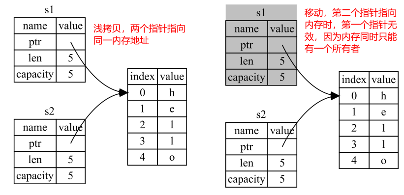
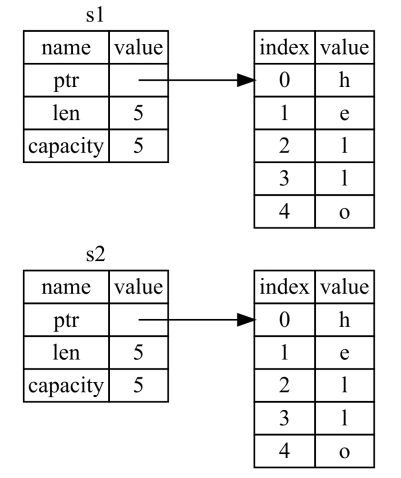
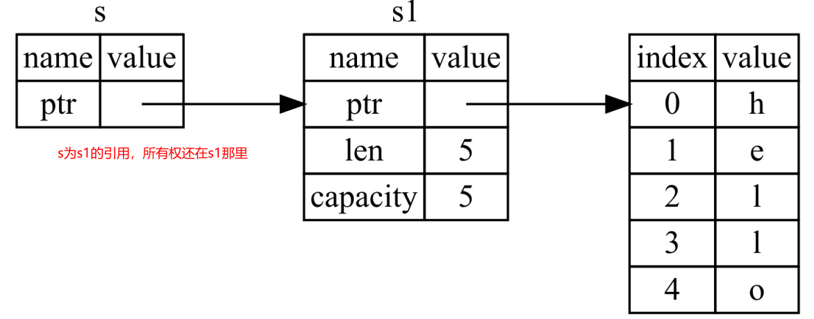

# 所有权的规则
1. **Rust 中的每一个值都有一个被称为其所有者（ owner）的变量。**
1. **值有且只有一个所有者。**
1. **当所有者（ 变量）离开作用域， 这个值将被丢弃**


```rust
{
	let s = String::from("hello"); // 从此处起， s 是有效的
	// 使用 s
} // 此作用域已结束，//s 不再有效	
```
当变量离开作用域， Rust 为我们调用一个特殊的函数。 这个函数叫做 drop。
> 在 C++ 中， 这种 item 在生命周期结束时释放资源的模式有时被称作 资源获取即初始化（ Resource Acquisition Is Initialization (RAII)），具体介绍参照： 


## 移动代替浅拷贝
看下面例子：
```rust
fn main() {
    let s1 = String::from("hello world"); //创建String变量，申请内存保存内容
    let s2 = s1; //s2指向内存，同时s1被标记无效

    println!("{}", s1); //因为s1被丢弃，编译出错
}
```
这段代码在C++中运行没有问题，但是在Rust会编译出错，因为s1已经被标记为无效。这就涉及到C++中的**浅拷贝**和Rust中**移动**的区别了：



- 所有整数类型， 比如 u32 。
- 布尔类型， bool ， 它的值是 true 和 false 。
- 所有浮点数类型， 比如 f64 。
- 字符类型， char 。
- 元组， 当且仅当其包含的类型也是上面的基本类型时

## 深拷贝
上面的例子，如果需要同时保持s1和s2可用，改怎么办呢？既然一个内存地址只能有一个所有者，那办法就是重新申请一块内存给s2，s1和s2指向不同的内存地址，也即C++概念中的**深拷贝。**在Rust中使用`clone`函数可以实现深拷贝，例如：
```rust
fn main() {
    let s1 = String::from("hello world");
    let s2 = s1.clone(); //深拷贝

    println!("{}, {}", s1, s2);
}
```
深拷贝之后，内存的结构如下：



## 所有权与函数
上面提到，对于实现了Copy trait的基本类型，移动与浅拷贝没有什么区别，对于堆上申请的内存，移动意味着所有权的转移，函数参数也不例外：
```rust
fn main() {
    let s = String::from("hello"); // s comes into scope
    takes_ownership(s); // s's value moves into the function...
                        // ... and so is no longer valid here
    println!("s: {}", s);//s已经没有所有权了，编译失败
}

fn takes_ownership(some_string: String) {
    // some_string comes into scope
    println!("{}", some_string);
}// Here, some_string goes out of scope and `drop` is called. The backing memory is freed.
```
当然，return函数返回值也会转移所有权：
```rust
fn main() {
    let s1 = gives_ownership();         // gives_ownership moves its return value into s1
}
fn gives_ownership() -> String {             // gives_ownership will move its
                                             // return value into the function
                                             // that calls it
    let some_string = String::from("hello"); // some_string comes into scope
    some_string                              // some_string is returned and
                                             // moves out to the calling
                                             // function
}
```

# 引用：不获取所有权

## 引用
引用的含义和C++一样，看下面例子：
```rust
fn main() {
    let s1 = String::from("hello");
    let len = calculate_length(&s1);
    println!("The length of '{}' is {}.", s1, len);
}
fn calculate_length(s: &String) -> usize { //引用符合加载类型前面
    s.len()
}
```

- 如果传递的不是引用，则s1的所有权进入函数内部后，在函数执行完离开函数作用域s1会被销毁，后面的打印会引用无效内存，导致编译错误
- 传递到函数的是string类型的引用，这样不需要考虑s1的生命周期问题，在函数返回后依然可以使用s1。引用的图示如下：

**引用允许使用值而不获得原有变量的所有权，更形象的应该叫借用**：



## 可变引用
既然函数内不能修改引用，那怎么能允许修改呢？那就用**mut可变引用**吧：
```rust
fn main() {
    let mut s = String::from("hello");
    change(&mut s);
}
fn change(some_string: &mut String) {//在引用符号后加mut，表示可以修改引用
    some_string.push_str(", world");
}
```

## 引用的规则

- **在任意给定作用域， 要么只能有一个可变引用， 要么只能有多个不可变引用**
- **引用必须总是有效的**。


这个限制的好处是 Rust 可以在**编译时就避免数据竞争**。 数据竞争（ data race） 类似于竞态条件， 它可由这三个行为造成：

- 两个或更多指针同时访问同一数据。
- 至少有一个指针被用来写入数据。
- 没有同步数据访问的机制。

可以使用大括号来创建一个新的作用域， 以允许拥有多个可变引用， 只是不能同时拥有。或者在一个引用销毁之后，在定义可变引用。


# Slice：不获取所有权

## range表示形式
另一个没有所有权的数据类型是slice。** slice允许你引用集合中一段连续的元素序列**， 而不用引用整个集合。可以使用一个由中括号中的`**[starting_index..ending_index]**`指定的 range 创建一个 slice。​

以字符串为例，字符串 slice（ string slice） 是 String 中一部分值的引用，：
```rust
let s = String::from("hello world");
//对字符串的部分引用
let hello = &s[0..5];
let world = &s[6..11];
```
其内存的结构如下：


```rust
let slice = &s[..2];//从开头到index2
let slice = &s[3..];//从index3到末尾
let slice = &s[..];//整个字符串范围
```

## string slice示例
string slice的类型为`&str`，使用示例如下：
```rust
fn first_word(s: &str) -> &str {
    let bytes = s.as_bytes();
    for (i, &item) in bytes.iter().enumerate() {
        if item == b' ' {
            return &s[0..i];
        }
    }
    return &s[..];
}

fn main() {
    let my_string = String::from("hello world");
    // first_word 中传入 `String` 的 slice
    let word = first_word(&my_string[..]);
    println!("{}", word);
    
    let my_string_literal = "hello world";
    // first_word 中传入字符串字面值的 slice
    let word = first_word(&my_string_literal[..]);
    println!("{}", word);

    // 因为字符串字面值就是string slice，
    // 这样写也可以， 即不使用 slice 语法！
    let word = first_word(my_string_literal);
    println!("{}", word);
}
```

## 其他slice类型
集合类型都支持slice，后面再补充
