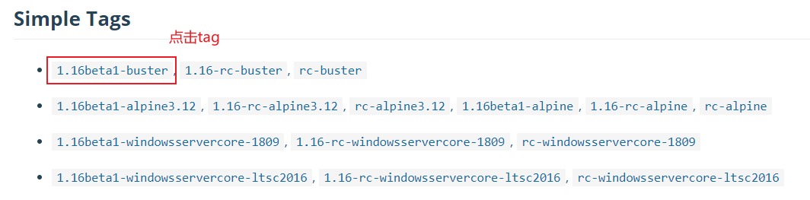

Dockerfile 是一个文本文件，其内包含了一条条的指令(Instruction)，每一条指令构建一层，因此每一条指令的内容，就是描述该层应当如何构建。

# 1 基本命令

- `FROM 镜像名`：定制镜像的基础镜像。也可以指定**scratch**表示没有基础镜像
- `RUN`：用于执行命令，有两者方式。**注意，每个命令会建立一层镜像，所以推荐第二种**
   - `RUN shell命令`：执行单个命令
   - `RUN ["可执行文件", "参数1", "参数2"]`：执行脚本命令


**更多基本命令参考《Docker从入门到实践》和下面我列举的一个示例。**


# 2 构建镜像
```bash
docker build [选项] <上下文路径/URL/-> -t 镜像名
```
一般来说，应该会将Dockerfile置于一个空目录下，或者项目根目录下。如果该目录下没有所需文件，那么应该把所需文件复制一份过来。如果目录下有些东西确实不希望构建时传给Docker引擎，那么可以用.gitignore 一样的语法写一个**.dockerignore**，该文件是用于剔除不需要作为上下文传递给Docker引擎的。


# 3 参考文件
我们可以在Docker Hub上查看已经生成的镜像文件，查看他们的Dockerfile内容：例如：[https://hub.docker.com/_/golang?tab=description](https://hub.docker.com/_/golang?tab=description)



# 4 示例：构建Ubuntu开发环境
```dockerfile
# 指定基于的基础镜像
FROM ubuntu:20.04

# 维护者信息
MAINTAINER Barret Ren <Barret.ren@outlook.com>

# update apt and install
ADD ./sources.list /etc/apt/sources.list
ADD ./.bashrc /root/
ADD ./.vimrc /root/
ADD ./.vim /root/.vim # 复制目录需要指定全路径
RUN apt-get update \
    && apt-get -y install gcc-10 gdb make vim\
    && wget -O go.tar.gz "https://studygolang.com/dl/golang/go1.15.6.linux-amd64.tar.gz" \
    && tar -xzf go.tar.gz -C /usr/local --strip-components=1 \
    && rm go.tar.gz \
    && make -p /home/barret/golang/{bin,pkg,src}\
# 我们也可以使用本地压缩文件，不下载：
Add ./go.tar.gz /root/ # 注意压缩文件会自动被展开
RUN mv /root/go /usr/local
```

# 5 多阶段构建
Docker v17.05 开始支持多阶段构建(multistage builds)。使用多阶段构建只需要编写一个 Dockerfile，并且生成的image更小：如果我们需要编译一个go源文件，并将可执行文件放入镜像中等待直接运行，那对比两种方式生成的镜像大小:
多阶段构建需要多个**FROM**，并使用**as**指定不同阶段名：比如下面示例：

- 第一阶段：将app.go文件复制到镜像中，并编译生成名为app的可执行文件
- 第二阶段：执行app文件
```dockerfile
FROM golang:1.15.6 as builder
RUN apk --no-cache add git
WORKDIR /go/src/github.com/go/helloworld/
COPY app.go .
RUN CGO_ENABLED=0 GOOS=linux go build -a -installsuffix cgo -o app .

FROM alpine:latest as prod
RUN apk --no-cache add ca-certificates
WORKDIR /root/
# 从上一阶段生成的镜像中复制app文件
COPY --from=builder /go/src/github.com/go/helloworld/app .
CMD ["./app"]
```
**显然分阶段构建中，最终生成的镜像中只包含app可执行文件，并没有包含go编译器等多余的文件，所以体积很小。**
在build时，我们可以直接全部构建，或使用**--target=**指定需要构建的阶段：
```bash
docker build --target builder -t username/imagename:tag .
```
