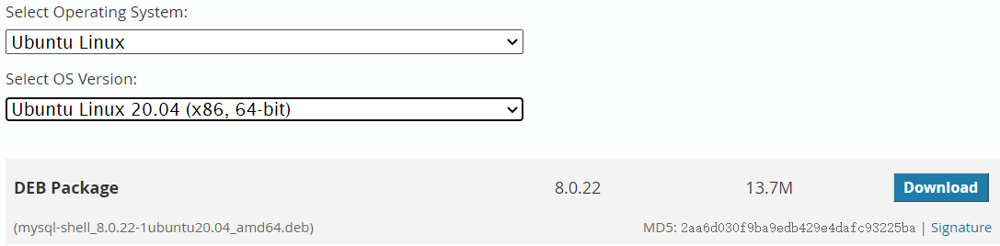

Mysql当前支持两种API，分别为：

- **Connector API**：支持使用SQL语句来执行操作，和shell中操作方式一样
- **X DevAPI**：新的API，推荐使用。除了支持普通的SQL语句，还支持NoSQL方法来处理JSON数据和SQL Table

# 1 安装C++ API
```shell
git clone https://github.com/mysql/mysql-connector-cpp.git
cmake ../mysql-connector-cpp
sudo cmake --build . --target install --config Release
# 复制头文件
sudo cp -r /usr/local/mysql/connector-c++-/include/mysqlx/ /usr/include/
# 将so文件复制到/usr/lib
sudo cp /usr/local/mysql/connector-c++-/lib64/debug/* /usr/lib
```

编译时需要指定动态链接库的位置，格式如下：`g++ -std=c++17 xx.cpp -lmysqlcppconn8`

# 2 安装Python API
Python API推荐使用pip安装，使用如下命令：
```shell
wget https://bootstrap.pypa.io/get-pip.py
sudo python get-pip.py

pip install mysql-connector-python
```

安装完成后可以使用如下代码验证一下：
```python
import mysql.connector

print("MySQL Connector/Python version: {0}".format(mysql.connector.__version__))
print("Version as tuple:")
print(mysql.connector.__version_info__)
print("")
print("API level: {0}".format(mysql.connector.apilevel))
print("Parameter style: {0}".format(mysql.connector.paramstyle))
print("Thread safe: {0}".format(mysql.connector.threadsafety))
```

# 3 开启Mysql X Plugin
MySQL Shell下载地址：[https://dev.mysql.com/downloads/shell/](https://dev.mysql.com/downloads/shell/)，下载deb包安装



1. 修改文件/etc/mysql/mysql.conf.d/mysqld.cnf
```
[mysqld]
datadir=/var/lib/mysql
socket=/var/lib/mysql/mysql.sock

[mysql.server]
user=mysql
# basedir=/usr/local/mysql

[client]
socket=/var/lib/mysql/mysql.sock
```

2. 使用如下命令为用户开启X plugin
```bash
$ sudo mysqlsh -u barret -h localhost -p --mysql --dba enableXProtocol
Please provide the password for 'barret@localhost': *************
Save password for 'barret@localhost'? [Y]es/[N]o/Ne[v]er (default No): Y
enableXProtocol: X Protocol plugin is already enabled and listening for connections on port 33060
```

# 4 示例数据库安装
从[https://dev.mysql.com/doc/index-other.html](https://dev.mysql.com/doc/index-other.html)中下载world_x数据库文件，安装：
```bash
wget https://downloads.mysql.com/docs/world_x-db.tar.gz
gzip -d world_x-db.tar.gz
tar xf world_x-db.tar
cd world_x-db
# 进入mysqlsh \sql下，输入：
SOURCE /home/barret/world_x-db/world_x.sql
```
