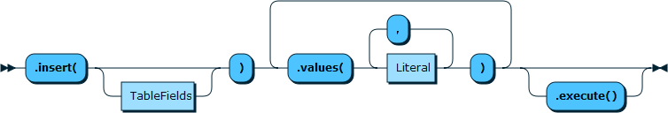
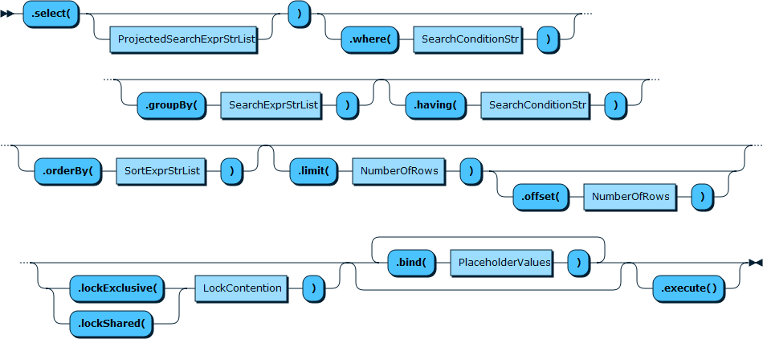
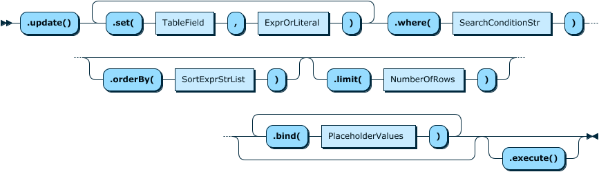
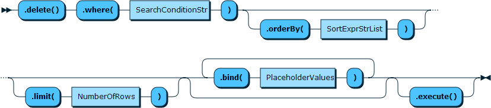

操作传统关系数据库table的函数已在第二节列出：下面进行详细的使用解析

# 1 Table.insert
```cpp
// Accessing an existing table
var myTable = db.getTable("my_table");
// Insert a row of data.
myTable.insert("id", "name")
	.values(1, "Imani")
	.values(2, "Adam")
	.execute();
```


# 2 Table.select


# 3 Table.update


# 4 Table.delete


