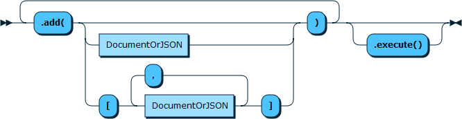
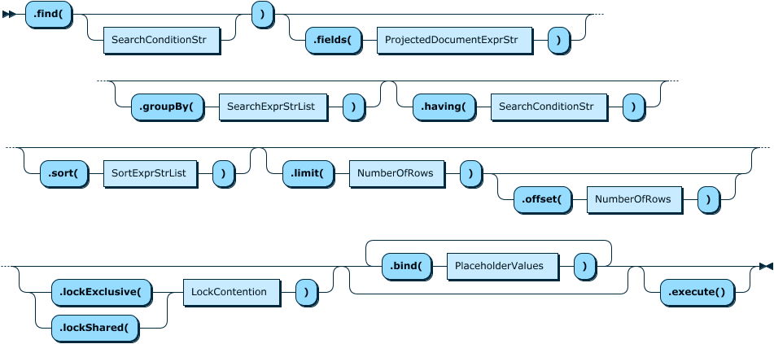
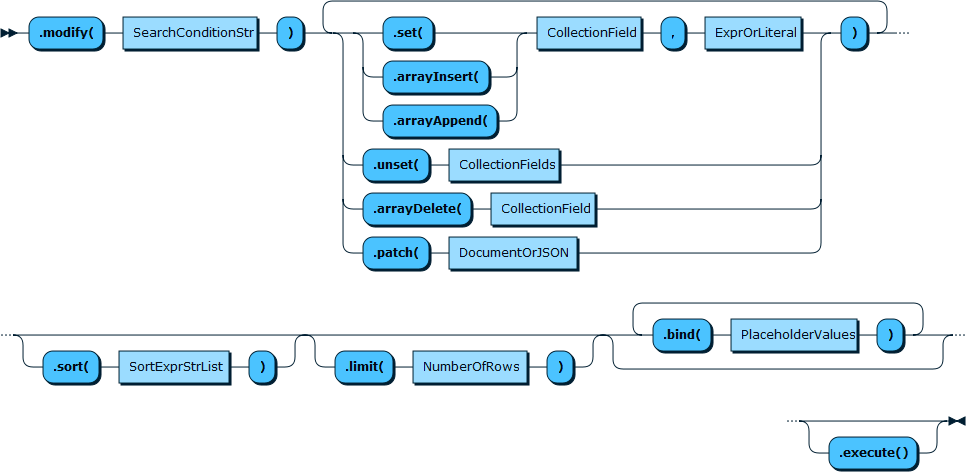
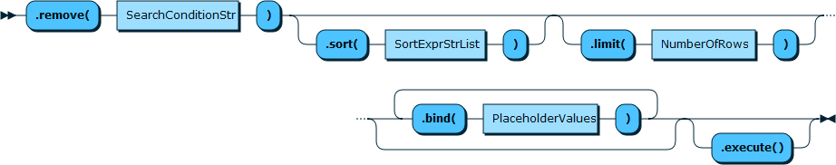

# 1 Mysql Collection介绍
MySQL提供**NoSQL JSON文档存储(Document Store，mongodb？？)**，从MySQL 5.7版本和MySQL 8.0版本开始，开发者可以在表的一列中存储 JSON 文档。MySQL 5.7 引入的 JSON 数据类型。它允许在表的一行中提供大约1GB大小的列，**数据必须是有效的JSON**，否则服务器会报错。MySQL文档存储允许开发者跳过底层数据结构创建、数据规范化和其它使用传统数据库时需要做的工作，直接存储数据。只需创建一个 JSON 文档集合(document collection)，接着就可以使用了。通过 X DevAPI，你可以从你的代码中移除令人不爽的结构化查询字符串，改为使用支持现代编程设计的 API 调用。
**在Document Store的概念中，collection=table，document=row**。

# 2 collection基本CRUD操作
Collection的基本CRUD函数已经在上一节表中列出：使用示例如下：
```cpp
Session sess("localhost", 33060, "barret", "newpasswd");
Schema db = sess.getSchema("test");
//创建新的collection
Collection coll = db.createCollection("my_collection");
//插入几行json document
coll.add(R"({"name":"barret","age":30})").execute();
coll.add(R"({"name":"dandan","age":28})").execute();
coll.add(R"({"name":"paopao","age":3})").execute();
//查询数据
DocResult docs = coll.find("age < :param1")
                     .bind("param1", 30)
                     .execute();
//打印结果
cout << docs.fetchOne() << endl;
//删除collection
db.dropCollection("my_collection");
```

现将基本操作拆解如下：

## 2.1 创建collection
调用DB对象的`createCollection()`函数，并且可以指定是否覆盖原有同名collection：
```cpp
// Create a new collection called 'my_collection'
Collection myColl = db.createCollection("my_collection");
// Create a new collection or reuse existing one
Collection myExistingColl = db.createCollection("my_collection", true)//true表示重用
```

## 2.2 获取collection
调用DB对象的`getCollection()`函数，获取已存在的collection：
```cpp
// Get a collection object for 'my_collection'
Collection myColl = db.getCollection("my_collection");
// Get a collection object but also ensure it exists in the database
Collection myColl = db.getCollection("my_collection", true);//true表示不存在则抛出异常
```

## 2.3 collection.add

```cpp
// 插入一条记录
coll.add(R"({"name":"Laurie", "age":19})").execute();
// 插入多条记录
std::list<DbDoc> docs = {
	DbDoc(R"({"name":"Nadya", "age":54})"),
	DbDoc(R"({"name":"Lukas", "age":32})")
};
coll.add(docs).execute();
```

## 2.4 collection.find
find函数用于查询json数据，**fields()，sort()，skip()和limit()**等函数可以用在find之后，作为附加的限定。
```cpp
// Find a single document that has a field 'name' that starts with 'L'
DocResult docs = myColl.find("name like :param").limit(1).bind("param", "L%").execute();
```

## 2.4 collection.modify


## 2.5 collection.remove


# 3 单条记录操作函数
除了上面的基本函数，DevAPI还提供了单独处理一条document记录的函数，前提是必须提供记录的id。

- `Collection.replaceOne(string id, Document doc)`
- `Collection.addOrReplaceOne(string id, Document doc)`
- `Collection.getOne(string id)`
- `Collection.removeOne(string id)`


Document Id唯一标识一个row，在add json数据时，mysql可以自动生成一个名为**_id**的项，保存随机的id值，并作为add函数的返回值返回。**i当然我们也可以在插入数据时，手动指定_id的值（在json数据中，必须使用_id作为key，标识此条记录的id）**。

# 4 将collection当作Table操作
DB的函数`getCollectionAsTable`可以把collection转换为Table，使用Table的CRUD函数，这样可以统一代码：
```cpp
// Get the customers collection as a table
Table customers = db.getCollectionAsTable("customers");
customers.insert("doc")
         .values(R"({"_id":"001", "name": "Ana", "last_name": "Silva"})")
         .execute();
// Now do a find operation to retrieve the inserted document
RowResult result = customers.select("doc->'$.name'", "doc->'$.last_name'")
                             .where("doc->'$._id' = '001'")
                             .execute();
Row record = result.fetchOne();
cout << "Name : " << record[0] << endl;
cout << "Last Name : " << record[1] << endl;
```

