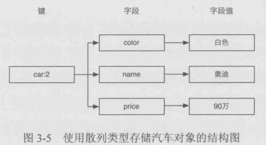
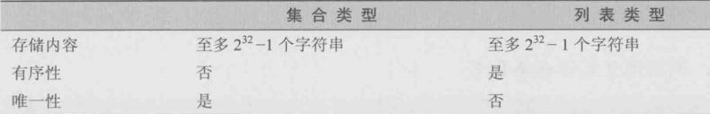

# 1 string类型
字符串是Redis最基本的类型，是其他类型的基础。一个字符串类型允许保存的容量为512MB。常用命令如下：

## 1.1 基本命令

- `keys pattern`：获取数据库保存的key列表
- `exists key`：判断key是否存在
- `del key`：删除key-value
- `type key`：获取可以对应的value的数据类型
- `set key value`：添加一个key-value项
- `mset key value key value...`：同时设置多个键值
- `get key`：获取key对应的value值
- `mget key key...`：同时获取多个键值
- `incr key`：自增value+1，并返回增加后的结果
   - `incr key 数值`：自增指定的数值
   - `incrbyfloat key 浮点数`：自增指定浮点数
- `decr key`：自建value-1
   - `decr key 数值`：自减指定的数值
- `append key value`：项键值尾部追加value，比如增加字符串内容。如不存在则创建新的key-value
- `strlen key`：获取字符串的长度
- `expire key seconds`：键值的过期时间，到期自动删除
   - `persist key`：取消过期时间
- `ttl key`：获取键值的剩余存活时间

## 1.2 位操作命令
一个字节由8bit组成，Redis提供下面四个命令：

- `getbit key offset`：获取指定bit的数值
- `setbit key offset value`：设置指定bit的数值
- `bitcount key [start][end]`：获取value中bit位为1的个数
- `bitop operation destkey key key...`：对多个字符串类型的value进行位操作，保存结果到destkey

# 2 hash类型
hash也是一宗字典结构，其存储了字段field和字段值的映射，**字段值只能是字符串。**结构如下：

## 2.1 基本命令

- `hset key field value`
- `hget key field`
- `hmset key field value [field value]`
- `hmget key field [field]`
- `hgetall key`
- `hexists key field`：判断字段是否存在
- `hsetnx key field value`：字段不存在时赋值，存在什么也不做
- `hincrby key field 数值`：自增字段值
- `hdel key filed [field]`
- `hkeys key`：获取字段名
- `hkeys key`：获取字段值

# 3 列表类型
列表类型可以存储一个有序的字符串列表（**双向链表）**，常用操作是向列表两端添加元素，或获得列表的某一个片段。**借助列表类型，Redis可以作为队列使用。**

## 3.1 基本命令

- `lpush key value [value..]`：向列表左边增加元素
- `rpush key value [value..]`：向列表右边增加元素
- `lpop key`：从左边弹出元素
- `rpop key`：从右边弹出元素
   - `brpop key seconds`：右边弹出元素，如果没有元素，阻塞等待，直到超时
- `llen key`：获取元素的个数
- `lindex key index`：获得指定索引的元素值
- `linsert key before|after pivot value`：从左到右查找值为pivot的元素，并在他2前面或后面插入新元素value
- `lset key index value`：设置指定索引的元素值
- `lrange key start stop`：获取列表的某一部分，但并不删除列表内容
- `lrem key count value`：删除列表中前count个值为value的元素
   - count = 0，删除全部值为value的元素
   - count > 0，从左边开始删除
   - count < 0，从右边开始删除
- `ltrim key start end`：删除指定范围外的所有元素
- `rpoplpush source dest`：从source右边弹出一个元素，添加到dest的左边，并返回该值。（**原子过程**）

# 4 集合类型
集合与列表的对比

## 4.1 基本命令

- `sadd key member [member..]`：添加集合元素，不允许重复
- `srem key member [member..]`：删除集合元素
- `smembers key`：获取集合中所有元素
- `sismember key member`：元素是否在集合中
- `scard key`：获取集合中元素个数
- `srandmember key [count]`：随机获取集合中元素
   - count > 0：随机获取count个不重复元素
   - count < 0：随机获取count个元素，有可能重复
   - count  > 集合size：返回全部元素
- `spop key`：集合中随机弹出一个元素

## 4.2 集合运算

- `sdiff key [key..]`：差集运算
   - `sdiffstore dest key [key..]`：差集，并保存到dest
- `sinter key [key..]`：交集运算
   - `sinterstore dest key [key..]`：交集，保存到dest
- `sunion key [key..]`：并集运算
   - `sunionstore dest key [key..]`：并集，保存到dest

# 5 有序集合
有序集合时在集合的基础上位每个元素关联了一个分数，使得具有**有序**的特点。需要注意的是，元素不同，分数有可能相同，分数可以是整数或浮点数。

## 5.1 基本命令

- `zadd key score member [score member]`：添加元素和分数
- `zincrby key 数值 member`：增加元素的分数，
- `ascore key member`：获取元素的分数
- `zrange key start stop [withscores]`：获得排名区域内的元素列表，从小到大排列
- `zrevrange key start stop [withscores]`：获得排名区域内的元素列表，从大到小排列
- `zrangebyscore key min max [withscores] [limit offset count]`：获取指定分数范围内的元素
- `zcard key`：获取元素的个数
- `zcount key min max`：获取指定分数范围内的元素个数
- `zrem key member [member]`：删除元素
   - `zremrangebyrank key start stop`：删除排名范围内元素
   - `zremrangebyscore key min max`：删除分数范围内的元素
- `zrank key member`：获取元素的排名，从小到大排列
- `zrevrank key member`：获取元素的排名，从大到小排列

