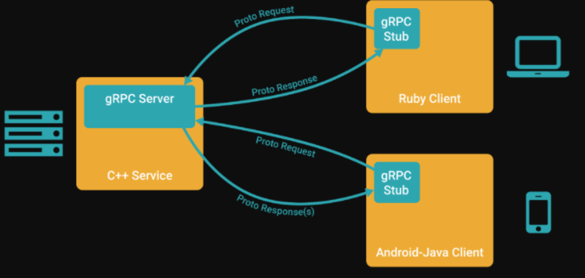

通过gRPC，客户端应用可以像调用本地对象一样直接调用另一台不同的机器上服务端应用的方法，使得您能够更容易地创建分布式应用和服务。与许多RPC系统类似，gRPC也是基于以下理念：定义一个服务，指定其能够被远程调用的方法（包含参数和返回类型）。在服务端实现这个接口，并运行一个gRPC服务器来处理客户端调用。在客户端拥有一个存根能够像服务端一样的方法。



# 参考教程：
[https://grpc.io/docs/languages/cpp/quickstart/](https://grpc.io/docs/languages/cpp/quickstart/)

# 1 安装gRPC
```shell
//git clone https://gitee.com/mirrors/grpc-framework.git
git clone --recurse-submodules -b v1.34.0 https://github.com/grpc/grpc

cmake ../.. -DgRPC_INSTALL=ON                \
              -DCMAKE_BUILD_TYPE=Release       \
              -DgRPC_ABSL_PROVIDER=package     \
              -DgRPC_CARES_PROVIDER=package    \
              -DgRPC_PROTOBUF_PROVIDER=package \
              -DgRPC_RE2_PROVIDER=package      \
              -DgRPC_SSL_PROVIDER=package      \
              -DgRPC_ZLIB_PROVIDER=package
make
make install
```
