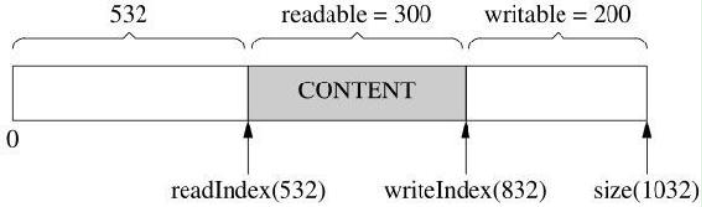
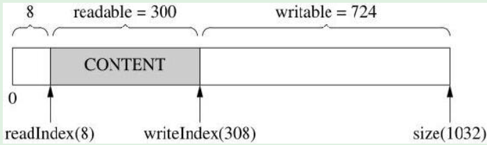
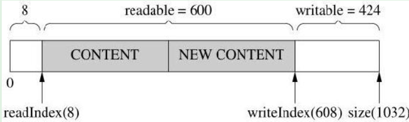

# 1 TCP分包与聊天室示例

## 1.1 什么是分包
分包指的是在发生一个消息（message）或一帧（frame）数据时，通过一定的处理，让接收方能从字节流中识别并截取（还原）出一个个消息。
对于**短连接**的TCP服务，分包不是一个问题，只要**发送方主动关闭连接，就表示一条消息发送完毕**，接收方read()返回0，从而知道消息的结尾。例如examples里的daytime和time协议。对于长连接的TCP服务，分包有四种方法：

1. **消息长度固定**，比如muduo的roundtrip示例就采用了固定的16字节消息。
1. 使用**特殊的字符或字符串作为消息的边界**，例如HTTP协议的headers以“\r\n”为字段的分隔符。
1. 在每条消息的头部**加一个长度字段**，这恐怕是最常见的做法。
1. 利用**消息本身的格式**来分包，例如XML格式的消息中...的配对，或者JSON格式中的{ ... }的配对。解析这种消息格式通常会用到状态机（state machine）。

## 1.2 muduo chat示例的解决方式
muduo chat示例(examples/asio/chat)采用了第三种方法：为每个消息增加一个长度消息头（网络字节序），格式如下：
```makefile
0x00,0x00,0x00,0x05,'h','e','l','l','o'
```
发送的处理逻辑很简单：获取要发送消息的长度，填充到buffer开头的4个字节内即可：
```cpp
muduo::net::Buffer buf;
buf.append(message.data(), message.size());
//发送时需要添加长度消息头，这里先获取消息长度
int32_t len = static_cast<int32_t>(message.size());
//转换为网络字节序（32为，4个字节）
int32_t be32 = muduo::net::sockets::hostToNetwork32(len);
buf.prepend(&be32, sizeof be32);//添加到消息头部
conn->send(&buf);
```
接收消息解析需要先获取长度，然后等待收集到指定长度的数据之后再从buf取出：
```cpp
//收到消息需要解析，分解出完整消息
while (buf->readableBytes() >= kHeaderLen) // kHeaderLen == 4
{
    // FIXME: use Buffer::peekInt32()
    const void *data = buf->peek();
    //获取消息开始的4个字节，要求至少已经收取4个字节的data
    int32_t be32 = *static_cast<const int32_t *>(data); // SIGBUS
    //转换为主机字节序，得到消息长度
    const int32_t len = muduo::net::sockets::networkToHost32(be32);
    if (len > 65536 || len < 0)
    {
        LOG_ERROR << "Invalid length " << len;
        conn->shutdown(); // FIXME: disable reading
        break;
    }
    else if (buf->readableBytes() >= len + kHeaderLen)
    {//当收到的数据长度达到指定的长度时才进入if解析，否则继续接收数据
        buf->retrieve(kHeaderLen);                    //清除buf中长度的4个字节
        muduo::string message(buf->peek(), len);      //获取实际消息内容
        messageCallback_(conn, message, receiveTime); //将数据交给回调函数处理
        buf->retrieve(len);                           //清除buf中消息缓存
    }
    else
    {
        break;
    }
}
```

# 2 Buffer类解读

## 2.1 设计思路
muduo Buffer的设计要点：

- 对外表现为一块连续的内存(char* p, int len)，以方便客户代码的编写。
- 其size()可以自动增长，以适应不同大小的消息。它不是一个fixedsize array（例如char buf[8192]）。
- 内部以**std::vector**来保存数据，并提供相应的访问函数。
- Buffer其实像是一个queue，从末尾写入数据，从头部读出数据


Buffer类应用于TcpConnection类中，提供如下功能：

- input buffer：TcpConnection会从socket读取数据，然后写入input buffer（**Buffer::readFd()**）
- output buffer，App代码把数据写入output buffer（**TcpConnection::send()**），TcpConnection从output buffer读取数据并写入socket

## 2.2 Buffer结构
muduo Buffer的设计参考了Netty的ChannelBuffer和libevent的evbuffer，结构如下：
```cpp
/// +-------------------+------------------+------------------+
/// | prependable bytes |  readable bytes  |  writable bytes  |
/// |                   |     (已存数据)    |     (空闲部分)    |
/// +-------------------+------------------+------------------+
/// |                   |                  |                  |
/// 0      <=      readerIndex   <=   writerIndex    <=     size
```
初始化时，size=1024，prependable bytes=8，readerIndex=writerIndex=8。
**内部腾挪**：因为写入数据时一直往writerIndex后写，而前面数据被读出后，readerIndex也是后移，会导致前面prependable变大。当prependable部分过大，导致writable部分不够写时，Buffer会优先使用prependable部分的空间，再次才会考虑扩大vector。例如下面示例：

1. 要写入300字节的数据，writable部分已经不够用，而prependable部分有足够空间。



2. 此时会先把readable部分数据迁移，扩充writable的空间



   - 如果扩充后空间足够，则写入数据
   - 如果扩充后空间还不够，则只能自动扩大vector的空间
3. 写入数据后，空间分布如下：



# 3 Buffer核心代码解读

## 3.1 注册socket事件回调函数
TcpConnection构造函数中给成员遍历channel对象设置回调函数，一个channel负责监听一个socket描述符的所有事件，当有事件发生时，会调用回调函数进行处理：
```cpp
//channel绑定可读可写等事件，供channel的handleEvent函数调用
channel_->setReadCallback(std::bind(&TcpConnection::handleRead, this, _1));
channel_->setWriteCallback(std::bind(&TcpConnection::handleWrite, this));
channel_->setCloseCallback(std::bind(&TcpConnection::handleClose, this));
channel_->setErrorCallback(std::bind(&TcpConnection::handleError, this));
```

## 3.2 读取socket数据
当有数据可读时，调用TcpConnection::handleRead函数，函数内会调用Buffer::readFd函数处理socket数据：
```cpp
void TcpConnection::handleRead(Timestamp receiveTime)
{
    //...
    //处理socket可读事件，调用Buffer类的readFd函数
    ssize_t n = inputBuffer_.readFd(channel_->fd(), &savedErrno);
    if (n > 0)
    { //读到了数据，调用App层的回调函数，处理读到的数据
        messageCallback_(shared_from_this(), &inputBuffer_, receiveTime);
    }
    //...
}

ssize_t Buffer::readFd(int fd, int *savedErrno)
{
    char extrabuf[65536]; //在栈上定义65536的临时buffer
    struct iovec vec[2];  //定义两个iovec
    const size_t writable = writableBytes();
    vec[0].iov_base = begin() + writerIndex_; //第一块指向Buffer类的writable区域
    vec[0].iov_len = writable;
    vec[1].iov_base = extrabuf; //第二块指向临时buffer
    vec[1].iov_len = sizeof extrabuf;

    //优先从socket读数据到Buffer类的writable区域，如果数据量太大，则多出来的数据写到临时buffer
    const int iovcnt = (writable < sizeof extrabuf) ? 2 : 1;
    const ssize_t n = sockets::readv(fd, vec, iovcnt); //即使数据量大也只需要一次系统调用，减少了开销
    if (n < 0)
    {
        *savedErrno = errno;
    }
    else if (implicit_cast<size_t>(n) <= writable)
    {
        writerIndex_ += n;
    }
    else
    {
        writerIndex_ = buffer_.size();
        //将临时buffer的数据写入Buffer类的区域，这里vector会动态增加空间，所以初始化时节省了内存
        append(extrabuf, n - writable);
    }
    return n;
}
```

## 3.3 写入数据到socket
当App层需要写数据到socket时，会间接调用到TcpConnection::sendInLoop函数，把数据存到TcpConnection的output buffer中。之后通过handleWrite函数再将output buffer中数据写入socket：
```cpp
void TcpConnection::sendInLoop(const void *data, size_t len)
{
    if (!channel_->isWriting() && outputBuffer_.readableBytes() == 0)
    { //output中没有缓存数据，则说明socket写处于空闲，可以直接写入socket
        nwrote = sockets::write(channel_->fd(), data, len);
    }
    //...
    if (!faultError && remaining > 0)
    {
        //将新的数据追加到outputBuffer之中，等待写入socket
        outputBuffer_.append(static_cast<const char *>(data) + nwrote, remaining);
        if (!channel_->isWriting())
        {
            channel_->enableWriting();
        }
    }
}

//等待epoll返回可写时，调用handleWrite
void TcpConnection::handleWrite()
{
    if (channel_->isWriting())
    {
        ssize_t n = sockets::write(channel_->fd(),
                                   outputBuffer_.peek(), //将output buffer数据写入socket
                                   outputBuffer_.readableBytes());
    }
    //...
}
```
